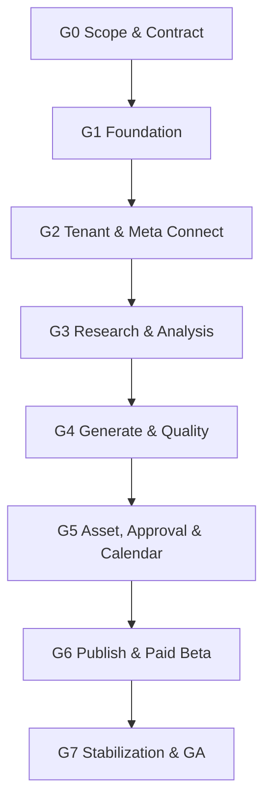

# AI Content OS — Execution Master Plan

## แผนพัฒนาแบบละเอียดสำหรับกระจายงานให้ Sub-agents พร้อมกัน

**สถานะ:** Execution Baseline v1.1  
**วันที่:** 30 สิงหาคม 2026  
**ขอบเขต:** Production Beta สำหรับ SME ไทย — Facebook Page + Instagram Professional  
**Product Flow:** Business Knowledge → Research → Analyze → Generate → Asset → Approve → Calendar → Publish → Basic Metrics  
**Delivery Model:** Contract-first Modular Monolith, Parallel Workstreams, Integration Gates

---

## 1. คำตอบเรื่อง “สิ่งที่ขาดอยู่ในแผนหรือไม่”

รายการ Core Database, API/Event Contract, Mobile Wireframe, Quality Golden Set, Industry Pack, Meta Spike, PDPA, Billing และ Production Test **อยู่ในแผนเดิมแล้วในระดับ Phase/Capability** แต่ยังไม่ได้แตกถึงระดับที่ Agent รับงานแล้วลงมือได้โดยไม่ตัดสินใจแทนกัน

Execution Baseline ชุดนี้เพิ่มชั้นที่ขาด:

- Task ID และเจ้าของงาน
- Dependency และงานที่เริ่มพร้อมกันได้
- Input/Output Contract
- Table/File/Module ownership
- Acceptance criteria และหลักฐานที่ต้องส่ง
- Test fixture และ Integration Gate
- Merge order, stop condition และ handoff format
- Estimate แบบ Person-day และ Parallel elapsed

ดังนั้น Product Master Plan เดิมยังเป็น Source of Truth ด้าน “จะสร้างอะไร” ส่วนเอกสารนี้และ Workstream Documents เป็น Source of Truth ด้าน “ใครทำอะไร เมื่อไร ใช้อะไรเชื่อม และตรวจรับอย่างไร”

---

## 2. Document Hierarchy และกฎเมื่อข้อมูลขัดกัน

| ลำดับ | เอกสาร | หน้าที่ |
|---:|---|---|
| 1 | Execution Master Plan ฉบับนี้ | Gate, Dependency, Agent ownership และคำตัดสินล่าสุด |
| 2 | Module Contracts/Events/Jobs Workstream | Contract กลาง, versioning, ports, jobs, outbox, idempotency |
| 3 | Core Database/RLS Workstream | Canonical table, migration order, RLS และ data ownership |
| 4 | Product Master Plan/Backlog | Product scope, priority, phase และ non-goal |
| 5 | Technical Architecture/Modular Rules | Stack, ADR และ architecture constitution |
| 6 | Domain Workstream Documents | Task-level detail และ acceptance ของแต่ละ track |

กฎ:

1. Contract และ Schema ที่ผ่าน Gate แล้วเปลี่ยนด้วย RFC/ADR + version เท่านั้น
2. Agent ห้ามแก้ Source of Truth กลางโดยตรงนอก owner
3. ถ้า Workstream ขัดกับเอกสารลำดับสูงกว่า ให้หยุดงานและส่ง Change Request
4. Implementation ที่ยังไม่มี Requirement ID, Contract และ Test owner ห้ามเข้า `Ready`

---

## 3. Execution Document Set

| Workstream | รายละเอียด | Task volume |
|---|---|---:|
| [Execution WBS](execution-wbs-and-parallel-delivery-th.md) | W0–W7, Task ID, PD, Critical Path, Gate G0–G7 และ Parallel Assignment | 535–665 PD ถึง Paid Beta |
| [Core Database + RLS](core-database-and-rls-workstream-th.md) | Canonical schema, migration 000–180, DB-00–DB-13, RLS/test matrix | 14 execution packages |
| [Contracts, Events + Jobs](module-contracts-events-jobs-workstream-th.md) | Tenant/Event/Job/Error contracts, module registry, ports, test kits, mocks | 14 agent packages |
| [UX, Quality + Industry](ux-quality-industry-workstream-th.md) | Mobile UX, 22 screen epics, Golden Set, Industry Packs | 115 tasks/epics |
| [Meta, Security + Production Ops](meta-security-production-ops-workstream-th.md) | Meta, PDPA, Billing/Tax, CI/CD, SLO, DR, incident, release | 7 parallel tracks |
| [Gap Register + Agent Governance](gap-register-and-agent-governance-th.md) | 32 gaps, collision risks, ownership, merge cadence, stop conditions | 32 gaps |
| [Asset Library Detailed Design](asset-library-database-ux-spec-th.md) | Asset schema, upload/processing state, rights, storage และ mobile acceptance | 6 slices |
| [Sprint 0A Decision + Contract Catalog](sprint-0a-decision-register-contract-catalog-th.md) | Decisions, ownership, contract catalog, dependency DAG และ G0 tracker | G0-001–024 |
| [Multi-agent Engineering Operating Model](sprint-0a-multi-agent-engineering-operating-model-th.md) | Skill-based Author/Reviewer/Tester, vendor-neutral handoff และ no self-approval | Operating baseline |
| [Object Storage Lifecycle Contract](sprint-0a-object-storage-lifecycle-contract-th.md) | UUID-only object keys, tenant lifecycle, export/grace/purge และ storage reconciliation | STO-01–08 |
| [Simple Onboarding Flow](sprint-0a-simple-onboarding-flow-th.md) | Mobile-first onboarding ภาษาไทย, multi-page, skip/resume และ first value ภายใน 10 นาที | ONB work packages |
| [Stripe Billing Contract](sprint-0a-stripe-billing-contract-th.md) | Hosted Checkout, Portal, webhook inbox, subscription lifecycle และ reconciliation | BILL work packages |

Agent ต้องอ่านเอกสาร Workstream ของตน, Execution WBS, Contracts Workstream และ Modular Rules ก่อนเริ่มทุก Package

---

## 4. Integrated Dependency Map



External track `Meta App Review` เริ่มใน W0 และเดินคู่ขนาน แต่เป็น hard dependency ของ Paid Production Beta

### Critical Path

`Scope Lock → Tenant Contract → Core Schema/RLS → Job/Event Kernel → Business/Page Isolation → Knowledge → Research/Evidence → Content Version → Generate → Quality → Asset Version → Approval/Schedule → Meta Publish → Billing/Quota → Security/PDPA/Restore → Paid Beta`

---

## 5. Waves และ Integration Gates

| Wave | เป้าหมาย | งานที่ทำขนานได้ | Gate |
|---|---|---|---|
| W0 | Pre-development readiness | Product decisions, schema, contracts, wireframes, Meta spike, Golden Set, PDPA, billing decision | G0 Scope & Contract Ready |
| W1 | Engineering foundation | Repo/CI, tenant DB/RLS, jobs/outbox, design system, observability, fake adapters | G1 Foundation Integrated |
| W2 | Workspace/Business/Meta connect | Team/role, Business/Page, knowledge shell, OAuth connection | G2 Tenant & Connection Alpha |
| W3 | Research/Analysis | Industry runtime, knowledge, evidence, suggestion, analysis | G3 Research Closed Pilot |
| W4 | Generate/Quality | Content/version, AI router, BYOK cohort, quality gate | G4 AI Content Alpha |
| W5 | Production workflow | Asset, approval, calendar, preview, notifications | G5 Mobile End-to-end Pilot |
| W6 | Publish/Commercial hardening | Meta publish, metrics, quota/billing, backup, security, PDPA, load | G6 Paid Beta |
| W7 | Stabilization | Reliability, support reduction, cost/activation optimization | G7 GA Decision |

### Gate G0 — ห้ามข้าม

ก่อนแจก Production implementation จำนวนมาก ต้องมี:

- Scope/non-goal/decision register
- Pilot 5 Workspace และข้อมูลที่ได้รับอนุญาต
- Core mobile wireframes + state matrix + usability round 1
- Core ERD/data dictionary/RLS matrix
- Tenant/API/Event/Job/Adapter/Usage contracts v1
- Meta capability matrix และ App Review path
- Quality rubric, annotation guide, Golden Set baseline
- Interior/Built-in Industry Pack v1
- Threat/data/retention matrix
- Test strategy และ release evidence template

ถ้า G0 ยังไม่ผ่าน Agent ทำได้เฉพาะ Spike, Prototype, Fake Adapter, Contract Test Kit และงาน Foundation ที่ไม่ผูก Schema

---

## 6. Agent Ownership Model

| Agent | Owner scope | Output หลัก | ห้ามแก้โดยตรง |
|---|---|---|---|
| A0 Integration/Architecture | Contracts, dependency DAG, migration registry, composition root, release gates | Contract versions, merge decisions, integrated build | Domain implementation ของ Agent อื่น |
| A1 Kernel/Data/Security | Identity, Workspace, Membership, Business/Page, RLS, audit, secret handles | Migrations, policies, repositories, security tests | Content/AI/Meta private tables |
| A2 Knowledge/Research/Industry | Knowledge versions, Pack, sources, evidence, suggestions | Domain module, fixtures, research adapter | AI router/content tables |
| A3 AI/Content/Quality | Content brief/version/variants, AI router, provider adapter, quality/eval | Generation/quality module, Golden runner | Knowledge/Asset/Approval state |
| A4 Asset/Media | Upload, processing, asset metadata/version/rights/storage adapters | Asset vertical slice และ media worker | Content lifecycle/publish tables |
| A5 Approval/Calendar/Frontend | Mobile design system, flow screens, approval, calendar, notification views | Product UI/workflow | Meta token/publish delivery state |
| A6 Meta/Publishing/Ops | OAuth, capability, publisher, metrics, billing reconciliation, telemetry/runbook | Meta/ops vertical slice | Content/approval private state |

A0 เป็น owner ของ shared files: root configuration, lockfile, shared schema catalog, migration registry, CI, ADR และ master documents

---

## 7. First Dispatch — Wave 0

สามารถส่งพร้อมกัน 7 Package โดยยังไม่เขียน Production Domain code:

### A0 — Integration and Decision Package

- `RDY-001`, `RDY-005`, `ARC-001`, `CTR-001..007`
- จัดทำ decision register, context map, contract catalog และ dependency DAG
- ส่ง contract fixtures, version policy, ownership registry และ G0 tracker

### A1 — Core Data, RLS and PDPA Package

- `DAT-001..007`, `SEC-001`, `PRV-001..003`, `DB-00 specification`
- ส่ง ERD, data dictionary, migration ownership, RLS matrix, retention/delete/export matrix
- ยังไม่ merge migration จริงจน Contract freeze

### A2 — Industry and Research Package

- `IND-001..003`, Research source/evidence contract review
- ส่ง Industry Pack schema, Built-in Pack v1 และ Skincare risk skeleton
- ใช้ข้อมูล synthetic/permissioned เท่านั้น

### A3 — Quality and AI Evaluation Package

- `QLT-001..003`, Golden Set schema/annotation pilot
- ส่ง rubric, 30-case annotation pilot, threshold และ plan ขยาย dataset
- ห้ามเลือก model จาก demo ก่อน dataset freeze

### A4 — UX and Design Package

- `UXD-001..011`
- ส่ง information architecture, wireframes ทุก Core Flow, state/error catalog และ usability findings
- ใช้ contracts/fixtures ห้ามออกแบบ field จากการเดา DB

### A5 — Meta Feasibility Package

- `MTA-001..004`, `META-001..010`
- ส่ง permission/capability matrix, OAuth/page discovery/publish spike, review package และ risk
- ใช้ test assets/test app; ห้าม production secret ใน repo

### A6 — Production Readiness Package

- `COM-001..002`, Security/Billing/Infra/Observability/Test Wave 0
- ส่ง billing/manual-vs-automated decision, threat model, environment/CI contract, SLO draft, RPO/RTO และ test plan

### Wave 0 Handoff

ทุก Agent ส่ง:

```text
Task IDs:
Status: done / partial / blocked
Files/modules changed:
Contracts consumed:
Contracts proposed or changed:
Assumptions:
Verification/tests:
Acceptance evidence:
Security/privacy/cost impact:
Open risks/external blockers:
Recommended next tasks:
```

---

## 8. First Implementation Dispatch — หลัง G0

| Agent | Package | Task scope |
|---|---|---|
| A0 | Foundation/Contracts | repository, CI/CD skeleton, contract versioning, merge train |
| A1 | Tenant DB/RLS | DB-00..02, Workspace/Business/Page, RLS harness |
| A2 | Industry/Research Fixtures | Pack runtime, evidence/suggestion schema, fake research adapter |
| A3 | Content/AI Fixtures | Content Brief/Version, fake AI adapter, quality runner |
| A4 | Asset Foundation | Asset schema slices 1–2, fake Storage/Media adapter |
| A5 | Mobile Shell | Design System, navigation, fixture-driven Core Flow screens |
| A6 | Meta/QA Foundation | Fake Publisher, OAuth spike implementation, contract/E2E harness |

### Integration Slice แรก

`เลือก Business → เลือก Suggestion fixture → สร้าง Content ด้วย Fake AI → แนบ Asset fixture → ส่งตรวจ → ตั้งเวลาแบบ Fake → ได้ Notification`

Slice แรกมีไว้พิสูจน์ Module Boundary, Tenant Context, Event/Job และ UI Flow ก่อนต่อ Provider จริง

---

## 9. Shared Contracts ที่ต้อง Freeze ก่อน Consumer Code

1. Tenant Context v1
2. Stable Error v1 + Thai action mapping
3. Event Envelope v1
4. Job Envelope v1
5. Usage/Cost Event v1
6. Secret Reference v1
7. Knowledge Snapshot/Evidence Bundle v1
8. Content Snapshot/Version v1
9. Asset Selection/Ready/Blocked v1
10. Approval Decision/Schedule Request v1
11. Meta Target/Publish Result v1
12. Notification Deep-link v1

Producer merge contract + fixture ก่อน Consumer; Consumer ใช้ fixture/fake และห้าม import private implementation

---

## 10. Migration Ownership และ Merge Safety

Canonical migration batches:

| Range | Owner |
|---|---|
| 000 | Foundation/Integration |
| 010–021 | Identity/Business |
| 030–041 | Industry/Knowledge |
| 050–051 | Jobs/Notification |
| 060–061 | AI/Metering |
| 070 | Research |
| 080–081 | Content/Quality |
| 090–091 | Approval/Calendar |
| 100 | Asset |
| 110–121 | Meta/Publishing/Metrics |
| 130–132 | Billing/Entitlement |
| 140–180 | Audit, performance, retention, grants, generated artifacts |

กฎ:

- Migration ที่ merge แล้วห้ามแก้ย้อนหลัง ใช้ forward-fix
- หนึ่ง table/event/route มี owner เดียว
- Cross-module association มี owner ที่ประกาศก่อนเริ่ม
- Contract major change หยุด consumer merge จนออก compatibility plan
- Clean migration และ upgrade จาก release ก่อนหน้าต้องผ่าน CI

---

## 11. Parallel Work ที่ไม่ปลอดภัย

ห้ามทำพร้อมกันก่อน freeze:

- Content, Approval, Calendar และ Publishing state machine
- Asset ↔ Content link และ approval invalidation
- Research Evidence → AI input snapshot
- Usage reservation/commit/release/reconciliation
- Meta target snapshot และ publish idempotency
- BYOK secret/decryption boundary
- Root package/CI/config และ migration registry

เมื่อ Contract ยังไม่พร้อม Agent ต้องสร้าง mock/fixture หรือเสนอ RFC ไม่สร้าง schema/field ของตนเอง

---

## 12. Agent Merge Protocol

1. แยก branch/worktree ต่อ Agent
2. A0 merge shared contracts ก่อน consumer
3. Merge order ต่อ Slice: Contract → Migration/RLS → Domain → Worker/Adapter → UI → Integration test → Observability/Runbook
4. Full integration build ทุก 48 ชั่วโมง
5. Demo vertical slice บน Staging ทุกสัปดาห์
6. Agent เจ้าของ Feature อนุมัติ Security/Billing/Restore gate ของตนเองไม่ได้
7. Stop-the-line เมื่อพบ tenant leakage, duplicate publish, lost job, migration divergence, secret exposure, irreversible data loss หรือ contract mismatch

---

## 13. Definition of Ready

Task เข้า `Ready` เมื่อมีครบ:

- Requirement/Task ID และ Product purpose
- Owner และ file/table/contract boundary
- Dependency อยู่ `Integrated` หรือมี approved fixture
- Input/Output/Error/Permission/Cost contract
- Acceptance criteria และ test owner
- Mobile/error/async state เมื่อเกี่ยวข้อง
- Privacy/retention/secret classification
- Rollback/forward-fix และ feature flag plan

## 14. Definition of Done

Agent ส่งได้สูงสุด `In review`; Integration/QA เปลี่ยนเป็น `Verified/Done` เมื่อ:

- Unit/contract/integration/RLS/failure tests ผ่านตาม scope
- Requirement → Contract → Code → Test → Gate trace ได้
- Tenant/Business/Page isolation ผ่าน
- Retry/replay ไม่ทำ side effect ซ้ำ
- UI 360/390/430 px และ Thai non-tech state ผ่าน
- Usage/cost/audit/trace ถูกบันทึก
- Migration upgrade/forward-fix ผ่าน
- Runbook/kill switch/rollback พร้อม

---

## 15. Estimate และ Calendar

Full Production-grade scope ตาม WBS:

- Effort ถึง Paid Beta: **535–665 Person-days**
- One-person: ประมาณ **24–30 เดือน** หากทำเฉลี่ย 5 productive PD/สัปดาห์
- 5 implementation lanes + 1 Integration/QA lane: ประมาณ **28–38 สัปดาห์** รวม integration/rework buffer
- Beta stabilization เพิ่มประมาณ 4–8 สัปดาห์และต้องดูข้อมูล Production อย่างน้อย 30 วัน

ตัวเลขสูงกว่าแผน Phase เดิม เพราะรวม UX ทุก state, security, evaluation, fault testing, billing, operations และ release evidence ไม่ใช่ Prototype

### Lean Beta Cut ที่ไม่ทำลาย Architecture

- เปิด Platform AI + BYOK 1 Provider ก่อน; Provider อื่นใช้ stub/feature flag
- Pack Built-in Production; Skincare เป็น evaluation pilot
- Media format จำกัดตาม Meta spike
- Calendar month + list ก่อน week view
- Manual invoice/reconciliation สำหรับลูกค้า Beta ชุดแรก
- Website/manual onboarding ก่อน document/historical import เต็มรูปแบบ
- Basic tag/collection ก่อน smart/bulk operation

ห้ามตัด RLS, idempotent publish, secret protection, quality/risk gate, asset rights/version, restore drill, PDPA delete, monitoring และ mobile recovery

---

## 16. Product Owner Decisions ที่ต้องล็อก

| ID | Decision | ค่าเริ่มต้นที่แนะนำ |
|---|---|---|
| DEC-01 | Pilot primary/secondary | GoldenHome Built-in เป็น Primary; Sarolux เป็น high-risk secondary; เพิ่ม SME ภายนอก 3 ราย |
| DEC-02 | Login | Email OTP/magic link + invitation |
| DEC-03 | Meta onboarding | Assisted setup สำหรับ Beta ก่อน self-service เต็มรูปแบบ |
| DEC-04 | P0 media | Image + carousel; video/Reel เปิดเมื่อ Meta/media spike ผ่าน |
| DEC-05 | Notification เมื่อปิดแท็บ | In-app + email สำหรับ complete/fail/review; LINE เป็น P1 หลัง Pilot |
| DEC-06 | AI providers | Auto + BYOK 1 Provider Production; ที่เหลือ feature flag |
| DEC-07 | Payment | Stripe Subscription เป็นช่องทางหลัก; Hosted Checkout + Customer Portal ลด PCI scope; manual invoice เป็น fallback เฉพาะกรณีที่กำหนด |
| DEC-08 | VAT/refund/grace | ให้นักบัญชีตรวจ; ระบุราคา/รอบบิล/refund ก่อน Paid Beta |
| DEC-09 | Data/retention | Singapore region; retention/RPO/RTO ต้องยืนยันจาก cost/legal review |
| DEC-10 | Quality reviewer | Product Owner + Brand reviewer; Skincare ต้องมี qualified claim reviewer |
| DEC-11 | Pilot limit | Closed Pilot 5, Paid Beta ไม่เกิน 10 Workspace ก่อน review |
| DEC-12 | Support | Async support ภาษาไทย, เวลาทำการและ emergency boundary ชัดเจน |
| DEC-13 | Object storage | ใช้ provider adapter; R2 เป็น primary candidate, metadata/manifest อยู่ Postgres และห้ามใช้ชื่อ/อีเมลใน object key |
| DEC-14 | Offboarding | Suspend → Export → Grace period → Purge; production purge ใช้รายการ exact keys ที่อนุมัติแล้วเท่านั้น |
| DEC-15 | Onboarding | Mobile-first, click/select เป็นหลัก, skip/resume ได้ และพาไปถึง first useful content ภายในเป้าหมาย 10 นาที |
| DEC-16 | Agent assignment | แบ่งตาม Role + Skill ไม่ตาม vendor; ทุก Work Package ต้องมี Author, independent Reviewer และ independent Tester |

Agent ทำ Spike/Contract/Fake Adapter ได้ระหว่างรอ Decision แต่ห้ามสรุป Payment/Tax/Legal/SLA เป็น Final

---

## 17. Immediate Next Actions

1. Product Owner ยืนยันหรือแก้ DEC-01..16
2. ตั้ง Agent A0 เป็น Integration Owner
3. แจก Wave 0 Packages A0–A6 พร้อมกัน
4. สร้าง Decision Register, Contract Catalog และ G0 Tracker
5. Review Wave 0 ทุก 48 ชั่วโมง
6. ผ่าน G0 แล้วจึงแจก First Implementation Dispatch
7. Integration Slice แรกต้องผ่านก่อนต่อ Provider จริงหลายตัว
8. เปิด Stripe Sandbox และ Meta test assets แล้วเปลี่ยนรายการ `UNVERIFIED` เป็น evidence จากระบบจริง
9. ก่อนรับลูกค้า Pilot ให้ทดสอบ provision/export/purge ของ Workspace จำลองแบบ end-to-end

เอกสารนี้ต้องอัปเดตทุกครั้งที่เปลี่ยน Scope, Contract Major, Migration Ownership, Gate หรือ Agent boundary
