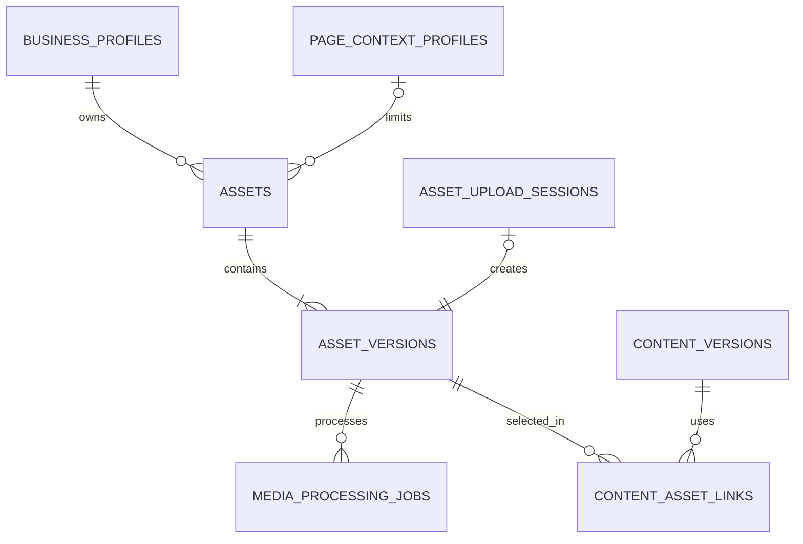
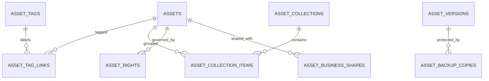
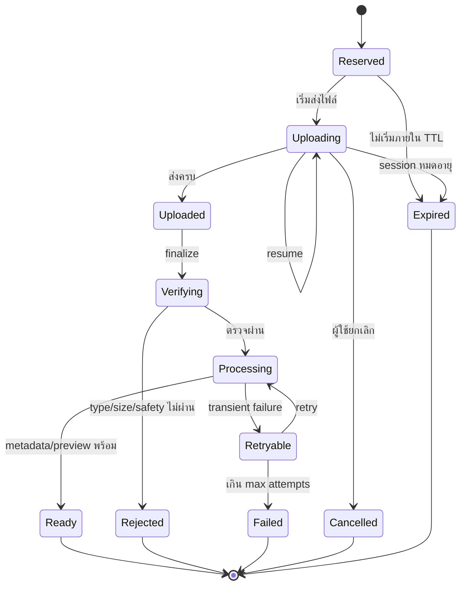
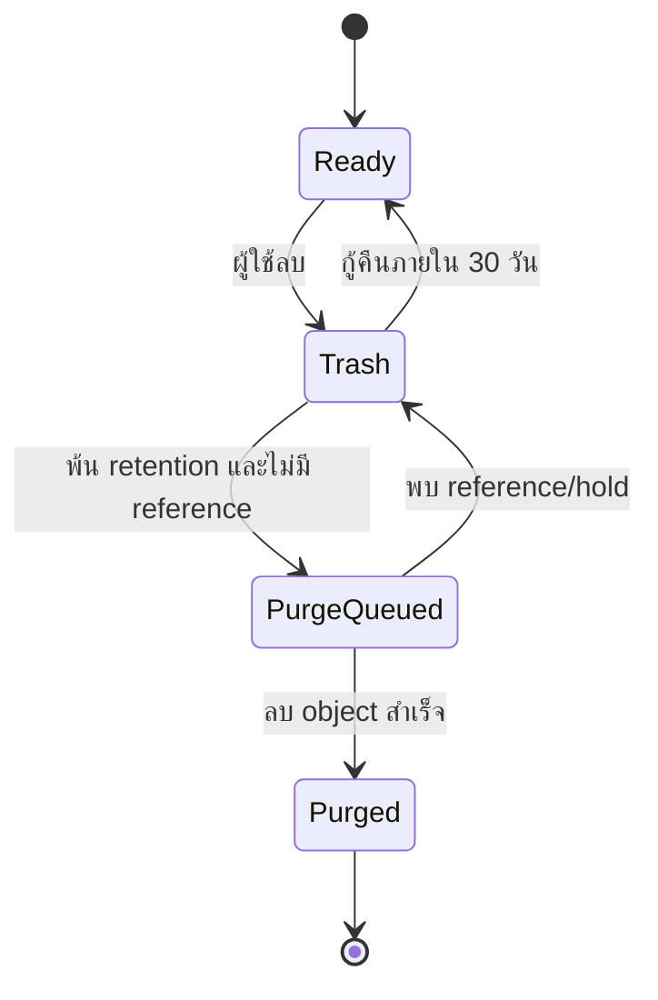
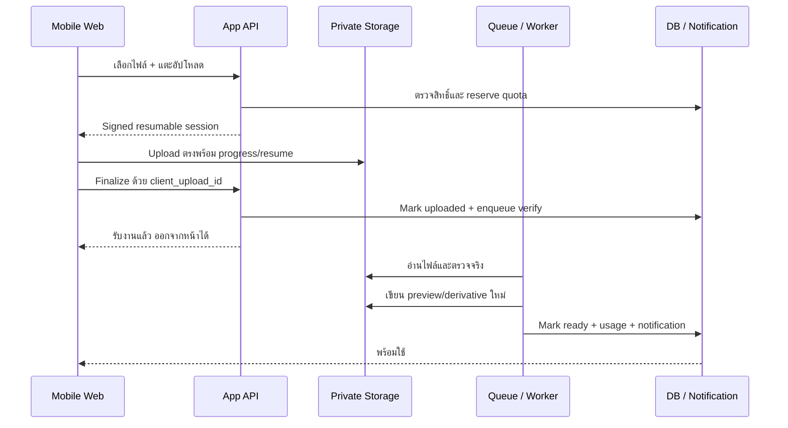

# Asset Library Detailed Design

## AI Content OS สำหรับ SME ไทย — Database Schema, Mobile Wireframe และ Processing State Machine

**สถานะ:** Proposed Detailed Design v0.1  
**วันที่:** 29 สิงหาคม 2026  
**เอกสารแม่:** `technical-architecture-meta-content-os-th.md`  
**กลุ่มผู้ใช้ปลายทาง:** เจ้าของธุรกิจและทีมการตลาดไทยที่ไม่ใช่สายเทคนิค  
**ขอบเขต Phase 1:** รูปและวิดีโอสำหรับ Facebook Page + Instagram Professional

> ชื่อตาราง, status code และรายละเอียดทางเทคนิคในเอกสารนี้มีไว้สำหรับทีมพัฒนาเท่านั้น ผู้ใช้ปลายทางต้องเห็นภาษาไทยง่ายๆ ใช้การแตะ/เลือกเป็นหลัก และไม่เห็น code, ID, JSON, provider error หรือศัพท์ infrastructure

---

## 1. Product และ Data Decisions

1. Supabase Storage private buckets เป็น Primary Storage ใน Production Beta
2. PostgreSQL เป็น source of truth ของ metadata, permission, rights, relationship, state และ usage
3. Asset เป็น logical item; ไฟล์จริงแต่ละ revision เป็น immutable Asset Version
4. Asset ทุกชิ้นอยู่ใน Workspace และ Business เดียวอย่างชัดเจน; Page scope เป็น optional restriction
5. Content/Publish ต้อง pin `asset_version_id` ห้ามอ้าง `latest`
6. Browser upload ตรงเข้า Storage แบบ resumable; request ของหน้าเว็บไม่รอ upload/processing จบ
7. Media validation/thumbnail/derivative/backup ทำเป็น background job และแจ้งเตือนเมื่อพร้อม
8. Main UI เป็น mobile-first, thumbnail/card-first และไม่บังคับผู้ใช้เขียน Prompt หรือชื่อไฟล์
9. R2 ใช้เป็น backup target ได้ก่อน แต่ไม่เป็น second serving path ตั้งแต่วันแรก
10. Derivative สร้างใหม่ได้จึงไม่จำเป็นต้อง backup; originals และ rights proof ต้องมี recovery plan

---

## 2. Domain Model

### 2.1 Core lineage

### 2.2 Organization, rights และ recovery

### 2.3 แยกความหมายให้ชัด

| Object | ความหมาย | ตัวอย่าง |
|---|---|---|
| Asset | รายการสื่อที่ผู้ใช้รู้จัก | “รูปครัว Modern Luxury บ้านคุณเอ” |
| Asset Version | ไฟล์ immutable หนึ่งเวอร์ชัน | original, crop 1:1, crop 4:5, Reel cover |
| Collection | โฟลเดอร์เสมือนใน UI | ผลงาน, รีวิว, ทีมงาน, โปรโมชั่น |
| Tag | ป้ายค้นหา | ครัว, Modern Luxury, กรุงเทพ |
| Rights | สิทธิ์และหลักฐานการใช้งาน | เจ้าของไฟล์, consent, paid ads, วันหมดอายุ |
| Content Asset Link | เวอร์ชันที่ Content ใช้จริง | Facebook cover ลำดับ 1 |

---

## 3. Database Conventions

- Domain table ใช้ `uuid` เป็น public-safe ID; high-volume event/job table ใช้ `bigint generated always as identity`
- เวลาใช้ `timestamptz` และเก็บ UTC เสมอ
- ขนาดไฟล์/egress ใช้ `bigint` หน่วย bytes; duration ใช้ `integer` หน่วย milliseconds
- เงินใช้ `numeric` ไม่ใช้ floating point
- status/type ใช้ `text` + `check constraint` เพื่อเพิ่มค่าใหม่ด้วย migration ที่อ่านง่าย
- ทุก foreign key มี index; list query ใช้ composite/partial index ตาม access pattern จริง
- ทุก tenant-owned table มี `workspace_id`; table ที่เกี่ยวกับ Content/Asset มี `business_profile_id` ซ้ำเพื่อ RLS และป้องกัน cross-business query
- Known fields ใช้ typed column; `jsonb` ใช้เฉพาะ provider/codec metadata ที่รูปแบบต่างกันจริง
- Domain tables อยู่ใน exposed schema ที่กำหนดและเปิด RLS; helper function อยู่ `private` schema
- ห้ามสร้าง custom table/function/trigger ใน `auth`, `storage` หรือ `realtime` schema
- ชื่อ database เป็น `snake_case`; UI ใช้คำภาษาไทย ไม่สะท้อนชื่อ column

---

## 4. Core Table Blueprint

### 4.1 `assets` — Logical Asset

| Field | Type | Null | กติกา |
|---|---|---:|---|
| `id` | uuid PK | No | ID ของ Asset |
| `workspace_id` | uuid FK | No | Tenant boundary |
| `business_profile_id` | uuid FK | No | Business เจ้าของ Asset |
| `page_context_profile_id` | uuid FK | Yes | ระบุเมื่อใช้เฉพาะ Page/สาขา |
| `scope` | text | No | `business_private`, `page_only`, `workspace_shared` |
| `kind` | text | No | `image`, `video` |
| `title` | text | No | ระบบตั้งจาก category/date ได้ ผู้ใช้ไม่ต้องพิมพ์ |
| `search_text` | text | No | normalized text สำหรับค้นภาษาไทย |
| `source` | text | No | `upload`, `ai_generated`, `imported`, `copied` |
| `status` | text | No | `preparing`, `ready`, `failed`, `trash`, `purged` |
| `current_version_id` | uuid FK | Yes | ชี้ version ที่หน้า Asset detail แสดง แต่ Content ห้ามใช้ pointer นี้ |
| `created_by` | uuid FK auth.users | No | ผู้เพิ่ม Asset |
| `deleted_at` | timestamptz | Yes | Soft delete |
| `purge_after` | timestamptz | Yes | เวลา earliest hard purge |
| `created_at`, `updated_at` | timestamptz | No | Audit timestamps |

Constraints สำคัญ:

- `page_only` ต้องมี `page_context_profile_id`
- `business_private` และ `workspace_shared` อนุญาต Page เป็น null
- `purge_after >= deleted_at`
- unique `(id, workspace_id, business_profile_id)` สำหรับ composite FK

### 4.2 `asset_versions` — Immutable Physical Object

| Field | Type | Null | กติกา |
|---|---|---:|---|
| `id` | uuid PK | No | Version ID ที่ Content pin |
| `workspace_id`, `business_profile_id` | uuid | No | ซ้ำจาก Asset เพื่อ isolation/query |
| `asset_id` | uuid FK | No | Logical Asset |
| `version_no` | integer | No | เริ่ม 1 และเพิ่มทีละหนึ่งต่อ Asset |
| `parent_version_id` | uuid FK | Yes | lineage ของ crop/edit/derivative |
| `purpose` | text | No | `original`, `edited`, `crop`, `preview`, `poster`, `platform_ready` |
| `platform` | text | Yes | `facebook`, `instagram` เมื่อเป็น platform-ready |
| `storage_provider` | text | No | `supabase`, `r2` |
| `bucket` | text | No | private bucket name |
| `object_key` | text | No | immutable opaque key |
| `original_filename` | text | Yes | แสดงเฉพาะผู้มีสิทธิ์ ไม่ใช้เป็น object key |
| `detected_mime` | text | No | อ่านจาก file signature |
| `byte_size` | bigint | No | ต้อง `>= 0` |
| `width`, `height` | integer | Yes | pixel; ต้อง `> 0` เมื่อมีค่า |
| `duration_ms` | integer | Yes | video duration |
| `video_codec`, `audio_codec` | text | Yes | technical validation |
| `sha256` | text | No | exact duplicate/integrity |
| `status` | text | No | `pending_upload`, `verifying`, `processing`, `ready`, `rejected`, `failed`, `purged` |
| `technical_metadata` | jsonb | No | provider-specific details; default `{}` |
| `created_by`, `created_at` | uuid, timestamptz | No | Audit |

Constraints สำคัญ:

- unique `(asset_id, version_no)`
- unique `(storage_provider, bucket, object_key)`
- unique `(id, asset_id)` สำหรับตรวจ `assets.current_version_id`
- ห้าม UPDATE object location/content หลัง `ready`; การแก้ไขสร้าง row ใหม่

### 4.3 `asset_upload_sessions` — Quota Reservation และ Resumable Upload

| Field | Type | Null | กติกา |
|---|---|---:|---|
| `id` | uuid PK | No | Upload session |
| `client_upload_id` | uuid | No | idempotency key จาก device |
| `workspace_id`, `business_profile_id` | uuid | No | Permission/quota boundary |
| `asset_id`, `asset_version_id` | uuid FK | No | Target records |
| `expected_mime` | text | No | จาก browser ใช้แค่ pre-check |
| `expected_bytes` | bigint | No | ขนาดที่ client แจ้ง |
| `reserved_bytes` | bigint | No | quota ที่กันไว้ |
| `uploaded_bytes` | bigint | Yes | ขนาดจริงหลัง finalize |
| `status` | text | No | `reserved`, `uploading`, `uploaded`, `expired`, `cancelled`, `failed` |
| `expires_at`, `completed_at` | timestamptz | Yes | TTL/completion |
| `created_by`, `created_at`, `updated_at` | uuid/timestamptz | No | Audit |

unique `(workspace_id, client_upload_id)` ป้องกันการกดซ้ำหรือ retry จากมือถือสร้าง Asset ซ้ำ

### 4.4 `media_processing_jobs` — Durable Media Work

| Field | Type | Null | กติกา |
|---|---|---:|---|
| `id` | bigint identity PK | No | Internal job ID ไม่แสดงผู้ใช้ |
| `workspace_id`, `business_profile_id` | uuid | No | Scope |
| `asset_version_id` | uuid FK | No | Version ที่ประมวลผล |
| `job_type` | text | No | `verify`, `scan`, `inspect`, `thumbnail`, `poster`, `derive`, `backup`, `purge` |
| `status` | text | No | `queued`, `running`, `retryable`, `succeeded`, `failed`, `cancelled` |
| `priority` | smallint | No | ค่าเริ่มต้น 100 |
| `attempt_count`, `max_attempts` | smallint | No | bounded retry |
| `available_at`, `lease_until` | timestamptz | No/Yes | delayed retry/worker lease |
| `idempotency_key` | text | No | unique per operation/version/parameters |
| `last_error_code`, `last_error_detail` | text | Yes | Internal only; redact secret |
| `created_at`, `started_at`, `finished_at` | timestamptz | No/Yes | Operations |

Worker claim งานด้วย queue primitive หรือ `for update skip locked`; transaction ต้องสั้นและห้ามเรียก Storage/FFmpeg/Meta ขณะถือ row lock

### 4.5 `asset_rights` — Ownership, License และ Consent

| Field | Type | Null | กติกา |
|---|---|---:|---|
| `id`, `asset_id` | uuid | No | Rights record/Asset |
| `workspace_id`, `business_profile_id` | uuid | No | Scope |
| `rights_type` | text | No | `owned`, `licensed`, `consent`, `unknown` |
| `rights_status` | text | No | `valid`, `expiring`, `expired`, `blocked` |
| `owner_name` | text | Yes | เจ้าของสิทธิ์ |
| `allowed_channels` | text[] | No | `facebook`, `instagram`, `paid_ads` ตาม policy |
| `paid_ads_allowed` | boolean | No | ค่าเริ่มต้น false เมื่อไม่ทราบ |
| `ai_edit_allowed` | boolean | No | ค่าเริ่มต้น false เมื่อไม่ทราบ |
| `starts_at`, `expires_at` | timestamptz | Yes | Validity window |
| `proof_asset_id`, `proof_url` | uuid/text | Yes | หลักฐาน consent/license |
| `note` | text | Yes | Admin/Approver ใช้ ไม่ส่งเข้า AI โดยอัตโนมัติ |
| `created_by`, `created_at`, `updated_at` | uuid/timestamptz | No | Audit |

### 4.6 Organization Tables

| Table | Key fields | กติกาหลัก |
|---|---|---|
| `asset_tags` | id, workspace_id, business_profile_id, name, normalized_name | unique normalized name ต่อ Business |
| `asset_tag_links` | asset_id, tag_id, workspace_id, business_profile_id | composite PK; ห้าม cross-business |
| `asset_collections` | id, workspace_id, business_profile_id, page_context_profile_id, name, sort_order | Folder เสมือน ไม่ย้าย object |
| `asset_collection_items` | collection_id, asset_id, sort_order | Asset อยู่หลาย Collection ได้ |
| `asset_business_shares` | asset_id, target_business_profile_id, granted_by, created_at | Admin-only; UI แสดง “แชร์ให้ธุรกิจ...” |

### 4.7 Content Link

`content_asset_links` ต้องมี:

- `id`, `workspace_id`, `business_profile_id`
- `content_version_id` และ optional `content_variant_id`
- `asset_id`, `asset_version_id`
- `role`: `cover`, `feed`, `story`, `reel`, `carousel_item`, `thumbnail`
- `sort_order`
- `platform`: optional เมื่อ link เฉพาะ Facebook/Instagram
- `created_by`, `created_at`

Rules:

- unique `(content_version_id, content_variant_id, role, sort_order)`
- version ต้องอยู่ใต้ Asset ที่ระบุ
- same Workspace เสมอ
- same Business เว้นแต่ Asset ถูก Admin share; service ต้องสร้าง business-safe link/clone ตาม policy
- การแก้ link หลังอนุมัติต้อง invalidate Approval

### 4.8 Backup และ Cost Tables

| Table | หน้าที่ | Key fields |
|---|---|---|
| `asset_backup_copies` | สำเนา originals/rights proof | asset_version_id, provider, bucket, object_key, status, sha256, verified_at |
| `storage_usage_daily` | Cost ledger ต่อวัน | usage_date, workspace_id, business_profile_id, provider, original_bytes, derivative_bytes, temp_bytes, egress bytes, operations, estimated_cost_thb |

`storage_usage_daily` ใช้ composite primary key `(usage_date, workspace_id, business_profile_id, provider)` และใช้ Admin dashboard/Monthly Storage Review

---

## 5. Constraints และ Index Plan

### 5.1 Indexes ที่ต้องมีตั้งแต่ migration แรก

| Index | รองรับหน้าจอ/งาน |
|---|---|
| `assets(workspace_id, business_profile_id, created_at desc, id) where deleted_at is null` | Library grid + cursor pagination |
| `assets(workspace_id, business_profile_id, kind, created_at desc) where deleted_at is null` | Filter รูป/วิดีโอ |
| `assets(workspace_id, page_context_profile_id, created_at desc) where page_context_profile_id is not null and deleted_at is null` | Page-only assets |
| GIN trigram บน `assets.search_text` | ค้นชื่อ/tag ภาษาไทย |
| `asset_versions(asset_id, version_no desc)` | Asset detail/version history |
| `asset_versions(workspace_id, business_profile_id, sha256) where status = 'ready'` | Exact duplicate detection |
| `content_asset_links(content_version_id, sort_order)` | Content preview |
| `content_asset_links(asset_id, created_at desc)` | Used-in list ก่อนลบ |
| `asset_rights(workspace_id, business_profile_id, expires_at) where rights_status in ('valid','expiring')` | Rights expiry notification |
| `asset_upload_sessions(status, expires_at) where status in ('reserved','uploading')` | Expired upload cleanup |
| `media_processing_jobs(status, available_at, priority desc, id) where status in ('queued','retryable')` | Non-blocking worker claim |

ทุก FK column ต้องมี index แม้ไม่อยู่ในรายการนี้ Postgres ไม่สร้าง FK index ให้อัตโนมัติ

### 5.2 Pagination

Asset Library ใช้ keyset cursor `(created_at, id)` ไม่ใช้ deep `offset`:

`next = rows after (last_created_at, last_id)`

UI ยังคงแสดงเป็น infinite scroll/“ดูเพิ่ม” ผู้ใช้ไม่เห็น cursor

### 5.3 Duplicate Rules

- Exact duplicate: SHA-256 เหมือนกันใน Business เดียว → ถาม “ไฟล์นี้มีอยู่แล้ว ใช้ไฟล์เดิมไหม?”
- Workspace-shared duplicate → Admin เลือกแชร์หรือคัดลอกให้ Business
- Perceptual duplicate/AI similarity เป็น Phase ถัดไป

---

## 6. RLS และ Authorization Model

### 6.1 หลักการ

- เปิด RLS ทุก domain table ใน exposed schema
- Policy ใช้ `to authenticated` พร้อม authorization predicate; `to authenticated` อย่างเดียวไม่พอ
- ใช้ `(select auth.uid())` เพื่อคำนวณครั้งเดียวต่อ statement
- Index `workspace_id`, `business_profile_id`, `user_id` และ columns ที่ RLS filter
- ห้ามใช้ `user_metadata` เป็นสิทธิ์; role/scope อยู่ใน server-controlled membership table
- Owner/Admin เห็นทุก Business ใน Workspace; Editor/Approver/Viewer อาจถูกจำกัด Business/Page
- Worker ใช้ server secret เฉพาะ backend และไม่ส่ง key ไป browser

### 6.2 Policy Matrix

| Operation | ใครทำได้ | เงื่อนไข |
|---|---|---|
| View Asset | สมาชิกที่ active | มีสิทธิ์ Business/Page หรือ Asset ถูกแชร์อย่างชัดเจน |
| Upload/Create | Owner/Admin/Editor | มี edit scope และ quota เหลือ |
| Edit metadata/tag/collection | Owner/Admin/Editor | Business scope ตรงกัน |
| Change rights/share | Owner/Admin; Approver เมื่อ policy อนุญาต | Audit ทุกครั้ง |
| Attach to Content | Owner/Admin/Editor | same Business หรือผ่าน share policy; version `ready` และ rights valid |
| Soft delete/restore | Owner/Admin/Editor ตาม policy | ห้ามทำให้ scheduled content ใช้งานไม่ได้ |
| Hard purge | Background service เท่านั้น | พ้น Trash/retention, ไม่มี reference, backup policy ผ่าน |
| View cost | Owner/Admin | Workspace scope |

### 6.3 Storage Access

- Buckets เป็น private และ browser ห้าม list object โดยตรง
- App API ตรวจ membership, Business/Page scope, file limit และ quota ก่อนออก signed upload/read URL
- Object key เริ่มด้วย immutable IDs แต่ permission source of truth อยู่ Database ไม่พึ่ง path อย่างเดียว
- `service_role`/secret key อยู่ server เท่านั้น
- ลบไฟล์ผ่าน Storage API ห้ามลบ row ใน `storage.objects` ตรงๆ

---

## 7. Upload และ Processing State Machine

### 7.1 State ownership

| State group | Source of truth | ผู้ใช้เห็น |
|---|---|---|
| Transfer | `asset_upload_sessions.status` | กำลังอัปโหลด / หยุดชั่วคราว / ลองใหม่ |
| Media readiness | `asset_versions.status` | กำลังเตรียมไฟล์ / พร้อมใช้ / ไฟล์ใช้ไม่ได้ |
| Worker execution | `media_processing_jobs.status` | ไม่แสดงชื่อสถานะภายใน |
| Logical lifecycle | `assets.status`, `deleted_at`, `purge_after` | พร้อมใช้ / ถังขยะ |

### 7.2 End-to-end states

### 7.3 User-facing status mapping

| Internal states | ข้อความผู้ใช้ | Primary action |
|---|---|---|
| `reserved`, `uploading` | กำลังอัปโหลด… | “ทำงานอื่นต่อได้” / “ยกเลิก” |
| `uploaded`, `verifying`, `processing`, `retryable` | กำลังเตรียมไฟล์… | “แจ้งฉันเมื่อพร้อม” |
| `ready` | พร้อมใช้ | “ใช้กับโพสต์นี้” |
| `rejected` | ไฟล์นี้ยังใช้ไม่ได้ | “ดูวิธีแก้” / “เลือกไฟล์ใหม่” |
| `failed` | เตรียมไฟล์ยังไม่สำเร็จ | “ลองอีกครั้ง” |
| `expired` | การอัปโหลดหมดเวลา | “อัปโหลดต่อ/เริ่มใหม่” |
| `cancelled` | ยกเลิกแล้ว | “เลือกไฟล์ใหม่” |

ห้ามแสดง stack trace, HTTP status, codec dump หรือ provider payload ในหน้าผู้ใช้ รายละเอียด internal อยู่ใน Operations log ที่ redact secret แล้ว

### 7.4 Asset delete lifecycle

Scheduled/Publishing Content และ legal/rights hold ต้อง block hard purge

---

## 8. Upload Sequence และ Transaction Boundaries

Transaction ที่ต้อง atomic:

1. Create session: create Asset/Version/Upload Session + reserve quota
2. Finalize: mark uploaded + enqueue verify job
3. Ready: update Version/Asset + actual usage + notification outbox
4. Purge: claim purge intent; ลบ Storage ภายนอก transaction; finalize DB หลังยืนยันผล

ห้ามถือ Database transaction ระหว่าง upload, malware scan, FFmpeg, Storage copy หรือ Meta API call

---

## 9. Idempotency, Retry และ Failure Policy

| จุดเสี่ยง | กลไก |
|---|---|
| ผู้ใช้แตะอัปโหลดซ้ำ | unique `(workspace_id, client_upload_id)` |
| Mobile retry finalize | finalize เป็น idempotent; session ที่ `uploaded` ตอบผลเดิม |
| Queue ส่งงานซ้ำ | unique `idempotency_key`; worker ตรวจ Version state ก่อนทำ |
| Worker ตายกลางงาน | `lease_until`; job กลับ `retryable` หลัง lease หมด |
| Derivative เขียนซ้ำ | immutable deterministic object key ต่อ job parameters |
| Notification ซ้ำ | outbox unique `(event_type, aggregate_id, version)` |
| Quota ค้าง | cleanup expired session คืน `reserved_bytes` |
| ไฟล์เสีย/ไม่รองรับ | `rejected`; ไม่ retry และให้คำแนะนำภาษาง่ายๆ |
| Storage/network ชั่วคราว | exponential backoff + jitter + bounded attempts |
| Malware/unsafe content | quarantine; block read/publish และแจ้ง Admin |

---

## 10. Mobile Asset Library Wireframe Contract

### 10.1 หน้าคลังรูปและวิดีโอ

เรียงจากบนลงล่าง:

1. Business/Page switcher พร้อม logo/name; ถ้ามีแห่งเดียวไม่แสดง picker
2. Search field “ค้นหารูปหรือวิดีโอ” พร้อมปุ่ม Filter
3. Category chips: ทั้งหมด, ผลงาน, สินค้า, รีวิว, ทีม, โปรโมชัน, วิดีโอ
4. Thumbnail grid 2 คอลัมน์บนมือถือ
5. Asset card แสดง thumbnail/poster, ชื่อสั้น, รูป/วิดีโอ และสถานะเฉพาะเมื่อจำเป็น
6. Primary action “เพิ่มรูป/วิดีโอ” อยู่ตำแหน่งแตะสะดวก
7. Bottom navigation 5 รายการ: หน้าแรก, สร้าง, ปฏิทิน, คลังสื่อ, เพิ่มเติม

ไม่แสดง bucket, path, MIME, byte count, checksum หรือชื่อ provider ใน Library grid

### 10.2 เพิ่มรูป/วิดีโอ

- Bottom sheet มีสอง action ใหญ่: “ถ่ายรูป/วิดีโอ” และ “เลือกจากเครื่อง”
- ระบบเลือก Business/Page จาก context ปัจจุบันให้แล้ว
- Category และ rights เป็น card/chip; ชื่อ/คำอธิบายเป็น optional
- Upload progress แสดงเปอร์เซ็นต์, จำนวนไฟล์ และข้อความ “ออกจากหน้านี้ได้”
- เมื่อ upload จบให้ปิด sheet ได้ทันที งานเตรียมไฟล์ทำ background

### 10.3 Asset Detail

- Preview ใหญ่; video ใช้ poster และแตะจึงเล่น
- ข้อมูลภาษาผู้ใช้: ชื่อ, หมวด, ใช้กับธุรกิจ/เพจใด, สิทธิ์ใช้งาน, ใช้แล้วกี่โพสต์
- Primary action ตาม context: “ใช้กับโพสต์นี้” หรือ “สร้างโพสต์จากไฟล์นี้”
- Secondary actions: เพิ่มในชุด, แก้หมวด, แชร์ให้ธุรกิจ, ดาวน์โหลด, ย้ายไปถังขยะ
- Technical details อยู่ Admin > รายละเอียดไฟล์ และพับไว้

### 10.4 Select-for-Content Mode

- เปิดจาก Create Flow พร้อม Business/Page filter ที่ล็อกถูกต้อง
- แตะ thumbnail เพื่อเลือก; carousel แสดงลำดับบน thumbnail
- Bottom action แสดง “ใช้ 3 รายการ”
- Asset ที่ rights หมดอายุหรือ processing ไม่เสร็จเลือกไม่ได้ พร้อมเหตุผลสั้นๆ
- หลังเลือก ระบบสร้าง/เลือก platform derivative ให้อัตโนมัติ ผู้ใช้ไม่ต้องรู้คำว่า derivative

### 10.5 Empty, Loading และ Error

| State | ข้อความ | Action |
|---|---|---|
| Empty | “ยังไม่มีรูปหรือวิดีโอของธุรกิจนี้” | “เพิ่มไฟล์แรก” |
| No search result | “ยังไม่พบไฟล์ที่ตรงกัน” | “ล้างตัวกรอง” |
| Uploading | “กำลังอัปโหลด 2 ไฟล์” | “ดูความคืบหน้า” |
| Processing | “กำลังเตรียมให้พร้อมโพสต์” | “ทำงานอื่นต่อได้” |
| Offline | “อินเทอร์เน็ตขาดช่วง เราจะอัปโหลดต่อเมื่อเชื่อมใหม่” | “ลองตอนนี้” |
| Rejected | “ไฟล์นี้ยังใช้ไม่ได้ เพราะรูปแบบไม่รองรับ” | “ดูวิธีแก้” |

---

## 11. Mobile/Non-tech Acceptance Tests

- ทุกหน้าทำงานได้ตั้งแต่ความกว้าง 360 px โดยไม่มี horizontal scroll
- Touch target สำคัญอย่างน้อย 44 × 44 px
- Library grid ใช้ poster/thumbnail; ห้าม autoplay/download original video ใน list
- Upload จาก camera/photo library ได้บน iOS/Android browser หลัก
- เปลี่ยนหน้า, lock screen, refresh หรือ network reconnect แล้ว upload/job/draft ไม่หาย
- ผู้ใช้เพิ่ม Asset และใช้กับ Content ได้โดยไม่กรอก required free-text field
- UI หลักไม่มีคำว่า API, token, queue, model ID, bucket, object key, JSON, MIME หรือ checksum
- Approval/Content preview แสดง Asset Version ที่ pin จริง
- Business/Page filter ถูกใช้ทั้ง query และ RLS ไม่ใช่แค่ป้ายบนหน้าจอ
- Screen reader อ่านชื่อ action/status ได้ และงานสำคัญไม่พึ่ง hover/สีอย่างเดียว

---

## 12. Implementation Slices

### Slice 1 — Schema และ Security Foundation

- Core tables, constraints, FK indexes, RLS policy tests
- Signed upload/read authorization service
- Storage Port interface และ private buckets
- Definition of Done: user A/B ต่าง Workspace และ Business มองเห็นข้อมูลข้ามกันไม่ได้ทุก API path

### Slice 2 — Resumable Upload

- Create/resume/finalize/cancel upload session
- Quota reservation/refund
- Mobile progress/reconnect
- Definition of Done: ปิดแท็บหรือเน็ตหลุดแล้วกลับมาทำต่อได้โดยไม่สร้าง Asset ซ้ำ

### Slice 3 — Processing และ Notification

- Verify signature/MIME/size, inspect metadata, thumbnail/poster
- Durable retry, lease, dead-letter, user-facing error mapping
- Ready transaction + notification outbox
- Definition of Done: งานสำเร็จ/ล้มเหลวไม่หายและผู้ใช้ได้รับสถานะที่ทำต่อได้

### Slice 4 — Mobile Library

- Business/Page switcher, search, chips, grid, detail, trash
- Category/tag/collection
- Definition of Done: ใช้งาน core flow ด้วยมือถือ 360 px และไม่ต้องพิมพ์ข้อมูลบังคับ

### Slice 5 — Content Integration และ Quality Gate

- Select-for-Content, carousel order, platform variant, pinned version
- Rights/platform validation และ approval invalidation
- Definition of Done: Scheduled Content ทุกชิ้นอ้าง immutable ready version และผ่าน rights gate

### Slice 6 — Backup, Retention และ Cost Ledger

- Original backup copy + checksum verify
- Trash/purge/reference guard
- Daily storage/egress/operation usage rollup
- Definition of Done: restore drill ผ่านและ Monthly Storage Review คำนวณต้นทุนได้

---

## 13. Verification Checklist ก่อน Production

- RLS tests ครบ SELECT/INSERT/UPDATE/DELETE ทุก role และ business scope
- UPDATE policy มี SELECT policy, `using` และ `with check`
- ทุก FK และ RLS filter column มี index
- Asset list ใช้ keyset pagination และ `explain analyze` ผ่าน dataset จำลอง
- Queue claim ไม่ block worker อื่นและ retry idempotent
- Service secret ไม่อยู่ใน browser/log/error payload
- Direct bucket listing ถูกปิด; signed URL มี TTL ต่ำที่สุดที่ flow ใช้งานได้
- Upload file type ตรวจจาก bytes จริง ไม่เชื่อ extension/client MIME
- Original/derivative object key immutable
- Backup/restore test รวม Storage object ไม่ใช่เฉพาะ Database
- Mobile test ครบ iOS Safari และ Android Chrome ที่ 360/390/430 px
- ผู้ใช้ Pilot ที่ไม่ใช่สายเทคนิคสร้าง/เลือก Asset/ตั้งเวลา/อนุมัติได้โดยไม่ต้องอธิบายศัพท์ AI

