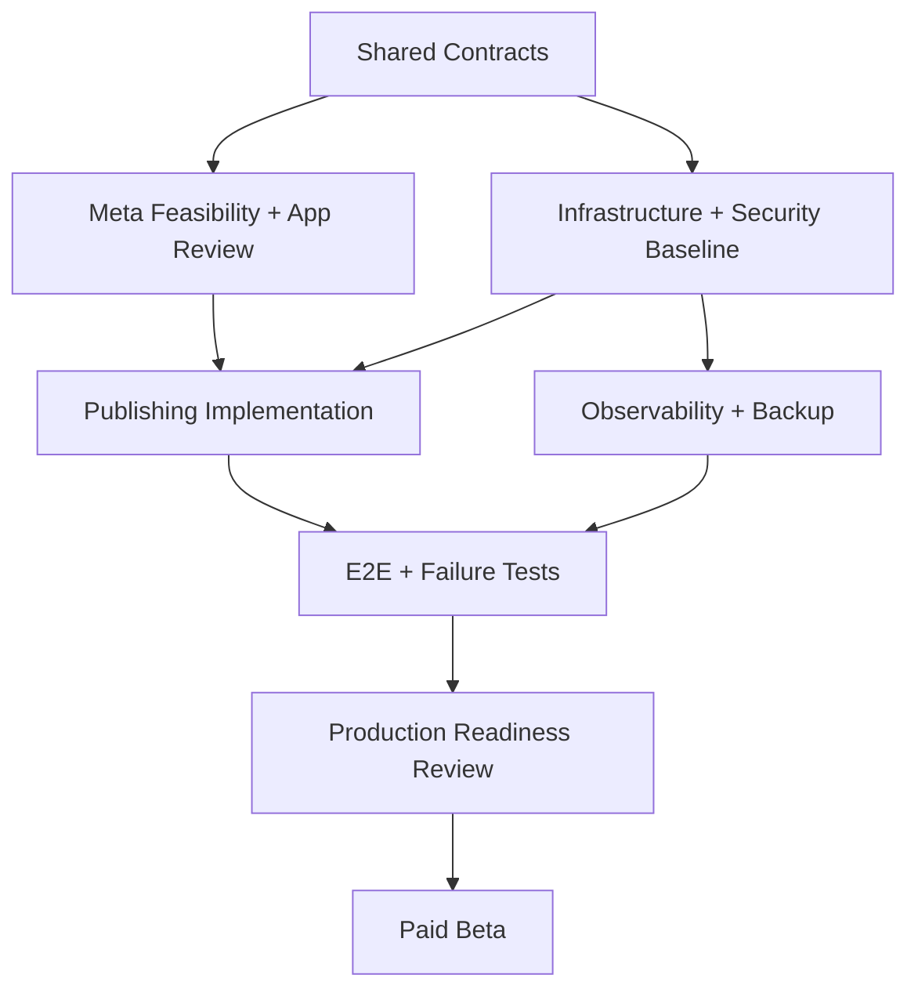

# Execution Workstream — Meta, Security, Billing และ Production Operations

**สถานะ:** Execution Baseline v1.0  
**วันที่:** 30 สิงหาคม 2026  
**ขอบเขต:** Meta feasibility/App Review/publishing, Security/PDPA, Billing/Payment/Tax, Infrastructure/CI/CD, Observability/SLO, Backup/Restore, Incident/Support, Test Strategy และ Production Readiness  
**วัตถุประสงค์:** แตกงานให้ Sub-agent หลายตัวลงมือพร้อมกันได้ โดยมีขอบเขต, dependency, deliverable และ acceptance criteria ที่ตรวจรับได้

> หลักการ: งานที่อยู่คนละ Track ทำพร้อมกันได้เมื่อ Contract ต้นทางถูกล็อกแล้ว แต่ห้าม Agent แก้ Schema, Event หรือ API Contract กลางเองโดยไม่ผ่านเจ้าของ Contract

---

## 1. ผลลัพธ์ที่ Workstream นี้ต้องส่งมอบ

ก่อน Paid Production Beta ระบบต้องพิสูจน์ได้ว่า:

1. เชื่อม Facebook Page และ Instagram Professional หลายบัญชีต่อ Workspace ได้ตามสิทธิ์จริง
2. Publish รูป, วิดีโอ และ Carousel แบบ background ได้โดยไม่โพสต์ซ้ำ แม้ retry หรือ worker restart
3. Tenant, Business, Page, Credential และ Asset ถูกแยกสิทธิ์ทุก data path
4. มี PDPA data inventory, consent/legal basis, retention, export และ deletion flow ที่ทำงานจริง
5. เก็บเงิน, จัดการสถานะสมาชิก, quota และเอกสารทางการเงินโดยไม่ทำให้ข้อมูลผู้ใช้สูญหาย
6. แยก Local/Preview/Staging/Production, deploy และ migrate แบบตรวจสอบ/ย้อนแก้ได้
7. วัด health, latency, error, backlog, cost และ publish reliability ได้จาก dashboard/alert
8. Restore ฐานข้อมูลและ Asset จาก backup ผ่านการซ้อมด้วยหลักฐาน
9. มี Incident/Support runbook ที่คนเดียวปฏิบัติได้ และข้อความแจ้งผู้ใช้เป็นภาษาไทย
10. ผ่าน Test Matrix, Production Readiness Review และ Go/No-Go Gate ที่กำหนด

---

## 2. กฎการกระจายงานให้ Sub-agent

### 2.1 Shared contracts ที่ต้อง Freeze ก่อนทำงานเชื่อมต่อ

| Contract | เจ้าของ | ผู้ใช้ Contract | Freeze เมื่อ |
|---|---|---|---|
| Tenant Context v1 | Core Platform | ทุก Track | workspace/business/page/user/role/correlation ครบ |
| Job/Event Envelope v1 | Background Platform | Meta, Billing, Ops, Test | idempotency, retry, trace, schema version ครบ |
| Social Publisher Port v1 | Meta Track | Calendar, Job, Metrics | capability, validation, publish result/error ครบ |
| Usage/Cost Event v1 | Billing/Cost Track | AI, Research, Storage, Meta | billable unit, payer, amount, dedupe key ครบ |
| Audit Event v1 | Security Track | ทุก Track | actor, action, target, before/after, source ครบ |
| Secret Reference v1 | Security/Infrastructure | Meta, BYOK, Payment | เก็บเฉพาะ reference; ห้ามส่ง secret ใน event/log |
| Error Taxonomy v1 | Ops + UX | ทุก Track | user-safe code, retryability, owner, severity ครบ |

### 2.2 File ownership ขณะให้ Agent ทำพร้อมกัน

- Agent หนึ่งตัวเป็นเจ้าของไฟล์/โฟลเดอร์หนึ่งชุดในแต่ละรอบ
- Schema migration มี Migration Owner คนเดียวเป็นผู้ merge และเรียงลำดับ
- Agent อื่นเสนอ schema change ผ่าน contract note หรือ patch แยก ห้ามแก้ migration เดียวกันพร้อมกัน
- Provider adapter, test fixture และ runbook แยกโฟลเดอร์ได้ จึงทำขนานกันได้
- ทุกงานส่งต่อพร้อม `Assumptions`, `Changed contracts`, `Open risks`, `How verified`

### 2.3 Definition of Ready สำหรับแจกงาน

- Task ID และ Scope ชัด
- ระบุไฟล์/โมดูลที่ Agent เป็นเจ้าของ
- Dependency ที่ต้องเสร็จแล้วระบุเป็น ID
- มี fixture/test account/mock ที่จำเป็น
- Acceptance criteria ตรวจแบบ pass/fail ได้
- ระบุสิ่งที่ห้ามทำและข้อมูลลับที่ห้าม log

---

## 3. Dependency Map และ Critical Path

### Critical Path ไป Paid Beta



### งานที่เป็น External Blocker

| Blocker | เริ่มเมื่อ | ผลกระทบ | Owner | Mitigation |
|---|---|---|---|---|
| Meta Business verification | Phase 0 วันแรก | App Review/advanced access ล่าช้า | Product/Meta | เตรียมเอกสารนิติบุคคล, domain, privacy URL ทันที |
| Meta App Review/permission approval | หลัง screencast/use case พร้อม | Publish จริงให้ลูกค้าหลายรายไม่ได้ | Meta | ส่ง review เร็ว, ใช้ test users/system users เฉพาะ dev ตามข้อกำหนด |
| Payment provider onboarding/KYC | Phase 1C | เปิดชำระเงินจริงไม่ได้ | Billing | เลือก provider สำรองและใช้ manual invoice beta เป็น contingency |
| Tax/VAT/accounting decision | ก่อนเปิดราคา | invoice/receipt และราคาหน้าเว็บผิด | Owner/Accountant | ขอคำยืนยันนักบัญชีเป็นลายลักษณ์อักษร |
| Privacy/Terms legal review | ก่อน Closed Pilot เก็บข้อมูลจริง | ความเสี่ยง PDPA/contract | Owner/Legal | ใช้ data-minimization และ pilot agreement ชั่วคราวที่ผ่าน review |
| Meta API/version/policy change | ต่อเนื่อง | format/permission แตก | Meta/Ops | pin version, deprecation calendar, contract tests, feature flag |

> External approval ต้องติดตามแยกจากสถานะ code: `not_started / preparing / submitted / changes_requested / approved / expired` พร้อม owner และวันที่ตรวจครั้งถัดไป

---

## 4. Track META — Feasibility, App Review และ Publishing

### เป้าหมาย

พิสูจน์ capability ที่ใช้ได้จริงกับ Facebook Page + Instagram Professional และสร้าง Publisher Adapter ที่ปลอดภัยต่อ retry, token failure และ partial success

### Task Breakdown

| ID | Pri | Phase | งาน | Depends on | Deliverable | Acceptance criteria |
|---|---:|---|---|---|---|---|
| META-001 | P0 | 0 | สร้าง Capability Matrix แยก FB/IG, media type, permission, account requirement, API version | — | `meta-capability-matrix-v1` | ทุก P0 format ระบุ supported/unsupported/unknown และ source/date |
| META-002 | P0 | 0 | สร้าง Meta App และ environment app strategy | — | App inventory + owner + environment policy | Dev/Staging/Prod credential ไม่ปะปนและมีผู้ถือสิทธิ์อย่างน้อย 2 คนถ้าเป็นไปได้ |
| META-003 | P0 | 0 | Business verification/domain/privacy/terms readiness | META-002, SEC-201 | Submission checklist | เอกสาร/URL/branding ตรงกันและไม่มี placeholder |
| META-004 | P0 | 0 | Permission map จาก user action → endpoint → data → retention | META-001 | Permission justification table | Permission ทุกตัวมีเหตุผล, UI flow และ data-use statement |
| META-005 | P0 | 0 | OAuth Spike: connect, re-consent, revoke, expired token | META-002, SEC-006 | Runnable spike + findings | ครบ happy/deny/revoke/expired และไม่เก็บ token ใน client/log |
| META-006 | P0 | 0 | Account discovery/pairing FB Page ↔ IG Professional | META-005 | Fixture + pairing rules | หลาย Page, ไม่มี IG, สิทธิ์ไม่พอ, asset ต่าง business แสดงผลถูกต้อง |
| META-007 | P0 | 0 | Publish spike: Facebook image/text | META-005 | API trace แบบ redact + result | สร้างโพสต์และเก็บ remote ID/permalink ได้ |
| META-008 | P0 | 0 | Publish spike: Instagram image | META-006 | API trace แบบ redact + result | container → ready → publish สำเร็จและ handle timeout ได้ |
| META-009 | P0 | 0 | Video/Reel/Carousel feasibility spike | META-007, META-008 | Format decision record | ล็อก format/limit/processing behavior ของ Beta; unsupported ถูกตัดชัดเจน |
| META-010 | P0 | 0 | App Review script, screencast และ reviewer test data | META-003–009 | Review submission package | reviewer ทำทุก permission flow ได้จาก clean account |
| META-011 | P0 | 0–1E | ส่ง/ติดตาม App Review และตอบ feedback | META-010 | Review log | สถานะ/คำถาม/คำตอบ/version บันทึกครบ; approved ก่อน Paid Beta |
| META-012 | P0 | 1A | Social Publisher Port v1 | MOD-001, MOD-002, META-001 | Interface + schema + error taxonomy | FB/IG adapters ไม่รั่ว provider object เข้า domain |
| META-013 | P0 | 1A | Credential lifecycle: encrypt, refresh/extend ตาม flow, health, reconnect | META-005, SEC-005 | Credential service + tests | revoked/expired/permission loss ตรวจพบและแจ้ง action ภาษาไทย |
| META-014 | P0 | 1D | Preflight validator ต่อ channel/media | META-009, AST-003, QLT-006 | Validation service | invalid format ถูกหยุดก่อน schedule และอธิบายวิธีแก้ได้ |
| META-015 | P0 | 1E | Facebook Publisher Adapter | META-012–014, JOB-003 | Adapter + contract tests | immediate/scheduled orchestration ผ่าน; remote result normalized |
| META-016 | P0 | 1E | Instagram Publisher Adapter + container polling | META-012–014, JOB-003 | Adapter + contract tests | polling มี deadline/backoff; restart แล้วทำต่อได้ |
| META-017 | P0 | 1E | Idempotency/duplicate prevention | MOD-004, META-015–016 | Dedupe design + concurrency tests | retry/timeout/double-click/worker crash ไม่เกิดโพสต์ซ้ำ |
| META-018 | P0 | 1E | Multi-channel fan-out และ partial success | META-015–017 | Publish orchestration | FB สำเร็จ/IG ล้มเหลวแสดงแยกและ retry เฉพาะ IG ได้ |
| META-019 | P0 | 1E | Publish status reconciliation | META-015–018 | Reconciler job | unknown result ถูก reconcile; ไม่ retry แบบ blind เมื่ออาจ publish แล้ว |
| META-020 | P0 | 1E | Basic metrics sync/cursor/rate handling | META-011, MET-001 | Metrics adapter | sync ซ้ำไม่ duplicate; missing permission degraded อย่างปลอดภัย |
| META-021 | P0 | 1E | Rate-limit/budget/circuit breaker | META-015–020, OBS-008 | Policy + tests | throttle ไม่ทำ queue พัง; retry-after ถูกเคารพ; alert ก่อน backlog เกิน SLO |
| META-022 | P0 | 1E | API version/deprecation management | META-001 | Version register + calendar | ระบุ version owner, expiry และ regression window |
| META-023 | P0 | 1E | Meta sandbox/pilot E2E matrix | META-015–022, TST-014 | Evidence pack | ผ่าน account/format/failure matrix ที่กำหนด 100% ของ P0 |

### Meta Non-goals ใน Beta

- ไม่ทำ Inbox/message/comment ingestion
- ไม่ทำ Ads buying/optimization
- ไม่ทำ Facebook Group, personal profile หรือ Instagram consumer account
- ไม่อ้างรองรับ media format จนกว่าจะผ่าน spike และ App permission จริง
- ไม่ใช้ scheduled endpoint ของ providerเป็น single source of truth; Platform scheduler ต้องคุมสถานะเอง

### ความเสี่ยงเฉพาะ Meta

- App Review ไม่อนุมัติ: ปรับ scope format/permission หรือเลื่อน Paid Beta; ห้าม bypass policy
- API success แต่ network timeout: ต้อง reconcile ด้วย idempotency record/remote lookup ก่อน retry
- Token ยัง valid แต่ role/Page access เปลี่ยน: health check และ preflight ก่อน publish
- Facebook สำเร็จแต่ Instagram ล้มเหลว: สถานะระดับ channel ไม่ใช่ content เดียว
- Video processing นาน: polling แบบ durable ไม่ถือ worker/HTTP request ค้าง

---

## 5. Track SEC — Security, Privacy และ PDPA

### เป้าหมาย

ป้องกัน tenant leakage, secret leakage, unauthorized publish, malicious upload และสร้าง data lifecycle ที่อธิบาย/ดำเนินการตาม PDPA ได้

### Task Breakdown

| ID | Pri | Phase | งาน | Depends on | Deliverable | Acceptance criteria |
|---|---:|---|---|---|---|---|
| SEC-001 | P0 | 0 | Security architecture + trust boundaries | MOD-001 | Threat context diagram | ครบ browser, API, DB, storage, worker, provider, admin |
| SEC-002 | P0 | 0 | Threat model แบบ STRIDE/abuse cases | SEC-001 | Threat register | ทุก threat มี likelihood/impact/control/owner/residual risk |
| SEC-003 | P0 | 0 | Data classification | SEC-001 | Public/Internal/Confidential/Restricted matrix | token/API key/PII/media/financial/audit ถูกจัดชั้นครบ |
| SEC-004 | P0 | 0 | Authentication/session policy | ACC-001 | Security requirements | recovery, session expiry, device/logout, brute-force/rate-limit ชัดเจน |
| SEC-005 | P0 | 1A | Secret vault/reference contract | INF-006, MOD-002 | Secret service interface | secret encrypted, masked, rotated; browser/job/event/log ไม่เห็น plaintext |
| SEC-006 | P0 | 1A | OAuth state/PKCE/redirect validation | META-005 | OAuth security tests | CSRF, replay, open redirect และ account-mixup tests ผ่าน |
| SEC-007 | P0 | 1A | RLS/authorization matrix | ACC-004, BUS-001 | Policy matrix + automated tests | role × workspace × business × page ทุก critical table ผ่าน deny-by-default |
| SEC-008 | P0 | 1A | Storage authorization/signed URL | AST-001, SEC-007 | Storage policy tests | private bucket, short-lived URL, no list/cross-business access |
| SEC-009 | P0 | 1A | Audit event contract | MOD-004 | Audit schema + retention | role/credential/publish/delete/billing/support action ระบุ actor/correlation ครบ |
| SEC-010 | P0 | 1A–1E | Secure headers, CORS, CSRF, CSP, cookie policy | INF-008 | Config + scanner evidence | production scanner ไม่มี critical/high ที่ไม่ได้ accept risk |
| SEC-011 | P0 | 1B | Research ingestion hardening/prompt injection boundary | RSH-003 | Sanitization + trust-label rules | external text ไม่สามารถสั่ง tool/ข้าม tenant/เปลี่ยน system policy |
| SEC-012 | P0 | 1C | BYOK isolation/redaction/provider egress controls | AI-003, SEC-005 | Tests + provider data-flow | key ไม่เข้า analytics/error trace; request ถูกผูก tenant/provider ถูกต้อง |
| SEC-013 | P0 | 1D | Upload threat model, MIME/signature, malware policy | AST-002–004 | Upload security pipeline | spoofed file, oversized/decompression risk, malicious filename ถูกปฏิเสธ/quarantine |
| SEC-014 | P0 | 1E | Rate limit/abuse prevention per user/workspace/IP/action | OBS-008 | Rate policies | login/upload/generate/publish มี limit และ user-safe response |
| SEC-015 | P0 | 1E | Dependency/SAST/secret/IaC/container scan pipeline | INF-009 | CI security jobs | block critical/high ตาม policy; exception มี owner+expiry |
| SEC-016 | P0 | 1E | Admin/support access policy | OPS-003 | Break-glass design | least privilege, time-bound, audited, no secret reveal, revoke tested |
| SEC-017 | P0 | 1E | Pen-test checklist + focused review | SEC-006–016 | Findings report | zero open critical/high ก่อน Paid Beta; medium มี owner/date |
| SEC-018 | P0 | 1E | Security incident playbook | INC-006 | Runbook | credential leak/tenant leak/malicious upload/account takeover tabletop ผ่าน |

### PDPA/Data Governance Tasks

| ID | Pri | Phase | งาน | Depends on | Deliverable | Acceptance criteria |
|---|---:|---|---|---|---|---|
| PDPA-001 | P0 | 0 | Data inventory และ data-flow map | SEC-003, META-004 | Record of processing | ทุก field/source/purpose/processor/region/retention/owner ครบ |
| PDPA-002 | P0 | 0 | Controller/processor role และ lawful basis decision | PDPA-001 | Decision record สำหรับ legal review | ทุก processing purpose มีฐาน/contract owner; จุดไม่ชัดถูก escalate |
| PDPA-003 | P0 | 0 | Vendor/subprocessor register | PDPA-001 | Vendor register | AI/hosting/storage/payment/error/analytics vendor ครบและมี DPA/status |
| PDPA-004 | P0 | 0 | Privacy notice, Terms, cookie/analytics consent requirements | PDPA-002–003 | Legal content requirements | URL พร้อมก่อน Meta review; version/effective date/acceptance record ครบ |
| PDPA-005 | P0 | 1A | Consent/preference/version records | PDPA-004 | Consent schema/API/UI | เก็บ version, timestamp, purpose; withdrawal ทำได้ตามที่กฎหมาย/contract กำหนด |
| PDPA-006 | P0 | 1E | Retention schedule per entity | PDPA-001–004 | Machine-readable retention policy | active/cancelled/trash/audit/backup แต่ละชนิดมีช่วงเวลาและเหตุผล |
| PDPA-007 | P0 | 1E | User/workspace data export | PDPA-001, SEC-007 | Export job + access control | export background, encrypted/signed, expires, audit, cross-tenant test ผ่าน |
| PDPA-008 | P0 | 1E | Delete account/workspace/business flow | PDPA-006, AST-009 | Deletion orchestration | preview impact, grace/cancel, purge, processor propagation, tombstone/audit ครบ |
| PDPA-009 | P0 | 1E | Backup deletion exception/expiry handling | PDPA-006, DR-004 | Policy + restore filter | deleted data ไม่กลับมา active หลัง restore และหมดตาม backup lifecycle |
| PDPA-010 | P0 | 1E | Data subject request runbook | PDPA-007–009, INC-009 | Intake/verify/execute/evidence flow | tabletop access/correction/delete request ผ่าน โดยไม่เปิดข้อมูลผิดคน |
| PDPA-011 | P0 | 1E | Breach assessment/notification workflow | SEC-018 | Legal incident checklist | incident timeline/evidence/decision/escalation contacts พร้อม |

> หมายเหตุ: ข้อกำหนดกฎหมาย ภาษี และระยะเวลาแจ้งเหตุให้ผู้เชี่ยวชาญกฎหมายไทยตรวจยืนยันก่อนเปิด Production; เอกสารนี้ไม่แทนคำปรึกษากฎหมาย

---

## 6. Track BIL — Billing, Payment, Tax และ Entitlement

### เป้าหมาย

ให้ subscription/payment/quota ทำงานถูกต้องแบบ idempotent แยกจาก payment provider และไม่ลบ/ล็อกข้อมูลทันทีเมื่อชำระไม่สำเร็จ

### Decision Gates ก่อนเขียนระบบ

| ID | Decision | ตัวเลือกที่ต้องประเมิน | Due | Output |
|---|---|---|---|---|
| BIL-D01 | Entity/merchant of record | บริษัทผู้ขาย, payment provider capability | Phase 0 | Accounting/legal decision |
| BIL-D02 | ราคาแสดงรวม VAT หรือไม่ | B2C/B2B positioning, invoice wording | Phase 0 | Price display rule |
| BIL-D03 | VAT/e-Tax invoice/receipt | manual, accounting integration, provider | ก่อน Paid Beta | Document flow |
| BIL-D04 | Billing cycle | monthly first; annual later | Phase 1C | Subscription policy |
| BIL-D05 | Payment methods | card, PromptPay, transfer/manual invoice | Phase 1C | Provider shortlist |
| BIL-D06 | Refund/cancel/proration | no proration/manual credit/etc. | Phase 1C | Customer policy |
| BIL-D07 | Grace period/data retention | failed payment/cancelled plan behavior | Phase 1C | State transition policy |
| BIL-D08 | BYOK pricing | subscription includes platform features; AI payer distinction | Phase 1C | Entitlement/pricing rule |

### Task Breakdown

| ID | Pri | Phase | งาน | Depends on | Deliverable | Acceptance criteria |
|---|---:|---|---|---|---|---|
| BIL-001 | P0 | 0 | Pricing hypothesis + unit economics model | BIL-D01–02 | Pricing/cost model | base/best/worst margin รวม AI/storage/payment/support/tax |
| BIL-002 | P0 | 0 | Plan/entitlement/quota catalog v1 | BIL-001 | Versioned plan manifest | users/business/pages/AI/research/storage ระบุ soft/hard behavior ครบ |
| BIL-003 | P0 | 1C | Usage/Cost Event v1 + dedupe | MOD-004, AI-008, AST-011 | Contract + fixtures | retry event ไม่คิดซ้ำ; payer/platform/BYOK แยกได้ |
| BIL-004 | P0 | 1C | Usage aggregation/ledger/reconciliation | BIL-003 | Immutable ledger + daily totals | ยอดรวมย้อน trace ถึง job/provider ได้; backfill idempotent |
| BIL-005 | P0 | 1C | Entitlement service | BIL-002 | Port/API/cache rules | ทุก module query entitlement เดียวกัน; plan change effective ถูกต้อง |
| BIL-006 | P0 | 1E | Payment provider spike/KYC/webhook verification | BIL-D05, INF-006 | Spike + provider ADR | signature/replay/out-of-order event tests ผ่าน |
| BIL-007 | P0 | 1E | Subscription state machine | BIL-D04, D06, D07, BIL-006 | State model | trial/active/past_due/grace/cancelled/expired transition deterministic |
| BIL-008 | P0 | 1E | Checkout/payment confirmation | BIL-006–007 | UI/API flow | duplicate submit/webhook ไม่สร้าง subscription ซ้ำ |
| BIL-009 | P0 | 1E | Quota warning/enforcement | BIL-002, BIL-005 | Policy engine + UX | 80% warning; hard stop ไม่ทำข้อมูลหาย/ยกเลิก published job ที่เริ่มแล้วผิดวิธี |
| BIL-010 | P0 | 1E | Invoice/receipt/tax data capture | BIL-D01–03, BIL-008 | Document records/export | เลขเอกสาร/สถานะ/ข้อมูลภาษีสอดคล้องกับนักบัญชีและแก้ย้อนหลังมี audit |
| BIL-011 | P0 | 1E | Payment reconciliation | BIL-004, BIL-006–010 | Daily reconciliation job | provider/ledger/subscription mismatch ถูกแจ้งและแก้แบบ audit ได้ |
| BIL-012 | P0 | 1E | Failed payment/grace/recovery flow ภาษาไทย | BIL-007–009 | Notifications + support action | ไม่ปิดอ่านข้อมูลทันที; retry/update method/cancel behavior ถูกต้อง |
| BIL-013 | P0 | 1E | Admin adjustment/credit/manual payment | BIL-010–011, SEC-016 | Audited admin tools | dual confirmation สำหรับ adjustment สำคัญ; reason required |
| BIL-014 | P0 | 1E | Financial export for accounting | BIL-010–013 | Monthly export schema | period totals reconcile และมี timezone/currency/tax fields |
| BIL-015 | P1 | 1.5 | Self-service upgrade/downgrade/cancel/top-up | BIL-007–014 | Customer flows | preview charge/entitlement/effective date ก่อนยืนยัน |

### Billing Risks

- Webhook มาไม่เรียง: state transition ต้องอิง event time/version และ reconcile
- Provider แสดง success แต่ webhook หาย: poll/reconcile ไม่เชื่อ client redirect
- Quota race: reserve → consume/release สำหรับงานแพง ไม่ใช้ read-then-write ธรรมดา
- Tax rule ไม่ชัด: ห้าม hard-code; แยก tax/document adapter และให้ accountant sign-off
- BYOK: ยังมี cost platform (research/storage/jobs/support) จึงห้ามตีความว่าใช้ฟรีทั้งหมด

---

## 7. Track INF — Infrastructure, Environments และ CI/CD

### Environment Model

| Environment | ข้อมูล | External side effects | ผู้เข้าถึง | Purpose |
|---|---|---|---|---|
| Local | synthetic only | fake adapters/default | developer | development/unit test |
| Preview | synthetic/ephemeral | fake; Meta test app เฉพาะ opt-in | PR owner | review/migration smoke |
| Staging | anonymized/synthetic | provider sandbox/test accounts | limited team | E2E/release candidate |
| Production | real | live providers | least privilege | customers |

### Task Breakdown

| ID | Pri | Phase | งาน | Depends on | Deliverable | Acceptance criteria |
|---|---:|---|---|---|---|---|
| INF-001 | P0 | 0 | Repository/module boundaries/ownership | MOD-001–003 | Repo structure + CODEOWNERS | domain/adapter/migration ownership ชัด; dependency rule lint ได้ |
| INF-002 | P0 | 0 | Environment inventory/naming/tagging | — | Environment register | owner, URL, project, region, data class, monthly cost ครบ |
| INF-003 | P0 | 0 | Infrastructure-as-code strategy | INF-002 | IaC/ADR | staging/prod reproducible; manual resource มี register+reason |
| INF-004 | P0 | 0 | Supabase projects/database/storage setup | INF-002–003 | Environment instances | staging/prod แยก project/keys/bucket และ RLS defaults |
| INF-005 | P0 | 0 | Runtime/worker/queue topology | JOB-001, MOD-004 | Deployment diagram | web request ไม่ถือ long job; queue retry/DLQ/lease defined |
| INF-006 | P0 | 0 | Secret management per environment | SEC-003 | Secret inventory/policy | ไม่มี secret ใน repo/preview/log; rotation owner/date ครบ |
| INF-007 | P0 | 0 | Domain, DNS, TLS และ email sender setup | PDPA-004 | Verified domains | HTTPS/HSTS และ transactional sender authentication ผ่าน |
| INF-008 | P0 | 0–1A | App/API runtime config and network policy | INF-004–007 | Config baseline | production debug off; allowlist/timeout/body limits set |
| INF-009 | P0 | 0 | CI pipeline: lint/type/unit/schema/security/build | INF-001 | Required checks | clean clone ทำซ้ำได้; failure block merge |
| INF-010 | P0 | 0 | Preview deployment per PR | INF-009 | Preview workflow | no prod secret/data; auto expiry/cleanup |
| INF-011 | P0 | 1A | Migration workflow + drift detection | INF-004, INF-009 | Migration pipeline | staging before prod; concurrent migration blocked; drift alert |
| INF-012 | P0 | 1A | Seed/factory/synthetic test data | INF-004 | Seed package | deterministic multi-tenant fixtures; no copied production PII |
| INF-013 | P0 | 1A | Feature flags/kill switches | MOD-008 | Flag service/policy | default safe; audit; per-env/workspace; stale flag owner |
| INF-014 | P0 | 1E | Release pipeline + promotion | INF-009–013, TST-019 | CI/CD workflow | immutable artifact promoted; approval and evidence recorded |
| INF-015 | P0 | 1E | Zero/low-downtime database change pattern | INF-011 | Expand/migrate/contract playbook | backward compatibility tested; rollback/forward-fix documented |
| INF-016 | P0 | 1E | Rollback and emergency deploy | INF-014–015 | Runbook + drill | prior app version restored; DB incompatible change handled safely |
| INF-017 | P0 | 1E | Capacity/cost baseline | OBS-010 | Load/cost report | expected 10/50/100 workspace capacity and trigger documented |
| INF-018 | P0 | 1E | Scheduled job/clock/timezone validation | CAL-001, JOB-003 | Time handling tests | UTC storage + Asia/Bangkok display; DST-independent; missed schedule recovery |

---

## 8. Track OBS — Observability, SLO และ Cost Visibility

### Service Indicators และ Beta Targets

> Targets เป็น initial guardrail ต้องปรับหลังมีข้อมูล Pilot 30 วัน และแยก provider-caused failure จาก platform defect แต่ผู้ใช้ต้องยังเห็นสถานะจริง

| Journey/Service | SLI | Beta SLO |
|---|---|---|
| Core web/API | successful eligible requests | ≥ 99.5% รายเดือน |
| Publish orchestration | jobs จบ terminal ถูกต้องภายใน window | ≥ 99% โดยไม่นับ provider policy rejection |
| Duplicate safety | duplicate posts จาก platform retry | 0 |
| Scheduled publish timeliness | เริ่ม attempt ภายใน ±5 นาที | ≥ 99% |
| AI/Research jobs | terminal success หรือ actionable failure ภายใน SLA | ≥ 98% |
| Notification | in-app notification ภายใน 60 วินาทีหลัง terminal event | ≥ 99% |
| Asset upload/processing | eligible asset พร้อมใช้ใน target window ตามขนาด | ≥ 98% |
| Tenant isolation | confirmed cross-tenant disclosure | 0 |
| Restore capability | RPO/RTO ตาม DR policy | drill ผ่าน 100% |

### Task Breakdown

| ID | Pri | Phase | งาน | Depends on | Deliverable | Acceptance criteria |
|---|---:|---|---|---|---|---|
| OBS-001 | P0 | 0 | Observability taxonomy | MOD-002, MOD-004 | naming/field/redaction standard | trace/job/workspace/module/error links ได้ โดยไม่ใส่ secret/content เต็ม |
| OBS-002 | P0 | 0 | Structured logging | OBS-001, SEC-003 | logger middleware | severity/error_code/correlation/environment/module ครบ; PII redact tests ผ่าน |
| OBS-003 | P0 | 0 | Error tracking/release correlation | OBS-002 | Error service config | issue ผูก release/trace/user-safe code; source map access จำกัด |
| OBS-004 | P0 | 1A | Distributed trace job/event propagation | OBS-001, JOB-001 | Trace instrumentation | browser/API/outbox/worker/provider span เชื่อมกันได้ |
| OBS-005 | P0 | 1B | Queue/job metrics | JOB-007 | Dashboard | queue depth/age/success/retry/DLQ/runtime/lease loss แยก job type |
| OBS-006 | P0 | 1E | Meta publishing dashboard | META-015–021 | Dashboard | success/failure/latency/retry/token/rate/partial/unknown ครบ |
| OBS-007 | P0 | 1E | Billing/payment dashboard | BIL-006–012 | Dashboard | checkout/webhook/reconcile/past_due/mismatch ครบ |
| OBS-008 | P0 | 1E | Alert policy/routing/noise budget | OBS-003–007 | Alert catalog | ทุก page alert มี severity, owner, runbook, dedupe, threshold |
| OBS-009 | P0 | 1E | SLI/SLO/error budget implementation | OBS-004–008 | SLO dashboard | คำนวณจาก user journey; maintenance/exclusion มี audit |
| OBS-010 | P0 | 1E | Cost observability | BIL-003–004, AST-011 | Cost dashboard | AI/research/storage/egress/compute/payment/support ต่อ workspace ได้ |
| OBS-011 | P0 | 1E | Synthetic probes | INF-014, META-015 | Probes | login/core API/job/notification และ safe publish test ตาม schedule |
| OBS-012 | P0 | 1E | Data-quality/reconciliation monitors | META-019, BIL-011 | Checks + alerts | stuck/unknown/orphan/missing ledger/remote mismatch ถูกตรวจ |
| OBS-013 | P1 | 1.5 | Customer-facing status page | INC-004 | Status components | incident update history และ subscription opt-in |

### Alert Severity

| Severity | ตัวอย่าง | Response target Beta | Action |
|---|---|---|---|
| SEV-0 | tenant leakage, mass duplicate publish, destructive data loss | ทันที | kill switch, contain, owner escalation |
| SEV-1 | publish unavailable, auth outage, payment corrupt, restore risk | ≤ 15 นาทีเมื่อ on-call active | mitigate, status update |
| SEV-2 | degraded provider, queue delay, one format unavailable | ≤ 4 ชั่วโมง | workaround/retry/notify affected users |
| SEV-3 | cosmetic/minor support issue | next business cycle | backlog/monitor |

---

## 9. Track DR — Backup, Restore และ Business Continuity

### Target Policy สำหรับ Beta

| Data class | Backup | Initial RPO | Initial RTO | Restore priority |
|---|---|---:|---:|---:|
| Tenant/config/content/calendar/publish ledger | managed DB PITR + scheduled logical backup | ≤ 24 ชม.; ลดตาม plan ที่เลือก | ≤ 8 ชม. | 1 |
| Secrets/tokens | vault/provider recovery; ไม่ export plaintext | ตาม provider | ≤ 4 ชม. reconnect path | 1 |
| Original assets | checksum + secondary backup policy | ≤ 24 ชม. | ≤ 24 ชม. | 2 |
| Derivatives/thumbnails | regenerate ได้ | ไม่กำหนด | ≤ 48 ชม. | 3 |
| Logs/traces | provider retention | ≤ 24 ชม. | best effort | 4 |

> RPO/RTO สุดท้ายต้องเลือกตามต้นทุนและแพ็กเกจจริง; ห้ามโฆษณา SLA สูงกว่าที่ drill ทำได้

### Task Breakdown

| ID | Pri | Phase | งาน | Depends on | Deliverable | Acceptance criteria |
|---|---:|---|---|---|---|---|
| DR-001 | P0 | 0 | Data criticality/dependency inventory | PDPA-001, INF-002 | Recovery inventory | DB/storage/vault/provider/config/DNS/source artifact dependency ครบ |
| DR-002 | P0 | 0 | RPO/RTO/cost decision | DR-001, BIL-001 | DR policy | owner sign-off และสอดคล้องราคา/ความเสี่ยง |
| DR-003 | P0 | 1E | Database backup/PITR verification | INF-004, DR-002 | Backup config evidence | backup สำเร็จถูก monitor และคนละ failure domainเท่าที่ plan รองรับ |
| DR-004 | P0 | 1E | Asset original backup/checksum | AST-012, DR-002 | Backup copier + manifest | copy idempotent; checksum mismatch alert; delete lifecycle respected |
| DR-005 | P0 | 1E | Configuration/IaC/secret reference recovery | INF-003, INF-006 | Recovery package | สร้าง environment ใหม่ได้โดยไม่เก็บ plaintext secret ใน backup |
| DR-006 | P0 | 1E | Full restore runbook | DR-003–005 | Stepwise runbook | ระบุ isolate, restore, migrate, verify, switch traffic, communicate |
| DR-007 | P0 | 1E | Restore validation suite | TST-016, DR-006 | Automated checks | tenant count/referential integrity/assets/publish ledger/auth checks ผ่าน |
| DR-008 | P0 | 1E | Restore drill to isolated environment | DR-003–007 | Timestamped evidence/report | measured RPO/RTO ผ่านหรือ gap มี blocker owner/date |
| DR-009 | P0 | 1E | Post-restore reconciliation | META-019, BIL-011 | Reconcile runbook | ไม่ republish job เก่า/คิดเงินซ้ำ; remote/provider state reconcile |
| DR-010 | P1 | 1.5 | Quarterly automated restore drill | DR-008 | Recurring process | last success/failure visible และ alert เมื่อเกินกำหนด |

---

## 10. Track INC/OPS — Incident, Support และ Admin Operations

### Task Breakdown

| ID | Pri | Phase | งาน | Depends on | Deliverable | Acceptance criteria |
|---|---:|---|---|---|---|---|
| INC-001 | P0 | 0 | Incident taxonomy/severity/roles | OBS-008 | Incident policy | commander/ops/comms/scribe role รวมกรณี one-person mode |
| INC-002 | P0 | 0 | Contact/escalation/vendor register | PDPA-003 | Contact sheet | Meta/payment/hosting/legal/accountant contacts + access method current |
| INC-003 | P0 | 1E | Generic detect-triage-contain-recover-review runbook | INC-001, OBS-008 | Master runbook | ใช้ error/trace/job ID หา scope ได้โดยไม่เปิด secret |
| INC-004 | P0 | 1E | User communication templates ภาษาไทย | INC-001 | Templates | investigating/identified/monitoring/resolved + affected action ชัด |
| INC-005 | P0 | 1E | Meta outage/token/rate/publish duplicate runbooks | META-017–021 | Runbook set | kill switch/reconcile/retry/notify steps แยกตาม failure |
| INC-006 | P0 | 1E | Security/credential/tenant leak runbooks | SEC-017–018 | Runbook set | revoke/contain/evidence/legal escalation และห้ามทำลายหลักฐาน |
| INC-007 | P0 | 1E | Queue/backlog/worker/AI provider runbooks | OBS-005 | Runbook set | pause/resume/replay/DLQ/circuit breaker ไม่สร้างผลซ้ำ |
| INC-008 | P0 | 1E | Billing/payment mismatch runbook | BIL-011–013 | Runbook | customer entitlement ปลอดภัยระหว่าง investigate และ adjustment audit |
| INC-009 | P0 | 1E | PDPA request/breach intake | PDPA-010–011 | Intake templates | verify identity, clock, owner, evidence chain ครบ |
| INC-010 | P0 | 1E | Backup/restore/data corruption runbook | DR-006–009 | Runbook | freeze writes/isolated restore/reconcile/communication ครบ |
| INC-011 | P0 | 1E | Tabletop exercises | INC-003–010 | Exercise reports | อย่างน้อย tenant leak, duplicate publish, DB restore, payment mismatch ผ่าน |
| INC-012 | P0 | 1E | Post-incident review process | INC-003 | PIR template | timeline, impact, root/system cause, action owner/date, no-blame |
| OPS-001 | P0 | 1E | Admin workspace health console | OBS-005–007, SEC-016 | Admin UI | health/failed jobs/credential/quota แสดงโดยไม่เผย secret/contentเกินจำเป็น |
| OPS-002 | P0 | 1E | Safe job operations | JOB-007–008 | Retry/cancel/replay UI/API | preview impact; idempotency; audit; bulk action มี guardrail |
| OPS-003 | P0 | 1E | Support access/break-glass | SEC-016 | Access workflow | user consent/justification/time limit/audit/revoke; default read-only |
| OPS-004 | P0 | 1E | Diagnostic bundle | OBS-001–007 | Redacted bundle | user ส่งได้จากมือถือ; มี IDs/versions/status แต่ไม่มี key/token/contentลับ |
| OPS-005 | P0 | 1E | Support intake/triage macros ภาษาไทย | INC-001 | Support playbook | จัด severity, ขอข้อมูลขั้นต่ำ, deep link diagnostic, expected response |
| OPS-006 | P0 | 1E | Known issues/service health banner | INF-013, INC-004 | Banner control | target affected users/module; audit; expiry; mobile readable |
| OPS-007 | P1 | 1.5 | Support metrics/capacity guardrail | OPS-005 | Dashboard | tickets/workspace, time-to-resolve, hours/week, recurring cause tracked |

### One-person Operations Guardrails

- ไม่มี 24×7 SLA ใน Beta; ระบุ support hours และ emergency scope ให้ชัด
- SEV-0 kill switch ต้องใช้ได้จากมือถืออย่างปลอดภัย แต่ destructive action ต้องยืนยันสองขั้น
- งาน publish/charge/delete ทุก manual replay ต้อง preview target และมี audit
- ห้าม support ขอ API key/token ผ่านแชตหรือภาพหน้าจอ
- Incident ก่อน Feature เสมอ; error budget หมดให้หยุด rollout ที่เพิ่มความเสี่ยง

---

## 11. Track TST — Test Strategy และ Quality Engineering

### Test Pyramid และ Environment

| ระดับ | เป้าหมาย | รันเมื่อ | External provider |
|---|---|---|---|
| Unit | domain rules/state machine/parser/redaction | ทุก PR | fake |
| Contract | port/adapter/event/schema compatibility | ทุก PR | mock/recorded sanitized fixture |
| Integration | DB/RLS/storage/queue/webhook | ทุก PR/merge | local/staging service |
| E2E | user journey/mobile/background/recovery | release candidate | sandbox/test account |
| Resilience | timeout/retry/crash/race/rate/partial | nightly/pre-release | controlled fault |
| Security | auth/RLS/secret/upload/scans | PR + pre-release | test fixtures |
| Performance | API/queue/upload/publish schedule | pre-release | bounded sandbox/fake |
| Restore | backup to isolated environment | release + recurring | isolated |

### Task Breakdown

| ID | Pri | Phase | งาน | Depends on | Deliverable | Acceptance criteria |
|---|---:|---|---|---|---|---|
| TST-001 | P0 | 0 | Master test matrix/traceability | Master backlog | Requirement → test map | P0 ทุก ID มี test owner/type/environment |
| TST-002 | P0 | 0 | Test data policy/factories | SEC-003, INF-012 | Fixture library | synthetic, deterministic, tenant-separated, no production PII |
| TST-003 | P0 | 0 | Contract test harness | MOD-001–004 | Shared harness | adapter ใหม่ต้องผ่าน same success/error/idempotency suite |
| TST-004 | P0 | 1A | Authentication/authorization/RLS matrix | SEC-004, SEC-007 | Automated suite | allow/deny ทุก role/scope; negative tests มากกว่า happy path |
| TST-005 | P0 | 1A | Migration/schema compatibility tests | INF-011, INF-015 | CI suite | empty DB + previous release upgrade + drift ผ่าน |
| TST-006 | P0 | 1B | Background job recovery tests | JOB-004–008 | Fault suite | crash before/after side effect, lease expiry, retry, DLQ, cancel ผ่าน |
| TST-007 | P0 | 1B | Research isolation/evidence/prompt injection eval | SEC-011, RSH-003–008 | Eval suite | ไม่มี cross-business leakage/unsupported claim/tool hijack |
| TST-008 | P0 | 1C | AI/BYOK key and cost tests | SEC-012, BIL-003 | Suite | key redaction, payer, ceiling, fallback, duplicate usage event ผ่าน |
| TST-009 | P0 | 1C | Thai content quality golden set | QLT-001–007 | Versioned eval dataset/report | threshold ต่อ dimension/industry ผ่านและ regression bounded |
| TST-010 | P0 | 1D | Asset upload/processing/security tests | SEC-013, AST-001–010 | Media corpus suite | mobile resume, spoof, duplicate, derivative, rights, signed URL, delete ผ่าน |
| TST-011 | P0 | 1D | Approval/calendar/timezone/state tests | CAL-001–005, APR-001–004 | State suite | edit invalidates approval; concurrency/conflict/reschedule/timezone ผ่าน |
| TST-012 | P0 | 1E | Publisher adapter contract tests | META-012–021 | Shared provider suite | validation/result/error/retry/idempotency/capability ผ่านทั้ง FB/IG |
| TST-013 | P0 | 1E | Meta live test-account matrix | META-023 | Evidence | P0 formats/account states/failures ผ่านใน app/version ที่จะ release |
| TST-014 | P0 | 1E | End-to-end core journeys | INF-014, TST-004–013 | E2E suite | onboarding→research→generate→asset→approve→schedule→publish→notify ผ่าน |
| TST-015 | P0 | 1E | Billing/webhook/subscription/quota tests | BIL-006–013 | Suite | replay/out-of-order/failure/grace/race/reconcile ผ่าน |
| TST-016 | P0 | 1E | Backup/restore verification tests | DR-006 | Restore suite | integrity/isolation/remote reconciliation/no re-side-effect ผ่าน |
| TST-017 | P0 | 1E | Security regression/scanning | SEC-010–017 | Security report | zero open critical/high; accepted risk มี expiry |
| TST-018 | P0 | 1E | Performance/load/soak test | INF-017, OBS-009 | Capacity report | target workload ผ่าน SLO; bottleneck/scale trigger recorded |
| TST-019 | P0 | 1E | Mobile/responsive/accessibility/usability regression | UX-001–010 | Device/browser evidence | 360/390/430 px + supported iOS/Android browser; no core keyboard/code requirement |
| TST-020 | P0 | 1E | Release acceptance/regression pack | TST-014–019 | Release report | critical suite 100%; flaky test ไม่มีสิทธิ์ถูก ignore โดยไม่มี owner/date |

### Required Failure Scenarios

ทุก integration ที่มี side effect ต้องทดสอบอย่างน้อย:

1. user double tap/duplicate request
2. API timeout ก่อนรู้ผล
3. provider success แต่ response หาย
4. worker crash ก่อนและหลังบันทึกผล
5. retry พร้อมกันสอง worker
6. credential expired/revoked/permission lost
7. provider 429/5xx/invalid payload
8. partial success ระหว่างหลาย channel
9. user แก้/ลบ/cancel ระหว่าง job ทำงาน
10. restore ข้อมูลเก่าในขณะที่ remote side effect มีอยู่แล้ว

---

## 12. Track PRD — Production Readiness และ Release Gates

### Readiness Tasks

| ID | Pri | Phase | งาน | Depends on | Deliverable | Acceptance criteria |
|---|---:|---|---|---|---|---|
| PRD-001 | P0 | 0 | Production readiness checklist owner/version | — | Checklist | ทุกข้อมี evidence link/owner/status ไม่ใช้ความจำ |
| PRD-002 | P0 | 1D | Data migration/cutover plan | INF-011, INF-015 | Cutover plan | rehearsal ผ่าน; freeze/rollback/communication ชัด |
| PRD-003 | P0 | 1E | Architecture/security/privacy review | SEC-001–018, PDPA-001–011 | Signed review record | critical/high ปิด; residual risks accepted โดย owner |
| PRD-004 | P0 | 1E | Meta capability/permission review | META-001–023 | Evidence record | approved permission + live test P0; unsupported hidden by capability flag |
| PRD-005 | P0 | 1E | Billing/accounting readiness review | BIL-001–014 | Reconciliation evidence | test payment→subscription→receipt/export reconcile |
| PRD-006 | P0 | 1E | Reliability/observability/SLO review | OBS-001–012 | Dashboard/alert drill evidence | alerts reach owner; runbook link; synthetic and SLO valid |
| PRD-007 | P0 | 1E | Backup/restore/continuity review | DR-001–009 | Drill report | RPO/RTO achieved or Beta cannot launch |
| PRD-008 | P0 | 1E | Support/incident readiness review | INC-001–012, OPS-001–006 | Tabletop reports | primary scenarios handled and communication usable |
| PRD-009 | P0 | 1E | Test/release quality review | TST-001–020 | Release candidate report | no blocker; critical suite 100%; known issues disclosed |
| PRD-010 | P0 | 1E | Cost/capacity/kill-switch review | INF-013, INF-017, OBS-010 | Guardrail report | per-workspace cost visible; budgets/alerts/feature kill switches tested |
| PRD-011 | P0 | 1E | Closed Pilot go/no-go | PRD-003–004, PRD-006, PRD-009 | Decision log | pilot scope/quota/accounts/support hours/rollback explicit |
| PRD-012 | P0 | 1E | Paid Beta go/no-go | PRD-003–011, META-011 | Decision log | ทุก Paid Beta blocker pass และ external approval valid |
| PRD-013 | P0 | post-launch | 24h/72h/7d launch review | PRD-012 | Review notes/actions | SLO/cost/support/security/feedback reviewed; rollout expand/pause decision |
| PRD-014 | P0 | post-launch | 30-day GA evidence review | PRD-013 | GA recommendation | 30-day reliability, margin, support, retention data meets gates |

### Hard No-Go Conditions

- Meta permission ที่จำเป็นยังไม่ approved หรือ capability ยังไม่ผ่าน live test
- พบ cross-tenant data exposure หรือ secret ใน browser/log/error tracker
- duplicate publish scenario ที่ยัง reproduce ได้
- ไม่มี reconciliation เมื่อ provider response ไม่ชัด
- ไม่มี restore drill หรือ restore แล้วเกิด re-publish/re-charge
- payment/subscription/ledger ไม่ reconcile
- PDPA export/delete/breach workflow ไม่มี owner หรือยังทดสอบไม่ได้
- Critical/High security finding ยังเปิดโดยไม่มี compensating control ที่อนุมัติ
- ไม่มี alert/runbook สำหรับ publish, queue, auth, payment และ backup failure
- core mobile flow ไม่ผ่านบน 360 px

---

## 13. Parallel Execution Plan สำหรับ Sub-agents

### Wave 0 — Contract/Decision Sprint (ทำพร้อมกัน 5–7 Agent)

| Agent Package | Tasks | Input | Output/Hand-off |
|---|---|---|---|
| A: Meta Feasibility | META-001–010 | Product scope, test business accounts | capability, permission, spike, review package |
| B: Security/PDPA | SEC-001–009, PDPA-001–005 | core entity/schema draft | threat/data/RLS/legal requirements |
| C: Billing/Tax | BIL-D01–08, BIL-001–002 | pricing hypothesis | signed decisions, plan/quota model |
| D: Infrastructure | INF-001–013 | stack ADR/module rules | environments, CI, secrets, migration, flags |
| E: Observability/SLO | OBS-001–005, INC-001–002 | job/event/error draft | telemetry contract, initial dashboard/incident policy |
| F: Test Architecture | TST-001–006 | P0 backlog/contracts | traceability, fixtures, test harness |
| G: DR/Readiness | DR-001–002, PRD-001 | infra/data inventory | RPO/RTO, checklist skeleton |

**Wave 0 Integration Gate:** Tenant Context, Job/Event, Publisher, Usage/Cost, Audit, Secret Reference และ Error Taxonomy v1 ถูก review/freeze

### Wave 1 — Foundation Implementation

| Agent Package | Tasks | Blocked by |
|---|---|---|
| Meta Connection | META-012–014 | META spike + contracts + security |
| Security Controls | SEC-005–013 | infra + schema + OAuth/storage flows |
| Billing Ledger | BIL-003–005 | usage contract + plan manifest |
| Infra Delivery | INF-004–013 | environment/secret decisions |
| Observability | OBS-002–005 | telemetry fields + runtime |
| Test Foundation | TST-002–011 | schemas/modules implemented |

### Wave 2 — Production Capability Implementation

| Agent Package | Tasks | Blocked by |
|---|---|---|
| Meta Publishing | META-015–023 | App capability, job platform, asset/calendar |
| Billing Payment | BIL-006–014 | provider/KYC/tax decisions, ledger |
| Security Hardening | SEC-014–018, PDPA-006–011 | full data paths |
| Production Infra | INF-014–018 | CI/migration/feature flags |
| Dashboards/Alerts | OBS-006–012 | production workflows |
| Backup/Restore | DR-003–009 | infra/schema/storage stable |
| Ops/Runbooks | INC-003–012, OPS-001–006 | error taxonomy/dashboards/admin APIs |
| Release Tests | TST-012–020 | integrated release candidate |

### Wave 3 — Evidence, Drill และ Launch

ดำเนิน PRD-002–013 โดย Agent แต่ละ Track ส่ง evidence ให้ Release Owner คนเดียวตัดสิน ไม่ให้ Agent เจ้าของ feature approve งานตัวเองเพียงลำพังใน security, billing และ restore gate

---

## 14. Agent Handoff Template

Agent ทุกตัวต้องส่งรายงานรูปแบบนี้:

```text
Task IDs:
Status: done / partial / blocked
Files/modules changed:
Contracts consumed:
Contracts changed or proposed:
Assumptions:
Verification commands/tests:
Acceptance evidence:
Security/privacy/cost impact:
Open risks:
External blockers:
Recommended next tasks:
```

ถ้าเปลี่ยน Contract กลาง ให้สถานะเป็น `proposed` และหยุด consumer merge จน Contract Owner approve/version bump

---

## 15. Risk Register กลาง

| Risk | L | I | Leading signal | Prevention | Contingency | Owner |
|---|---:|---:|---|---|---|---|
| Meta review ล่าช้า/ไม่อนุมัติ | H | H | feedback/rejection | start Phase 0, minimum permission | จำกัด pilot/test, ลด scope format | Meta/Product |
| Tenant leakage | M | Critical | auth/RLS test fail | deny-by-default, tenant envelope | kill switch, contain, breach flow | Security |
| Duplicate publish | M | Critical | duplicate remote ID/post | idempotency + reconciliation | pause publisher, identify/delete with user consent | Meta/Ops |
| Secret leakage | M | Critical | scanner/log finding | vault/ref/redaction | revoke/rotate/investigate | Security |
| Unsupported claim/content risk | M | H | quality eval fail | evidence/risk gate | block publish/request review | Quality/Product |
| Queue backlog | M | H | oldest age/SLO burn | capacity/backpressure | pause low-priority, scale worker | Platform/Ops |
| Payment mismatch | M | H | reconcile difference | verified webhook + ledger | grace entitlement/manual audit | Billing |
| Cost overrun | M | H | unit cost/anomaly | quota/ceiling/cost event | kill expensive module/adjust quota | Billing/Ops |
| Backup unusable | L | Critical | restore check fail | recurring isolated drill | freeze risky deploy/manual recovery | DR |
| One-person operator overload | H | H | support hours/tickets rise | scope/quota/self-service/runbooks | pause onboarding/rollout | Owner |
| Vendor outage | M | H | provider error/SLO burn | circuit breaker/fallback where safe | degraded mode/status notice | Ops |
| Schema/event drift จาก parallel agents | M | H | CI contract fail | ownership/freeze/version tests | revert consumer/compat adapter | Architecture |

---

## 16. Evidence Checklist ที่ต้องแนบก่อนปิด Task

- PR/commit หรือไฟล์ deliverable
- Automated test result และ test name
- Screenshot/video เฉพาะ flow ที่ต้องใช้ App Review/UX evidence
- Redacted provider request/response fixture เมื่อเกี่ยวข้อง
- Migration/schema diff และ forward-fix plan เมื่อแตะ data
- Dashboard/alert/runbook link เมื่อสร้าง background/side effect
- Cost/usage event sample เมื่อทำงานที่มีต้นทุน
- Audit event sample เมื่อเป็น privileged action
- Mobile 360 px evidence เมื่อมี UI
- Open risk/accepted risk owner และวันหมดอายุ

---

## 17. สิ่งที่ต้องตัดสินโดยเจ้าของผลิตภัณฑ์ก่อนแจก Wave 0

1. ชื่อนิติบุคคล/โดเมน/อีเมลที่จะใช้กับ Meta, Payment และ Privacy documents
2. Beachhead Pilot businesses และ Meta accounts ที่ใช้ทดสอบโดยได้รับอนุญาต
3. Media formats P0 ที่ต้องการจริง: image, video/Reel, carousel
4. Payment method ขั้นต่ำสำหรับ Paid Beta และยอมรับ manual invoice ชั่วคราวหรือไม่
5. ราคาแสดงรวม VAT, รอบบิล, grace period และ refund policy เบื้องต้น
6. Data region/vendor ที่ยอมรับ และระยะเก็บข้อมูลหลัก/หลังยกเลิก
7. Support hours/ช่องทาง/ขอบเขตเหตุฉุกเฉินสำหรับ One-person Beta
8. Initial RPO/RTO ที่ยอมรับได้เทียบต้นทุน
9. จำนวน Pilot/Paid Beta Workspace สูงสุดและ quota ต่อราย
10. ผู้ตรวจภายนอก: นักบัญชี/ภาษี และที่ปรึกษากฎหมาย/PDPA

เมื่อ 10 ข้อนี้ยังไม่ครบ Agent สามารถทำ spike, contract, fake adapter, threat model และ test harness ได้ แต่ห้ามสรุป Payment/Tax/Legal/Production SLA เป็น Final
