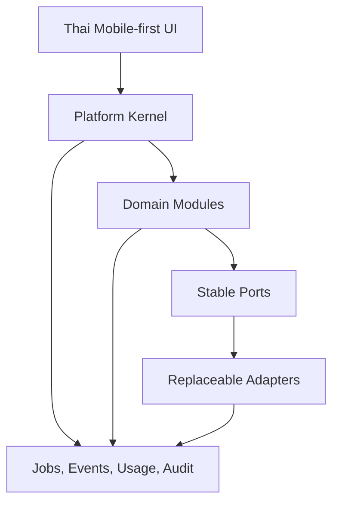

# Modular Plug-and-Play Design Rules

## AI Content OS สำหรับ SME ไทย

**สถานะ:** Architecture Constitution v1.0  
**วันที่:** 30 สิงหาคม 2026  
**ใช้กับ:** Application, Database, Background Jobs, AI, Research, Social, Storage, Industry Pack, UI และ Operations  
**หลักสำคัญ:** Modular Monolith ตอนเริ่มต้น แต่ทุก Module มี Contract ที่พร้อมแยก Scale ได้ภายหลัง

เอกสารนี้เป็นกฎบังคับสำหรับการออกแบบและ Review งานใหม่ เป้าหมายไม่ใช่สร้าง Microservices ตั้งแต่วันแรก แต่ป้องกันไม่ให้ Business Logic ผูกติดกับ Provider, Page, Industry หรือ Module อื่นจนเปลี่ยนและขยายไม่ได้

---

## 1. ความหมายของ Plug-and-Play

Module ที่ถือว่า Plug-and-Play ต้อง:

1. เปิด/ปิดได้ต่อ Environment, Plan, Workspace หรือ Business ด้วย Feature/Capability Policy
2. เปลี่ยน Adapter/Provider ได้โดย Core Workflow ไม่ต้องแก้ Business Logic
3. ประกาศ Input, Output, Permission, Cost, Limit และ Event ที่รองรับอย่างชัดเจน
4. มี Contract Test ชุดเดียวกันสำหรับทุก Implementation
5. Failure ของ Module หนึ่งไม่ทำให้ข้อมูลของ Module อื่นเสียหรือเกิดผลซ้ำ
6. ย้าย Worker หรือ Runtime ออกไป Scale แยกได้โดยไม่เปลี่ยน Product Flow
7. เก็บ Tenant Context, Business Context, Audit และ Usage เหมือนกันทุก Module

Plug-and-Play **ไม่หมายถึง** เปิดให้ลูกค้ารัน code/plugin ที่อัปโหลดเองใน Phase 1 ระบบเริ่มจาก Module ที่ทีมพัฒนาควบคุมและ Deploy พร้อม Application เพื่อจำกัด Security, Support และ Migration risk

---

## 2. Architecture Shape

### 2.1 Platform Kernel

Kernel มีเฉพาะ capability ที่ทุก Module ต้องใช้ร่วมกัน:

- Identity, Workspace, Membership และ Authorization
- Business/Page Context
- Module/Capability Registry และ Feature Policy
- Transaction, Outbox, Job และ Idempotency primitives
- Notification, Audit, Usage/Cost และ Observability primitives
- Secret/Credential reference โดยไม่เปิด plaintext
- Clock, locale และ timezone abstraction

Kernel ห้ามมี logic เฉพาะ Research, Content, Asset หรือ Provider

### 2.2 Domain Modules

- Business Knowledge
- Industry Intelligence
- Research และ Evidence
- Suggestion
- Content Brief/Generation
- Content Quality
- Asset Library
- Approval
- Content Calendar
- Publishing
- Content Metrics
- Billing/Entitlement

แต่ละ Domain Module เป็นเจ้าของกฎ, state transition, table/migration และ event ของตนเอง

### 2.3 Replaceable Adapter Modules

- `AIProviderAdapter`: OpenAI, Anthropic, Gemini, xAI, Vercel AI Gateway, OpenRouter
- `ResearchSourceAdapter`: search/research source ที่ผ่าน source policy
- `SocialConnector`: Meta และ social provider ในอนาคต
- `PublisherAdapter`: Facebook Page, Instagram Professional
- `StorageAdapter`: Supabase Storage, Cloudflare R2
- `NotificationAdapter`: in-app, email, LINE ในอนาคต
- `PaymentAdapter`: payment provider ที่เลือก
- `MediaProcessorAdapter`: thumbnail, metadata, transcode

---

## 3. Module Contract บังคับ

ทุก Module ต้องมี Manifest/Descriptor ที่ machine-readable และเอกสารคนอ่านได้ โดยมีอย่างน้อย:

| Field | ความหมาย |
|---|---|
| `module_key` | ชื่อคงที่ เช่น `research.core`, `publisher.meta.facebook` |
| `contract_version` | Major/minor ของ public contract |
| `implementation_version` | Version ของ implementation/deployment |
| `capabilities` | สิ่งที่ Module ทำได้ เช่น `text.generate`, `asset.store`, `post.publish` |
| `input_schemas` / `output_schemas` | Schema ที่ validate ได้ |
| `required_permissions` | Role/permission และ external scopes ที่ต้องมี |
| `required_secrets` | Credential reference ที่ต้องใช้; ห้ามมี secret value |
| `supported_scopes` | Platform/Workspace/Business/Page/Content |
| `limits` | ขนาด, format, timeout, rate และ concurrency |
| `cost_dimensions` | token, search call, bytes, egress, operation, processing second |
| `emitted_events` / `consumed_events` | Event contract ที่รองรับ |
| `health_check` | วิธีตรวจพร้อมใช้งาน |
| `fallback_policy` | ทำอย่างไรเมื่อ unavailable |
| `data_classification` | ประเภทข้อมูล/PDPA/retention |

Module จะ Activate ได้เมื่อ Registry ตรวจ Dependency, Contract version, Permission, Secret, Entitlement และ Health ผ่าน

---

## 4. Dependency Rules

1. Dependency ไหลทิศทาง `UI → Application Use Case → Domain → Port`; Adapter ขึ้นต่อ Port ไม่ใช่กลับกัน
2. Domain ห้าม import Provider SDK, HTTP client หรือ Storage client โดยตรง
3. Module ห้ามแก้ table ที่ Module อื่นเป็นเจ้าของโดยตรง
4. Cross-module write ใช้ public command/application service หรือ event; read ใช้ query contract/read model ที่ประกาศ
5. Circular dependency เป็น Architecture failure ต้องแก้ด้วย contract/event หรือย้าย primitive ที่เป็นของร่วมเข้า Kernel
6. Shared utility อนุญาตเฉพาะเรื่องไร้ Business Policy เช่น ID, clock, result type, schema validation
7. ห้ามสร้าง `common` หรือ `utils` เป็นที่ทิ้ง logic ข้าม Module
8. UI ห้ามเรียก Adapter โดยตรงและห้ามตัดสิน Business Permission จาก client อย่างเดียว
9. Module ใหม่ห้ามเพิ่ม Environment Variable แบบกระจาย ต้องลงทะเบียนผ่าน typed configuration/secret registry
10. Feature flag ห้ามเปลี่ยนข้อมูลที่เขียนแล้วจนอ่านไม่ได้; disable path ต้องยังแสดง historical state ได้

---

## 5. Data Ownership Rules

### 5.1 Table และ Migration Ownership

- ทุก table, view, function, queue และ migration ต้องมี `owner_module`
- Migration ของ Module อยู่ใน namespace/folder ของ Module และ deploy ตามลำดับกลางที่ deterministic
- ช่วง Modular Monolith ใช้ PostgreSQL เดียวได้ แต่ ownership ยังเข้มงวด
- Module อื่นอ่าน public view/query service ได้ แต่ห้ามอาศัย private column โดยไม่ประกาศ contract
- Cross-module foreign key ใช้ได้เฉพาะ aggregate root ที่ stable และผ่าน Architecture Review; integration ที่ต้องแยก service ภายหลังให้เก็บ ID + event/read model

### 5.2 Tenant Context Envelope

ทุก command, query, job และ event ที่แตะข้อมูลลูกค้าต้องพก:

- `workspace_id`
- `business_profile_id` เมื่อเป็นข้อมูลธุรกิจ
- `page_context_profile_id` เมื่อจำกัด Page
- `actor_user_id` หรือ `system_actor`
- `request_id`, `correlation_id`, `causation_id`
- locale/timezone ที่จำเป็นต่อ output

ไม่มี Module ใดอนุมาน Business จาก Asset, Content หรือ Page โดยไม่ตรวจ relation ที่ Database/Authorization layer

### 5.3 State และ History

- Aggregate state มี owner เดียว
- Content/Asset/Knowledge ที่มีผลต่อ publish ต้อง version และอ้าง immutable version
- Event เป็น integration record ไม่ใช่แหล่งจริงแทน Domain state เว้นแต่ตัดสินใช้ Event Sourcing โดยเฉพาะ
- Delete ใช้ tombstone/retention และส่ง domain event; consumer จัดการข้อมูลอ้างอิงตาม policy ของตน

---

## 6. Command, Query และ Event Contracts

### 6.1 Synchronous Contract

ใช้เฉพาะงานสั้นที่ผู้ใช้ต้องได้ผลทันที เช่น validation, save draft และ permission check

- Input/Output validate ด้วย versioned schema
- Error เป็น stable application error code + Thai user message mapping
- Timeout และ rate limit ระบุใน contract
- ห้ามส่ง raw provider response ออกนอก Adapter

### 6.2 Asynchronous Contract

Research, Analyze, Generate, Media, Publish และ Metrics ใช้ Job/Event:

- Event envelope มี `event_id`, `event_type`, `event_version`, `occurred_at` และ Tenant Context
- Producer เขียน state + outbox ใน transaction เดียว
- Consumer idempotent ด้วย `(consumer_key, event_id)` หรือ domain idempotency key
- Retry ใช้ exponential backoff + jitter; งานหมดสิทธิ์/invalid input ไม่ retry แบบไม่สิ้นสุด
- Dead-letter ต้องมี owner, alert, replay rule และ redaction
- Ordering รับประกันเฉพาะ partition/aggregate ที่จำเป็น ไม่อ้าง global order
- Payload เก็บ reference แทนไฟล์/secret/ข้อความขนาดใหญ่

### 6.3 Contract Evolution

- เพิ่ม optional field เป็น minor change
- ลบ/เปลี่ยนความหมาย/ชนิด field เป็น major change
- Producer/consumer ต้องรองรับ rolling deployment อย่างน้อยหนึ่ง version overlap
- Event เก่าใน queue ต้องอ่านได้ระหว่าง migration
- Deprecated contract มี owner, replacement และ removal date

---

## 7. Plug-in Categories และ Stable Ports

### 7.1 AI Port

Capability-based ไม่ยึดชื่อ model:

- `generateStructured`
- `analyzeContent`
- `embedKnowledge`
- `moderateRisk`
- `healthAndPricing`

Router เลือก Adapter จาก capability, policy, BYOK mode, data policy, cost ceiling, health และ Thai eval ห้ามใช้ `if provider === ...` ใน Domain

### 7.2 Research Port

- query/retrieve
- source metadata/freshness
- evidence normalization
- rate/cost reporting
- source allow/deny policy

Suggestion Module รับ normalized evidence เท่านั้น ไม่รับ vendor response โดยตรง

### 7.3 Social Connector/Publisher Port

- connect/reconnect/disconnect
- list authorized channels
- validate content/media capability
- publish/status/delete เมื่อ provider รองรับ
- metrics sync

Platform capability เช่น carousel, reel, first comment ต้อง query จาก Connector ไม่ hard-code จากชื่อ channel

### 7.4 Storage Port

- create resumable upload intent
- finalize/verify object
- signed read
- copy/delete/restore
- checksum/metadata
- usage/cost dimensions

Database เก็บ provider + bucket + object key ผ่าน opaque location record; Domain ห้ามประกอบ public URL เอง

### 7.5 Industry Pack

Industry Pack เป็น data/config module ไม่ใช่ code plugin โดย default ประกอบด้วย:

- taxonomy และ content pillars
- audience/job/problem templates
- seasonality และ Thai calendar cues
- restricted claims และ review rules
- research query recipes/source policy
- content examples/eval cases ที่มีสิทธิ์ใช้งาน
- default suggestion/quality weights

Pack override ได้ระดับ Business โดยไม่แก้ Pack ต้นฉบับ และทุก version ต้อง audit/rollback ได้

---

## 8. UI Module Rules

1. แต่ละ Feature Module เป็นเจ้าของ route, screen state, Thai copy key, analytics event และ permission guard ของตน
2. ใช้ Product Design System กลางสำหรับ navigation, form, chip, asset picker, job state, empty/error และ mobile action sheet
3. Module UI รับ View Model ที่พร้อมใช้ ไม่อ่าน schema/provider response ตรงๆ
4. Capability ที่ปิดต้องไม่แสดง dead button; historical record ยังเปิดดูได้แบบ read-only
5. Module ใหม่ต้องรองรับ 360 px, touch target ประมาณ 44 px และไม่มี hover/drag-only core action
6. ค่าเทคนิคอยู่ Admin > ขั้นสูง; Core UI ใช้คำศัพท์ของงานธุรกิจ
7. Module ต้องประกาศ deep links สำหรับ Notification และ resume state สำหรับงาน background
8. Shell navigation มี slot จำกัด; Module ใหม่ไม่เพิ่มเมนูหลักโดยอัตโนมัติ ต้องผ่าน information architecture review

---

## 9. Security, Privacy และ Isolation Rules

- Activate Module แบบ deny-by-default และ least privilege
- External permission/secret ผูกกับ Workspace และ Provider connection ที่ชัดเจน
- Module ได้ credential handle/scoped token เท่าที่ต้องใช้ ไม่ได้รับ master secret
- ทุก tenant table เปิด RLS และทุก service path ตรวจ scope ซ้ำตาม threat model
- Provider payload/log/trace ต้อง redact secret และ personal data ตาม classification
- Module ประกาศข้อมูลที่เก็บ, retention, export และ delete behavior ก่อน Production
- Third-party Adapter ต้องมี data-use, training, retention, region และ subprocessors review
- Runtime plug-in code จากบุคคลภายนอกต้องแยก sandbox/signature/network/secret policy; ไม่อยู่ใน Phase 1

---

## 10. Cost และ Entitlement Rules

ทุก Module ที่อาจสร้างต้นทุนต้อง:

1. ประกาศ cost dimensions ใน Manifest
2. Estimate cost ก่อนรับงานเมื่อทำได้
3. ตรวจ Plan entitlement, quota และ per-job ceiling
4. เขียน usage event จริงหลังงานเสร็จ/ล้มเหลว
5. แยก payer: Platform, Direct BYOK หรือ Gateway BYOK
6. ไม่คิดซ้ำเมื่อ retry ด้วย idempotency key เดิม
7. มี kill switch และ fallback ที่ไม่ทำให้ข้อมูลสูญหาย

Module ที่ยังวัด cost ต่อ Workspace ไม่ได้ ห้ามเปิดแบบ Unlimited ใน Paid Production

---

## 11. Scale Path โดยไม่ Rewrite

| ระดับ | เมื่อไร | การเปลี่ยนแปลง |
|---|---|---|
| Level 1: In-process Module | เริ่มต้น | Deploy Modular Monolith, transaction/trace ง่ายที่สุด |
| Level 2: Dedicated Worker Pool | queue latency หรือ CPU/media สูง | แยก worker ตาม job type แต่ใช้ contract/event เดิม |
| Level 3: Isolated Runtime | provider failure/rate/security ต่างกัน | แยก Adapter/Publisher/Media service หลัง port เดิม |
| Level 4: Separate Data/Service | scale, compliance หรือทีม ownership ชัด | ใช้ outbox/event/read model; ย้าย owner table ด้วย migration plan |

### Extraction Gate

จะแยก Module เป็น Service เมื่อมีอย่างน้อยหนึ่งข้อที่วัดได้:

- ต้อง scale CPU/memory/concurrency ต่างจาก Application อย่างมีนัยสำคัญ
- Failure/Deploy cadence ของ Module กระทบระบบหลักซ้ำๆ
- Security/compliance ต้อง isolation เพิ่ม
- Database contention/throughput แก้ด้วย index/query/worker tuning แล้วไม่พอ
- มีทีม owner แยกและ contract เสถียร

ห้ามแยกเพียงเพราะ “อนาคตอาจโต”

---

## 12. Testing Contract

ทุก Module ต้องมี:

- Unit tests สำหรับ Domain rules/state transition
- Contract tests ที่ทุก Adapter implementation ต้องผ่าน
- Authorization/RLS tests ทุก Role และ Tenant scope
- Idempotency/retry/replay tests สำหรับ consumer/job
- Failure injection: timeout, rate limit, invalid key, partial provider success
- Cost/usage reconciliation tests
- Migration compatibility test กับ event/job version ที่ยังค้าง
- Mobile UX acceptance เมื่อมีหน้าผู้ใช้
- Golden-set/quality eval เมื่อผลลัพธ์มาจาก AI/Research

Adapter ใหม่จะเปิด Production ไม่ได้จนผ่าน Shared Contract Suite และมี Pilot flag จำกัด scope

---

## 13. Observability และ Operations Contract

ทุก request/job/event ต้อง trace ผ่าน `correlation_id` โดย Tag อย่างน้อย:

- module/capability/implementation version
- workspace/business/page scope แบบ redacted ตาม policy
- provider/model/connection reference เมื่อเกี่ยวข้อง
- latency, retry, status และ stable error code
- usage/cost dimensions

Module ต้องมี Health/readiness, SLI/SLO, alert owner, Admin diagnostic, runbook และ kill switch ต่อ Module/Provider/Capability

---

## 14. Module Review Checklist

ก่อน Merge Module/Adapter ใหม่ ต้องตอบ “ผ่าน” ทุกข้อ:

- [ ] มี owner และ business purpose ชัดเจน
- [ ] เลือกเป็น Domain Module, Adapter หรือ Industry Pack ถูกประเภท
- [ ] มี versioned manifest และ schema
- [ ] ไม่ import Provider SDK เข้า Domain
- [ ] ไม่มี direct write ข้าม table ownership
- [ ] พก Tenant Context ครบและมี isolation tests
- [ ] Async flow มี outbox/idempotency/retry/dead-letter
- [ ] Secret, permission, data classification และ retention ระบุครบ
- [ ] Cost dimension, quota และ payer ระบุครบ
- [ ] UI รองรับ non-tech Thai/mobile และ capability disabled state
- [ ] Contract/failure/migration tests ผ่าน
- [ ] Observability, runbook, kill switch และ rollback พร้อม
- [ ] มี Scale/Extraction path แต่ไม่เพิ่ม infrastructure ก่อนมี trigger

---

## 15. Anti-patterns ที่ห้ามใช้

- `switch/if` ตรวจชื่อ Provider กระจายอยู่ใน Business Logic
- UI ส่ง raw prompt/provider/model ID เป็นแกนหลักของ Core Flow
- Module อ่าน/เขียน table ของ Module อื่นโดยไม่มี contract
- Event ที่ไม่มี version, tenant scope หรือ idempotency key
- Queue payload มี secret, signed URL ระยะยาว หรือไฟล์ binary
- Feature flag ที่ปิดแล้วทำให้ historical data เปิดไม่ได้
- Runtime plugin จากลูกค้าเข้าถึง database/network/secret โดยตรง
- Microservice ต่อหนึ่ง Module ตั้งแต่เริ่ม ทั้งที่ยังไม่มี scale/failure trigger
- Adapter ใหม่ที่ไม่มี contract test, cost tag, kill switch และ Thai error mapping

---

## 16. Phase 1 Module Map

| Module | Phase | Deploy เริ่มต้น | Extraction candidate |
|---|---|---|---|
| Tenant/Business Kernel | 1A | Web/API process | แยกช้าที่สุด |
| Meta Connection | 1A | Web/API + secret service | เมื่อ permission/token workload แยกชัด |
| Knowledge | 1A–1B | Web/API | เมื่อ retrieval scale สูง |
| Research/Suggestion | 1B | Background worker | แยก worker/provider ได้เร็ว |
| AI Generation/Quality | 1C | Background worker | แยก worker/router ตาม concurrency |
| Asset Library | 1D | Web/API + media worker | Media processor แยกก่อน metadata domain |
| Approval/Calendar | 1D | Web/API | คงใน monolith ได้นาน |
| Meta Publisher | 1E | Dedicated queue worker | แยก service เมื่อ throughput/failure ต้อง isolation |
| Metrics Sync | 1E | Background worker | แยกเมื่อ data volumeสูง |
| Billing/Usage | 1E | Web/API + event consumer | แยกเมื่อ settlement/compliance ต้องการ |

กฎนี้ทำให้เริ่มง่ายแบบ Modular Monolith แต่สามารถเปลี่ยน AI provider, Research source, Storage, Industry Pack หรือ Publisher และย้าย workload หนักออกจาก process หลักได้โดยไม่รื้อ Domain Flow
