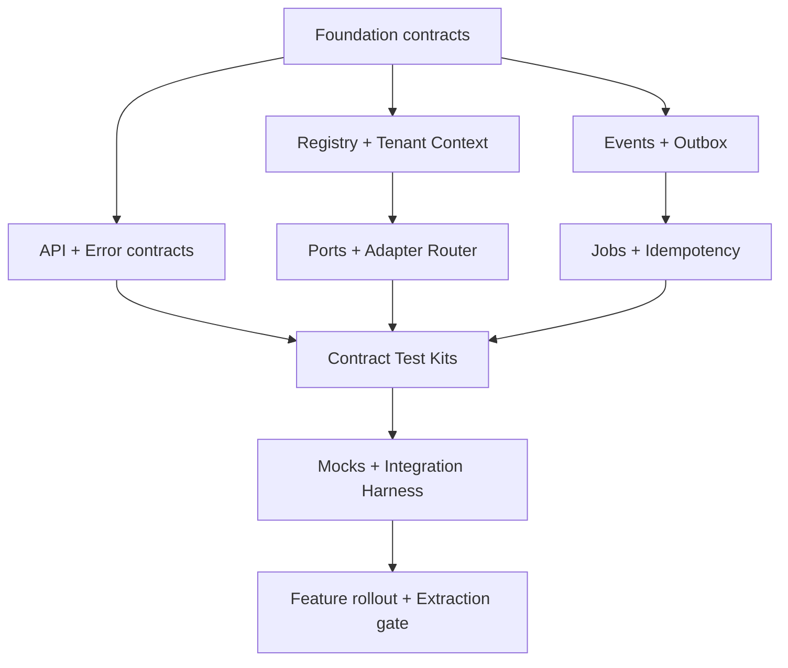

# Workstream: API Contracts, Events, Background Jobs และ Modular Plug-and-Play

**สถานะ:** Execution Baseline v1.0  
**วันที่:** 30 สิงหาคม 2026  
**ขอบเขต:** Platform Kernel และ Integration Contracts สำหรับ Phase 1  
**เป้าหมาย:** ให้หลาย Agent พัฒนา Module แยกกันได้โดยไม่ผูก Provider, ไม่เขียนข้อมูลข้ามขอบเขต และรวมงานกลับมาได้ด้วย Contract/Test ชุดเดียวกัน

> เริ่มต้นเป็น Modular Monolith แต่ Contract ทุกจุดต้องพร้อมให้แยก Worker หรือ Service โดยไม่เปลี่ยน Domain Workflow

---

## 1. ผลลัพธ์ที่ Workstream นี้ต้องส่งมอบ

1. Module Registry และ Manifest ที่ validate/activate/deactivate Module ได้
2. Tenant Context เดียวกันสำหรับ HTTP command/query, job และ event
3. API Contract v1 พร้อม error code, pagination, concurrency และ idempotency rule
4. Event Contract v1, schema catalog, transactional outbox และ idempotent consumer
5. Background Job Kernel สำหรับงาน Research, AI, Media, Publish และ Metrics
6. Stable Ports และ Adapter Router ที่เลือก implementation จาก capability/policy ไม่ใช่ชื่อ Provider
7. Shared Contract Test Kit ที่ Adapter ทุกตัวต้องผ่าน
8. Feature Policy, safe rollout และ kill switch ระดับ Platform/Workspace/Business/Capability
9. Integration Mock/Fake สำหรับให้ทุกทีมพัฒนาโดยไม่ต้องรอ Provider จริง
10. Observability, usage/cost, audit และ extraction readiness สำหรับ Scale ในอนาคต

### ไม่รวมใน Workstream นี้

- Business logic ของ Research, Content, Asset, Calendar หรือ Publisher
- UI สำหรับผู้ใช้ทั่วไป ยกเว้น Admin diagnostic contract
- การเปิดให้ลูกค้าอัปโหลด code/plugin มารันเอง
- การแยกเป็น Microservice ตั้งแต่ Phase 1

---

## 2. กฎร่วมที่ทุก Agent ต้องใช้

### 2.1 Repository และ Ownership Boundary

ใช้โครงสร้างเชิงแนวคิดต่อไปนี้ แม้ชื่อจริงจะปรับตาม Framework:

```text
src/
  kernel/
    contracts/       # schema/envelope/error/result
    tenant-context/
    modules/
    events/
    jobs/
    idempotency/
    feature-policy/
    observability/
  modules/<module-key>/
    domain/
    application/
    ports/
    adapters/
    contracts/
    migrations/
    tests/
  test-kits/
    adapter-contracts/
    event-contracts/
    job-contracts/
  mocks/
  contract-catalog/
```

- Agent หนึ่งเป็นเจ้าของ folder/task output ของตน ห้ามแก้ไฟล์กลางพร้อมกัน
- ไฟล์กลาง เช่น root exports, dependency wiring และ migration index ให้ Integration Agent รวมใน Wave สุดท้าย
- Domain ห้าม import SDK/HTTP/Storage client ของ Provider
- Cross-module write ต้องผ่าน Command/Application Service หรือ Event
- ทุก public schema ต้องมี version และ fixture อย่างน้อย success/validation error/failure
- Payload ห้ามมี secret, binary, long-lived signed URL หรือ raw Provider response

### 2.2 Definition of Ready ต่อ Task

- Dependency ทุก ID อยู่สถานะ Done หรือมี mock contract ที่ตกลงแล้ว
- ระบุ owner module, input, output และ error cases
- ระบุ tenant scope และ permission scope
- ระบุ synchronous หรือ asynchronous ชัดเจน
- ถ้าเกิดต้นทุน ต้องระบุ cost dimensions และ payer

### 2.3 Definition of Done ต่อ Task

- Implementation + schema + tests + fixtures + concise docs พร้อม
- Type check, lint, unit และ contract tests ผ่าน
- Tenant isolation และ authorization test ผ่านเมื่อแตะข้อมูลลูกค้า
- Error เป็น stable code และมี Thai user-message mapping key
- Trace/correlation, audit และ cost hook พร้อมตามประเภทงาน
- Retry/replay ไม่ก่อ side effect ซ้ำ
- มี backward-compatibility test เมื่อเป็น public/event/job contract
- ไม่มี Provider SDK หลุดออกนอก Adapter

---

## 3. Contract หลักที่ต้อง Freeze ก่อนกระจายงาน

### 3.1 Tenant Context v1

ทุก command, query, job และ event ที่แตะข้อมูลลูกค้าต้องมี:

| Field | Required | Rule |
|---|---:|---|
| `workspace_id` | Yes | Tenant root; ตรวจ membership/entitlement ทุกครั้ง |
| `business_profile_id` | Conditional | บังคับสำหรับข้อมูลเฉพาะธุรกิจ |
| `page_context_profile_id` | Conditional | บังคับเมื่อจำกัด Facebook Page/Instagram account |
| `actor` | Yes | `user_id` หรือ typed `system_actor`; ห้ามเป็น string อิสระ |
| `request_id` | Yes | ต่อหนึ่ง inbound request/trigger |
| `correlation_id` | Yes | ติดตาม workflow ข้าม Module |
| `causation_id` | Conditional | ID ของ command/event/job ต้นเหตุ |
| `locale` | Yes | Phase 1 default `th-TH` |
| `timezone` | Yes | Workspace default; Phase 1 default `Asia/Bangkok` |

Context ที่รับจาก Client เชื่อถือไม่ได้ ต้อง resolve และ authorize ฝั่ง Server ก่อนสร้าง Trusted Context

### 3.2 Event Envelope v1

| Field | Rule |
|---|---|
| `event_id` | UUID/ULID ไม่ซ้ำ |
| `event_type` | `<domain>.<entity>.<action>` เช่น `content.generation.completed` |
| `event_version` | Integer major version |
| `occurred_at` | UTC `timestamptz` |
| `producer` | module key + implementation version |
| `tenant_context` | Trusted Tenant Context |
| `subject` | aggregate type/id/version |
| `correlation_id` / `causation_id` | ใช้ trace workflow |
| `idempotency_key` | Domain key เมื่อมี external side effect |
| `payload` | Small, versioned, no secret/binary |
| `metadata` | trace/schema refs; ห้ามใส่ business field แทน payload |

### 3.3 Job Envelope v1

เพิ่มจาก Event Envelope:

- `job_id`, `job_type`, `job_version`
- `priority`, `available_at`, `attempt`, `max_attempts`
- `timeout_seconds`, `lease_owner`, `lease_expires_at`
- `dedupe_key`, `cancel_requested_at`
- `input_ref` และ `result_ref` สำหรับ payload ขนาดใหญ่
- `progress_percent`, `progress_stage`, `last_error_code`

### 3.4 Stable Error Contract v1

```text
code                Stable machine code
message_key         Thai UI localization key
category            validation|auth|permission|conflict|rate_limit|provider|temporary|internal
retryable           boolean
retry_after_seconds optional
field_errors        optional structured list
correlation_id      support reference
details             safe/redacted only
```

ห้ามส่ง Provider error, stack trace, token, model ID หรือคำศัพท์เทคนิคให้ผู้ใช้ทั่วไปโดยตรง

---

## 4. Dependency Graph และ Parallelization Plan



### Wave ที่แนะนำ

| Wave | ทำพร้อมกันได้ | Merge gate |
|---|---|---|
| W0 | CM-001 ถึง CM-006 | Architecture owner approve Contract v1 |
| W1 | MR, TC, API, EV ชุดแรก | Schema/fixtures compile และไม่มี field conflict |
| W2 | JB, ID, FP, OB และ Port packages | Kernel unit/integration tests ผ่าน |
| W3 | Adapter test kits + mocks แยกตามประเภท | ทุก Fake Adapter ผ่าน shared suite |
| W4 | Integration scenarios, rollout, extraction readiness | Full workflow replay/failure tests ผ่าน |

ข้อสำคัญ: “กระจายพร้อมกัน” ควรเริ่มหลัง W0 Freeze เท่านั้น หากทุก Agent นิยาม envelope/error/tenant context เอง จะรวมงานยากและเกิด contract drift

---

## 5. Execution Backlog แบบ Task-Level

### A. Contract Foundation และ Catalog

| ID | Pri | งาน | Dependencies | Inputs | Outputs | Acceptance Tests |
|---|---:|---|---|---|---|---|
| CM-001 | P0 | ล็อก naming/versioning policy ของ Module, API, Event, Job และ capability | — | Architecture rules | `contract-versioning-v1`, naming validator spec | ตรวจตัวอย่าง valid/invalid; breaking change ถูกจัดเป็น major |
| CM-002 | P0 | สร้าง schema technology decision: runtime validator + generated types + OpenAPI/JSON Schema | CM-001 | Stack decision | ADR + generator workflow | Schema เดียว generate runtime/type/docs ได้; CI ตรวจ drift |
| CM-003 | P0 | สร้าง Contract Catalog layout และ ownership metadata | CM-001 | Module list | Catalog index, owner, status, deprecation fields | ค้น contract ตาม module/capability/version ได้ |
| CM-004 | P0 | นิยาม stable Result/Error v1 และ Thai message key policy | CM-001 | UX terminology | error schema, code registry, fixtures | ไม่มี raw provider error; retryability/field error serialize ได้ |
| CM-005 | P0 | นิยาม Money/Usage/Time/ID primitives | CM-002 | Cost model, UTC policy | shared schemas | money ไม่ใช้ float; time เป็น UTC; bytes/token เป็น integer |
| CM-006 | P0 | CI contract governance: lint, compatibility, fixture validation, ownership check | CM-002, CM-003 | Catalog | CI jobs + failure report format | PR ที่ลบ required fieldหรือเปลี่ยน type โดยไม่ bump major ต้อง fail |

### B. Module Manifest และ Registry

| ID | Pri | งาน | Dependencies | Inputs | Outputs | Acceptance Tests |
|---|---:|---|---|---|---|---|
| MR-001 | P0 | สร้าง Module Manifest schema v1 | CM-002, CM-005 | Required manifest fields | machine-readable schema + examples | Reject duplicate key, invalid semver, missing permission/cost/data policy |
| MR-002 | P0 | สร้าง in-process Module Registry | MR-001 | manifests | register/list/resolve API | Duplicate capability resolution deterministic; invalid moduleไม่ activate |
| MR-003 | P0 | Dependency/compatibility resolver | MR-002 | dependency ranges | activation plan + diagnostics | Circular/missing/incompatible dependency ถูก block พร้อม stable error |
| MR-004 | P0 | Activation readiness pipeline | MR-003, FP-001 | secret handles, entitlement, health, permission | readiness result per capability/scope | deny-by-default; missing secret/scope/entitlement ไม่ activate |
| MR-005 | P0 | Lifecycle hooks และ graceful shutdown | MR-002 | module instances | initialize/readiness/drain/shutdown contract | Module drain ไม่รับงานใหม่และงาน active จบ/คืน lease อย่างปลอดภัย |
| MR-006 | P1 | Admin diagnostic query contract | MR-004, OB-003 | health/flag/version data | redacted diagnostic view model | Support เห็น version/health/last error โดยไม่เห็น secret/customer content |

### C. Tenant Context และ Authorization Boundary

| ID | Pri | งาน | Dependencies | Inputs | Outputs | Acceptance Tests |
|---|---:|---|---|---|---|---|
| TC-001 | P0 | Trusted Tenant Context schema v1 | CM-002, CM-005 | Workspace/Business/Page hierarchy | schema + fixtures | Conditional fields validate; locale/timezone normalize ได้ |
| TC-002 | P0 | HTTP context resolver | TC-001 | auth session, route/body refs | trusted context middleware/service | Client สลับ workspace_id เองแล้วเข้าข้อมูลอื่นไม่ได้ |
| TC-003 | P0 | Job/Event context propagation | TC-001, EV-001, JB-001 | trusted context | propagation helpers | context ครบหลัง serialize/deserialize/retry/replay |
| TC-004 | P0 | Scope relation validator | TC-002 | workspace/business/page IDs | authorization port | Business/Page ที่ไม่อยู่ Workspace ถูก deny แม้ user อยู่คนละ workspace |
| TC-005 | P0 | System actor policy | TC-001 | scheduler/worker/webhook use cases | typed actors + permission matrix | Worker ทำได้เฉพาะ capability/scope ที่มอบหมาย; no superuser default |
| TC-006 | P0 | Tenant isolation contract test kit | TC-002, TC-003, TC-004 | role matrix | reusable tests | Cross-workspace/business/page read/write/job/event ถูก block ครบ matrix |

### D. Synchronous API Contracts

| ID | Pri | งาน | Dependencies | Inputs | Outputs | Acceptance Tests |
|---|---:|---|---|---|---|---|
| API-001 | P0 | API envelope v1 สำหรับ command/query | CM-004, TC-001 | Result/Error, tenant context | request/response schema | success/error/correlation serialize ได้และไม่ leak internal detail |
| API-002 | P0 | Command idempotency header/key policy | API-001, ID-001 | create/update/connect operations | middleware contract | request key เดิม+payloadเดิมคืนผลเดิม; payloadต่างกันได้ conflict |
| API-003 | P0 | Keyset pagination/filter/sort contract | API-001 | mobile list use cases | cursor schema | Stable ordering; no duplicate/missing ระหว่าง page; cursor opaque/tamper-safe |
| API-004 | P0 | Optimistic concurrency/version conflict contract | API-001 | Content/Knowledge/Calendar edits | version/precondition policy | stale update ไม่ overwrite; error ระบุให้ refresh/compare ได้ |
| API-005 | P0 | Async command receipt contract | API-001, JB-001 | generate/research/media/publish requests | `accepted` response + job/status/deep-link refs | API ตอบเร็ว; user ออกจากหน้าได้; poll/resume ด้วย permission check |
| API-006 | P0 | OpenAPI generation + redacted examples | API-001–005, CM-006 | schemas | versioned OpenAPI artifact | CI diff; examples validate; secret/raw provider fields absent |

### E. Event Contracts และ Transactional Outbox

| ID | Pri | งาน | Dependencies | Inputs | Outputs | Acceptance Tests |
|---|---:|---|---|---|---|---|
| EV-001 | P0 | Event Envelope v1 | CM-002, CM-005, TC-001 | event requirements | schema + fixtures | Required tenant/trace/producer/subject fields validate |
| EV-002 | P0 | Event naming/catalog และ owner registry | EV-001, CM-003 | domain event inventory | event catalog | Duplicate ownership/type blocked; unknown version rejected/quarantined |
| EV-003 | P0 | Compatibility/upcaster policy | EV-001, CM-006 | v1/v2 fixtures | upcaster interface + CI tests | Consumer อ่าน current และ previous supported versionระหว่าง rolling deploy |
| EV-004 | P0 | Outbox database schema/migration | EV-001, TC-001 | DB conventions | outbox table + indexes + retention | Domain state+outbox commit/rollback พร้อมกัน; tenant/correlation indexed |
| EV-005 | P0 | Outbox writer API | EV-004 | domain transaction | append event function/service | ห้ามเขียน event นอก transaction สำหรับ state-changing command |
| EV-006 | P0 | Outbox dispatcher with lease/backoff | EV-004, ID-002 | queue/broker adapter port | dispatcher | Parallel dispatcher ไม่ส่ง record เดียวกันพร้อมกัน; crash แล้ว recover ได้ |
| EV-007 | P0 | Delivery status, poison record และ replay contract | EV-006, OB-002 | failure policy | status/DLQ/replay operations | Replay จำกัด scope, audit ทุกครั้ง, redaction และ max attempts ทำงาน |
| EV-008 | P1 | Inbox/processed-event retention cleanup | ID-002, EV-007 | retention matrix | cleanup job | ไม่ลบ dedupe record ก่อน replay window; batch cleanup ไม่ lock ยาว |

### F. Background Job Kernel

| ID | Pri | งาน | Dependencies | Inputs | Outputs | Acceptance Tests |
|---|---:|---|---|---|---|---|
| JB-001 | P0 | Job Envelope และ lifecycle state machine v1 | CM-004, TC-001 | async requirements | schema + transition rules | invalid transition block; terminal state immutableยกเว้น controlled replay |
| JB-002 | P0 | Job type registry + version handler | JB-001, MR-002 | job handlers | typed registry | Unknown job/version quarantine; handler resolution deterministic |
| JB-003 | P0 | Enqueue service + dedupe | JB-001, ID-001 | async command | durable job + receipt | concurrent enqueue key เดียวสร้าง logical job เดียว |
| JB-004 | P0 | Worker claim/lease/heartbeat | JB-002 | queue rows | worker runtime primitive | ใช้ skip-locked/lease; crashed worker ถูก reclaim; double execution side effect ไม่เกิด |
| JB-005 | P0 | Retry taxonomy/backoff/jitter | JB-004, CM-004 | error categories | retry policy engine | validation/authไม่ retry; temporary/rate-limit retryตาม policy/Retry-After |
| JB-006 | P0 | Timeout/cancellation/cooperative abort | JB-004 | long-running adapters | cancellation contract | cancel ก่อน start ไม่ run; cancel ระหว่าง run จบ safe point; external result late ถูก reconcile |
| JB-007 | P0 | Progress/stage/status snapshot | JB-001, OB-001 | user notification UX | job progress query/event | progress monotonic; stage เป็น Thai message key; no provider jargon |
| JB-008 | P0 | Result/error reference และ payload size guard | JB-001 | storage/data policies | result_ref contract | payloadใหญ่/PIIไม่ลง queue; reference auth/retention ถูกต้อง |
| JB-009 | P0 | Dead-letter triage/replay | JB-005, JB-008 | support workflow | DLQ operations/runbook | replay ต้อง permission+reason+audit; dedupe ป้องกัน external side effect ซ้ำ |
| JB-010 | P0 | Job retention/archival/cleanup | JB-009 | retention matrix | cleanup worker | ประวัติที่ UI/audit ต้องใช้ไม่หาย; batch cleanup bounded |
| JB-011 | P0 | Canonical job profiles | JB-001–010 | Research/AI/Media/Publish/Metrics needs | per-type timeout/retry/concurrency defaults | Profile มี owner, max cost, max attempts, cancellation/replay ruleครบ |
| JB-012 | P0 | Job kernel stress/failure test | JB-003–011 | load targets | test report | duplicate enqueue, worker crash, lease expiry, provider timeout, deploy drain ผ่าน |

### G. Idempotency และ External Side Effects

| ID | Pri | งาน | Dependencies | Inputs | Outputs | Acceptance Tests |
|---|---:|---|---|---|---|---|
| ID-001 | P0 | Idempotency key/record schema | CM-005, TC-001 | command/job use cases | idempotency store contract | key scope includes workspace+operation; payload hash mismatch conflict |
| ID-002 | P0 | Idempotent event consumer wrapper | ID-001, EV-001 | consumer key/event id | inbox/processed record wrapper | redelivery N ครั้ง commit side effectครั้งเดียว; failed transaction retryได้ |
| ID-003 | P0 | External operation ledger | ID-001 | Meta publish/storage/notification | operation attempt/result records | provider timeout-after-success reconcile ได้; provider object ID pinned |
| ID-004 | P0 | Publish exactly-once-effect strategy | ID-003, JB-005 | Meta adapter semantics | publish dedupe/reconciliation contract | retry หลัง ambiguous timeout ไม่สร้างโพสต์ซ้ำ |
| ID-005 | P0 | Notification dedupe strategy | ID-002 | job/event notification | dedupe key policy | completed/retried event ไม่แจ้งผู้ใช้ซ้ำเกิน policy |
| ID-006 | P0 | Replay safety test suite | ID-002–005 | event/job fixtures | reusable failure tests | replay outbox/inbox/job/publish/notification ไม่ทำ side effect ซ้ำ |

### H. Stable Ports, Adapter Router และ Normalization

| ID | Pri | งาน | Dependencies | Inputs | Outputs | Acceptance Tests |
|---|---:|---|---|---|---|---|
| PT-001 | P0 | Base Adapter contract: health, capability, limits, usage, error normalization | MR-001, CM-004 | adapter rules | shared interface/schema | ทุก adapter report readiness/cost/errorแบบ normalized |
| PT-002 | P0 | AI Provider Port v1 | PT-001 | generate/analyze/embed/moderate needs | port + normalized DTO | no raw provider/model response escapes; abort/timeout/usage supported |
| PT-003 | P0 | Research Source Port v1 | PT-001 | query/evidence/source policy | port + evidence DTO | freshness/source/cost present; suggestionรับ normalized evidenceเท่านั้น |
| PT-004 | P0 | Storage Port v1 | PT-001 | upload/signed-read/copy/delete/usage | opaque location DTO + port | Domainไม่ประกอบ URL; checksum/finalize/idempotent delete supported |
| PT-005 | P0 | Media Processor Port v1 | PT-001 | metadata/thumbnail/transcode | port + result DTO | deterministic variants; unsupported media normalized; progress supported |
| PT-006 | P0 | Meta Connector/Publisher Port v1 | PT-001 | FB/IG auth/channel/publish/status | capability-driven port | FB/IG capability queried; partial success represented; no platform if/switch in Domain |
| PT-007 | P0 | Notification Port v1 | PT-001 | in-app first; email/LINE future | channel-neutral command/result | dedupe/deep-link/locale supported; delivery failure does not roll back domain result |
| PT-008 | P1 | Payment Port placeholder contract | PT-001 | future billing | minimal reserved contract | ไม่ผูก Phase 1 flow; versioned placeholderไม่บังคับ implementation |
| PT-009 | P0 | Capability/Policy Router | PT-001–007, FP-001 | health/cost/BYOK/data policy/eval | selection decision + reason | Domainส่ง capability ไม่ส่ง provider name; unhealthy/over-budget adapter excluded |
| PT-010 | P0 | Secret handle/config registry boundary | MR-004, PT-001 | managed/BYOK credentials | scoped credential resolver | manifestเห็น referenceเท่านั้น; logs/events/jobsไม่พบ secret; revokeได้ทันที |

### I. Shared Contract Test Kits

| ID | Pri | งาน | Dependencies | Inputs | Outputs | Acceptance Tests |
|---|---:|---|---|---|---|---|
| CT-001 | P0 | Base Adapter contract kit | PT-001, CM-006 | base adapter fixtures | reusable test runner | health, timeout, abort, normalized error, usage, redaction casesผ่าน |
| CT-002 | P0 | AI Adapter kit | PT-002, CT-001 | golden fixtures | suite + conformance report | structured output, invalid key, rate limit, timeout, usage mismatch tested |
| CT-003 | P0 | Research Adapter kit | PT-003, CT-001 | evidence fixtures | suite | allow/deny source, freshness, citation metadata, rate/cost tested |
| CT-004 | P0 | Storage Adapter kit | PT-004, CT-001 | sample objects | suite | multipart/finalize/checksum/signed read/delete replay/usage tested |
| CT-005 | P0 | Media Adapter kit | PT-005, CT-001 | image/video fixtures | suite | corrupt/oversize/unsupported/retry/deterministic output tested |
| CT-006 | P0 | Publisher Adapter kit | PT-006, CT-001, ID-004 | FB/IG scenario fixtures | suite | capability validation, partial success, ambiguous timeout, duplicate retry tested |
| CT-007 | P0 | Notification Adapter kit | PT-007, CT-001, ID-005 | notification fixtures | suite | locale, deep-link, dedupe, transient/permanent failure tested |
| CT-008 | P0 | Event/Job compatibility kit | EV-003, JB-002, ID-006 | old/current fixtures | suite | current consumerอ่าน supported previous version/replayได้ |
| CT-009 | P0 | Conformance badge/gate in CI | CT-001–008 | reports | merge/deploy gate | Adapter ที่ไม่ผ่านหรือไม่มี manifest/fixtures deploy productionไม่ได้ |

### J. Feature Policy, Flags และ Safe Rollout

| ID | Pri | งาน | Dependencies | Inputs | Outputs | Acceptance Tests |
|---|---:|---|---|---|---|---|
| FP-001 | P0 | Feature Policy model v1 | TC-001, MR-001 | plans/entitlements/admin needs | typed policy decision contract | default deny; precedence deterministic; decision includes reason/source |
| FP-002 | P0 | Scope hierarchy: platform→plan→workspace→business→capability | FP-001 | scope model | evaluator | business overrideไม่ข้าม platform kill switch; historical readยังได้เมื่อปิด write |
| FP-003 | P0 | Gradual rollout/bucket policy | FP-002 | pilot workspace list/percentage | stable allocation | Workspaceอยู่ bucketเดิม; explicit allow/deny ชนะ percentage |
| FP-004 | P0 | Kill switch + circuit state | FP-002, OB-002 | module/provider health | runtime disable policy | ปิดรับงานใหม่ทันที; active jobs drain/cancelตาม policy; read historyได้ |
| FP-005 | P0 | Flag audit/expiry/owner | FP-001 | admin changes | audit schema + stale-flag report | ทุก change มี actor/reason/time; temporary flagมี expiry/owner |
| FP-006 | P1 | Admin policy query/mutation contract | FP-005, MR-006 | non-tech admin UX | safe APIs/view model | ไม่แสดง code/secret; confirm high-impact switch; rollback actionชัด |

### K. Integration Mocks และ Developer Harness

| ID | Pri | งาน | Dependencies | Inputs | Outputs | Acceptance Tests |
|---|---:|---|---|---|---|---|
| MK-001 | P0 | Fake clock, ID, tenant, cost และ deterministic scheduler | CM-005, TC-001 | shared primitives | test utilities | tests reproducible; timezone/expiry/retry advance without real wait |
| MK-002 | P0 | Fake AI Adapter | PT-002, CT-002 | canned Thai responses/errors | deterministic adapter | ผ่าน AI contract kit; simulate delay/rate/invalid key/malformed output |
| MK-003 | P0 | Fake Research Adapter | PT-003, CT-003 | evidence fixtures | deterministic adapter | ผ่าน Research kit; stale/blocked/conflicting evidence scenarios |
| MK-004 | P0 | In-memory/local Storage + Media Adapters | PT-004, PT-005, CT-004, CT-005 | media fixtures | fake adapters | multipart/corrupt/processing delay/failure modes reproducible |
| MK-005 | P0 | Fake Meta Publisher | PT-006, CT-006 | FB/IG capability matrix | adapter/simulator | success/partial/rate/expired token/timeout-after-success scenarios |
| MK-006 | P0 | Fake Notification Adapter | PT-007, CT-007 | delivery fixtures | captured outbox | dedupe/failure/deep-link/locale assertions possible |
| MK-007 | P0 | Scenario DSL/fixture builder | MK-001–006 | E2E use cases | scenario harness | หนึ่ง fixtureรัน success/retry/cancel/partial/replayได้โดยไม่ใช้ network |
| MK-008 | P0 | Local integration profile | MK-007, MR-002, FP-001 | all fake manifests | one-command dev/test environment | Agentแต่ละ Module run testsโดยไม่ต้องมีเงินจริง/API key |

### L. Observability, Audit, Usage และ Operations

| ID | Pri | งาน | Dependencies | Inputs | Outputs | Acceptance Tests |
|---|---:|---|---|---|---|---|
| OB-001 | P0 | Correlation/trace propagation | API-001, EV-001, JB-001 | request→job→event flow | instrumentation contract | traceเดียวตาม workflowข้าม retry/worker/adapterได้ |
| OB-002 | P0 | Stable operational error taxonomy + alert route | CM-004, JB-005 | module owners/runbooks | metrics/alert mapping | retry storm/DLQ/provider failure alertถูก owner; PII redacted |
| OB-003 | P0 | Module health/readiness/SLI contract | MR-004, PT-001 | module/provider status | health aggregation | livenessไม่ผูก external provider; readinessสะท้อน capabilityจริง |
| OB-004 | P0 | Usage/cost event v1 | CM-005, EV-001 | token/search/bytes/egress/processing/publish | cost schema + producer hook | workspace/business/job/provider attributionครบ; money precisionถูก |
| OB-005 | P0 | Audit event v1 | TC-001, EV-001 | security/admin/external actions | audit schema | actor/scope/action/before-after ref/reason; secret/content redaction |
| OB-006 | P0 | Metrics cardinality/redaction policy | OB-001, OB-004 | observability backend | tagging rules | ไม่มี user content/token/page nameใน metric label; cardinality bounded |
| OB-007 | P0 | Standard module runbook template | OB-002, OB-003 | operational scenarios | template | owner/SLO/alerts/kill/replay/rollback/escalationครบ |
| OB-008 | P1 | Cost reconciliation test/report | OB-004, CT-001 | provider statements/usage fixtures | reconciliation job/report | detected missing/duplicate usage; variance threshold alert |

### M. Extraction Readiness และ Scale Gate

| ID | Pri | งาน | Dependencies | Inputs | Outputs | Acceptance Tests |
|---|---:|---|---|---|---|---|
| EX-001 | P0 | Module boundary dependency check | MR-001, PT-001 | import graph/table ownership | architecture lint | Domain import adapter SDK/direct cross-module DB accessทำ CI fail |
| EX-002 | P0 | Data ownership registry + migration namespace rule | MR-001 | DB objects | owner catalog/lint | ทุก table/view/function/queueมี owner; migration order deterministic |
| EX-003 | P0 | Cross-module read/write policy enforcement | EX-002 | commands/query services/views | architecture tests | direct writeถูก block; allowed read contract versioned |
| EX-004 | P1 | Service extraction readiness checklist | EV-001–008, PT-001, OB-001 | module metrics/contracts | scorecard | moduleมี ports/events/ownership/runbookก่อนถูกเสนอแยก |
| EX-005 | P1 | Quantitative extraction triggers | OB-003, OB-004 | latency/load/failure/deploy data | threshold policy | decisionมี metric evidence; “เผื่ออนาคต” อย่างเดียวไม่ผ่าน |
| EX-006 | P1 | Dual-run/traffic shadow contract | FP-003, ID-001, OB-001 | replacement adapter/service | comparison harness | shadowไม่มี external side effect; output/cost/latency compareและ rollbackได้ |
| EX-007 | P1 | Strangler migration rehearsal | EX-004, EX-006, MK-007 | one fake module | rehearsal report | routeบาง scopeไป implementationใหม่, rollbackโดยไม่เสีย job/event/data |

---

## 6. Integration Epics ที่ใช้พิสูจน์ว่า Kernel ใช้งานจริง

### INT-001 — Research → Suggestion

**Dependencies:** TC, EV, JB, ID, PT-003, MK-003, OB  
**Input:** Workspace/Business context + research recipe reference  
**Output:** Research job receipt, normalized evidence, completed/failed notification event  
**Acceptance:**

- API ตอบ accepted โดยไม่รอ Provider
- Retry ไม่สร้าง evidence ซ้ำ
- Cancel ได้ก่อนสร้าง suggestion
- Stale/blocked source ถูก normalize เป็น business error
- Cost attributed ถึง workspace/business/job

### INT-002 — Generate → Quality Review

**Dependencies:** PT-002, MK-002 และ Kernel ทั้งหมด  
**Input:** immutable brief/knowledge version refs  
**Output:** content version ref + quality result ref  
**Acceptance:**

- Provider เปลี่ยนผ่าน policy/router โดย Domain flow ไม่แก้
- malformed structured output retry/repair ตาม policy
- BYOK secret ไม่ปรากฏใน job/event/log
- Request เดิมไม่สร้าง content version ซ้ำ

### INT-003 — Upload → Media Processing

**Dependencies:** PT-004/005, MK-004 และ Kernel ทั้งหมด  
**Input:** upload intent + asset/business scope  
**Output:** verified object/version, derivatives, processing notification  
**Acceptance:**

- finalize/checksum idempotent
- corrupt/unsupported/oversize เป็น stable Thai error
- worker crash แล้ว resume โดยไม่สร้าง derivative ซ้ำ
- Storage/Media adapter สลับได้หลัง Ports เดิม

### INT-004 — Schedule → Facebook + Instagram Publish

**Dependencies:** PT-006, MK-005, ID-004 และ Kernel ทั้งหมด  
**Input:** immutable content/media versions + channel targets + schedule  
**Output:** per-channel publish operation/result + notification  
**Acceptance:**

- Facebook สำเร็จ/Instagram ล้มเหลวถูกเก็บเป็น partial result
- ambiguous timeout ไม่โพสต์ซ้ำ
- token revoked หยุด retryแบบถาวรและแจ้ง reconnect
- kill switch ปิดเฉพาะ IG หรือ provider capability ได้

### INT-005 — Feature Rollout และ Adapter Swap

**Dependencies:** FP, EX, MK  
**Input:** Pilot workspace list + old/new fake adapter  
**Output:** routing/audit/comparison report  
**Acceptance:**

- Pilot เท่านั้นที่ใช้ adapter ใหม่
- rollback ไม่ทำให้ historical result เปิดไม่ได้
- active job ใช้ implementation version ที่ pin ไว้หรือ migrateตาม explicit policy
- usage/cost/health แยก old/new implementation ได้

---

## 7. Agent Assignment Packages ที่ไม่ชนกัน

หลัง Freeze W0 สามารถแจก Package ต่อไปนี้ให้ Agent แยกกัน โดยแต่ละ Agentส่ง PR/artifactของ folderตัวเอง ไม่แก้ composition root:

| Package | Task IDs | ขอบเขตไฟล์หลัก | ต้องรอ |
|---|---|---|---|
| PKG-01 Contract Governance | CM-001–006 | `kernel/contracts`, `contract-catalog`, CI | — |
| PKG-02 Module Registry | MR-001–006 | `kernel/modules` | CM Freeze |
| PKG-03 Tenant Context | TC-001–006 | `kernel/tenant-context` | CM Freeze |
| PKG-04 API Contracts | API-001–006 | `kernel/contracts/api` | CM, TC schemas |
| PKG-05 Events/Outbox | EV-001–008 | `kernel/events`, DB migration namespace | CM, TC schemas |
| PKG-06 Job Runtime | JB-001–012 | `kernel/jobs` | CM, TC, EV schemas |
| PKG-07 Idempotency | ID-001–006 | `kernel/idempotency` | CM, EV/JB schemas |
| PKG-08 Ports/Router | PT-001–010 | `modules/*/ports`, `kernel/modules/router` | CM, MR |
| PKG-09 Contract Test Kits | CT-001–009 | `test-kits` | Port schemas |
| PKG-10 Feature Policy | FP-001–006 | `kernel/feature-policy` | TC, MR schemas |
| PKG-11 Integration Mocks | MK-001–008 | `mocks` | Ports + kits |
| PKG-12 Observability/Cost | OB-001–008 | `kernel/observability` | API/EV/JB schemas |
| PKG-13 Extraction Guard | EX-001–007 | architecture lint/scorecard | MR, Ports, OB |
| PKG-14 Integration | INT-001–005 | composition root/E2E only | ทุก package upstream |

### Merge Contract สำหรับทุก Agent

แต่ละ Package ต้องส่ง:

1. Implementation หรือ executable specification
2. Public schema/types และ version
3. Valid/invalid/backward fixtures
4. Unit/contract/failure tests
5. `README` สั้น: purpose, API, ownership, dependency, failure behavior
6. Migration + rollback note หากแตะ DB
7. Manifest/capability/cost/data-classification updates
8. ไม่มีการแก้ไฟล์ composition root; แจ้ง integration instructions แทน

---

## 8. Release Gates

### Gate G1 — Contract Freeze

- CM-001–006, TC-001 และ EV/JB envelope draft approved
- Contract catalog และ CI compatibility check ทำงาน
- มี owner ต่อ contract และ breaking-change policy

### Gate G2 — Kernel Ready

- Module registry, tenant isolation, outbox, job lifecycle และ idempotency tests ผ่าน
- Worker crash/retry/replay/cancel test ผ่าน
- Trace, audit, cost และ Thai error mapping ครบ

### Gate G3 — Adapter Ready

- Ports v1 freeze
- Fake adapters ทุกประเภทผ่าน shared contract kits
- Production adapter เปิดไม่ได้หากไม่มี conformance report + pilot flag + kill switch

### Gate G4 — Vertical Slice Ready

- INT-001 ถึง INT-004 ผ่านด้วย Fake Adapters
- อย่างน้อยหนึ่ง Provider จริงต่อ Critical Path ผ่าน contract suite
- Cross-tenant, partial success, ambiguous timeout และ deploy-drain scenarios ผ่าน

### Gate G5 — Extraction Ready ไม่ได้แปลว่าต้องแยก

- Dependency/data ownership lint ผ่าน
- มี metric trigger และ scorecard
- Shadow/rollback rehearsal ผ่าน
- ยังคง deploy Modular Monolith จนมี measured trigger

---

## 9. ความเสี่ยงและสิ่งที่ห้ามตัดออกจาก Scope

| ความเสี่ยง | ผลกระทบ | Control ที่บังคับ |
|---|---|---|
| Agent สร้าง schema ของตัวเอง | รวมงานไม่ได้ | W0 freeze + catalog + CI drift check |
| Retry โพสต์ซ้ำ | กระทบลูกค้าโดยตรง | external operation ledger + reconciliation + replay tests |
| Tenant context เชื่อ client | ข้อมูลรั่วข้ามธุรกิจ | trusted server resolver + relation validator + isolation suite |
| Provider response หลุดเข้า Domain | เปลี่ยน providerยาก | normalized DTO + import lint + adapter contract kit |
| Queue เก็บ secret/ไฟล์ใหญ่ | Security/cost | payload guard + references + secret handle |
| Feature flag ปิดแล้วเปิดประวัติไม่ได้ | UX/data loss | read-old/write-new policy + history tests |
| Event schema เปลี่ยนตอน queue ค้าง | deploy fail/data loss | version overlap + upcaster + old fixture tests |
| Cost ไม่ผูก workspace/job | ขายแพ็กเกจไม่ได้ | usage event v1 + reconciliation |
| ทำ Microservice เร็วเกินไป | ต้นทุน/complexityสูง | measurable extraction gate |

---

## 10. Exit Criteria ของ Workstream

Workstream นี้ถือว่าเสร็จเมื่อ:

- Task P0 ทั้งหมด Done หรือมี explicit waiver ที่ owner/expiry ชัดเจน
- Agent อื่นสามารถสร้าง Adapter ใหม่จาก template และผ่าน Contract Kit โดยไม่แก้ Domain
- งาน background ทุกประเภทใช้ receipt/status/progress/retry/cancel/DLQ primitive เดียวกัน
- Event/job replay ไม่ก่อ side effect ซ้ำใน test scenarios
- Tenant isolation ผ่าน Workspace/Business/Page/Role matrix
- Production capability ทุกตัวมี manifest, owner, secret scope, health, usage/cost, pilot flag และ kill switch
- INT-001 ถึง INT-005 ผ่านทั้ง success และ failure paths
- ระบบยัง deploy แบบ Modular Monolith แต่ Media/Publisher/AI Worker สามารถย้าย process หลัง contract เดิมได้
