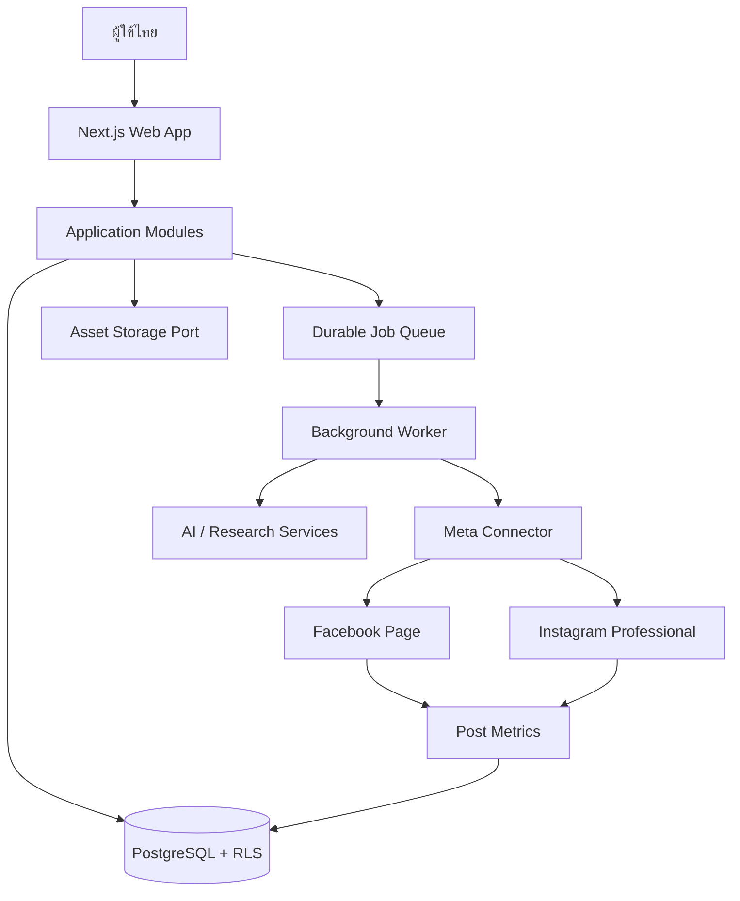
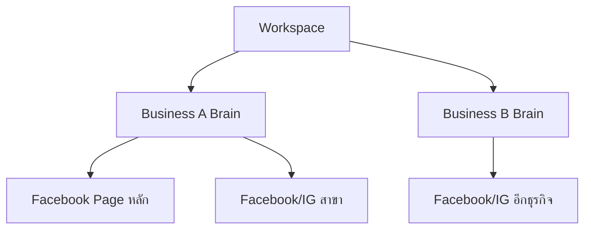
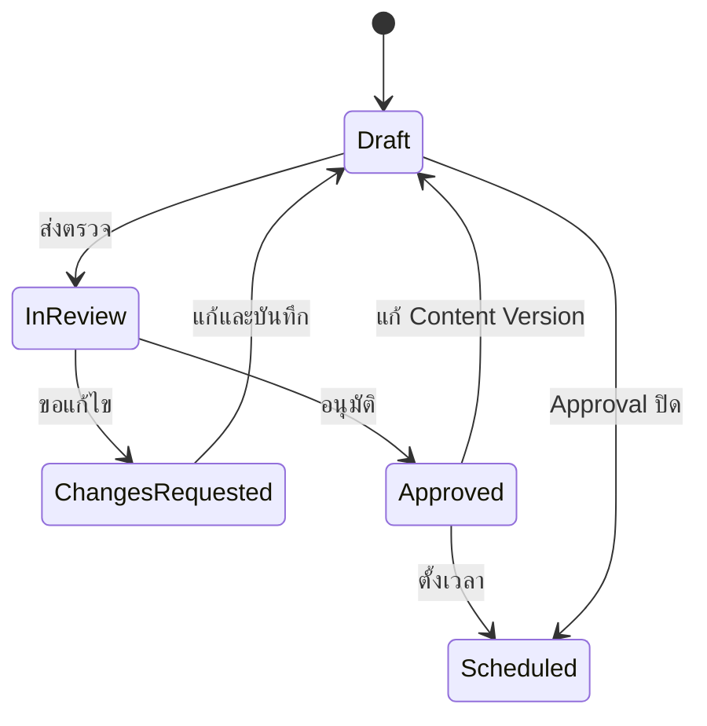
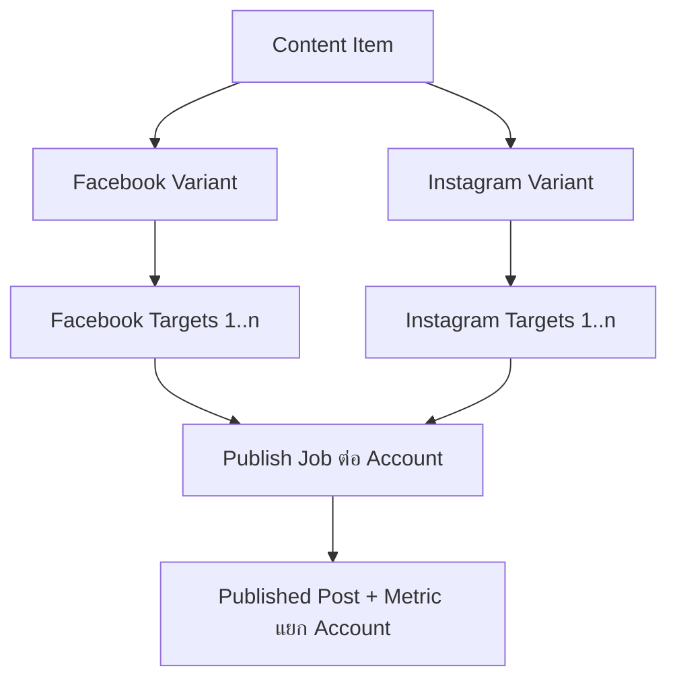
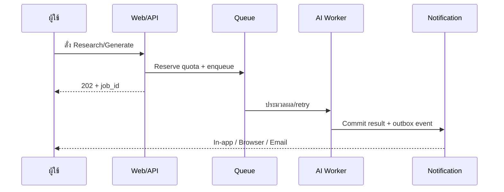
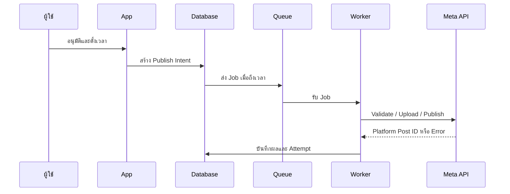
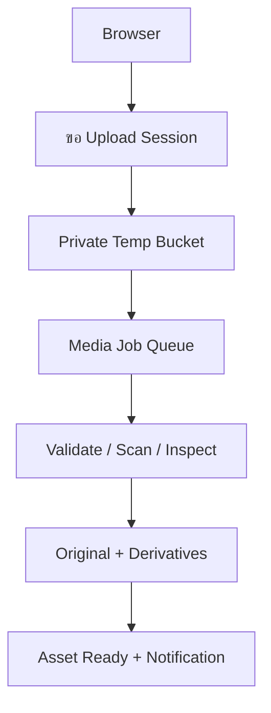
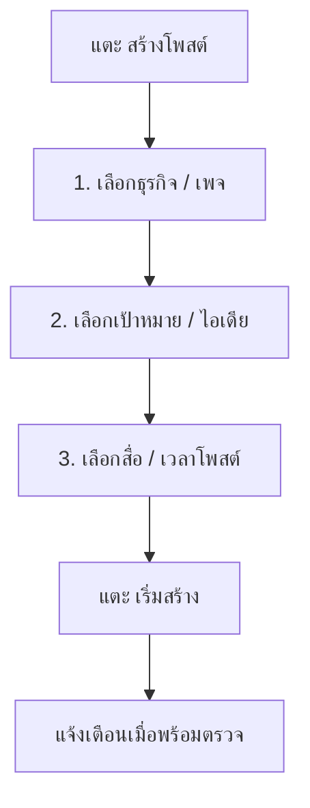

# Technical Architecture Note

## AI Content OS สำหรับ SME ไทย — Phase 1: Facebook + Instagram

**สถานะ:** Proposed Architecture v0.8  
**วันที่:** 30 สิงหาคม 2026  
**กลุ่มผู้ใช้หลัก:** เจ้าของธุรกิจและทีมการตลาด SME ไทย  
**ขอบเขต:** Business Knowledge → Research → Analyze → Generate → Asset Library → Review → Calendar → Publish → Content Metrics

---

## 1. เป้าหมายการออกแบบ

ระบบต้องช่วยให้ SME ไทยสร้างคอนเทนต์ที่มีคุณภาพและเผยแพร่บน Facebook Page กับ Instagram Professional ได้ในที่เดียว โดยมีข้อกำหนดหลักดังนี้

1. ผู้ใช้ใหม่ต้องสร้างและตั้งเวลาโพสต์แรกได้ภายในประมาณ 20–30 นาที
2. คอนเทนต์ต้องสร้างจากข้อมูล Research ที่ตรวจสอบย้อนกลับได้ ไม่ใช่สร้างจาก Prompt เปล่า
3. Facebook และ Instagram ใช้เนื้อหาต้นทางเดียวกัน แต่มี Caption และข้อกำหนดสื่อแยกตามแพลตฟอร์ม
4. การ Publish ต้องทนต่อ API timeout, token หมดอายุ และการประมวลผลสื่อแบบ asynchronous
5. ทุกข้อมูลธุรกิจต้องแยกตาม Workspace อย่างชัดเจน
6. ระบบต้องรองรับผู้ใช้ไทยตั้งแต่ต้น ไม่ใช่แปล UI ภาษาอังกฤษภายหลัง
7. Phase 1 ไม่เก็บ Inbox, Lead, Order หรือ Revenue
8. หนึ่ง Workspace ต้องมีสมาชิกได้หลายคน พร้อม Role และขั้นตอน “ผู้สร้างส่งตรวจ → ผู้อนุมัติอนุมัติ” ที่ Admin เปิด/ปิดได้
9. AI layer ต้องไม่ผูกกับผู้ให้บริการรายเดียว และรองรับ Bring Your Own API Key (BYOK) อย่างปลอดภัย
10. หนึ่ง Workspace ต้องเชื่อม Facebook Page และ Instagram account ได้หลายบัญชี โดย Publish/Metric แยกสถานะต่อบัญชี
11. Research/Analyze/Generate/AI Review ต้องทำแบบ Background ผู้ใช้เปลี่ยนหน้า/ปิดแท็บได้และได้รับ Notification เมื่อเสร็จ
12. Business Knowledge, Research, Evidence และ Suggestion ต้องแยกตามธุรกิจของแต่ละ Page ห้ามนำข้อมูลข้ามธุรกิจมาสร้าง Content
13. ต้องมี Asset Library สำหรับรูปและวิดีโอที่ค้นหา, reuse, version, ตรวจสิทธิ์ใช้งาน และผูกกับ Content/Platform Variant ได้ โดยไฟล์ของคนละ Business ต้องไม่ปะปนกันโดยค่าเริ่มต้น
14. ผู้ใช้หลักเป็น Non-tech User ทุกหน้าหลักต้องใช้ภาษาธุรกิจที่เข้าใจได้ทันที และไม่แสดง code, ID, API response, queue, token หรือศัพท์ infrastructure
15. Core workflow ต้องเป็น Click/Select-first ไม่บังคับให้ผู้ใช้เขียน Prompt; ช่องพิมพ์เป็น optional refinement หลังระบบเสนอค่าเริ่มต้นให้แล้ว
16. ผู้ใช้ต้องทำงานหลักครบผ่านมือถือได้ ตั้งแต่ Research, สร้าง/แก้ Content, เลือก Asset, ส่งตรวจ/อนุมัติ, ตั้งเวลา, ดูสถานะ และรับ Notification

---

## 2. Architectural Decision หลัก

### ADR-001 — เริ่มด้วย Modular Monolith

ใช้ Application เดียวที่แบ่ง Domain Module ชัดเจน แทนการเริ่มด้วย Microservices

เหตุผล:

- คนเดียวพัฒนาและดูแลได้
- Deploy, Debug และ Trace ง่าย
- ใช้ TypeScript และ Domain Type ร่วมกันได้
- ยังสามารถแยก Worker หรือ Meta Publisher เป็น Service ภายหลังได้

### ADR-002 — Meta-first Connector

Phase 1 มี Connector เดียวคือ `MetaConnector` แต่แยก Publisher เป็น:

- `FacebookPagePublisher`
- `InstagramPublisher`

การโพสต์ไปสองแพลตฟอร์มต้องสร้าง Publish Job แยกกัน เพื่อให้ Facebook สำเร็จได้แม้ Instagram ล้มเหลว หรือกลับกัน

### ADR-003 — PostgreSQL เป็น System of Record

ใช้ PostgreSQL เก็บ Business Brain, Research Evidence, Content Version, Calendar, Publish Job และ Metrics ส่วนไฟล์ภาพ/วิดีโอเก็บใน Object Storage

### ADR-004 — งานหนักต้องผ่าน Queue

Research, AI generation, media validation, scheduled publishing และ metrics sync ห้ามทำเป็น request ยาวจากหน้าเว็บโดยตรง ต้องสร้าง Job และประมวลผลแบบ asynchronous พร้อม retry

### ADR-005 — Thai-first, UTC-at-rest

- UI เริ่มต้นเป็น `th-TH`
- Workspace timezone เริ่มต้นเป็น `Asia/Bangkok`
- Database เก็บ timestamp เป็น UTC
- หน้า UI แสดงวันที่ไทยและเลือกแสดง พ.ศ. ได้

### ADR-006 — Multi-user และ Optional Approval เป็น Core Capability

ทุก Workspace รองรับสมาชิกหลายคนตั้งแต่ schema แรก โดยใช้ Role อย่างน้อย `owner`, `admin`, `editor`, `approver`, `viewer` และเก็บ Approval Policy ระดับ Workspace

- Admin เปิด/ปิด `approval_required` ได้จาก Admin UI
- เมื่อเปิด ผู้สร้าง Content ห้ามอนุมัติงานของตัวเองโดยค่าเริ่มต้น
- เมื่อแก้ Content Version หลังอนุมัติ Approval เดิมต้องหมดผลทันที
- การเปลี่ยน Policy ต้องมี Audit Log และห้ามทำให้รายการค้างถูกอนุมัติอัตโนมัติ

### ADR-007 — Provider-neutral AI และ Curated Model Registry

Business logic เรียก `AIOrchestrator` ผ่าน capability contract ไม่เรียก SDK ของผู้ให้บริการโดยตรง ผู้ใช้เลือก `Auto (แนะนำ)` หรือเลือก Provider/Model จากรายการที่ Admin อนุญาต

- รองรับ OpenAI API, Anthropic, Google Gemini และ xAI เป็นลำดับแรก
- คำว่า “ChatGPT key” ใน UI ต้องใช้ชื่อที่ถูกต้องว่า “OpenAI API key”; ChatGPT Plus/Pro ไม่ใช่ API credit
- ไม่แสดง model catalog ทั้งหมดโดยอัตโนมัติ ต้องผ่าน capability check, cost ceiling และ Thai content-quality eval ก่อน
- การตั้งค่าแบบ Custom แยกได้ตามงาน: Research, Analyze, Generate และ Quality Review

### ADR-008 — OpenRouter เป็น Optional Adapter ไม่ใช่ Critical Path แรก

Phase 1 ใช้ Vercel AI SDK เป็น abstraction และใช้ Vercel AI Gateway สำหรับ platform-managed traffic/fallback ตามความเหมาะสม ส่วน BYOK สามารถเรียก direct provider adapter หรือ request-scoped gateway ได้ OpenRouter เตรียมเป็น adapter เพิ่มภายหลังหรือให้ลูกค้านำ OpenRouter API key มาเอง แต่ไม่ให้เป็น dependency เดียวของระบบ

### ADR-009 — Workspace, Business และ Channel เป็นคนละขอบเขต

- `Workspace` = tenant, ทีม, permission และ billing boundary
- `Business` = Business Brain, Brand Voice, Audience, Offer, Industry Pack, trusted sources และ content policy
- `Social Account/Channel` = Facebook Page หรือ Instagram Professional account หนึ่งบัญชี
- `Channel Group` = กลุ่มปลายทางที่ผู้ใช้ตั้งชื่อ เช่น “สำนักงานใหญ่”, “สาขากรุงเทพ” หรือ “ทุกเพจแบรนด์ A”

หนึ่ง Workspace มีหลาย Business และหลาย Channel ได้ แต่ทุก Channel ต้องผูกกับ `business_profile_id` หนึ่งรายการเสมอ เพื่อป้องกันนำ voice, offer, evidence หรือข้อห้ามผิดธุรกิจไปโพสต์ หลาย Page สามารถแชร์ Business Brain เดียวกันได้เมื่อเป็นธุรกิจ/แบรนด์เดียวกัน เช่น Page หลักกับ Page สาขา โดยเก็บข้อมูลเฉพาะ Page เป็น override อีกชั้น แต่ละการส่งไปหนึ่ง Social Account สร้าง `publish_target` และ `publish_job` แยกกัน

### ADR-010 — Knowledge Isolation ต่อ Business และ Page

ทุก Research/Generation Job ต้องระบุ `workspace_id`, `business_profile_id` และ target Page/Channel อย่างชัดเจน Retrieval ต้อง filter ด้วย Business ก่อน semantic search เสมอ และห้าม fallback ไป Knowledge ของ Business อื่นแม้อยู่ใน Workspace เดียวกัน

- Content Item หนึ่งรายการเป็นของ Business เดียว
- Channel Group ที่ใช้สร้าง/โพสต์ Content เดียวกันต้องมี Business เดียวกันทั้งหมด
- หากผู้ใช้เลือก Pages คนละธุรกิจ ระบบต้อง split เป็นหลาย Content Items และสร้าง context/approval แยก
- Page-specific override ใช้สำหรับสาขา, พื้นที่ให้บริการ, เบอร์ติดต่อ, CTA, promotion, audience และข้อห้ามเฉพาะ Page
- AI Job ต้อง pin `business_knowledge_version_id` และ `page_context_version_id` เพื่อให้ผลลัพธ์ตรวจสอบย้อนหลังได้

### ADR-011 — Async-by-default AI และ Durable Notification

คำสั่ง `research`, `analyze`, `generate`, `regenerate` และ `quality_review` ห้ามรอ AI ใน HTTP request หน้าเว็บ API ต้อง validate/reserve quota, สร้าง Job แล้วตอบ `202 Accepted` พร้อม `job_id` โดยเร็ว

- Job และผลลัพธ์อยู่ใน Database/Queue ไม่ผูกกับ browser session
- ผู้ใช้ไปทำงานอื่น, reload หรือปิดแท็บได้โดย Job ไม่หยุด
- Result commit และ notification-outbox event ต้องเกิดใน transaction เดียวกัน
- In-app notification เป็นช่องทางหลัก; browser notification และ email เปิด/ปิดได้จาก preference
- Realtime subscription ใช้เพื่อความเร็ว แต่มี polling/reconnect fallback; Realtime ไม่ใช่ source of truth

### ADR-012 — Asset เป็น Domain แยกจาก Content และใช้ Immutable Version

ไฟล์รูป/วิดีโอไม่ควรถูกเก็บเป็น attachment ที่อยู่ใต้ Content Item โดยตรง เพราะ Asset หนึ่งชิ้นอาจถูกใช้ซ้ำในหลายโพสต์ ส่วน Content หนึ่งรายการอาจมีหลาย Asset, หลาย crop และหลายแพลตฟอร์ม

- Binary อยู่ใน Object Storage; metadata, permission, rights, tag และความสัมพันธ์อยู่ใน PostgreSQL
- Asset ทุกชิ้นต้องมี `workspace_id` และ `business_profile_id`; `page_context_profile_id` เป็น optional scope
- การแก้ crop/compress/cover/transcode สร้าง `asset_version` ใหม่ ไม่ overwrite object เดิม
- Content Version และ Publish Target ต้อง pin `asset_version_id` ที่ใช้จริง ห้ามอ้างคำว่า `latest`
- ค่าเริ่มต้นคือ `business_private`; การแชร์ทั้ง Workspace ต้องให้ Admin ตั้ง `workspace_shared` อย่างชัดเจน
- การนำ Asset ไปอีก Business ใช้คำสั่ง “คัดลอกไปธุรกิจ...” พร้อมตรวจ rights ใหม่ แทนการสร้าง cross-business reference เงียบๆ

### ADR-013 — ใช้ Supabase Storage ใน Phase 1 แต่ซ่อนหลัง Storage Port

Phase 1 ใช้ **Supabase Storage private buckets** เพราะระบบใช้ Supabase Auth/Postgres อยู่แล้ว, ได้ RLS/JWT flow, resumable upload และ quota 100 GB ใน Pro โดยไม่เพิ่ม vendor/credential อีกชุด เหมาะกับ solo founder และรูปแบบ Asset Library ที่ไฟล์ส่วนใหญ่ถูก preview ภายในทีมแล้วส่งต่อไป Meta ไม่ใช่ video streaming สาธารณะ

อย่างไรก็ตาม domain code ต้องเรียก `AssetStoragePort` (`createUploadSession`, `headObject`, `getReadUrl`, `deleteObject`) และเก็บ `storage_provider`, `bucket`, `object_key` แยกจาก public URL เพื่อย้ายไป **Cloudflare R2** ได้เมื่อ egress/traffic โต ห้ามให้ Content table ผูกกับ Supabase URL โดยตรง

### ADR-014 — Non-tech, Click-first และ Mobile-first เป็น Product Contract

ระบบต้องไม่คาดหวังว่าผู้ใช้รู้จัก Prompt, Model, Token, Queue, Webhook, API หรือศัพท์ AI อื่น การตั้งค่าทางเทคนิคอยู่ใน Admin > ขั้นสูงเท่านั้น และแสดงเฉพาะ Owner/Admin ที่ต้องใช้งานจริง

- หลัง Onboarding การสร้าง Content ปกติต้องไม่มีช่องพิมพ์บังคับ ใช้ suggestion, template, chip, card, radio, dropdown, date/time picker และ smart default
- หน้า Generate ห้ามเริ่มด้วยกล่อง “พิมพ์ Prompt”; เริ่มจาก “อยากได้โพสต์แบบไหน” และตัวเลือกเป้าหมายที่เป็นภาษาธุรกิจ
- Main navigation และทุก Core Flow ต้องออกแบบที่หน้าจอมือถือก่อน แล้วจึงขยายเป็น Desktop
- Table, hover, drag-and-drop และ right-click ห้ามเป็น interaction เดียวของงานสำคัญ ต้องมี card/list, tap และ action menu ทดแทน
- Background Job แสดงเป็นภาษาผู้ใช้ เช่น “กำลังค้นข้อมูล”, “กำลังเตรียมโพสต์”, “พร้อมให้ตรวจ” ไม่แสดงชื่อ worker/queue/provider error
- Error ทุกข้อความต้องบอกว่าเกิดอะไรขึ้นในภาษาง่ายๆ และมีปุ่มทำต่อ เช่น “เชื่อม Facebook ใหม่”, “ลองอีกครั้ง” หรือ “เปลี่ยนรูป”

### ADR-015 — Modular Plug-and-Play Contracts, Deploy เป็น Monolith ก่อน

ทุก capability แบ่งเป็น Platform Kernel, Domain Module หรือ Replaceable Adapter พร้อม contract/version/permission/cost/event ที่ชัดเจน แต่ Phase 1 ยัง deploy เป็น Modular Monolith และแยกเฉพาะ worker ที่มีงานหนัก

- Domain ห้ามเรียก Provider SDK โดยตรง ต้องผ่าน Port/Adapter
- แต่ละ Module เป็นเจ้าของ state, table/migration และ business rule ของตน
- Cross-module write ผ่าน command/application service หรือ versioned event; ห้ามแก้ table ของกันโดยตรง
- ทุก command/job/event ต้องพก Workspace/Business/Page context และ idempotency/correlation information
- Provider, Storage, Social connector, Research source และ Industry Pack ต้องเปลี่ยนได้หลังผ่าน shared contract test
- แยกเป็น Service เมื่อมีข้อมูลด้าน scale, failure, security หรือ ownership รองรับ ไม่แยกจากการคาดเดา

---

## 3. System Architecture



---

## 4. Recommended Technical Stack

| Layer | Recommended Stack | เหตุผล |
|---|---|---|
| Web application | Next.js App Router + TypeScript | Full-stack codebase เดียว, SSR, Server Components และ Route Handlers |
| UI | Tailwind CSS + shadcn/ui | สร้าง Dashboard และ Design System ได้เร็ว |
| Localization | `next-intl` + message catalog ภาษาไทย | แยกข้อความ UI ออกจากโค้ดและเพิ่มภาษาอังกฤษภายหลังได้ |
| Validation | Zod | ใช้ schema ร่วมระหว่าง Form, API และ AI Structured Output |
| Database | Supabase PostgreSQL, Singapore | Region ใกล้ผู้ใช้ไทยและลดงานดูแลฐานข้อมูล |
| Authentication | Supabase Auth | Email OTP/Magic Link และ Google Login สำหรับ MVP |
| Tenant security | PostgreSQL Row Level Security | จำกัดข้อมูลด้วย `workspace_id` และสมาชิก Workspace |
| File storage | Supabase Storage private buckets ใน Phase 1 | ผูก Auth/RLS ได้ตรง, มี 100 GB ใน Pro และลดระบบที่ solo founder ต้องดูแล |
| Storage portability | `AssetStoragePort` + opaque immutable object key | สลับ/ทยอยย้ายไป Cloudflare R2 ได้โดยไม่แก้ Content domain |
| Large upload | Uppy + TUS resumable upload | upload วิดีโอตรงจาก browser, มี progress/resume และไม่ผ่าน Vercel Function |
| Semantic retrieval | `pgvector` | เก็บ embedding ใกล้กับ Business/Industry data โดยไม่เพิ่ม Vector DB ใหม่ |
| Thai keyword search | `pg_trgm` + normalized text | ใช้ substring/fuzzy search ช่วยกรณีภาษาไทยไม่มีการเว้นคำชัดเจน |
| Background jobs | Supabase Queues + global dispatcher | Durable queue, retry และ archive โดยไม่เพิ่ม provider อีกตัว |
| Scheduler | Supabase Cron เรียก dispatcher ทุกนาที | ใช้ Cron งานเดียว ไม่สร้าง Cron แยกทุกโพสต์ |
| Job status/notification | PostgreSQL + Supabase Realtime; polling fallback | ผู้ใช้เปลี่ยนหน้าได้และยังเห็นสถานะ/ผลลัพธ์จาก durable state |
| Worker runtime | Next.js Route Handler บน Node.js runtime | ใช้ code และ type ร่วมกับ Web App; งานยาวแตกเป็นหลาย Job |
| AI orchestration | Vercel AI SDK + Zod/JSON Schema | ใช้ interface เดียวกับหลาย provider และคงผลลัพธ์แบบ structured |
| AI gateway | Vercel AI Gateway เป็น primary gateway; direct adapters เป็นทางเลือก | Routing, fallback, usage telemetry และรองรับ BYOK โดยไม่ผูก business logic |
| BYOK secret handling | Server-side envelope encryption + managed KEK | เก็บ key เป็น ciphertext, รองรับ rotation และไม่คืน raw key หลังบันทึก |
| Hosting | Vercel, Function region Singapore | Deploy/preview ง่ายและวาง compute ใกล้ Supabase Singapore |
| Error tracking | Sentry | ติดตาม frontend, API และ background error |
| Product telemetry | First-party event table ก่อน | ลดระบบภายนอกใน MVP และควบคุมข้อมูลได้ง่าย |
| Testing | Vitest + Playwright | Unit, integration และ end-to-end flow |
| CI/CD | GitHub Actions + Vercel Preview | ตรวจ type, test, migration และ preview ก่อน production |

Supabase มี region `ap-southeast-1` Singapore และระบุชัดว่า region เป็นเพียง data-location control ไม่ใช่หลักฐานว่าระบบ comply โดยอัตโนมัติ ([Supabase regions](https://supabase.com/docs/guides/platform/regions)). Vercel รองรับการกำหนด Function region ให้ใกล้ฐานข้อมูล ([Vercel function regions](https://vercel.com/docs/functions/configuring-functions/region)).

Supabase Queues เป็น Postgres-native durable queue และ Supabase Cron ใช้ `pg_cron` สำหรับ recurring jobs ([Queues](https://supabase.com/docs/guides/queues), [Cron](https://supabase.com/docs/guides/cron)).

---

## 5. Application Modules

```text
src/
  app/                 # Next.js pages, layouts, route handlers
  modules/
    identity/          # User, workspace, member, role
    business-brain/    # Brand, audience, offer, voice, restrictions
    industry-pack/     # Shared vertical knowledge and rules
    ai/                # Provider adapters, model registry, BYOK and routing policy
    research/          # Runs, sources, evidence and suggestions
    assets/            # Library, upload, metadata, rights, versions and derivatives
    content/           # Ideas, items, versions and platform variants
    quality/           # Rubric, deterministic rules and AI review
    approval/          # Policy, request, decision and audit trail
    calendar/          # Schedule and content status transitions
    meta/              # OAuth, account discovery, FB/IG publishers
    jobs/              # Queue, dispatcher, retry and dead-letter
    notifications/     # In-app inbox, outbox delivery and preferences
    metrics/           # Post-level performance snapshots
    usage/             # Quotas, model usage and cost ledger
  lib/                 # Shared infrastructure clients
supabase/
  migrations/
  seed.sql
```

โมดูลต้องติดต่อกันผ่าน service interface หรือ domain event ไม่ควร import database query ข้ามโมดูลโดยตรงจน dependency พันกัน

---

## 6. Core Data Model

### Identity และ Multi-tenancy

- `users`
- `workspaces`
- `workspace_members`
- `workspace_roles`
- `workspace_member_scopes`
- `workspace_invitations`
- `workspace_settings`
- `plans`
- `usage_events`

### AI Configuration และ Credentials

- `provider_credentials`
- `workspace_ai_policies`
- `model_registry`
- `model_capabilities`
- `generation_runs`
- `provider_health_snapshots`
- `ai_jobs`
- `job_progress_events`
- `usage_reservations`

### Business Knowledge

- `business_profiles`
- `business_profile_versions`
- `business_knowledge_items`
- `brand_voice_profiles`
- `audience_segments`
- `offers`
- `content_restrictions`
- `business_source_policies`
- `page_context_profiles`
- `page_context_versions`
- `industry_packs`
- `industry_pack_versions`

### Research

- `research_runs`
- `research_sources`
- `evidence_items`
- `research_suggestions`
- `source_snapshots`

### Asset Library

- `assets`
- `asset_versions`
- `asset_tags`
- `asset_tag_links`
- `asset_collections`
- `asset_collection_items`
- `asset_rights`
- `asset_upload_sessions`
- `media_processing_jobs`
- `content_asset_links`

### Content

- `content_ideas`
- `content_items`
- `content_versions`
- `content_variants`
- `quality_reviews`
- `calendar_items`
- `content_targets`
- `approval_policies`
- `approval_requests`
- `approval_events`

### Meta Publishing

- `meta_connections`
- `social_accounts`
- `channel_groups`
- `channel_group_members`
- `publish_intents`
- `publish_targets`
- `publish_jobs`
- `published_posts`
- `performance_snapshots`
- `webhook_events`

### Operations

- `job_attempts`
- `dead_letter_jobs`
- `audit_logs`
- `application_events`
- `notification_outbox`
- `user_notifications`
- `notification_preferences`
- `push_subscriptions`

ทุกตาราง tenant-owned ต้องมี `workspace_id` และ RLS policy ที่ตรวจทั้งสมาชิกและสิทธิ์ ห้ามใช้ user-editable metadata ใน JWT เป็นตัวตัดสินสิทธิ์

### Business/Page Knowledge Hierarchy



ลำดับ Context ที่ใช้สร้าง Content:

1. **Industry Pack** — ความรู้/กฎกลางของอุตสาหกรรม เป็น template ที่ versioned
2. **Business Brain** — ข้อมูลจริงของธุรกิจ: positioning, audience, offer, proof, voice, restrictions และ trusted sources
3. **Page Context** — ข้อมูลเฉพาะเพจ/สาขา: พื้นที่, contact, local offer, local audience, CTA และ override ที่อนุญาต
4. **Campaign/Content Brief** — เป้าหมายเฉพาะงาน

ชั้นล่าง override ชั้นบนได้เฉพาะ field ที่กำหนด ห้าม Page override hard safety/compliance rule ของ Industry/Business โดยตรง ทุก `research_run`, `evidence_item`, `research_suggestion`, `content_item`, `quality_review` และ `ai_job` ต้องมี `business_profile_id`; เพิ่ม `social_account_id` หรือ `page_context_profile_id` เมื่อข้อมูลเป็น Page-specific

Retrieval query ต้องใช้ filter อย่างน้อย:

`workspace_id = current_workspace AND business_profile_id = selected_business`

แล้วจึงทำ semantic/vector search หากเป็นงานเฉพาะ Page ให้เพิ่ม `page_context_profile_id IN (NULL, selected_page_context)` ห้ามค้นแบบ Workspace-wide แล้วให้ AI เลือกเอง เพราะเสี่ยงนำราคา, เบอร์โทร, claim หรือข้อห้ามของอีกธุรกิจมาปะปน

### Workspace Roles และ Approval Policy

| Role | สิทธิ์หลัก |
|---|---|
| Owner | Billing, ลบ Workspace, เปลี่ยน Owner และทุกสิทธิ์ของ Admin |
| Admin | เชิญสมาชิก, กำหนด Role, เปิด/ปิด Approval, ตั้ง AI/BYOK และเชื่อม Meta |
| Editor | Research, สร้าง/แก้ Content และส่งตรวจ |
| Approver | Review, Request changes, Approve และตั้งเวลาเมื่อได้รับสิทธิ์ |
| Viewer | อ่าน Calendar, Content และ Metrics |

Owner/Admin เห็นทุก Business ใน Workspace ส่วน Editor, Approver และ Viewer สามารถกำหนด scope เป็นทุก Business หรือเฉพาะ `business_profile_id`/Channel Group ได้ เช่น ทีมธุรกิจ A ต้องไม่เห็น Draft, Research หรือ API Key policy ของธุรกิจ B

Policy ขั้นต้น:

- `approval_mode = none | one_approver`
- `author_can_approve_own = false` เป็นค่าเริ่มต้น
- `approval_required_for_publish = true` เมื่อเปิด Approval
- `content_version_id`, business/page-context hash และ target-set hash ต้องถูกบันทึกใน Approval; หากสร้าง Version ใหม่, เปลี่ยนข้อมูลสำคัญของธุรกิจ/เพจ หรือเปลี่ยนปลายทางให้ยกเลิก Approval เดิม
- เมื่อ Admin ปิด Approval รายการที่ยัง `in_review` ต้องให้ผู้ใช้เลือกว่าจะกลับ `draft` หรือคงรอการตัดสิน ห้าม auto-approve



การตรวจ Permission ต้องทำทั้ง UI, service layer และ database/RLS; การซ่อนปุ่มอย่างเดียวไม่ใช่ authorization

---

## 7. Content Model สำหรับ Facebook + Instagram



`ContentItem` คือแนวคิดกลาง ส่วน `ContentVariant` เก็บรายละเอียดเฉพาะแพลตฟอร์ม เช่น:

- Caption
- CTA
- Hashtag
- Media crop/aspect ratio
- Cover title
- First comment ถ้ารองรับในอนาคต
- Platform validation result

ห้ามใช้ Caption เดียวกันโดยไม่มีขั้นตอนตรวจ Platform Fit

### Multi-channel และหลาย Page

ผู้ใช้เลือกปลายทางได้เป็น Social Account รายตัวหรือ Channel Group ระบบ resolve กลุ่มเป็นรายการ `content_targets` แบบ snapshot ก่อนส่งตรวจ เพื่อให้ผู้อนุมัติเห็นชัดว่าจะโพสต์ที่ใดบ้าง

- Base variant มีระดับ Platform (`facebook`, `instagram`)
- Per-account override เก็บเฉพาะ field ที่ต่างจาก base เช่น local CTA, เบอร์สาขา, hashtag หรือรูป
- Target ทุกบัญชีต้องอยู่ใน Business เดียวกับ Content Item; หากเลือก Pages คนละ Business ระบบต้อง Split/Clone เป็น Content Item แยกและผ่าน Research Context, Quality และ Approval ใหม่
- เพิ่ม/ลบ Target หลังอนุมัติทำให้ Approval เดิมหมดผล เพราะกลุ่มผู้ชมและข้อกำหนดอาจเปลี่ยน
- Calendar filter ได้ตาม Workspace, Business, Channel Group และ Social Account
- Publish status แสดงแบบ aggregate ได้ แต่ต้อง drill down เห็น success/failure ต่อ Page/IG account
- Metrics เก็บต่อ `published_post`; dashboard จึง roll up ตาม Content Item, Business, Channel Group หรือ Account ได้โดยไม่รวมตัวเลขผิดซ้ำ

---

## 8. Research และ AI Architecture

### Research pipeline

1. ผู้ใช้เลือก Business และ Page/Channel เป้าหมายก่อนเริ่ม Research
2. Pin Business Brain version, Page Context version และ Industry Pack version ลงใน Research Run
3. ค้น Source ตาม allowlist และ query strategy ของ Business/อุตสาหกรรม
4. เก็บ metadata: URL, publisher, published date, fetched date, content hash และ knowledge scope
5. Extract เฉพาะ claim/fact ที่ต้องใช้ ไม่เก็บบทความเต็มโดยไม่จำเป็น
6. สร้าง Evidence Item พร้อม `business_profile_id`, optional `page_context_profile_id`, confidence และ freshness
7. Deduplicate ภายใน Business ด้วย URL canonicalization และ content hash; ห้าม merge Evidence ข้าม Business
8. สร้าง Topic Suggestion แยกตาม Business/Page และอ้างกลับไป Evidence ได้

หาก Page A และ Page B เป็นสาขาของ Business เดียวกัน ระบบใช้ Research/Evidence กลางร่วมกันได้ แล้วเติม Page Context เฉพาะสาขา แต่หากเป็นคนละธุรกิจ แม้อยู่ใน Workspace เดียวกันต้องแยก Research Run และ Suggestion โดยสมบูรณ์

### AI model routing

- งานราคาต่ำ/ปริมาณมาก: classification, tagging, formatting, basic scoring
- งานคุณภาพสูง: research synthesis, conflict detection, final generation
- ค่าเริ่มต้นใน UI คือ `Auto (แนะนำ)` เพื่อให้ระบบเลือกตาม capability, quality, latency และ budget
- Advanced mode ให้ Workspace Admin กำหนด Provider/Model แยกสำหรับ Research, Analyze, Generate และ Quality Review
- Model name และ reasoning level ต้องมาจาก `model_registry` ไม่ hardcode ใน business logic
- บันทึก provider, model, credential mode, prompt version, token/tool usage, latency และ estimated cost ทุก generation

### Capability contract และ Model Registry

แต่ละ Model ต้องระบุอย่างน้อย:

- `supports_structured_output`
- `supports_tool_calling`
- `supports_web_search`
- `supports_vision`
- `context_window`
- `max_output_tokens`
- `data_policy` และ ZDR/no-training capability
- `estimated_input/output_cost`
- `thai_quality_score` แยกตาม use case/industry
- `status = candidate | approved | degraded | disabled`

Model ที่เลือกเองแต่ไม่รองรับ capability ของ Job ต้องถูกปฏิเสธก่อน enqueue เช่น Research Job ที่ต้องใช้ Web Search จะเลือก Model ที่ไม่มี tool/search contract ไม่ได้ ระบบต้อง sync catalog จาก provider/gateway แต่การเปิดขาย Model ใหม่ต้องผ่าน Eval และ Manual Approval ก่อน

### BYOK modes

| Mode | ใครจ่ายค่า AI | Routing | เหมาะกับ |
|---|---|---|---|
| Platform AI | ระบบ | Primary gateway + fallback | SME ทั่วไปที่ต้องการใช้งานทันที |
| Direct BYOK | ลูกค้าจ่าย provider | Direct provider adapter | ลูกค้าที่ต้องการคุมบัญชี/ค่าใช้จ่ายกับ provider |
| Gateway BYOK | ลูกค้าจ่าย provider | Request-scoped gateway | ต้องการ unified interface และ observability |
| OpenRouter key | ลูกค้าจ่าย OpenRouter | OpenRouter adapter | Power user ที่ต้องการ model catalog กว้าง |

กติกา BYOK:

- Admin เท่านั้นที่เพิ่ม, ทดสอบ, rotate หรือลบ key ได้
- Key เป็น write-only; แสดงเฉพาะ provider, label, last four characters, status และ last validated time
- Encrypt ด้วย AES-256-GCM/envelope encryption; key-encryption key อยู่ใน managed server secret และมี rotation plan
- ห้ามเขียน raw key ลง log, error, analytics, queue payload หรือ client state
- Job เก็บเพียง `credential_id`; Worker จึง decrypt แบบ just-in-time และล้าง reference หลัง request
- Validate key ด้วย metadata endpoint หรือ minimal no-content request เท่าที่ provider รองรับ
- หาก BYOK หมดเครดิต/ถูก revoke ห้าม fallback มาใช้ Platform AI โดยอัตโนมัติ เว้นแต่ Admin เปิด `allow_platform_fallback` และยอมรับการคิด quota ไว้ล่วงหน้า
- Content และ Research quota ยังเป็นระดับ Workspace แม้ลูกค้าจ่ายค่า AI เอง เพราะ quota ครอบคลุม worker, storage, review, publishing และ support ไม่ใช่แค่ token

### คำตัดสินเรื่อง OpenRouter

**ควรเตรียม adapter แต่ยังไม่ควรเป็น critical path ของ Production Phase 1** เนื่องจาก stack ปัจจุบันอยู่บน Vercel และ [Vercel AI Gateway](https://vercel.com/ai-gateway) มี unified API, fallback, model catalog หลายค่าย และประกาศ no markup; เอกสารปัจจุบันยังระบุ request-scoped BYOK ได้ จึงพอสำหรับ OpenAI, Anthropic, Gemini และ xAI ในช่วงแรก

OpenRouter มีข้อดีชัดเจนด้าน catalog ขนาดใหญ่, routing, fallback, Structured Outputs และ ZDR controls ([Models](https://openrouter.ai/docs/guides/overview/models), [Structured Outputs](https://openrouter.ai/docs/guides/features/structured-outputs), [ZDR](https://openrouter.ai/docs/guides/features/zdr)) แต่การเชื่อม gateway สองตัวตั้งแต่วันแรกเพิ่ม test matrix, error mapping, billing reconciliation และ incident surface สำหรับธุรกิจคนเดียว

เงื่อนไขให้เพิ่ม OpenRouter adapter:

1. มีลูกค้าจ่ายเงินจริงอย่างน้อย 3 Workspace ขอ Model/Provider ที่ primary gateway ไม่มี
2. ต้องการ gateway-level redundancy จาก incident ที่วัดได้
3. OpenRouter ช่วยลดต้นทุนหรือเพิ่ม Thai quality อย่างมีนัยสำคัญจาก benchmark
4. รองรับกรณีลูกค้านำ **OpenRouter API key ของตนเอง** มา โดยไม่อัปโหลด provider key เข้า OpenRouter workspace ของระบบ

หากภายหลังใช้ OpenRouter BYOK management API ต้องแยก credential/routing ต่อ Workspace อย่างเคร่งครัด เพราะ OpenRouter สามารถ prioritize BYOK key และ fallback ไป shared capacity ได้ตาม policy ([OpenRouter BYOK](https://openrouter.ai/docs/guides/overview/auth/byok)). ค่าเริ่มต้นของระบบต้องปิด shared-capacity fallback เพื่อไม่ให้เกิดค่าใช้จ่ายที่ลูกค้าไม่ได้อนุมัติ

### Background AI Job และ Notification Flow



Job state:

`queued → running → validating → completed | retryable | failed | cancel_requested | cancelled`

ข้อกำหนด:

- Endpoint สร้าง Job ต้องรับ `idempotency_key` ป้องกัน double click/retry สร้างงานซ้ำ
- Job payload เก็บ `business_profile_id`, pinned knowledge versions และ target Page IDs; Worker ห้ามโหลด “Business ล่าสุดของ Workspace” แบบกว้างๆ
- Quota ถูก reserve ตอน enqueue และ finalize จาก usage จริงเมื่อจบ; งานที่ provider เริ่มคิดเงินแล้วแม้ผู้ใช้ cancel ต้องบันทึกต้นทุนตามจริง
- `progress_percent` ใช้ได้เฉพาะ pipeline ที่แบ่ง stage วัดได้ ห้ามแสดงเปอร์เซ็นต์ปลอม; งานอื่นแสดงชื่อ stage และเวลาเริ่ม
- User มี Job Center ดูงานทั้งหมดข้ามหน้า พร้อม filter Workspace, status และ job type
- In-app badge/toast แจ้ง “สร้างเสร็จ”, “พร้อมตรวจ”, “ล้มเหลว—ลองใหม่” และลิงก์เปิดผลลัพธ์
- Notification ผู้สร้างเมื่อ Job เสร็จ; แจ้ง Approver เมื่อผู้สร้างกด “ส่งตรวจ”; แจ้ง Admin เมื่อเกิด repeated failure/provider key invalid
- Browser push ต้องขอ permission หลังผู้ใช้ opt in เท่านั้น; Email และ Browser แยก preference ตาม event type
- Notification payload ห้ามใส่ prompt, API key หรือข้อมูลละเอียดอ่อนไว้ใน browser lock screen
- Outbox dispatcher ส่งแบบ at-least-once และใช้ dedupe key `job_id + recipient_id + event_type`
- Realtime หลุดต้อง reconnect และ fetch unread notifications/job state จาก API เพื่อไม่พลาดเหตุการณ์
- Cancel งานที่ยัง `queued` ได้ทันที; งาน `running` เป็น best-effort และต้อง discard result หากสถานะสุดท้ายถูกยืนยันเป็น cancelled

### Structured output

AI output ต้องผ่าน Zod/JSON Schema เช่น:

```json
{
  "title": "string",
  "content_pillar": "education",
  "evidence_ids": ["uuid"],
  "facebook": { "caption": "string" },
  "instagram": { "caption": "string", "hashtags": ["string"] },
  "risk_flags": []
}
```

ทุก adapter ต้อง normalize output กลับเข้า schema เดียวกันและ validate ซ้ำในระบบ แม้ provider/gateway ระบุว่ารองรับ Structured Outputs ส่วน OpenAI path ให้ตั้ง `store=false` เมื่อไม่ต้องเก็บ state และทบทวนนโยบาย retention เพราะ `store=false` ไม่ได้หมายความว่าไม่มี abuse-monitoring retention ทุกกรณี ([OpenAI Structured Outputs](https://developers.openai.com/api/docs/guides/structured-outputs), [OpenAI data controls](https://developers.openai.com/api/docs/guides/your-data)).

### Content Quality Engine

ใช้ Hybrid Quality Gate สามชั้น:

1. **Deterministic rules** — คำต้องห้าม, footer, CTA, character limit, expired offer
2. **Evidence validation** — claim ต้องมี Evidence และ Source ที่ยังไม่หมดอายุ
3. **AI rubric review** — Brand fit, Audience fit, Hook, Value, CTA และ Platform fit

AI ห้ามเป็นผู้ตัดสิน hard safety rule เพียงลำพัง

---

## 9. Scheduled Publishing Flow



### Reliability rules

- ใช้ idempotency key ต่อ `publish_intent + platform + social_account`
- Resolve Channel Group เป็น immutable target snapshot ก่อนสร้าง Job และสร้าง Job หนึ่งรายการต่อ Social Account
- ใช้ per-account concurrency/rate-limit bucket และ queue fairness ไม่ให้ Workspace ที่มีหลาย Page แย่ง Worker ทั้งระบบ
- สถานะหลัก: `scheduled → queued → publishing → published | retryable | failed`
- Network timeout ห้ามสรุปทันทีว่า publish ไม่สำเร็จ ต้อง query status ก่อน retry
- Retry แบบ exponential backoff พร้อม jitter
- แยก permanent error เช่น permission revoked ออกจาก transient error
- เก็บ raw provider error แบบ redacted เพื่อ debug โดยไม่เก็บ token
- Dead-letter หลังเกินจำนวน retry และแจ้งผู้ใช้ภาษาไทยพร้อมวิธีแก้
- เป้าหมาย duplicate publish เท่ากับศูนย์

Meta มี API แยกสำหรับ [Facebook Page posts](https://developers.facebook.com/documentation/pages-api/posts), [Facebook Reels](https://developers.facebook.com/documentation/video-api/guides/reels-publishing) และ [Instagram Content Publishing](https://developers.facebook.com/documentation/instagram-platform/content-publishing). Instagram มี publishing limit และข้อกำหนด media container จึงต้องตรวจ status และ platform limit ก่อนยิง publish ซ้ำ

---

## 10. Meta OAuth และ Account Connection

MVP ใช้ Meta Login for Business/Facebook Login flow เพื่อค้นหา Facebook Pages ทั้งหมดที่ผู้ใช้มีสิทธิ์ และ Instagram Professional accounts ที่เชื่อมอยู่ ผู้ใช้เลือกเชื่อมหลาย Page/Account เข้า Workspace เดียวได้ พร้อม map แต่ละบัญชีเข้ากับ Business Brain, optional Page Context และ Channel Group

Permission ขั้นต้นที่ต้องประเมินใน App Review ได้แก่:

- `pages_show_list`
- `pages_manage_posts`
- `pages_read_engagement`
- `instagram_basic`
- `instagram_content_publish`

รายการจริงต้องยืนยันกับ Use Case และ Meta App Review ณ วันที่ยื่น โดย `pages_manage_posts` ใช้สร้าง/แก้ไข/ลบ Page post ตาม [Meta Permissions Reference](https://developers.facebook.com/docs/permissions/) และ Instagram Professional account ต้องผ่านข้อกำหนดของ [Instagram Content Publishing](https://developers.facebook.com/documentation/instagram-platform/content-publishing).

Security requirements:

- OAuth token เก็บเป็น ciphertext เท่านั้น
- Encryption key อยู่ใน server secret และต้องมี key rotation plan
- เก็บ Page/IG permission และ health แยกราย Social Account; บัญชีหนึ่งถูก revoke ต้องไม่ทำให้บัญชีอื่น disconnect ตาม
- Re-sync account discovery ได้โดยไม่สร้าง Social Account ซ้ำ ใช้ Meta account ID เป็น external unique key ภายใน Workspace
- ห้ามส่ง OAuth token ไปยัง AI provider
- รองรับ reconnect เมื่อ token invalid/expired
- ตรวจ `state` และ redirect URI ทุก OAuth flow
- Verify webhook signature และทำ event deduplication
- เตรียม Data Deletion Callback และ Deauthorization Callback
- เริ่ม Business Verification และ App Review ตั้งแต่ต้นโครงการ

---

## 11. Asset Library และ Media Pipeline

### 11.1 Supabase Storage เทียบ Cloudflare R2

สำหรับ architecture นี้ต้องเปรียบเทียบ **incremental cost** เพราะระบบจ่าย Supabase Pro เพื่อใช้ Database/Auth อยู่แล้ว ไม่ควรนำค่า Pro US$25 ไปนับเป็นค่า Storage ทั้งก้อน

| มุมมอง | Supabase Storage | Cloudflare R2 | ผลต่อระบบนี้ |
|---|---|---|---|
| ค่าเริ่มต้น | Pro รวม file storage 100 GB | Standard ฟรี 10 GB-month | ต่ำกว่า 100 GB Supabase มี incremental cost เป็นศูนย์ |
| พื้นที่เกิน quota | US$0.0213/GB-month | Standard US$0.015/GB-month | R2 ถูกกว่า แต่ส่วนต่าง storage อย่างเดียวค่อนข้างเล็ก |
| Egress | Pro รวม uncached 250 GB และ cached 250 GB; เกินแล้ว US$0.09/GB และ US$0.03/GB ตามลำดับ | Egress จาก R2 ฟรี; คิด Class A/B operations | **R2 ชนะชัดเมื่อมีการเปิดดู/ดาวน์โหลดวิดีโอจำนวนมาก** |
| Authorization | Private bucket + PostgreSQL RLS/JWT และ signed URL | Private bucket + API token, temporary credential หรือ presigned URL | Supabase เขียน Business/Workspace permission ได้ตรงกว่า; R2 ต้องให้ App authorize แล้วจึง sign URL |
| Upload ใหญ่ | TUS resumable; แนะนำเมื่อไฟล์เกิน 6 MB และ Pro ตั้ง max file ได้ถึง 500 GB | S3 multipart; object สูงสุดประมาณ 5 TiB | ทั้งคู่พอสำหรับ Meta; Supabase ทำ browser resume ได้เร็วกว่า ส่วน R2 ยืดหยุ่นกว่าสำหรับไฟล์ใหญ่มาก |
| CDN/รูปย่อ | Smart CDN และ image transformation รวมใน product | Public custom domain ใช้ Cloudflare Cache; transformation เป็น product/flow เพิ่ม | Supabase ลดงาน integration สำหรับ thumbnail/crop ช่วงแรก |
| Lifecycle | ต้องทำ retention/garbage collection ใน application job | มี object lifecycle rule และล้าง incomplete multipart อัตโนมัติ | R2 ดูแลงาน archive/temp ขนาดใหญ่ได้ดีกว่า |
| ที่ตั้งข้อมูล | เลือก project region Singapore ได้ | `apac` เป็น location hint แบบ best effort ไม่ใช่ country guarantee | Supabase อธิบาย data location ต่อลูกค้าไทยได้ตรงกว่า แต่ทั้งคู่ยังต้องทำ PDPA assessment |
| Portability | REST/TUS และ S3-compatible แต่ RLS ผูกกับ Supabase | S3-compatible เป็นแนวทางหลัก | R2 เคลื่อนย้ายง่ายกว่าเล็กน้อย; Storage Port ลด lock-in ได้ทั้งคู่ |
| ภาระ solo founder | Auth, DB, RLS, Storage และ billing อยู่ชุดเดียว | เพิ่ม account, key, CORS, signing, multipart, custom domain และ monitoring | **Supabase ชนะ Phase 1 ด้านความเร็วและความง่ายในการดูแล** |

ราคา ณ 29 สิงหาคม 2026 อ้างอิง [Supabase pricing](https://supabase.com/pricing), [Supabase Storage usage](https://supabase.com/docs/guides/platform/manage-your-usage/storage-size), [Supabase egress](https://supabase.com/docs/guides/platform/manage-your-usage/egress) และ [Cloudflare R2 pricing](https://developers.cloudflare.com/r2/pricing/). รายละเอียด implementation ดู [Supabase resumable uploads](https://supabase.com/docs/guides/storage/uploads/resumable-uploads), [Supabase private buckets/RLS](https://supabase.com/docs/guides/storage/buckets/fundamentals), [R2 multipart uploads](https://developers.cloudflare.com/r2/objects/upload-objects/), [R2 presigned URLs](https://developers.cloudflare.com/r2/api/s3/presigned-urls/) และ [R2 data location](https://developers.cloudflare.com/r2/reference/data-location/). R2 คิด operations แยกและปัดขึ้นตาม billing unit; ตัวเลขจริงต้องดู access pattern ไม่ใช่ storage เพียงอย่างเดียว

ตัวอย่าง incremental cost ก่อน operations โดยใช้อัตรา US$1 = ฿36:

| Usage ต่อเดือน | Supabase Storage | R2 Standard | ข้อสังเกต |
|---|---:|---:|---|
| เก็บ 100 GB | US$0 เพิ่มจาก Pro | ประมาณ US$1.35 | Supabase ถูกกว่าในช่วงเริ่มต้น |
| เก็บ 500 GB | ประมาณ US$8.52 | ประมาณ US$7.35 | ต่างเพียงประมาณ ฿42/เดือน |
| ส่งออก 1 TB แบบ cached | ประมาณ US$22.50 overage | US$0 egress | R2 เริ่มได้เปรียบจริงจาก bandwidth |
| ส่งออก 1 TB แบบ uncached | ประมาณ US$67.50 overage | US$0 egress | วิดีโอ/ดาวน์โหลดซ้ำทำให้ Supabase แพงขึ้นเร็ว |

**คำตัดสิน:** ใช้ Supabase Storage ใน Production Beta และ **ไม่ทำ hybrid ตั้งแต่วันแรก** เพราะ traffic หลักคือทีมงาน preview แล้วส่งไฟล์ไป Meta ไม่ใช่การ stream วิดีโอให้ผู้ชมปลายทาง ให้ทบทวน R2 เมื่อเกิดข้อใดข้อหนึ่ง:

1. media egress เกิน 250 GB/เดือนต่อเนื่อง 2 เดือน
2. egress overage เกินประมาณ ฿1,000/เดือน
3. มี public client portal, share link หรือ preview/download วิดีโอซ้ำจำนวนมาก
4. ต้องใช้ custom CDN domain, Cloudflare Cache/Workers หรือ lifecycle rule หนักขึ้น

Storage เกิน 100 GB อย่างเดียว **ยังไม่ใช่เหตุผลพอให้ย้าย** เพราะส่วนต่างราคา storage เล็กกว่าต้นทุนเวลาและความซับซ้อนของระบบเพิ่ม

### 11.2 Scope และโครงสร้างข้อมูล

Asset ทุกชิ้นต้องมี scope ชัดเจน:

- `business_private` — ค่าเริ่มต้น เห็นได้เฉพาะสมาชิกที่มีสิทธิ์ใน Business นั้น
- `page_only` — ใช้เฉพาะ Page/สาขา เช่น รูปหน้าร้านและเบอร์ติดต่อเฉพาะพื้นที่
- `workspace_shared` — logo, template หรือ disclaimer ที่ Admin ตั้งใจแชร์ทุก Business

Object key ใช้ UUID และเป็น immutable ไม่ใช้ชื่อไฟล์จากผู้ใช้หรือข้อมูลลูกค้าใน path:

`{workspace_id}/{business_profile_id}/{asset_id}/{asset_version_id}.{ext}`

แนะนำ private buckets สามกลุ่ม:

| Bucket | หน้าที่ | Retention |
|---|---|---|
| `asset-temp` | upload ที่ยังไม่ validate/quarantine | ล้าง incomplete/orphan ภายใน 24 ชั่วโมง |
| `asset-originals` | ต้นฉบับที่ผ่าน validation | เก็บจนผู้ใช้ลบและพ้น trash/usage retention |
| `asset-derivatives` | thumbnail, crop, compressed และ post-ready version | ล้างได้เมื่อไม่มี reference และพ้น retention |

“Folder” ใน UI ควรเป็น `asset_collection` ใน Database ไม่ใช่การย้าย object path จริง เพราะการ move จะเปลี่ยน URL/cache และทำให้ reference ซับซ้อน

ตาราง `assets` เก็บอย่างน้อย `workspace_id`, `business_profile_id`, optional `page_context_profile_id`, owner/uploader, kind, original filename, detected MIME, byte size, dimensions, duration, SHA-256, status, source และ timestamps ส่วน `asset_versions` เก็บ bucket/key, parent version, purpose, checksum, media properties และ processing status

`asset_rights` ต้องเก็บ source/owner, license type, proof URL/file, consent/model release, permitted channels, expiry และ note เพราะ Content Quality ไม่ได้มีแค่ภาษา แต่รวมสิทธิ์นำรูปบุคคล/เพลง/วิดีโอไปใช้ด้วย

### 11.3 Upload และ Background Processing



1. API ตรวจ Workspace/Business permission, file quota และ allowed MIME/size แล้วสร้าง `asset_upload_session`
2. Browser upload ตรงไป Storage; ไฟล์เกิน 6 MB ใช้ TUS resumable ผ่าน direct Storage hostname ไม่วิ่งผ่าน Vercel Function
3. เมื่อ upload เสร็จ API/worker ตรวจ magic bytes, MIME จริง, SHA-256, malware, width/height, duration และ codec แล้วสร้าง media job
4. Worker สร้าง thumbnail/poster, preview และ platform-ready derivative; ทุกผลลัพธ์ใช้ object key ใหม่
5. Transaction ที่เปลี่ยน Asset เป็น `ready` ต้องเขียน notification-outbox event พร้อมกัน ผู้ใช้ออกจากหน้าได้ระหว่างประมวลผล
6. ก่อน Calendar/Approval ระบบ validate aspect ratio, size, codec และจำนวน carousel ตาม target Facebook/Instagram
7. ตอน Publish ต้อง pin `asset_version_id`; ถ้า Meta ต้อง pull URL ให้สร้าง URL ชั่วคราวที่มี TTL พอสำหรับการประมวลผลและไม่ทำให้ bucket ทั้งชุดเป็น public

Phase 1 ไม่ต้องทำ Video Editor หรือ adaptive streaming เต็มรูปแบบ ให้รองรับ upload, preview/poster, basic crop และตรวจว่าไฟล์ตรงข้อกำหนด Meta ก่อน หากต้อง transcode วิดีโอยาวจริงให้ใช้ dedicated worker/managed media service เพราะ Supabase image transformation และ R2 object storage ไม่ใช่ video transcoder

### 11.4 การผูก Asset กับ Content

- `content_asset_links` เชื่อม `content_version_id` กับ `asset_version_id`
- เก็บ role เช่น `cover`, `feed`, `story`, `reel`, `carousel_item`, `thumbnail` และ `sort_order`
- Content Item เดียวใช้ Asset เดียวกันซ้ำได้หลาย target แต่ platform crop/derivative แยกกัน
- การแก้ Asset หลัง Content อนุมัติสร้าง Version ใหม่และทำให้ Approval หมดผลเฉพาะเมื่อผู้ใช้เปลี่ยน link ไป Version ใหม่นั้น
- UI แสดง “ถูกใช้ใน 7 Content / ตั้งเวลา 2 รายการ / เผยแพร่แล้ว 4 รายการ” ก่อนลบ

### 11.5 Search, Duplicate และการลบ

Asset Library ต้องค้น/กรองได้ตาม Business/Page, ชนิดไฟล์, orientation/aspect ratio, campaign, content pillar, tag, วันที่, uploader, rights expiry และ used/unused เริ่มด้วย metadata + `pg_trgm`; semantic image search/perceptual hash ค่อยเพิ่มเมื่อมีข้อมูลจริง

- SHA-256 ใช้ตรวจไฟล์ซ้ำแบบ exact; perceptual hash เป็น Phase ถัดไป
- ลบแบบ soft delete ลง Trash 30 วันก่อน
- ห้าม hard-delete version ที่ยังผูกกับ Scheduled/Publishing Content
- Garbage collector ลบ object ผ่าน Storage API เมื่อไม่มี reference และพ้น retention ห้าม `DELETE` แถวใน `storage.objects` โดยตรง
- Published asset ควรเก็บอย่างน้อย 12 เดือนเป็นค่าเริ่มต้น หรือใช้ policy ที่ลูกค้ากำหนด
- การ migrate ไป R2 ให้เริ่มจาก new writes, ทำ dual-read ผ่าน `storage_provider`, backfill แบบ background, verify checksum แล้วจึง purge ต้นทางหลัง grace period

---

## 12. Thai-first Product Requirements

### ภาษาและเนื้อหา

- Default locale: `th-TH`
- UI ใช้ภาษาไทยที่เจ้าของธุรกิจเข้าใจ เช่น “รอตรวจ”, “พร้อมโพสต์”, “โพสต์ไม่สำเร็จ”
- Brand voice รองรับระดับภาษา: เป็นกันเอง, ผู้เชี่ยวชาญ, สุภาพ, พรีเมียม, ขายตรง
- Prompt, rubric และ error message ต้องเขียนภาษาไทยโดยตรง
- เก็บชุด Golden Examples ภาษาไทยแยกตาม Industry Pack
- ตรวจ Unicode normalization ก่อน deduplication และ comparison
- ห้ามนับความยาวด้วย JavaScript `.length` อย่างเดียว เพราะสระ/วรรณยุกต์และ emoji อาจนับผิด ใช้ grapheme-aware counting

### วันที่ เวลา และเงิน

- เก็บเวลา UTC และแปลงด้วย workspace timezone
- ค่าเริ่มต้น `Asia/Bangkok`
- แสดง `29 ส.ค. 2569` ได้ แต่ API และ database ใช้ ISO/Gregorian
- ราคาและ usage แสดงสกุลบาท (`THB`)
- Scheduler ต้องทดสอบกรณีผู้ใช้เดินทางแต่ Workspace ยังใช้เวลาไทย

### การค้นหาภาษาไทย

PostgreSQL full-text search มาตรฐานไม่ควรเป็นตัวค้นหาหลักสำหรับภาษาไทยใน MVP เนื่องจากภาษาไทยไม่ได้เว้นคำทุกตำแหน่ง แนะนำ:

- normalized substring search ด้วย `pg_trgm`
- semantic search ด้วย embedding + `pgvector`
- metadata filter เช่น industry, content pillar, date และ source
- เพิ่ม Thai tokenizer/Search Engine แยกเมื่อข้อมูลและ traffic พิสูจน์ว่าจำเป็น

### Product UX Contract สำหรับ Non-tech User

#### 1. Navigation ไม่สะท้อนโครงสร้างระบบภายใน

ผู้ใช้ไม่ควรเห็นเมนูชื่อ Research Run, Generation Job, Model Registry, Asset Derivative หรือ Publish Delivery แม้ระบบภายในมี module เหล่านี้ Mobile bottom navigation มีไม่เกิน 5 รายการ:

| เมนู | สิ่งที่ผู้ใช้เข้าใจและทำได้ |
|---|---|
| หน้าแรก | งานวันนี้, โพสต์ที่ต้องตรวจ, งานที่ระบบกำลังเตรียม และสิ่งที่ต้องแก้ |
| สร้าง | Wizard สร้างโพสต์จากเป้าหมายและไอเดียแนะนำ |
| ปฏิทิน | ดู Agenda/สัปดาห์, เลือกวันเวลา และสถานะโพสต์ |
| คลังรูปและวิดีโอ | อัปโหลด, ค้นหา, เลือกใช้ซ้ำ และดูว่าใช้กับโพสต์ใด |
| เพิ่มเติม | ธุรกิจ/เพจ, ทีม, รายงาน, การใช้งาน และการตั้งค่า |

Research ปรากฏต่อผู้ใช้ในชื่อ **“ไอเดียที่เหมาะกับธุรกิจคุณ”** และ Quality Review แสดงเป็น **“จุดที่ควรปรับก่อนโพสต์”** ไม่จำเป็นต้องเป็นเมนูแยก

#### 2. Three-step Create Flow และไม่บังคับเขียน Prompt



- ถ้า Workspace มี Business/Page เดียว ให้เลือกให้อัตโนมัติและข้าม Step 1
- เป้าหมายเป็น card เช่น “ให้ความรู้”, “ขายสินค้า”, “สร้างความน่าเชื่อถือ”, “รีวิวผลงาน”, “โปรโมชัน”
- ไอเดียมาจาก Research/Suggestion เฉพาะ Business พร้อมเหตุผลสั้นๆ ผู้ใช้แตะเลือกได้ทันที
- ระบบเสนอ CTA, tone, Content Pillar, รูป/วิดีโอ และเวลาที่เหมาะสมให้ก่อน ผู้ใช้แก้เฉพาะที่ต้องการ
- ช่อง “รายละเอียดเพิ่มเติม” เป็น optional และพับไว้ ไม่ใช้คำว่า Prompt
- เมื่อได้ผลลัพธ์ ให้มีปุ่ม quick edit เช่น “สั้นลง”, “เป็นกันเองขึ้น”, “ขายน้อยลง”, “เน้นจุดเด่น”, “เปลี่ยนคำชวน” และ “สร้างอีกแบบ” แทนการให้พิมพ์คำสั่ง
- ผู้ใช้เลือก Caption ที่ชอบจาก 2–3 card และแตะ “ใช้ข้อความนี้”

#### 3. Approval บนมือถือ

- Notification เปิดเข้า Content ที่ต้องตรวจโดยตรง
- Preview สลับ Facebook/Instagram ด้วย tab และเห็นรูป/วิดีโอเหมือนโพสต์จริง
- ปุ่มหลักอยู่ด้านล่างในตำแหน่งใช้นิ้วโป้งสะดวก: “อนุมัติ” และ “ขอให้แก้”
- เมื่อขอแก้ ให้เลือกเหตุผลแบบ chip เช่น “ข้อมูลไม่ถูก”, “ภาษายังไม่ใช่”, “รูปไม่เหมาะ”, “คำชวนยังไม่ชัด” และมีหมายเหตุ optional
- ไม่แสดง diff แบบ code; ไฮไลต์เฉพาะ “แก้ข้อความ”, “เปลี่ยนรูป”, “เปลี่ยนเพจ/เวลา” เป็นภาษาง่ายๆ

#### 4. Asset Library บนมือถือ

- ปุ่ม “ถ่ายรูป” และ “เลือกจากเครื่อง” ต้องเด่น
- หน้าหลักเป็น thumbnail grid/card ไม่ใช่ตารางไฟล์
- Filter เริ่มจาก Business/Page ปัจจุบันโดยอัตโนมัติ แล้วใช้ chip เช่น “สินค้า”, “ผลงาน”, “รีวิว”, “ทีม”, “หน้าร้าน”, “โปรโมชัน”, “วิดีโอ”
- ใน Create Flow แตะรูป/วิดีโอแล้วเลือก “ใช้กับโพสต์นี้” ได้ทันที
- Video grid โหลด poster/preview เบาก่อน เล่นไฟล์จริงเมื่อผู้ใช้แตะ เพื่อลด data และทำงานดีบนเครือข่ายมือถือ
- Upload มี progress, ออกจากหน้าได้, resume ได้ และแจ้งเตือนเมื่อไฟล์พร้อมใช้

#### 5. ภาษาหน้าจอ

| คำภายในระบบ | คำที่แสดงต่อผู้ใช้ |
|---|---|
| Business Brain | ข้อมูลธุรกิจ |
| Research Run | ค้นหาไอเดียใหม่ |
| Evidence | แหล่งข้อมูล |
| AI Generation Job | กำลังเตรียมโพสต์ |
| Quality Review | จุดที่ควรปรับ |
| Asset Library | คลังรูปและวิดีโอ |
| Asset Derivative | รูป/วิดีโอพร้อมโพสต์ |
| Approval Request | รอตรวจ |
| Publish Job | กำลังโพสต์ |
| Failed / Retry | ยังไม่สำเร็จ / ลองอีกครั้ง |
| Usage Quota | สิทธิ์การใช้งานเดือนนี้ |

`workspace_id`, `business_profile_id`, provider/model ID, token count, queue name, raw error, JSON และ API response ห้ามปรากฏใน UI ปกติ

#### 6. Mobile Acceptance Criteria

- Core Flow ทั้งหมดทำได้ที่ viewport กว้าง 360 px โดยไม่เลื่อนแนวนอน
- ปุ่ม/พื้นที่แตะสำคัญมีขนาดอย่างน้อย 44 × 44 px และไม่วางชิดกันจนกดผิดง่าย
- Bottom navigation ไม่เกิน 5 รายการ; action หลักอยู่ใน thumb-reach zone
- Calendar บนมือถือใช้ Agenda/Week เป็นค่าเริ่มต้น; Month view เป็น overview และห้ามพึ่ง drag-and-drop
- หลัง Onboarding การสร้างโพสต์แบบมาตรฐานมี required free-text field เท่ากับ 0
- Form autosave; refresh, เปลี่ยนหน้า, สัญญาณหลุด หรือปิดหน้าจอต้องไม่ทำให้ Draft/Upload/AI Job หาย
- งานหลักที่ต้องผ่าน mobile test: switch Business/Page, Research suggestion, Create/Edit, Asset upload/select, Submit/Approve, Schedule/Reschedule, Publish status, Notification และ Usage
- รองรับ camera/photo library picker, Thai keyboard, large font setting, safe-area และ browser หลักบน iOS/Android
- Phase 1 ใช้ Responsive Web App ก่อน ไม่ต้องสร้าง Native App; PWA install/offline shell เป็น enhancement ได้ แต่ห้ามใช้แทนการทำ mobile web ให้ดี

#### 7. Progressive Disclosure สำหรับ Admin/BYOK

- ผู้ใช้ทั่วไปเห็นเพียง “AI อัตโนมัติ — แนะนำ”
- Owner/Admin จึงเห็นเมนู “ตั้งค่า AI” และต้องกด “แสดงตัวเลือกขั้นสูง” ก่อนเห็น Provider/Model
- การเพิ่ม BYOK ใช้ provider card → วาง API Key → แตะ “ทดสอบการเชื่อมต่อ” → เลือก model จาก dropdown ที่ผ่านการรับรอง
- แสดงผลเป็น “เชื่อมต่อแล้ว”, “กุญแจใช้ไม่ได้” หรือ “รุ่นนี้ไม่รองรับงานภาษาไทย” ไม่แสดง stack trace หรือ provider payload
- ค่าเริ่มต้นต้องปลอดภัยและใช้งานได้โดยไม่ต้องเปิด Advanced Setting

### Onboarding และ Support

- Wizard ภาษาไทยแบบ card/chip: ธุรกิจ → ลูกค้า → สินค้า/บริการ → สไตล์ภาษา → สิ่งที่ห้ามใช้ → เชื่อม Facebook/Instagram
- ลดการพิมพ์ด้วยการอ่านข้อมูลที่ผู้ใช้อนุญาตจาก Facebook Page/Instagram/เว็บไซต์ แล้วให้ผู้ใช้แตะยืนยันหรือแก้ไข
- แสดง progress ทีละขั้นและให้ “ข้ามไปก่อน” ได้ในข้อมูลที่ไม่จำเป็น
- มีตัวอย่างธุรกิจไทย ไม่ใช้ placeholder ต่างประเทศ
- Error จาก Meta ต้องแปลเป็นสิ่งที่ผู้ใช้ทำต่อได้
- Help Center และ onboarding video ภาษาไทย
- ช่องทาง Support ช่วง Pilot ควรใช้ LINE OA หรือช่องทางที่ลูกค้าคุ้นเคย

---

## 13. Security, Privacy และ PDPA

Phase 1 ไม่มี Inbox และ Lead จึงลด PII ได้มาก แต่ยังมีข้อมูลผู้ใช้, Brand asset และ social access token

ขั้นต่ำที่ต้องมี:

- Privacy Notice ภาษาไทย
- ระบุผู้ประมวลผลข้อมูลภายนอกและการส่งข้อมูลข้ามประเทศ
- Data Processing Agreement กับ vendor ที่เกี่ยวข้อง
- Data minimization: ส่งเฉพาะข้อมูลที่จำเป็นให้ AI
- User export และ workspace deletion workflow
- Retention policy สำหรับ research snapshot, generation log, media และ audit log
- RLS ทุกตารางที่ expose ผ่าน Data API
- Secret key ใช้ server-side เท่านั้น
- BYOK credential เป็น write-only, encrypted per record และห้ามอยู่ใน browser หลัง submit สำเร็จ
- การส่ง Prompt ผ่าน gateway/direct provider ต้องแสดง Subprocessor/Data Route ให้ Workspace Admin เห็นก่อนเปิดใช้
- ปิด prompt/completion logging ที่ gateway เป็นค่าเริ่มต้น และเก็บเฉพาะ metadata ที่จำเป็นต่อ cost/audit
- Redact authorization header, API key, access token และ prompt content จาก application/error log
- Audit log สำหรับ connect account, approve, schedule, publish และ delete
- Encryption in transit และ at rest
- Automated backup และ restore test
- Incident response และช่องทางแจ้งเหตุ

การเลือก Singapore region ไม่ทำให้ comply อัตโนมัติ ต้องประเมินบทบาทผู้ควบคุม/ผู้ประมวลผล ฐานการประมวลผล การโอนข้อมูล และมาตรการรักษาความมั่นคงตาม [พ.ร.บ. คุ้มครองข้อมูลส่วนบุคคล พ.ศ. 2562](https://www.ratchakitcha.soc.go.th/DATA/PDF/2562/A/069/T_0052.PDF) และประกาศที่เกี่ยวข้อง โดยควรให้ที่ปรึกษากฎหมายตรวจเอกสารก่อนเปิดขายจริง

หมายเหตุ Supabase ปรับข้อจำกัด schema ภายในแล้ว: ห้ามสร้างหรือแก้ custom object ใน `auth`, `storage` และ `realtime` schema; เก็บ application object ใน `public`/`app`/private schema และใช้ migration ที่ควบคุมได้ ([Supabase changelog](https://supabase.com/changelog)).

---

## 14. Environments และ Deployment

แยกอย่างน้อยสาม environment:

| Environment | Data | Meta |
|---|---|---|
| Local | Seed/mock data | Mock connector หรือ test user |
| Staging | ข้อมูลทดสอบเท่านั้น | Development/Test Meta app |
| Production | ข้อมูลลูกค้าจริง | Live Meta app ที่ผ่าน review |

ข้อกำหนด:

- Vercel Preview ห้ามต่อ Production database
- Production migration ต้องผ่าน staging ก่อน
- Schema change ต้องมี migration file และ rollback/forward-fix plan
- Package version ต้อง pin และ commit lockfile
- Feature flag สำหรับ Reel, Carousel และ Metrics ที่ยังไม่พร้อม
- Deployment ต้องไม่หยุด scheduler หรือสร้าง duplicate worker

---

## 15. Observability และ Product Operations

### Technical metrics

- API error rate และ latency
- Queue depth และ oldest-job age
- Schedule lag: `actual_publish_time - scheduled_time`
- Publish success แยก Facebook/Instagram
- Retry และ dead-letter count
- OAuth reconnect rate
- Meta rate-limit errors
- AI latency, token usage และ estimated cost
- AI job queue wait, end-to-end completion time และ cancellation rate แยก job type
- Notification outbox lag, delivery success, unread count และ duplicate suppression
- Evidence freshness และ generation failure
- Asset upload success/resume rate, media-processing latency/failure และ orphan temp bytes
- Storage bytes, cached/uncached egress และ derivative count แยก Workspace, Business และ provider

### Release targets สำหรับ Production Beta

- Publish success หลัง retry ≥ 99%
- Duplicate published post = 0
- Schedule lag p95 ≤ 2 นาที
- Create-AI-job API p95 ≤ 1 วินาที และ lost completed job = 0
- In-app notification หลัง result commit p95 ≤ 10 วินาที
- Critical cross-tenant data leak = 0
- ทุก AI output ผ่าน schema validation
- ทุก factual content มี evidence trace หรือถูกระบุว่าเป็น creative/opinion
- Asset ที่สถานะ `ready` ต้องมี checksum/metadata ครบ และ lost completed upload = 0

---

## 16. Cost Guardrails สำหรับ One-person Business

- ตั้ง quota ต่อ Workspace ไม่ใช่ต่อ User: research runs, content items, storage และ scheduled posts
- ใช้ model routing แทน model ใหญ่ทุกงาน
- Cache source extraction ด้วย content hash
- ไม่สร้าง embedding ซ้ำเมื่อ source ไม่เปลี่ยน
- เก็บ usage ledger ต่อ AI call และ publish operation
- Alert เมื่อ workspace ใช้ต้นทุนเกินสัดส่วนรายได้ที่กำหนด
- แยก ledger เป็น `platform_ai`, `direct_byok`, `gateway_byok` และ `openrouter_key`
- BYOK failure ห้าม fallback ไป Platform AI โดยไม่รับอนุญาต เพราะจะเปลี่ยนผู้รับภาระค่าใช้จ่าย
- Model ที่ลูกค้าเลือกต้องมี `max_output_tokens`, concurrency และ daily request cap แม้ลูกค้าจ่ายค่า AI เอง
- จำกัด media size และ retention ตามแพ็กเกจ
- เริ่มหนึ่ง Supabase project และหนึ่ง application deployment ต่อ environment
- ห้ามแยก Microservice จนมีเหตุผลจาก load, security boundary หรือทีม ownership จริง

---

## 17. สิ่งที่เลื่อนไป Phase 2

- Facebook/Instagram Inbox
- Comment moderation และ auto-reply
- Contact/Customer profile
- Lead/Opportunity
- Appointment/Quotation/Order
- Payment และ Revenue
- Content-to-Revenue attribution
- ROI dashboard
- TikTok และช่องทางอื่น

อย่างไรก็ตาม Phase 1 ต้องเก็บ `content_id`, `content_variant_id`, `campaign_tag`, `platform_post_id`, `social_account_id` และ `published_at` เพื่อเชื่อม Conversation/Revenue ภายหลังโดยไม่ต้องรื้อข้อมูล

---

## 18. Suggested Build Order

1. Foundation: Auth, Workspace, RLS, Storage Port, Thai locale
2. Member invitation, Role, Admin UI และ optional Approval policy
3. Durable Job, usage reservation, Job Center และ Notification outbox
4. AI provider abstraction, curated model registry และ Platform AI path
5. Business Brain และ Industry Pack
6. Asset Library, resumable upload, rights, derivative และ media notification
7. Research Source/Evidence pipeline
8. Content Item, Asset Link, Version และ Quality Gate
9. Calendar และ Approval state machine
10. Meta OAuth + multi-account discovery/Channel Group
11. Facebook image/text publishing
12. Instagram image/carousel publishing
13. Facebook/Instagram Reel publishing
14. BYOK สำหรับ provider ที่ผ่าน test ทีละราย
15. Metrics sync, observability และ pilot hardening

Meta Business Verification และ App Review ต้องเริ่มพร้อมข้อ 1–2 ไม่ควรรอให้ Publisher เสร็จแล้วจึงยื่น

---

## 19. Architecture Review ก่อนเริ่ม Coding

ต้องยืนยันการตัดสินใจต่อไปนี้:

- รูปแบบ Login ของผู้ใช้: Email OTP, Google หรือทั้งสองแบบ
- Role matrix, จำนวนผู้ใช้ต่อแพ็กเกจ และ default Approval policy
- เมื่อปิด Approval จะจัดการรายการ `in_review` อย่างไรใน UX
- จำนวน Business Brains, Meta Channels, Asset Storage และ Publish Deliveries ต่อแพ็กเกจ
- การแก้ Target/Channel Group หลังอนุมัติต้อง invalidate Approval ตามที่เสนอหรือไม่
- Instagram onboarding ใช้ account ที่เชื่อม Facebook Page เท่านั้นใน MVP หรือไม่
- ประเภทโพสต์ที่ถือเป็น GA: image, carousel, Reel
- ความถี่ dispatcher: ทุก 1 นาทีหรือ 5 นาที
- Retention ของ source snapshot และ media
- เกณฑ์เปิด R2 adapter: egress, public delivery หรือ lifecycle requirement ใดเป็น trigger
- ขนาดไฟล์/codec/derivative ที่ Production Beta รับประกัน และงานใดต้องใช้ video transcoder แยก
- Industry Packs สองกลุ่มแรก
- แพ็กเกจและ quota เริ่มต้น
- BYOK เปิดทุกแพ็กเกจหรือ Growth ขึ้นไป และ provider สองรายแรกที่จะรับประกัน support
- Platform AI ใช้ gateway ใดเป็น primary และเงื่อนไขเพิ่ม OpenRouter adapter
- Model/Industry eval ใดเป็นเกณฑ์ขึ้นสถานะ `approved`
- Phase 1 เปิด Notification ช่องทางใดบ้าง: in-app (บังคับ), browser push และ email
- Quota reservation/refund policy เมื่อ AI Job fail หรือถูก cancel
- ข้อมูลใดอนุญาตให้ส่งเข้า AI provider
- เกณฑ์ Content Quality Gate และ hard-fail ต่ออุตสาหกรรม

เมื่อยืนยันรายการนี้แล้ว สามารถแตกเป็น Database Schema, API Contract, Meta App Review checklist และ Sprint Backlog ได้ทันที

---

## 20. Cost Model, Unit Economics และราคาขาย

> ตัวเลขส่วนนี้เป็น Planning Model ณ 29 สิงหาคม 2026 ไม่ใช่ใบเสนอราคาจาก Vendor และยังไม่รวม VAT/ภาษี, ค่าโฆษณาหาลูกค้า, ค่าจัดตั้ง/บัญชี, เงินเดือนผู้ก่อตั้ง และงานพัฒนาครั้งแรก ใช้อัตราแปลงสำหรับวางแผน **US$1 = ฿36** เพื่อให้แก้สมมติฐานได้ง่าย

### 20.1 นิยามหน่วยที่คิด Quota

- **1 Content Item** = 1 แนวคิดกลาง + Facebook variant + Instagram variant; จำนวนปลายทางวัดแยกด้วย Publish Delivery
- **1 Research Run** = 1 research brief ที่มีแหล่งอ้างอิง พร้อม suggestion โดยออกแบบงบไว้ไม่เกินประมาณ 5 web-search calls
- **1 Business Brain** = knowledge/voice/audience/offer/policy ของหนึ่งธุรกิจ; หลาย Page/สาขาของธุรกิจเดียวกันแชร์ Brain ได้และใช้ Page Context override
- **1 Meta Channel** = Facebook Page หรือ Instagram Professional account หนึ่งบัญชี
- **1 Publish Delivery** = การส่ง Content Item หนึ่งรายการไปยัง Social Account หนึ่งบัญชี; FB Page + IG account เท่ากับ 2 deliveries และ retry ของ Job เดิมไม่นับซ้ำ
- **Asset Storage** = ขนาดเฉลี่ยของ originals + derivatives + temp ที่ยังไม่หมด retention; ไม่รวม image/video generation credit
- Quota เป็นระดับ Workspace ไม่ใช่ต่อ User; การเพิ่มสมาชิกจึงไม่คูณ AI allowance
- ทุกการ Retry, Regenerate และสร้าง Variant ต้องเข้า `usage_events`; UI ต้องบอกก่อนว่าการกดใดใช้ quota

### 20.2 Fixed technology cost ต่อเดือน

| รายการ | ราคาปัจจุบัน/สมมติฐาน | งบประมาณบาท |
|---|---:|---:|
| Supabase Pro | US$25/เดือน | ฿900 |
| Vercel Pro | US$20/เดือน และมี US$20 usage credit | ฿720 |
| Sentry Developer | US$0; Team US$26 เมื่อจำเป็น | ฿0–936 |
| Domain, transactional email, backup/export และเครื่องมือย่อย | Planning buffer | ฿1,000–2,000 |
| **Lean baseline** | ก่อน AI usage และ overage | **ประมาณ ฿2,620–4,556** |
| **งบที่ควรกันจริง** | เผื่อ staging, overage และค่าเงิน | **฿5,000–8,000/เดือน** |

แหล่งราคาอย่างเป็นทางการ: [Supabase Pro](https://supabase.com/pricing), [Vercel Pro](https://vercel.com/pricing), [Sentry](https://sentry.io/pricing/). Supabase Pro ปัจจุบันรวม first project, 8 GB database, 100 GB file storage, 250 GB egress และ compute credit สำหรับ Micro instance; ต้องเปิด spend cap/alerts และวัด media egress จริงก่อนเพิ่มวิดีโอจำนวนมาก

Cloudflare R2 ไม่มี fixed monthly fee สำหรับ usage ขั้นต้น, Standard storage ราคา US$0.015/GB-month หลัง free tier 10 GB และไม่มี egress fee แต่คิด Class A/B operations แยก ([R2 pricing](https://developers.cloudflare.com/r2/pricing/)). จึงเป็น cost escape hatch เมื่อ media delivery โต ไม่ใช่เหตุผลให้เพิ่ม provider ตั้งแต่ Beta

### 20.3 Variable AI/Search cost benchmark

ใช้ราคา [OpenAI API](https://developers.openai.com/api/docs/pricing) เป็น benchmark กลาง ไม่ได้หมายความว่าทุก Job ต้องใช้ OpenAI โดยราคาปัจจุบันของ short-context `gpt-5.6-terra` อยู่ที่ US$1/M input และ US$6/M output, `gpt-5.6-luna` อยู่ที่ US$0.10/M input และ US$0.60/M output ส่วน Web Search อยู่ที่ US$10/1,000 calls บวก token ที่เกี่ยวข้อง

ตัวอย่างต้นทุนดิบ:

| Operation | สมมติฐาน | ต้นทุนดิบโดยประมาณ | งบ COGS ที่ใช้ในแผน |
|---|---|---:|---:|
| 1 Content Item | Terra 6k input + 1.5k output; Luna review 4k input + 1k output | US$0.016 หรือประมาณ ฿0.58 | **฿5/item** |
| 1 Research Run | 5 searches + Terra 20k input/3k output + review | ประมาณ US$0.09 หรือ ฿3.25 | **฿15/run** |

งบ COGS สูงกว่าต้นทุนดิบหลายเท่าเพื่อครอบคลุม Thai polish, structured-output repair, retries, provider variance, source extraction และ model price change ถ้า usage จริงเกินงบนี้ติดต่อกันสองเดือนให้ปรับ routing/quota ก่อนลด Gross Margin

**ไม่รวม Image/Video แบบ Unlimited ในแพ็กเกจหลัก** เพราะต้นทุนมี variance สูง ตัวอย่างราคา video generation ปัจจุบันอยู่ที่ US$0.05–0.35/วินาที; วิดีโอ 15 วินาทีจึงประมาณ ฿27–189 ก่อน retry ควรขายเป็น credit add-on และทุก reroll ใช้ credit

### 20.4 Payment และ Support reserve

- ใช้ payment-fee reserve **4.5% ของรายได้** ใน model เพื่อครอบคลุม fixed fee/วิธีชำระเงินผสม โดย [Stripe Thailand](https://stripe.com/th/pricing) ปัจจุบันระบุบัตรในประเทศ 3.65% + ฿10, บัตรต่างประเทศ 4.75% + ฿10 และ PromptPay 1.65%
- ตีมูลค่าเวลาผู้ก่อตั้งสำหรับ Support ที่ **฿600/ชั่วโมง** แม้ยังไม่จ่ายเงินเดือนให้ตนเอง เพื่อไม่ให้ margin ดูดีเกินจริง
- Assisted onboarding แยกเป็นค่าติดตั้ง เพราะการสร้าง Business Brain, Industry Pack, Brand Voice, Source allowlist, เชิญทีม และตั้ง BYOK ใช้เวลามากกว่าค่า Support รายเดือน

### 20.5 ราคาเสนอขายสำหรับ Production Beta

| แพ็กเกจ | ราคา/เดือน | Business Brains | Users | Meta Channels | Asset Storage | Content Items | Research Runs | Publish Deliveries |
|---|---:|---:|---:|---:|---:|---:|---:|---:|
| Starter | **฿1,690** | 1 | 2 | 2 | 5 GB | 15 | 4 | 30/เดือน |
| Growth — แนะนำ | **฿3,490** | 1 | 5 | 6 | 25 GB | 40 | 12 | 120/เดือน |
| Business | **฿7,490** | 2 | 10 | 20 | 100 GB | 100 | 30 | 500/เดือน |
| Agency — หลัง Beta | **฿18,900** | 5 | 25 | 50 | 500 GB | 250 | 60 | 1,500/เดือน |

ราคาเป็นราคาก่อน VAT หากมีหน้าที่เรียกเก็บตามกฎหมาย ทุกแพ็กเกจเปิด/ปิด Approval ได้, รองรับ BYOK self-service, เชื่อม Facebook Page + Instagram Professional ได้หลายบัญชีตาม quota และมี Content Metrics ระดับโพสต์

Quota ของ Business Brain กับ Channel ต้องแยกกัน: ธุรกิจเดียวมี Facebook Page 3 เพจและ IG 3 บัญชี = **1 Business Brain + 6 Meta Channels**; ถ้า Workspace ดูแลร้านอาหารหนึ่งธุรกิจกับคลินิกอีกหนึ่งธุรกิจ = **2 Business Brains** แม้มี Page อย่างละบัญชี

Add-on ที่แนะนำ:

- Assisted setup: **฿12,000/ธุรกิจ** ครั้งเดียว — Business Brain, Brand Voice, Industry Pack, trusted sources, invite/role, BYOK และ seed calendar 30 วัน
- สมาชิกเพิ่ม: **฿190/user/เดือน** โดยยังใช้ Workspace quota เดิม
- Extra Business Brain pack: **฿1,690/เดือน** รวม 2 users, 2 Meta Channels, 5 GB Asset Storage, 15 Content Items, 4 Research Runs และ 30 Publish Deliveries
- Extra Meta Channel pack: **฿490/เดือน** เพิ่มได้สูงสุด 2 accounts และ 100 Publish Deliveries โดยใช้ Business Brain/Content quota เดิม
- Extra Asset Storage 100 GB: **฿390/เดือน**; ไม่รวม public streaming/heavy-download use case
- Extra 20 Content Items: **฿590**
- Extra 10 Research Runs: **฿690**
- Image generation: ขายเป็น credit pack หลัง benchmark model/resolution จริง; Video generation ไม่รวมใน Production Beta

อย่าลดค่าสมาชิกรายเดือนเพียงเพราะลูกค้าใช้ BYOK เพราะลูกค้ายังซื้อ Research workflow, Industry/Business Brain, Quality Gate, Calendar, Approval, Meta publishing, metrics, storage และ support ส่วน BYOK เป็นสิทธิ์ควบคุม provider/ค่า AI ของลูกค้า

### 20.6 Unit economics เมื่อใช้ quota เต็ม

สมมติฐาน: Content ฿5/item, Research ฿15/run, payment reserve 4.5%, shared-infra allocation ครอบคลุม Channel/Publish Delivery/Asset Storage quota ของแต่ละแพ็กเกจ และ Support reserve Starter 15 นาที, Growth 30 นาที, Business 60 นาที, Agency 150 นาทีต่อเดือน หาก publish jobs, metrics sync หรือ media egress ทำให้ infra จริงเกิน allocation ต้องปรับ Delivery/Storage quota หรือ add-on price

| แพ็กเกจ | AI/Search | Infra allocation | Payment | Support reserve | COGS รวม | Gross Margin |
|---|---:|---:|---:|---:|---:|---:|
| Starter ฿1,690 | ฿135 | ฿120 | ฿76.05 | ฿150 | **฿481.05** | **71.5%** |
| Growth ฿3,490 | ฿380 | ฿180 | ฿157.05 | ฿300 | **฿1,017.05** | **70.9%** |
| Business ฿7,490 | ฿950 | ฿350 | ฿337.05 | ฿600 | **฿2,237.05** | **70.1%** |
| Agency ฿18,900 | ฿2,150 | ฿700 | ฿850.50 | ฿1,500 | **฿5,200.50** | **72.5%** |

นี่เป็น fully loaded planning margin ที่รวมเวลาซัพพอร์ต แต่ยังไม่รวม CAC, churn, tax และ founder salary เป้าหมายควรเป็น Gross Margin อย่างน้อย 70%; Growth ราคาต่ำกว่า **ประมาณ ฿3,380** จะต่ำกว่า guardrail นี้ภายใต้สมมติฐานปัจจุบัน

หากเป็น **Full BYOK** และลูกค้าจ่ายทั้ง model/tool cost เอง COGS ของ Growth ลดจากประมาณ ฿1,017 เหลือประมาณ ฿637 และ Gross Margin เพิ่มเป็นประมาณ **81.7%** แต่หาก Research ยังใช้ search/tool ของระบบ ต้องคิดส่วนนั้นกลับเข้า ledger ตามจริง

Founding-customer price ที่ ฿2,990 สามารถใช้ได้เฉพาะ 10 รายแรกและล็อกไม่เกิน 12 เดือน เพราะ margin เมื่อใช้ quota เต็มจะเหลือประมาณ 66.7%; ค่าติดตั้งและสิทธิ์ขอ case study ต้องชดเชย acquisition subsidy นี้

### 20.7 เป้ารายได้หลักล้านสำหรับ One-person Business

- **24 Growth accounts × ฿3,490 × 12 = ฿1,005,120 ARR**
- ที่ quota เต็มและ Platform AI: Gross profit planning ประมาณ **฿59,351/เดือน** ก่อน marketing, accounting, tax และ founder salary; Support reserve รวมประมาณ 12 ชั่วโมง/เดือน
- 19 Growth accounts + setup ฿12,000 ต่อราย = รายได้ปีแรกประมาณ **฿1,023,720** แต่ recurring ARR ยังอยู่ประมาณ ฿795,720
- หากขาย Founding price ฿2,990 ต้องประมาณ 28 accounts จึงแตะ ฿1,004,640 ARR และมี margin ต่ำกว่า

ดังนั้น “รายได้หลักล้าน” มีความเป็นไปได้สำหรับคนเดียว แต่เป้าหมายที่ปลอดภัยกว่าไม่ใช่ไล่จำนวนผู้ใช้ฟรี ควรขาย 20–30 Workspace ที่มี setup fee, quota ชัด, onboarding เป็นระบบ และ Support แบบ async ภาษาไทย

### 20.8 Market anchor และ Positioning

[Buffer](https://buffer.com/pricing) ปัจจุบันคิด Essentials US$5/เดือนต่อ channel เมื่อจ่ายรายปี และ Team US$10/channel; Facebook + Instagram จึงประมาณ US$10–20/เดือน ส่วน [Metricool](https://metricool.com/pricing/) เริ่ม US$20/เดือนสำหรับสูงสุด 5 brands ตัวเลขเหล่านี้เป็น anchor ของ **scheduler/analytics** ไม่ใช่ราคาที่ระบบนี้ควรแข่งตรงๆ

Growth ฿3,490 ต้องขายผลลัพธ์ที่คู่แข่ง scheduler ไม่ได้ให้ครบชุด: research เฉพาะธุรกิจไทย, evidence trace, industry rule, Thai content-quality gate, suggestion, approval และ Meta publishing หากลูกค้าต้องการเพียงตั้งเวลาโพสต์ ระบบนี้จะมีราคาแพงกว่าและควรบอกตรงๆ

### 20.9 Gateway cost decision

| ทางเลือก | ค่าใช้จ่าย/ข้อดีปัจจุบัน | คำตัดสิน |
|---|---|---|
| Vercel AI Gateway | ประกาศ no token markup, รองรับหลาย provider, fallback และ request-scoped BYOK บน paid tier | **Primary สำหรับ Phase 1** เพราะอยู่ใน hosting stack เดิม |
| Direct provider | ไม่มี gateway fee และ data path สั้น | ใช้เมื่อ provider-specific feature/privacy requirement จำเป็น |
| OpenRouter | 500+ models, routing/ZDR/guardrails; Pay-as-you-go มี platform fee 5.5%; BYOK allowance US$25,000 list-price inference/เดือน ก่อน fee 5% | **Optional adapter หลังมี demand** |

แหล่งข้อมูล: [Vercel AI Gateway](https://vercel.com/ai-gateway), [Vercel AI Gateway pricing](https://vercel.com/docs/ai-gateway/pricing), [OpenRouter pricing](https://openrouter.ai/pricing), [OpenRouter privacy](https://openrouter.ai/docs/guides/privacy/data-collection). ราคาและ policy ต้องตรวจใหม่ก่อนเปิด Billing จริง

### 20.10 Cost telemetry ที่ต้องสร้างก่อนขาย

ทุก AI/Research Job ต้องเขียน `usage_event` ที่มี:

- `workspace_id`, `business_profile_id`, `user_id`, `job_type`, `content_id`, `social_account_id`
- `credential_mode`, `provider`, `model`, `gateway`
- input/output/cached/reasoning tokens และ tool/search calls
- provider cost, gateway fee, currency, FX rate และ estimated THB cost
- retry count, latency, success/failure และ fallback chain
- publish delivery count โดย retry ของ idempotency key เดิมต้องไม่ถูกนับซ้ำ
- `storage_provider`, original/derivative bytes, cached/uncached egress, transform count และ media-processing seconds

สร้าง monthly rollup และ alert:

- Yellow: ใช้ quota 80% หรือ AI/Search + allocated infra เกิน 15% ของรายได้แพ็กเกจ
- Red: projected fully loaded COGS เกิน 30% ของรายได้ หรือมี anomalous retry loop
- Hard stop: เกิน quota/budget, key invalid, model disabled หรือ request cost estimate เกิน per-job ceiling

Admin UI ต้องแสดงทั้ง “Usage ของ Workspace” และ “ใครเป็นผู้จ่ายค่า AI” เพื่อไม่ให้ Platform AI, Direct BYOK และ Gateway BYOK ปะปนกัน

---

## 21. Detailed Design และ Delivery Artifacts

- [Execution Master Plan](ai-content-os-execution-master-plan-th.md) — Source of Truth สำหรับ Agent ownership, dependency, gates, dispatch และ merge protocol
- [Execution WBS และ Parallel Delivery](execution-wbs-and-parallel-delivery-th.md) — W0–W7, task estimates, critical path และ integration calendar
- [Core Database + RLS Workstream](core-database-and-rls-workstream-th.md) — Canonical schema, migration sequence และ isolation tests
- [Module Contracts, Events + Jobs Workstream](module-contracts-events-jobs-workstream-th.md) — Contract pack, job/event kernel, adapters และ shared test kits
- [UX, Quality + Industry Workstream](ux-quality-industry-workstream-th.md) — Mobile states, usability, Golden Set และ Industry Packs
- [Meta, Security + Production Ops Workstream](meta-security-production-ops-workstream-th.md) — Meta review, PDPA, billing, infrastructure, SLO, DR และ release gates
- [Gap Register + Agent Governance](gap-register-and-agent-governance-th.md) — Gap audit, collision risks, file ownership และ integration cadence
- [Master Product Plan, Development Phases และ Feature Backlog](ai-content-os-master-plan-and-backlog-th.md) — Source of Truth สำหรับขอบเขต, Phase, Release Gate, P0/P1/P2/Future backlog และ One-person delivery rules
- [Asset Library Database, Mobile UX และ Processing State Machine](asset-library-database-ux-spec-th.md) — Schema blueprint, RLS/index, upload/processing/delete lifecycle, mobile acceptance และ implementation slices
- [Modular Plug-and-Play Design Rules](modular-plug-and-play-design-rules-th.md) — Module contract, dependency/data ownership, ports/adapters, event evolution, scale path และ review checklist

เมื่อมีการเปลี่ยน Locked Product Decision, Phase boundary, P0 requirement หรือ tenant/security boundary ต้องอัปเดตเอกสารที่เกี่ยวข้องพร้อมกัน และห้ามเก็บ requirement สำคัญไว้เฉพาะในแชต
