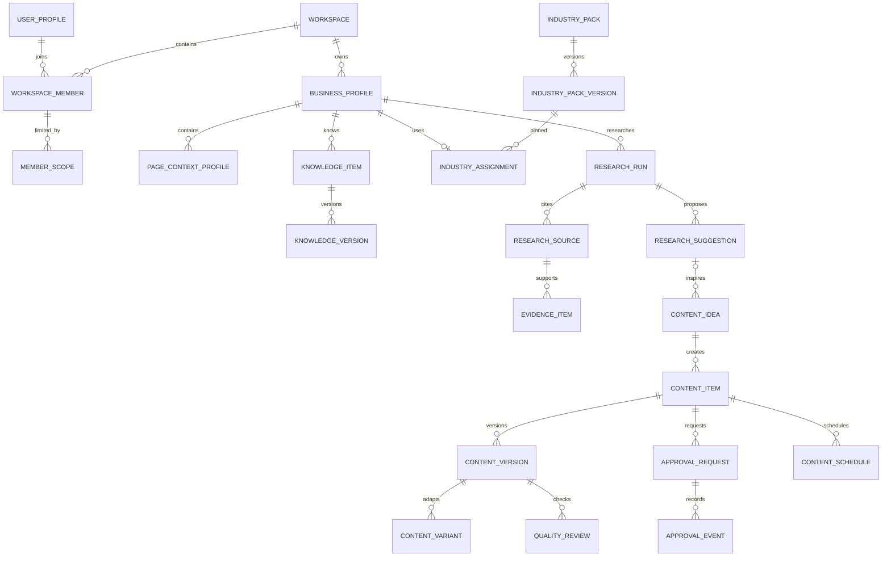
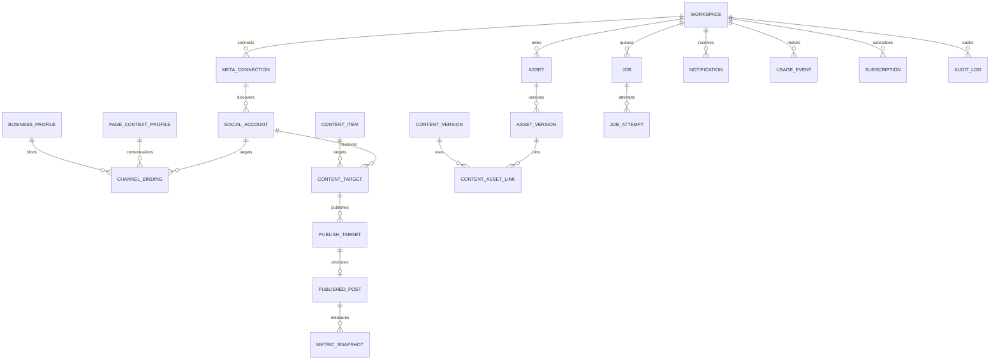
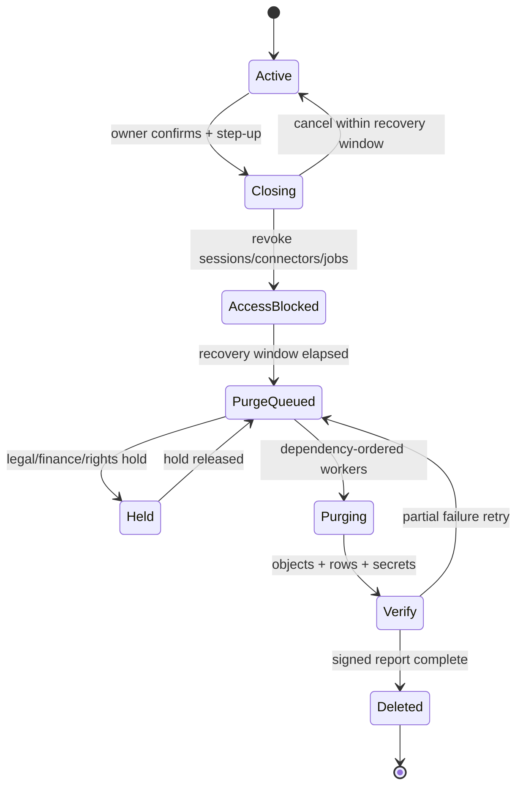

# Sprint 0A — Canonical Core ERD, RLS, Data Classification และ Retention Baseline

**Package:** A1 / `DAT-001..007`, `SEC-001`, `PRV-001..003`, `DB-00 specification`  
**สถานะ:** Sprint 0A execution baseline v1.0  
**วันที่:** 30 สิงหาคม 2026  
**เจ้าของ:** A1 Kernel/Data/Security  
**ผู้อนุมัติ:** A0 Integration/Architecture + Security reviewer + Product owner  
**ขอบเขต:** Production Beta สำหรับ SME ไทย — Facebook Page และ Instagram Professional  

เอกสารนี้เป็น handoff แบบ self-contained สำหรับ Coding Agent หลายค่าย เช่น Codex และ Claude โดย Agent ผู้รับงาน **ห้ามสมมติว่ามี shared memory, chat history หรือการตัดสินใจนอกเอกสารนี้** หากข้อมูลจำเป็นไม่อยู่ใน Input Pack ให้หยุดและเปิด Contract Change Request แทนการเดา

---

## 1. เป้าหมายและ Definition of Done

เอกสารนี้ล็อก baseline ที่ต้องมี **ก่อน merge Production Domain Migration**:

1. Canonical Core ERD และ Data Dictionary ระดับ aggregate/table family
2. ชื่อ Tenant Boundary เดียวกันทั้งระบบ: Workspace → Business → Page/Social Account
3. Migration ownership และ merge order ที่ Agent หลายตัวไม่ชนกัน
4. RLS role-operation matrix รวม negative/cross-tenant cases
5. Sensitive data classification และตำแหน่งจัดเก็บ
6. Retention, export, workspace closure และ deletion behavior
7. DB-00 implementation handoff พร้อม input/output, file ownership และ deterministic validation

ถือว่า package นี้เสร็จเมื่อ:

- ไม่มี entity P0 ที่ไม่มี owner, scope, sensitivity และ retention class
- ทุก tenant-facing table family มี RLS behavior ครบ `SELECT/INSERT/UPDATE/DELETE`
- Migration ordinal ไม่มี owner ซ้ำ
- DB-00 implementer สามารถเริ่มจาก repository เปล่าโดยไม่ถาม schema convention เพิ่ม
- Validation commands มี exit code deterministic: `0 = pass`, ค่าอื่น = fail

### Out of scope

- SQL migration จริงของ DB-01 ขึ้นไป
- UI และข้อความหน้าจอ
- Provider implementation ของ AI, Meta, Storage หรือ Payment
- Lead, Inbox และ ROI ซึ่งอยู่ Phase 2
- การให้ลูกค้าติดตั้ง third-party code/plugin เอง
- Asset field-level schema เต็ม; ใช้เอกสาร `asset-library-database-ux-spec-th.md` เป็น owner spec

---

## 2. Source-of-Truth และกฎเมื่อเอกสารขัดกัน

Agent ต้องอ่านไฟล์ต่อไปนี้จาก repository/workspace ตามลำดับ:

1. `ai-content-os-execution-master-plan-th.md` — Gate, Agent ownership และ scope ล่าสุด
2. `module-contracts-events-jobs-workstream-th.md` — Tenant/Event/Job/Error contract
3. เอกสารนี้ — Core data, migration, RLS, classification, retention และ DB-00 handoff
4. `asset-library-database-ux-spec-th.md` — Asset Library schema/state owner
5. `core-database-and-rls-workstream-th.md` — Full table blueprint และ DB-01..13 backlog
6. `modular-plug-and-play-design-rules-th.md` — Module boundary และ adapter rules

ลำดับตัดสินเมื่อขัดกัน:

- Approved ADR/Contract Registry ของ A0 ใหม่กว่า > เอกสารนี้ > workstream เดิม
- Asset-specific detail ให้ Asset spec ชนะ แต่ tenant/RLS naming จากเอกสารนี้ยังบังคับ
- Agent ห้ามแก้ shared contract เอง ให้สร้างข้อเสนอที่ระบุ `current`, `proposed`, `reason`, `affected producers`, `affected consumers`, `migration impact`, `compatibility plan`

---

## 3. Canonical Database Constitution

### 3.1 Schema และ trust zones

| Zone | ใช้เก็บ | Client access | กฎ |
|---|---|---|---|
| Exposed application schema | Tenant-facing domain/read models | ผ่าน RLS เท่านั้น | ทุก table เปิด RLS; view ใช้ security invoker |
| `private` | authorization helpers, secret references, raw webhook, worker payload, reconciliation | ไม่มี direct grant | Server/worker ผ่าน typed service เท่านั้น |
| `auth` | Supabase identity source | Supabase managed | ห้ามสร้างหรือแก้ custom object |
| `storage` | Supabase Storage metadata | Storage API/policy | ห้ามลบหรือแก้ row โดยตรง |
| `realtime` | Supabase managed | Platform managed | ห้ามสร้างหรือแก้ custom object |

ชื่อ exposed schema จริงต้องถูก A0 ล็อกใน ADR ก่อน DB-00 merge หากยังไม่ล็อกให้ใช้ placeholder `app` ใน template และห้าม hard-code หลายชื่อใน Module

### 3.2 Identifier, time, money และ state

- Domain aggregate/entity: `uuid`; Application สร้าง ID ก่อน transaction ได้
- Append-only event/attempt/ledger ปริมาณสูง: `bigint generated always as identity`
- เวลา: `timestamptz`, UTC; Local scheduling เก็บ `timezone_snapshot` แบบ IANA เพิ่ม
- Locale เริ่มต้น: `th-TH`; timezone เริ่มต้น: `Asia/Bangkok`
- Byte/token/operation: `bigint`
- เงิน: `numeric(18,6)` + ISO-4217 currency; ห้าม float
- Phase 1 state: `text` + named `CHECK`; เปลี่ยนค่าได้ผ่าน migration เท่านั้น
- ทุก mutable row: `created_at`, `updated_at`; user mutation เพิ่ม `created_by`, `updated_by`
- Soft lifecycle: `archived_at` หรือ `deleted_at`; hard delete ผ่าน retention job เท่านั้น
- Immutable version/evidence/decision/usage/audit/publish history: ห้าม update เนื้อหาเดิม

### 3.3 Tenant boundary

Canonical field names เท่านั้น:

| Scope | Field | Required when |
|---|---|---|
| Tenant root | `workspace_id` | ทุก tenant-owned row |
| Business | `business_profile_id` | knowledge, research, content, asset, approval, calendar, publish |
| Page context | `page_context_profile_id` | policy/knowledge/asset ที่จำกัดเฉพาะเพจ |
| Connected destination | `social_account_id` | target/publish/metrics |

ห้ามสร้าง synonym เช่น `tenant_id`, `organization_id`, `brand_id`, `page_id` ใน canonical domain schema

กฎ relation:

- Child ต้องยืนยันว่า parent อยู่ Workspace/Business เดียวกันด้วย composite FK, stable validation function หรือ command transaction ที่มี DB constraint รองรับ
- `workspace_id` จาก client ไม่ trusted; server ต้อง resolve active membership
- Role ให้เพดานสิทธิ์ ส่วน member scope ตัดสิทธิ์ให้แคบลงและไม่ขยาย role
- ทุก FK, RLS predicate และ keyset cursor column ต้องมี index
- List ที่โตต่อเนื่องใช้ keyset pagination เช่น `(created_at desc, id desc)`

### 3.4 Transaction, async และ cross-module writes

- Domain state และ outbox event เขียน transaction เดียวกัน
- ห้ามเรียก external provider ขณะถือ DB transaction
- Mobile create/retry ต้องมี client idempotency key
- Worker claim ใช้ lease + `FOR UPDATE SKIP LOCKED` หรือ queue semantics ที่เทียบเท่า
- Cross-module mutation ผ่าน application command หรือ domain event; ห้าม Module query/write private table ของ Module อื่นโดยตรง
- Secret, binary, long-lived signed URL และ raw provider response ห้ามอยู่ event/job payload

---

## 4. Canonical Core ERD

แผนภาพนี้แสดง aggregate boundary และ relation สำคัญ ไม่ใช่ SQL field ครบทุก column





### Relation invariants ที่ migration/test ต้อง enforce

1. Page Context อยู่ Business เดียวและ Workspace เดียวกับ parent เสมอ
2. Social Account ผูก Active Business เดียวในช่วงเวลาเดียวกัน แต่ Workspace มีหลาย Page/IG ได้
3. Knowledge/Research/Content/Asset ทุก row มี Business scope; Page scope เป็น nullable override ที่ต้องอยู่ Business เดียวกัน
4. Content ที่ approve/schedule/publish ต้อง pin `content_version_id`
5. Content/Publish ที่ใช้สื่อต้อง pin `asset_version_id` ที่ `ready` และ rights valid
6. Approval Request pin Content Version; Version ใหม่ไม่ inherit approval โดยอัตโนมัติ
7. FB และ IG เป็น Publish Target แยกกัน; partial success ไม่ rollback target ที่สำเร็จ
8. Published Pack/Knowledge/Content version และ Approval/Usage/Audit history เป็น immutable
9. Credential/API key/token เก็บเป็น secret reference เท่านั้น ไม่อยู่ exposed row
10. Workspace/Business/Page UUID ที่ไม่สัมพันธ์กันต้อง fail ที่ DB หรือ command boundary แม้ actor มีสิทธิ์ในแต่ละ entity แยกกัน

---

## 5. Canonical Data Dictionary Summary

ตารางนี้เป็น minimum inventory ที่แต่ละ Module ต้องแตกเป็น field-level dictionary ใน PR ของตน

| Module | Table family / source of truth | Scope | Mutability | Sensitivity | Retention class | Owner |
|---|---|---|---|---|---|---|
| `identity.core` | `user_profiles` | user | mutable/soft delete | PII-2 | ID-USER | A1 Identity |
| `identity.core` | `workspaces`, `workspace_settings` | workspace | mutable/versioned | TENANT-1 | TENANT-LIFE | A1 Identity |
| `identity.core` | `workspace_members`, `workspace_member_scopes` | workspace/business/page | mutable + history | PII-2/AUTH-3 | AUTH-HISTORY | A1 Identity |
| `identity.core` | `workspace_invitations` | workspace | short-lived | PII-2/AUTH-3 | TOKEN-SHORT | A1 Identity |
| `business.core` | `business_profiles`, `business_profile_versions` | workspace/business | current + immutable versions | TENANT-1 | TENANT-LIFE/HISTORY | A1 Business |
| `business.core` | `page_context_profiles`, versions, bindings | workspace/business/page | current + immutable versions | TENANT-1 | TENANT-LIFE/HISTORY | A1 Business |
| `industry.core` | pack catalog/versions/assignments | global/business | published immutable | PUBLIC-0/TENANT-1 | CATALOG/HISTORY | A2 Industry |
| `knowledge.core` | items/versions/voice/audience/offers/restrictions | business/page | current + immutable versions | CONTENT-2 | CONTENT-HISTORY | A2 Knowledge |
| `research.core` | runs/sources/snapshots/evidence/suggestions | business/page | mixed; evidence immutable | CONTENT-2/COPYRIGHT-3 | RESEARCH-* | A2 Research |
| `content.core` | ideas/items/versions/variants/quality/targets | business/page | current + immutable versions | CONTENT-2 | CONTENT-HISTORY | A3 Content |
| `approval.core` | policies/requests/events | business/page | policy versioned; event append-only | CONTENT-2/AUTH-3 | APPROVAL-HISTORY | A5 Workflow |
| `calendar.core` | calendar items/schedules | business/page | mutable state + history | CONTENT-2 | SCHEDULE-HISTORY | A5 Workflow |
| `asset.core` | assets/versions/rights/links/backup/usage | business/page | logical mutable; versions immutable | MEDIA-2/RIGHTS-3 | ASSET-* | A4 Asset |
| `connector.meta` | connections/accounts/bindings | workspace/business/page | mutable + history | INTEGRATION-2/SECRET-4 | CONNECTION-HISTORY | A6 Meta |
| `connector.meta` | raw webhook inbox | private workspace | append/process/purge | PROVIDER-3/SECRET-4 | WEBHOOK-SHORT | A6 Meta |
| `publisher.meta` | intents/targets/jobs/posts/metrics | business/page/account | state + immutable result/snapshot | CONTENT-2/PROVIDER-3 | PUBLISH-HISTORY | A6 Publisher |
| `jobs.kernel` | jobs/attempts/DLQ/outbox/consumed ledger | workspace | state + append-only | INTERNAL-3 | JOB-SHORT/LEDGER | A0 Kernel |
| `notification.core` | notifications/preferences/push subscriptions | workspace/user | mutable + inbox | PII-2/SECRET-4 | NOTIFICATION-* | A5 Notification |
| `ai.gateway` | model registry/policies/credential refs/generation runs | global/workspace | catalog + run history | CONTENT-2/SECRET-4 | AI-RUN-* | A3 AI |
| `metering.core` | reservations/events/quota buckets | workspace/business | append-only ledger + aggregate | FIN-3 | FINANCE-HISTORY | A0/A6 Metering |
| `billing.core` | plans/prices/subscriptions/invoices/payment refs | global/workspace | versioned + ledger-like | PII-2/FIN-3 | FINANCE-HISTORY | A6 Billing |
| `audit.core` | audit logs/security events | workspace/private | append-only | AUTH-3/SECURITY-4 | AUDIT/SECURITY | A1 Security |

### Required field-level dictionary template

ทุก Module PR ต้องเพิ่ม fragment ที่มีคอลัมน์ต่อไปนี้:

```text
table_name
column_name
data_type
nullable
default
meaning_th
source_of_truth
tenant_scope
sensitivity_class
retention_class
encrypted_or_hashed
write_owner
read_consumers
index_or_constraint
deletion_behavior
```

ห้ามใช้คำว่า “metadata”, “config”, “payload” หรือ “JSON” โดยไม่ระบุ JSON Schema version, maximum size, prohibited fields และ owner

---

## 6. Migration Ownership Registry

Integration Owner เป็นผู้ assign filename/timestamp จริงและ merge manifest ส่วน Agent แก้เฉพาะ batch/folder ที่ได้รับมอบหมาย

| Batch | Owner module/agent | Depends on | Output/Gate | Shared-file writer |
|---:|---|---|---|---|
| `000` | A0 Integration/DB-00 | none | schemas, extensions, conventions, helpers | A0 only |
| `010` | A1 Identity | 000 | profiles/workspace/member/invite/settings | A0 manifest only |
| `011` | A1 Identity + Security review | 010 | authorization helpers v1 | A0 manifest only |
| `020` | A1 Business | 011 | business/page + immutable versions | A0 manifest only |
| `021` | A1 Identity/Business | 020 | member business/page scope + deferred FK | A0 manifest only |
| `030` | A2 Industry | 020 | pack/version/assignment | A0 manifest only |
| `040` | A2 Knowledge | 020,030 | knowledge + typed profiles | A0 manifest only |
| `041` | A2 Knowledge | 040 | resolved knowledge contract | A0 manifest only |
| `050` | A0 Async Kernel | 011 | jobs/outbox/consumer ledger | A0 |
| `051` | A5 Notification | 050 | notification inbox/preferences/push | A0 manifest only |
| `060` | A3 AI Gateway | 011,020 | model/policy/credential reference | A0 manifest only |
| `061` | A0/A6 Metering | 050,060 | quota/reservation/usage ledger | A0 manifest only |
| `070` | A2 Research | 030,040,050,061 | research/evidence/suggestion | A0 manifest only |
| `080` | A3 Content | 040,050,060,070 | idea/content/version/variant/quality | A0 manifest only |
| `081` | A3 Content | 080 | target placeholder contract | A0 manifest only |
| `090` | A5 Approval | 080 | policy/request/event | A0 manifest only |
| `091` | A5 Calendar | 080,090 | calendar/schedule | A0 manifest only |
| `100` | A4 Asset | 020,050,061,080 | Asset detailed schema | A0 manifest only |
| `110` | A6 Meta Connector | 020,050 | connection/account/webhook inbox | A0 manifest only |
| `111` | A0 Integration | 110,020,081 | business-channel/social FK | A0 only |
| `120` | A6 Publisher | 080,091,100,110,050 | intent/target/job/post | A0 manifest only |
| `121` | A6 Publisher | 120 | metric snapshots | A0 manifest only |
| `130` | A6 Billing | 010 | plan/price/entitlement/subscription | A0 manifest only |
| `131` | A6 Billing | 130,050 | webhook/invoice/payment read model | A0 manifest only |
| `132` | A0 Integration + A6 | 061,130 | entitlement-metering resolver | A0 only |
| `140` | A1 Security/Audit | 011 | audit/security event core | A0 manifest only |
| `141` | A0 Integration | all domain batches | audit consumers/hooks | A0 only |
| `150` | DB performance owner | stable schema + prod fixture | indexes/partition readiness | A0 manifest only |
| `160` | A1 Security/Data | all | retention/export/anonymization | A0 manifest only |
| `170` | A1 Security | all | grants/RLS/exposed surface hardening | A0 manifest only |
| `180` | A0 Integration | all | generated ERD/dictionary/types/checksum | A0 only |

### Migration invariants

1. Merge แล้วห้ามแก้ migration ย้อนหลัง; ใช้ forward-fix
2. Add nullable → chunked backfill → validate → enforce constraint
3. DDL ที่เสี่ยง lock ต้องมี `lock_timeout`, `statement_timeout`, rollout และ recovery note
4. Production index บนตารางใหญ่ใช้ non-blocking/concurrent path ที่ runner รองรับ
5. Global seed ใช้ stable key และ rerun ได้; tenant pilot fixture ห้ามอยู่ production seed
6. Cross-module FK สร้างใน integration batch เท่านั้น เว้นแต่ registry ระบุเจ้าของชัดเจน
7. Agent ห้าม regenerate shared DB types/ERD/manifest; A0 ทำหลัง merge wave
8. PR หนึ่งชุดต้องมี migration + constraints/indexes + RLS/grants + tests + dictionary fragment + rollout note

### File ownership contract

```text
db/modules/<module-key>/migrations/      # module owner writes
src/modules/<module-key>/                # module owner writes
tests/db/<module-key>/                    # module owner writes
docs/data-dictionary/<module-key>.yaml    # module owner writes
db/migration-manifest.*                   # A0 only
src/generated/database-types.*            # A0 only
docs/generated/core-erd.*                 # A0 only
docs/generated/schema-checksum.*           # A0 only
```

---

## 7. Canonical Roles, Capabilities และ Scope

Built-in roles:

- `owner`: ทุก capability ใน Workspace รวม billing, credentials, member transfer และ data request
- `admin`: บริหาร Workspace/Business/Content ตาม capability ที่มอบหมาย แต่ห้าม transfer/remove Owner
- `editor`: สร้าง/แก้ knowledge, research, content, asset และ schedule เมื่อ policy อนุญาต
- `approver`: อ่านงานใน scope, approve/reject/request changes ตาม policy
- `viewer`: อ่านเฉพาะ projection ที่ได้รับอนุญาต

Member status ที่ให้ access ได้มีเพียง `active` เท่านั้น; `invited`, `suspended`, `left` ต้องถูก deny ทันที

Scope types:

- `all_businesses`: ใช้ capability ได้ทุก Business/Page ใน Workspace
- `business`: จำกัด Business เดียว รวม Page ใต้ Business ตาม policy
- `page`: จำกัด Page Context เดียว

Role ไม่ควร hard-code เป็น policy ทุก table โดยตรง ให้ authorization helper resolve `capability + tenant context + member scope` และ index membership/scope lookup

---

## 8. RLS Role-Operation Matrix

สัญลักษณ์: `Y` ผ่านเมื่อ active + capability + scope ตรง, `P` ผ่านตาม policy/explicit capability, `O` เฉพาะ row ของตน, `S` service/worker เท่านั้น, `N` ห้าม

### 8.1 Workspace, identity และ business

| Resource / operation | Owner | Admin | Editor | Approver | Viewer | Service |
|---|---:|---:|---:|---:|---:|---:|
| Own user profile SELECT/UPDATE | O | O | O | O | O | P |
| Workspace SELECT | Y | Y | Y | Y | Y | P |
| Workspace UPDATE | Y | P | N | N | N | P |
| Member list SELECT | Y | Y | P | N | N | P |
| Invite/change scope | Y | P | N | N | N | P |
| Transfer/remove owner | Y | N | N | N | N | P |
| Business/Page SELECT | Y | Y | Y | Y | Y | P |
| Business/Page INSERT/UPDATE/archive | Y | Y | P | N | N | P |
| Immutable business/page version UPDATE/DELETE | N | N | N | N | N | N |

### 8.2 Knowledge, research, content และ assets

| Resource / operation | Owner | Admin | Editor | Approver | Viewer | Service |
|---|---:|---:|---:|---:|---:|---:|
| Knowledge/Research SELECT | Y | Y | Y | Y | Y | P |
| Knowledge current INSERT/UPDATE/archive | Y | Y | Y | N | N | P |
| Knowledge version UPDATE/DELETE | N | N | N | N | N | N |
| Start/cancel Research | Y | Y | Y | N | N | P |
| Research run/source/evidence INSERT | N | N | N | N | N | S |
| Suggestion save/dismiss/use | Y | Y | Y | P | N | P |
| Content SELECT | Y | Y | Y | Y | Y | P |
| Content create/edit/version | Y | Y | Y | N | N | P |
| Approved/published version UPDATE/DELETE | N | N | N | N | N | N |
| Asset SELECT/use | Y | Y | Y | Y | Y | P |
| Asset upload/edit/archive | Y | Y | Y | N | N | P |
| Asset rights/share | Y | Y | N | P | N | P |
| Asset hard purge | N | N | N | N | N | S |

### 8.3 Approval, calendar, Meta, publishing และ billing

| Resource / operation | Owner | Admin | Editor | Approver | Viewer | Service |
|---|---:|---:|---:|---:|---:|---:|
| Approval policy manage | Y | Y | N | N | N | P |
| Approval request create/cancel | Y | Y | Y | N | N | P |
| Approve/reject/request changes | Y | P | P | Y | N | P |
| Approval event UPDATE/DELETE | N | N | N | N | N | N |
| Calendar SELECT | Y | Y | Y | Y | Y | P |
| Schedule/unschedule | Y | Y | P | N | N | P |
| Meta connection health SELECT | Y | Y | P | N | N | P |
| Connect/disconnect/re-auth Meta | Y | P | N | N | N | P |
| Raw token/webhook SELECT | N | N | N | N | N | S |
| Publish now/cancel pending | Y | Y | P | N | N | P |
| Publish delivery/post/metric INSERT | N | N | N | N | N | S |
| Billing/subscription SELECT | Y | P | N | N | N | P |
| Plan/payment action | Y | N | N | N | N | P |
| BYOK credential manage | Y | P | N | N | N | P |
| Plain credential SELECT | N | N | N | N | N | N |

### 8.4 Jobs, notification, metering และ audit

| Resource / operation | Owner | Admin | Editor | Approver | Viewer | Service |
|---|---:|---:|---:|---:|---:|---:|
| Own notification SELECT/mark read | O | O | O | O | O | P |
| Notification insert/delivery state | N | N | N | N | N | S |
| Job redacted status SELECT | Y | Y | O/P | O/P | O/P | P |
| Internal job/attempt/DLQ payload | N | N | N | N | N | S |
| Usage/quota summary SELECT | Y | Y | P | N | N | P |
| Usage ledger INSERT/UPDATE/DELETE | N | N | N | N | N | S/N |
| Tenant audit SELECT | Y | P | O | approval trail | N | P |
| Security event details | P | N | N | N | N | S |
| Audit/security INSERT | N | N | N | N | N | S |
| Audit/security UPDATE/DELETE | N | N | N | N | N | N |

### 8.5 Mandatory RLS patterns

- Exposed table: `ENABLE ROW LEVEL SECURITY`; production ใช้ `FORCE ROW LEVEL SECURITY` เมื่อ service path ผ่าน explicit privileged adapter
- Policy ระบุ `TO authenticated`; anonymous ไม่มี tenant policy
- `SELECT`: active membership + capability + Workspace/Business/Page scope + lifecycle visibility
- `INSERT`: `WITH CHECK` scope ทั้งหมด; user action ตรวจ `created_by = (select auth.uid())`
- `UPDATE`: มี `USING` และ `WITH CHECK`; ห้ามย้าย row ข้าม tenant/scope ด้วย update
- `DELETE`: ไม่มี broad user delete; ใช้ soft-delete command ที่ update typed lifecycle field
- Immutable/append-only: ไม่มี user update/delete policy และมี command/trigger/privilege defense ตามความเหมาะสม
- Exposed view: `security_invoker = true`
- Security definer function: `set search_path = ''`, fully qualified objects, revoke public execute, explicit grant
- Browser/mobile ห้ามถือ service-role credential

### 8.6 Mandatory authorization cases ต่อ tenant table

ทุก table family ต้องมี test อย่างน้อย 10 cases:

1. Same Workspace + allowed role/scope → pass
2. Same Workspace + wrong role/capability → deny
3. Same Workspace + allowed Business A แต่ row Business B → deny
4. Same Business + allowed Page A แต่ row Page B → deny
5. Different Workspace แต่รู้ UUID → deny
6. Suspended/left member → denyทันที
7. Anonymous → deny
8. Forged `created_by`/scope columns → insert/update fail
9. Immutable/ledger row → update/delete fail
10. Authorized server command → pass + expected audit/outbox

ต้อง assert ทั้ง returned row count และ mutation error; ห้ามถือว่า empty result เพียงอย่างเดียวพิสูจน์ mutation denial

---

## 9. Sensitive Data Classification

### 9.1 Classification levels

| Class | ตัวอย่าง | Storage/log rule | Client projection |
|---|---|---|---|
| `PUBLIC-0` | published industry catalog, public model label | normal integrity controls | allowed |
| `TENANT-1` | business name, page display name, settings | encrypted in transit/at rest by platform | allowed through RLS |
| `PII-2` | email, display name, contact, actor identity | minimize; mask where possible | only as required by role |
| `CONTENT-2` | knowledge, caption, research brief, generated copy | tenant isolated; no model training reuse by default | through RLS |
| `MEDIA-2` | image/video/original/thumbnail | private bucket; short signed access | authorized signed URL only |
| `INTEGRATION-2` | account display/capability/health | redact external identifiers | health projection only |
| `PROVIDER-3` | provider payload, external post ID, webhook | private, redact/log hash | safe projection only |
| `AUTH-3` | membership/scope/approval/audit actor | restricted and append-only where needed | minimum role projection |
| `FIN-3` | price, invoice, usage/cost ledger | restricted, immutable history | owner/admin summary |
| `RIGHTS-3` | license/consent/proof/expiry | private media/evidence + audit | status/expiry, proof by permission |
| `COPYRIGHT-3` | research snapshot/excerpt | restricted, retention/policy bound | approved excerpt only |
| `INTERNAL-3` | job payload, DLQ, trace, implementation errors | private; short retention | redacted status only |
| `SECRET-4` | API key, OAuth token, signing secret, push token | vault/encrypted secret store; never plaintext DB/log | never returned after write |
| `SECURITY-4` | raw security event, replay anomaly, IP/user agent | hash/minimize; restricted | security/admin safe view only |

### 9.2 Absolute prohibitions

ห้ามเก็บหรือส่งออกใน client/API/event/job/log/fixture:

- plaintext BYOK/API key/OAuth access token/refresh token/webhook secret
- card PAN/CVV หรือ payment credential ที่ provider จัดการ
- raw Authorization/Cookie headers
- long-lived signed media URL
- provider stack trace หรือ full SDK error
- raw prompt/response ที่มี secret โดยไม่มี redaction/retention decision
- full research snapshot ที่ client ไม่มีสิทธิ์ทำซ้ำ

Secret table เก็บได้เพียง `credential_reference`, provider, fingerprint/last-four-like identifier, status, created/rotated/expired timestamps และ audit reference

### 9.3 Encryption/hash requirements

- Invitation token: store cryptographic hash only
- External account ID: raw encrypted/private reference + stable hash for uniqueness
- IP/user-agent: store keyed hash or truncated/redacted representationตาม security need
- Asset checksum/content hash: hash เพื่อ integrity/dedup ไม่ใช่ secret
- Database backup/object storage: platform encryption at rest + access logging + least privilege
- Application logs: structured allowlist; default-deny payload fields

---

## 10. Retention Baseline v0.1

ตัวเลขนี้เป็น **Engineering default สำหรับ Pilot** ต้องได้รับ Product/Security/Legal approval ก่อน Paid Beta และสามารถเปลี่ยนด้วย policy version โดยไม่แก้ historical record ย้อนหลัง

| Retention class | Data | Active retention | หลัง Workspace closure/delete request | Final behavior |
|---|---|---|---|---|
| `ID-USER` | user profile | อายุบัญชี | access ปิดทันที; 30-day recovery เว้น legal hold | delete/anonymize identity link |
| `TENANT-LIFE` | workspace/business/page current | อายุ Workspace | mark closing; 30-day recovery | hard delete/anonymizeตาม dependency |
| `HISTORY` | immutable business/page/knowledge/content versions | อายุ Workspace + lineage | 30-day recovery | purge หากไม่มี legal/financial hold |
| `AUTH-HISTORY` | memberships/scopes/invitations history | อายุ Workspace | 30-day recovery | anonymize actor fields; retain security minimum 1 year |
| `TOKEN-SHORT` | invitation/reset-like records | ถึง expiry + 30 วัน | immediate revoke | purge token/hash recordตาม security need |
| `RESEARCH-RUN` | brief/status/suggestion/evidence metadata | 12 เดือนหลัง last use | included in 30-day recovery | purge/anonymize; keep nonidentifying aggregate |
| `RESEARCH-SNAPSHOT` | copyrighted/raw snapshot | 30 วัน default หรือสั้นกว่าตาม source policy | no recovery unless needed by active evidence/legal hold | purge object + locator; preserve permitted hash/citation metadata |
| `CONTENT-HISTORY` | content versions/quality/lineage | อายุ Workspace | 30-day recovery | purge content; keep anonymized product aggregates only |
| `APPROVAL-HISTORY` | request/decision trail | อายุ Workspace + 1 ปี default | restrict immediately | anonymize actor after minimum retention; preserve decision integrity |
| `SCHEDULE-HISTORY` | calendar/schedule state | 12 เดือนหลัง final state | 30-day recovery | purge/anonymize |
| `ASSET-ORIGINAL` | original media | อายุ Asset/Workspace | Trash 30 วัน; block purge if referenced/hold | purge object, versions, signed access; verify deletion |
| `ASSET-DERIVATIVE` | thumbnail/poster/transcode | อายุ Asset หรือ cache policy | may purge immediately after source deletion | regenerate when needed; no backup required |
| `RIGHTS-PROOF` | consent/license proof | อายุ Asset use + 2 ปี default | restricted immediately | retain under rights/legal hold then purge |
| `UPLOAD-TEMP` | multipart/temp upload | 24 ชั่วโมงหลัง expiry/failure | no recovery | purge object/session residue |
| `WEBHOOK-SHORT` | raw Meta/payment webhook inbox | 30 วันหลัง processed; 90 วัน failure/DLQ | no tenant access | redact/purge payload, retain dedupe hash longer |
| `PUBLISH-HISTORY` | intent/target/post/metric | อายุ Workspace; metrics detail 24 เดือน default | 30-day recovery | purge tenant content; retain anonymized aggregate |
| `JOB-SHORT` | job input/result/attempt errors | 30 วัน success; 90 วัน failed/DLQ | no client access | purge payload; retain redacted operational counters |
| `OUTBOX-SHORT` | published outbox row | จน consumers ack + 30 วัน | no recovery | purge after guarantee window |
| `CONSUMER-LEDGER` | event dedupe keys | 180 วันหรือ max replay window | retained for replay safety | purge by partition/window |
| `NOTIFICATION-INBOX` | user notifications | 180 วัน | delete with user/workspace | purge |
| `PUSH-SECRET` | device push subscription | active + 30 วัน inactive | revoke immediately | purge token/reference |
| `AI-RUN` | generation metadata/cost/lineage | 12 เดือน | 30-day recovery | anonymize/purge prompt/outputตาม content deletion |
| `AI-RAW` | raw prompt/response debug | off by default; max 30 วัน opt-in support | revoke/purge immediately | purge/redact |
| `FINANCE-HISTORY` | usage ledger/invoice/payment reference | 7 ปี engineering default subject to Thai tax/legal review | access restricted, not erased if legal basis requires | anonymize nonrequired PII; retain ledger integrity |
| `AUDIT` | tenant audit | 1 ปี default | restrict immediately | anonymize actor where allowed; purge after policy |
| `SECURITY` | security event | 2 ปี default | restricted | hash/anonymize PII; retain active investigation/legal hold |
| `BACKUP` | encrypted backup | 35 วัน rolling default | deletion propagates by backup expiry, not in-place mutation | inaccessible except restore procedure; expire automatically |

### Retention precedence

ลำดับสูงสุดก่อน:

1. Legal/security/rights hold
2. Financial/tax retention obligation
3. Active publication/approved lineage dependency
4. Workspace recovery window
5. Table retention default

Hold ต้องมี `hold_type`, scope, reason code, created_by, approved_by, start/end/review date และ audit trail; UI ทั่วไปไม่เห็นรายละเอียดลับ

---

## 11. Export, Workspace Closure และ Delete Behavior

### 11.1 PDPA/data export contract

Export เป็น background job และต้อง:

1. Owner หรือ authorized privacy operator request เท่านั้น
2. Step-up verification ก่อนเริ่ม
3. Snapshot `requested_scope`, policy version และ requester
4. Export เฉพาะข้อมูล Workspace/Business/Page ที่ requester มีอำนาจตาม contract
5. ไม่รวม secret, raw webhook, internal job/DLQ, provider credential, security investigative detail หรือ copyrighted raw snapshot
6. รวม manifest: schema version, generated_at, workspace_id, counts, omitted classes/reasons, checksums
7. Package encrypted; download URL short-lived, single-purpose, audited
8. Export artifact หมดอายุ 7 วัน default และ purge อัตโนมัติ
9. Retry idempotent ไม่สร้าง package ที่เข้าถึงข้าม scope

Minimum export domains:

- Workspace/business/page settings
- Members/roles/scopes ที่เหมาะสม
- Knowledge current + permitted version history
- Research citation/evidence metadata และ permitted excerpts
- Content/version/variant/quality/approval/calendar/publish history
- Asset metadata/rights + originals ที่ผู้ใช้เป็นเจ้าของและ policy อนุญาต
- Usage/billing invoices/read model ที่ส่งออกได้
- Tenant-visible audit trail

### 11.2 User removal

- Remove/suspend membership: access ปิดใน transaction เดียว
- Content/approval/audit history ห้าม cascade delete; actor เปลี่ยนเป็น retained internal ID หรือ anonymized labelตาม retention
- Push token/session/active invitation revoke ทันที
- ห้ามลบ Owner คนสุดท้าย; transfer ownership ก่อน

### 11.3 Business/Page archive

- Archive ปิด creation/publish ใหม่ แต่ยังอ่าน history ตาม role
- Existing schedule ต้อง cancel หรือย้ายผ่าน explicit command; ห้าม silent continue
- Meta binding disconnect/revoke ตาม Product decision และเก็บ redacted history
- Hard purge ทำหลัง Workspace policy/hold/reference check

### 11.4 Workspace deletion lifecycle



Required order:

1. Mark Workspace `closing`; write audit event
2. Revoke browser sessions, push tokens, invitations, API/connector credentials; stop new jobs/publish
3. Cancel or drain jobs using typed policy
4. Wait 30-day recovery default unless verified immediate deletion policy applies
5. Evaluate legal/finance/rights/security holds
6. Purge ephemeral/export/temp/raw payload first
7. Purge tenant content, research, assets/object versions and connector data
8. Anonymize/retain finance, audit, security minimum required records
9. Let encrypted backup copies expire within rolling window
10. Produce internal signed deletion report with counts/checksums/failures; report contains no deleted content

### 11.5 Asset deletion special rules

- User delete = move to Trash; hide from normal query
- Scheduled/publishing content, active rights/legal hold หรือ immutable published reference block hard purge
- Trash recovery default 30 วัน
- Purge worker verifies object deletion, derivative deletion and backup policy state
- Delete through Storage API; never delete `storage.objects` row directly
- Partial purge is retryable/idempotent and visible to support as redacted status

---

## 12. DB-00 Implementation Handoff

### 12.1 Task identity

| Field | Value |
|---|---|
| Package | `DB-00` Schema Foundation and Test Harness |
| Owner | Integration/Database Agent assigned by A0 |
| Dependencies | none, but Contract v1 names from A0 must be present or stubbed explicitly |
| Blocks | DB-01..DB-13 and all production tenant modules |
| Production data mutation | none |
| Merge reviewer | A0 Integration + A1 Security/Data |

### 12.2 Inputs — no assumed shared memory

Agent must receive or locate all files below before coding:

```text
sprint-0a-core-erd-rls-retention-th.md       # this document
module-contracts-events-jobs-workstream-th.md
core-database-and-rls-workstream-th.md
asset-library-database-ux-spec-th.md
ADR choosing exposed application schema name
ADR choosing migration runner/test framework/runtime validator
contract catalog containing Tenant Context v1 and Stable Error v1
repository AGENTS.md/CONTRIBUTING.md/package manager lockfile
```

If one of the last four items does not exist, DB-00 may create a **proposal/stub in owned folder** but must not silently choose and write shared root configuration

### 12.3 Required outputs

1. Database schema/folder convention and owner-comment format
2. Batch `000` migration: approved extensions only, `private` schema, helper conventions
3. Migration runner supporting clean deploy and previous-release upgrade mode
4. Idempotent global seed runner separated from pilot/test fixtures
5. Test factories for User A/B, Workspace A/B, Business/Page A/B, built-in roles and membership scopes
6. Auth context helper for anonymous, authenticated user, suspended user and server/worker
7. RLS assertion helpers for row visibility and mutation denial
8. Schema lint rules:
   - every table has PK
   - every FK has supporting index
   - every tenant table has canonical scope, RLS and owner comment
   - exposed view is security invoker
   - security definer function has empty search path and explicit grants
   - immutable/ledger table lacks user update/delete grants
9. CI targets for clean migration, upgrade migration, seed replay, schema lint, RLS smoke and generated artifact drift
10. Cross-tenant smoke fixture proving Workspace A cannot access Workspace B by known UUID
11. `README` explaining exact local prerequisites, commands, exit codes and failure artifacts
12. Forward-fix template; DB-00 must not depend on production downgrade

### 12.4 Output file ownership

DB-00 implementer may write only paths assigned by A0. Recommended package-owned paths:

```text
db/foundation/migrations/
db/foundation/seeds/
db/foundation/lint/
tests/db/foundation/
tests/db/fixtures/
scripts/db/                         # only if A0 assigns ownership
docs/handoffs/db-00/
```

Shared paths below are A0-only unless written approval is in task input:

```text
package.json / lockfiles / root workspace config
db/migration-manifest.*
src/generated/database-types.*
docs/generated/core-erd.*
CI workflow root files
```

DB-00 may provide patch fragments/proposed commands for A0 to integrate shared files

### 12.5 Required deterministic command contract

Repository implementation may use the approved package manager แต่ต้อง expose command semantics เหล่านี้ผ่าน `make` หรือ equivalent documented wrapper:

```bash
make db-reset-test
make db-migrate-clean
make db-migrate-upgrade FIXTURE=previous-release
make db-seed-replay
make db-schema-lint
make db-rls-smoke
make db-contract-check
make db-generated-drift-check
make db-test-foundation
make db-verify
```

Command contract:

- ห้าม prompt แบบ interactive
- ตั้ง locale/timezone deterministic: `LC_ALL=C`, database/session timezone UTC
- ใช้ database test instance แยก; ห้ามใช้ production URL
- Exit `0` เมื่อผ่านทั้งหมด; nonzero เมื่อ fail
- Output stable summary: command, migration checksum, tests passed/failed, elapsed time, artifact paths
- Secret/connection URL ต้อง redact
- `db-verify` รันทุก target ตามลำดับและหยุดด้วย failure summary ที่อ่านได้
- `db-reset-test` ต้อง reject host/database ที่ไม่ match explicit test allowlist

ตัวอย่าง CI invocation ที่ implementation ต้องรองรับ:

```bash
LC_ALL=C TZ=UTC make db-verify
```

หากใช้ Supabase CLI/npm/pnpm/bun/Docker ต่างกัน ให้ wrapper ซ่อนความต่างเพื่อให้ Coding Agent ทุกค่ายเรียก command เดียวกัน

### 12.6 Deterministic fixture contract

Stable symbolic identities; UUID จริงกำหนดใน fixture catalog ห้ามสุ่มทุก test:

```text
user_owner_a       active owner of workspace_a
user_editor_a      editor scoped business_a1/page_a1
user_approver_a    approver scoped business_a1
user_viewer_a      viewer workspace_a
user_suspended_a   suspended member workspace_a
user_owner_b       active owner workspace_b
workspace_a / workspace_b
business_a1 / business_a2 / business_b1
page_a1 / page_a2 / page_b1
```

Required smoke assertions:

1. `user_owner_a` sees Workspace A, never Workspace B
2. `user_editor_a` sees Business A1/Page A1, never A2/Page A2
3. `user_approver_a` cannot edit content/knowledge
4. `user_viewer_a` cannot insert/update/delete
5. `user_suspended_a` sees zero tenant rows and cannot mutate
6. anonymous sees zero tenant rows
7. forged Workspace/Business/Page IDs fail
8. server fixture only succeeds through explicit server test helper

### 12.7 DB-00 acceptance tests

| ID | Scenario | Expected evidence |
|---|---|---|
| `DB00-A01` | Blank DB migrate | all batch 000 objects created; checksum stable |
| `DB00-A02` | Run seed twice | same catalog counts/keys; no duplicate |
| `DB00-A03` | Cross-tenant known UUID | SELECT empty; INSERT/UPDATE denied |
| `DB00-A04` | Suspended/anonymous | no tenant access |
| `DB00-A05` | Tenant table without RLS | lint exits nonzero and names object |
| `DB00-A06` | FK without index | lint exits nonzero and names FK/columns |
| `DB00-A07` | View without security invoker | lint fails |
| `DB00-A08` | Unsafe security definer | lint fails on search path/grants |
| `DB00-A09` | Secret-like fixture/log value | secret scan fails and redacts output |
| `DB00-A10` | Generated artifact changed | drift check fails until A0 regenerates/commits |
| `DB00-A11` | Test reset points to non-test DB | command refuses destructive action |
| `DB00-A12` | Upgrade fixture | previous release migrates forward; data assertions pass |

### 12.8 DB-00 Definition of Done

- `LC_ALL=C TZ=UTC make db-verify` ผ่านจาก clean checkout
- No production/pilot customer data in seed or fixture
- No secret in repository, log snapshot or test report
- Foundation README ใช้ได้โดย Agent ที่ไม่มี chat context
- A0 รับ ownership/merge ordinals; A1 sign off lint/RLS harness
- Known limitations/open decisions listed; no silent assumption

---

## 13. Agent Handoff Protocol สำหรับ Codex/Claude

ทุก task prompt ที่แจกต้อง copy block ต่อไปนี้และกรอกให้ครบ:

```text
TASK_ID:
OWNER_MODULE:
OBJECTIVE:
ALLOWED_PATHS:
FORBIDDEN_SHARED_PATHS:
INPUT_FILES_AND_VERSIONS:
CONTRACTS_CONSUMED:
MIGRATION_BATCH:
TABLES_OWNED:
DEPENDENCIES_ALREADY_MERGED:
FIXTURES_AVAILABLE:
REQUIRED_OUTPUTS:
ACCEPTANCE_TEST_IDS:
VALIDATION_COMMANDS:
SECURITY_CLASSIFICATION:
RETENTION_CLASSES:
ROLLBACK_OR_FORWARD_FIX:
REVIEWERS:
STOP_CONDITIONS:
```

### Stop conditions

Agent ต้องหยุดและรายงาน blocker เมื่อ:

- ชื่อ/schema/version ของ shared contract ไม่ตรงกัน
- ต้องแก้ shared file ที่ไม่ได้รับ ownership
- ต้องเพิ่ม cross-module FK นอก assigned integration batch
- ต้องเก็บ plaintext credential/raw provider payload ใน exposed table
- RLS requirement ขัดกับ Product capability
- Retention/legal basis ไม่ชัดสำหรับข้อมูล FIN/RIGHTS/SECURITY
- Validation ต้องใช้ production credential/database
- Migration ที่ merge แล้วต้องถูกแก้ย้อนหลัง

### Required completion report

```text
Task IDs:
Status: done | partial | blocked
Files changed:
Migrations added:
Contracts consumed and exact versions:
Assumptions explicitly made:
Validation commands and exit codes:
Acceptance evidence/artifact paths:
RLS negative cases covered:
Security/privacy/retention impact:
Performance/lock impact:
Forward-fix plan:
Open risks or external blockers:
Recommended next task:
```

---

## 14. G0 Data/Security Gate Checklist

ก่อน A0 เปลี่ยน `G0 Data Contract` เป็นผ่าน ต้องเช็ก:

- [ ] Exposed schema name และ migration/test tooling มี ADR
- [ ] Tenant Context v1 field namesตรงเอกสารนี้
- [ ] Canonical ERD ไม่มี owner ซ้ำหรือ entity P0 หาย
- [ ] Migration registry batch `000–180` ไม่มี collision
- [ ] Role/capability/scope semantics ถูก Product owner อนุมัติ
- [ ] RLS matrix ครบ browser/mobile และ service-only surface
- [ ] Secret/raw webhook/internal job tablesไม่ exposed
- [ ] Retention v0.1 numbers ได้ Security/Product/Legal disposition: approved/changed/deferred with owner/date
- [ ] Export/delete lifecycle มี owner, audit, idempotency และ partial-failure behavior
- [ ] Asset purge/reference/rights hold rulesตรง Asset spec
- [ ] DB-00 commands/fixtures/acceptance IDsถูก Integration ownerรับรอง
- [ ] Agent handoff promptsอ้าง exact file versions/checksums ไม่อ้าง chat memory

---

## 15. Open Decisions ที่ต้องปิดก่อน Paid Beta

| ID | Decision | Default ในเอกสารนี้ | Owner | Deadline/Gate |
|---|---|---|---|---|
| `DATA-DEC-01` | ชื่อ exposed application schema | `app` placeholder | A0 | ก่อน DB-00 merge |
| `DATA-DEC-02` | Migration/test/runtime tooling | wrapper command contract only | A0 | ก่อน DB-00 coding |
| `DATA-DEC-03` | Force RLS service path | force where compatible | A0+A1 | ก่อน G1 |
| `DATA-DEC-04` | Workspace recovery window | 30 วัน | Product+Security | ก่อน Pilot |
| `DATA-DEC-05` | Finance/tax retention | 7 ปี engineering default | Finance/Legal | ก่อน Paid Beta |
| `DATA-DEC-06` | Audit/security retention | 1/2 ปี | Security/Legal | ก่อน Paid Beta |
| `DATA-DEC-07` | Research snapshot retention | 30 วัน max default | Research+Legal | ก่อน real research source |
| `DATA-DEC-08` | AI raw prompt/response logging | off; max 30 วัน opt-in | AI+Security | ก่อน real AI provider |
| `DATA-DEC-09` | Backup rolling expiry | 35 วัน | Ops+Security | ก่อน Pilot |
| `DATA-DEC-10` | Immediate deletion exception | not enabled by default | Product+Legal | ก่อน Paid Beta |

การที่ decision ยังเปิดอยู่ไม่อนุญาตให้ Agent เลือกเอง Agent ใช้ default เฉพาะ prototype/test และต้องติด feature/policy gate ตามที่ owner กำหนด

---

## 16. Sprint 0A A1 Completion Statement

Package นี้ส่งมอบ:

- Canonical Core ERD และ invariants
- Data Dictionary inventory + fragment template
- Migration Ownership Registry `000–180`
- RLS role-operation/negative-case baseline
- Sensitive Data Classification และ absolute prohibitions
- Retention/Export/Delete baseline พร้อม hold/recovery behavior
- DB-00 implementation handoff ที่ Agent ต่างค่ายทำซ้ำได้

ขั้นต่อไปหลัง A0 รับ package:

1. ปิด `DATA-DEC-01..03`
2. Dispatch DB-00 ด้วย exact allowed paths
3. Run `LC_ALL=C TZ=UTC make db-verify`
4. เมื่อ DB-00 ผ่าน จึง dispatch DB-01 และ DB-02 ตามลำดับ

