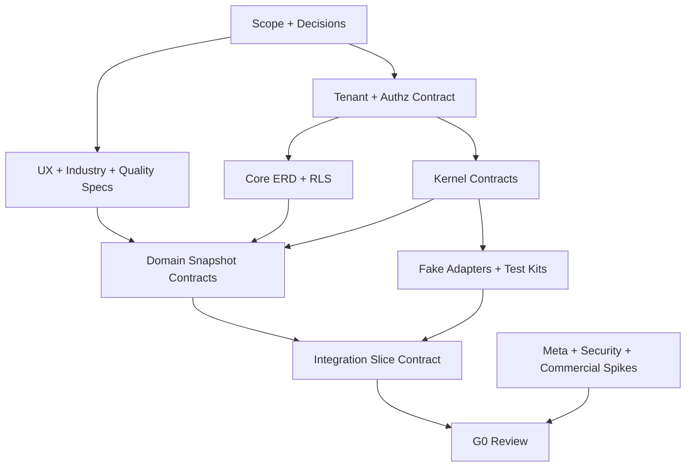

# Sprint 0A — Decision Register, Contract Catalog และ Multi-agent Execution Baseline

**สถานะ:** Baseline v1.0 — ใช้เริ่ม Sprint 0A ได้  
**วันที่:** 30 สิงหาคม 2026  
**Owner:** A0 Integration / Architecture  
**ขอบเขต:** Lean Production Beta สำหรับ SME ไทย — Facebook Page + Instagram Professional  
**Delivery model:** Contract-first Modular Monolith, background-first, mobile-first, vendor-neutral multi-agent delivery  
**Gate เป้าหมาย:** G0 Scope & Contract Ready

เอกสารนี้เป็น execution baseline ที่รวมคำตัดสิน, ownership, Contract Catalog, dependency, G0 tracker และวิธีส่งงานข้าม Agent ไว้ในที่เดียว เพื่อให้ Agent จากหลายค่าย เช่น Codex และ Claude ทำงานร่วมกันได้โดยไม่ต้องอาศัยความจำหรือบทสนทนาร่วมกัน

---

## 1. วิธีใช้เอกสารนี้

1. ทุก Work Package ต้องอ้าง Decision ID, Contract ID, Module ID และ Gate ที่เกี่ยวข้อง
2. ค่าในหัวข้อ `Approved` ใช้เป็น baseline ได้ทันที เว้นแต่ Product Owner เปิด RFC เปลี่ยน
3. รายการ `Provisional` ทำ Spike/Fixture ได้ แต่ห้ามสรุปเป็น Production policy ก่อนเงื่อนไขผ่าน
4. รายการ `Open` ต้องมี Owner, due gate และ safe default; ห้าม Agent ตัดสินใจเงียบ ๆ
5. Agent อ่าน Work Package ของตนจากไฟล์ ไม่ถือว่าข้อมูลใน chat, memory หรือคำบอกต่อเป็น requirement
6. Producer ต้องส่ง Contract + Fixture + Compatibility Note ก่อน Consumer เขียน implementation ที่ผูกกับ Contract
7. งานของ Agent จบที่ `In review`; A0/QA เท่านั้นที่เปลี่ยนเป็น `Integrated`, `Verified` หรือ `Done`

### 1.1 ลำดับ Source of Truth

หากข้อมูลขัดกัน ให้ใช้ลำดับนี้:

1. Decision/RFC ที่สถานะ `Approved` และใหม่กว่า
2. เอกสารนี้สำหรับ Sprint 0A, ownership, contract version และ Gate
3. Execution Master Plan
4. Module Contracts / Core Database / Domain Workstream
5. Product Master Plan และ Backlog
6. Technical Architecture และ Modular Rules
7. Comment, chat, memory หรือ implementation เดิม

### 1.2 สถานะมาตรฐาน

| สถานะ | ความหมาย |
|---|---|
| Proposed | มีข้อเสนอ แต่ยังไม่ใช้เป็นข้อผูกมัด |
| Provisional | ใช้ทำ Spike/Fixture ได้ มีเงื่อนไขที่ต้องยืนยัน |
| Approved | Product/Architecture baseline ที่ Agent ต้องทำตาม |
| Frozen v1 | Contract ผ่าน G0; เปลี่ยนแบบ breaking ต้อง RFC |
| In progress | Owner กำลังจัดทำ Deliverable |
| In review | Deliverable พร้อมตรวจ แต่ยังไม่ถือว่า integrated |
| Integrated | รวมเข้า baseline/repository และ CI เห็นแล้ว |
| Verified | Acceptance evidence ผ่านโดยผู้ตรวจที่ไม่ใช่ผู้สร้าง |
| Superseded | ถูกแทนด้วย Decision/Contract version ใหม่ |
| Blocked | มี dependency หรือคำตัดสินที่ทำต่ออย่างปลอดภัยไม่ได้ |

---

## 2. Lean Beta Scope ที่อนุมัติเป็นค่าเริ่มต้น

การตอบรับ `OK` ของ Product Owner ต่อแผน Sprint 0A ให้ถือเป็นการอนุมัติ baseline ด้านล่างเพื่อเริ่มทำงาน โดยหัวข้อภาษี/กฎหมาย/ข้อจำกัด Meta ยังเป็น Provisional ตามเจ้าของผู้เชี่ยวชาญ

### 2.1 Approved Decisions

| ID | Decision | ค่า Baseline | เหตุผล/ผลกระทบ | เปลี่ยนได้โดย | สถานะ |
|---|---|---|---|---|---|
| DEC-001 | Beachhead industry | GoldenHome Built-in/Interior เป็น Production Pack แรก | มีข้อมูลจริง, content pattern และผู้ตรวจ Brand | Product Owner ผ่าน RFC | Approved |
| DEC-002 | High-risk evaluation pack | Sarolux/Skincare ใช้ทดสอบ claim-risk; ยังไม่ Production default | พิสูจน์ Quality Gate กับเนื้อหาเสี่ยง | Product + qualified reviewer | Approved |
| DEC-003 | Pilot size | Closed Pilot 5 Workspace; Paid Beta ไม่เกิน 10 Workspace ก่อน review | จำกัด support/cost และเก็บ feedback ลึก | Product Owner | Approved |
| DEC-004 | Core channels | Facebook Page + Instagram Professional; หนึ่ง Workspace เชื่อมหลาย Page/Account ได้ | ตรงตลาดไทยและแชร์ Meta integration | Product Owner + Meta owner | Approved |
| DEC-005 | LinkedIn | ไม่อยู่ Phase 1 | ลด scope และไม่ตรง beachhead | Product Owner | Approved |
| DEC-006 | Phase 1 Product Flow | Research → Analyze → Generate → Asset → Approval → Calendar → Publish → Basic Metrics | Vertical value loop ที่วัดได้ | Product Owner | Approved |
| DEC-007 | Lead/Inbox/ROI | Phase 2; ไม่เป็น dependency ของ Lean Beta | ลูกค้าปิดขายใน Inbox แต่ attribution ยังไม่จำเป็นต่อ core creation | Product Owner | Approved |
| DEC-008 | User experience | ภาษาไทย, non-tech, click/select-first, mobile-first; ไม่มี prompt บังคับ | กลุ่มผู้ใช้หลักทำงานผ่านมือถือ | Product + UX owner | Approved |
| DEC-009 | Team workflow | Workspace มีหลาย User; approval เปิด/ปิดได้ใน Admin | รองรับผู้ทำและหัวหน้าอนุมัติ | Product Owner | Approved |
| DEC-010 | Tenant hierarchy | Workspace → Business Profile → Page Context; Knowledge แยกตาม Business/Page | ป้องกันความรู้ปนกันในหลายธุรกิจ | A0+A1 ผ่าน RFC | Approved |
| DEC-011 | Processing model | Research/AI/Media/Publish เป็น background job; ผู้ใช้ออกจากหน้าได้และได้รับแจ้ง | mobile/resilience/cost control | A0 | Approved |
| DEC-012 | Notification P0 | In-app + Email สำหรับ completed/failed/review; LINE เป็น P1 | แจ้งได้แม้ปิดแท็บโดยไม่เพิ่ม LINE integration ใน P0 | Product Owner | Approved |
| DEC-013 | AI UX | `Auto — แนะนำ` เป็น default; technical choice อยู่ Admin Advanced | ลดภาระ non-tech user | Product + AI owner | Approved |
| DEC-014 | AI provider opening | Platform AI + BYOK OpenAI 1 Provider ใน Production; Claude/Gemini/Grok/OpenRouter เป็น Adapter/flag จนผ่าน eval | รักษา plug-and-play โดยจำกัด test matrix | Product + A3 | Approved |
| DEC-015 | OpenRouter | ทำ Port/Adapter-compatible แต่ไม่เป็น P0 production dependency | ลด vendor dependency และความซับซ้อน billing | A0+A3 | Approved |
| DEC-016 | P0 media | Image + carousel; video/Reel เปิดหลัง Meta/media spike ผ่าน | ลดความเสี่ยง format/processing/review | Product + A4+A6 | Approved |
| DEC-017 | Asset storage | Private object storage ผ่าน Storage Port; immutable object key/version; signed access | เปลี่ยน R2/Supabase Storage ได้และรักษาสิทธิ์ | A0+A4 | Approved |
| DEC-018 | Calendar | Month + list view ก่อน; ไม่บังคับ drag-and-drop | ใช้มือถือและ accessibility ได้ | Product + UX owner | Approved |
| DEC-019 | Meta onboarding | Assisted setup ใน Beta; self-service เต็มรูปแบบภายหลัง | ลด support surprise ระหว่าง App Review | Product + A6 | Approved |
| DEC-020 | Payment P0 | Manual invoice + reconciliation สำหรับ 5–10 Beta Workspace | ลดเวลา integration และตรวจราคาจริง | Product + Finance | Approved |
| DEC-021 | Architecture | Modular Monolith; module ติดต่อผ่าน contract/port/event; ห้าม direct cross-module write | ส่งมอบเร็วแต่ extraction-ready | A0 ผ่าน RFC | Approved |
| DEC-022 | Provider neutrality | Domain ห้าม import SDK/provider response; router เลือกจาก capability/policy | Plug-and-play และ testable | A0 | Approved |
| DEC-023 | Security minimum | RLS deny-by-default, secret handle, audit, idempotent publish, restore/PDPA tests ห้ามตัด | ความเสี่ยงข้อมูลและโพสต์ซ้ำสูง | Security owner + A0 | Approved |
| DEC-024 | Serving/backup | มี serving storage path เดียว; cross-provider backup อนุญาตเมื่อ RPO/RTO ต้องการ | ไม่ทำ dual-serving ที่ซับซ้อน | A0+A4+A6 | Approved |
| DEC-025 | Agent orchestration | รองรับ Codex/Claude/agent vendor อื่นด้วย protocol กลางใน repository | ลด dependency กับ vendor-specific memory/instructions | A0 | Approved |

### 2.2 Lean Beta Non-goals

| ID | ไม่ทำใน Lean Beta | ตำแหน่ง Backlog |
|---|---|---|
| NG-001 | LinkedIn, TikTok, X, YouTube publisher | Future channel adapters |
| NG-002 | Lead/Inbox CRM และ revenue attribution เต็มระบบ | Phase 2 |
| NG-003 | BYOK ทุก Provider เปิด Production พร้อมกัน | Phase 1.5 หลัง evaluation |
| NG-004 | ลูกค้าอัปโหลด executable plugin/code | Future; security design แยก |
| NG-005 | Microservices ตั้งแต่วันแรก | ทำเมื่อ extraction trigger มีข้อมูลจริง |
| NG-006 | Full automated tax invoice/refund/payment gateway | หลัง manual billing validated |
| NG-007 | Website/document crawler เต็มรูปแบบ | P1 หลัง SSRF/copyright/security spike |
| NG-008 | Video/Reel ทุก format ก่อน Meta spike | Conditional P0/P1 |
| NG-009 | Week view/calendar automation ขั้นสูง | P1 |
| NG-010 | AI ตัดสิน claim เสี่ยงโดยไม่มี human reviewer | ไม่อนุญาต |

---

## 3. Unresolved Decision Register

Agent ใช้ `Safe default` ได้เฉพาะ Spike/Fixture ถ้า Deadline ผ่านโดยไม่มีคำตอบต้องตั้งสถานะ `Blocked` ตามคอลัมน์ Stop condition

| ID | คำถามที่ยังไม่ปิด | Owner ผู้ตัดสิน | ผู้เตรียมข้อมูล | Due gate | Safe default ระหว่างรอ | Stop condition |
|---|---|---|---|---|---|---|
| OPEN-001 | ราคา Beta, VAT included/excluded, refund, grace period | Product + Accountant | A6 Billing | ก่อน G6; pricing draft ก่อน G0 | Manual invoice, no auto-charge | ห้ามรับเงินจริงโดยข้อความราคา/ภาษียังไม่ตรวจ |
| OPEN-002 | Region, retention ต่อ data class, legal basis และ DPA | Product + Privacy reviewer | A1/A6 | G0 policy draft; final ก่อน G6 | Singapore candidate, minimum retention | ห้าม Production customer data ถ้า legal/retention noticeไม่พร้อม |
| OPEN-003 | RPO/RTO และ backup provider | Product + Ops | A6/A4 | G0 target; drill ก่อน G6 | RPO 24h/RTO 8h เป็น planning assumption | ห้ามอ้าง SLA จน restore drill ผ่าน |
| OPEN-004 | BYOK OpenAI model allowlist และ max budget | Product + A3 | A3 | G0 | 1 text model + cost ceiling fixture | ห้ามให้ user ใส่ model ID อิสระ |
| OPEN-005 | Platform AI default provider/model | Product + A3 | A3 eval | G4 | Fake AI/fixture เท่านั้นใน W0–W1 | ห้ามเลือกจาก demo โดยไม่มี Golden Set |
| OPEN-006 | P0 upload/file/size/duration limit | Product + A4 + A6 | Meta/media spike | G0 | Image/jpeg/png/webp; conservative size fixture | ห้ามเปิด format ที่ processor/publisher ไม่รับ |
| OPEN-007 | Video/Reel รวม P0 หรือเลื่อนไป P1 | Product | A4/A6 | G0 | Feature flag off | ห้าม UI promise ก่อน capability matrix ผ่าน |
| OPEN-008 | Meta permissions/capability/app-review path | Product + Meta owner | A6 | G0 risk accepted; G6 review complete | Test accounts + assisted onboarding | ห้าม Paid Beta publish นอก approved path |
| OPEN-009 | Instagram account types และ publishing limitations ที่รองรับ | Product + A6 | A6 | G0 | Professional account only | ห้าม account type ที่ test matrixไม่ผ่าน |
| OPEN-010 | Email provider และ sender domain | Product + Ops | A6 | G1 | Fake Notification | ห้าม Production email ก่อน SPF/DKIM/DMARC/testพร้อม |
| OPEN-011 | Pilot workspace 5 รายและ consent ต่อ fixture/content | Product | A2/A3/A6 support | G0 | Synthetic fixtures | ห้ามนำ content ลูกค้ามา train/eval โดยไม่มี permission |
| OPEN-012 | Golden Set license/retention และ reviewer agreement | Product + Quality owner | A3 | G0 | Synthetic/anonymized only | ห้ามแชร์ raw customer content ข้าม Agent/vendor |
| OPEN-013 | Skincare qualified reviewer และ prohibited claim list | Product | A3/A2 | ก่อนเปิด Pack 2 pilot | Pack disabled | ห้าม skincare Production suggestion/generation |
| OPEN-014 | Support hours, response target และ emergency boundary | Product | A6 Ops | G0 draft; final G6 | Async Thai business-hours support | ห้ามโฆษณา 24/7 support |
| OPEN-015 | Direct client DB allowlist vs server-only API inventory | A0+A1 Security | A1 | G0 | server-only mutations; deny direct table access | ห้าม frontend สร้าง direct write จากการเดา |<br>**Disposition proposed 2026-09-02 — RFC-2026-012.** A1 เตรียม inventory ตามที่ทะเบียนกำหนด ผู้เขียนตรวจซ้ำทุกข้ออ้าง (9/9 ยืนได้). ข้อค้นพบแกน: §8 matrix ตอบเรื่อง role/capability/scope เท่านั้น ไม่เคยตอบว่า **tier ไหนเป็นผู้ออกคำสั่ง**; ทั้งเอกสาร 897 บรรทัดมีข้อความระดับ tier อยู่บรรทัดเดียว (`:415` ห้าม browser ถือ service-role credential) และเงียบเรื่อง anon key. วันนี้ 'server-only mutations' จึงเป็น**ธรรมเนียม ไม่ใช่การควบคุม**. RFC ระบุกลไกบังคับใช้และบันทึกว่าขึ้นกับ DATA-DEC-03 (เปิดอยู่ ครบกำหนด G1) แทนที่จะอ้างว่าบังคับได้แล้ว.
| OPEN-016 | Product KPI targets สำหรับ activation/cost/support | Product | A0/A6 | G0 | เก็บ event ก่อนโดยยังไม่ตั้ง vanity target | ห้ามใช้ metric ที่ไม่มีสูตร/source/owner |
| OPEN-017 | Accessibility P0 threshold | Product + UX | A5 | G0 | WCAG 2.2 AA component baseline | ห้ามปล่อย core flowที่แตะไม่ได้/ไม่มี label |
| OPEN-018 | Repository language/runtime/package manager | A0 | Platform spike | ก่อนเริ่ม G1 | TypeScript/Node/Next.js assumption ห้าม lockfile จนประกาศ | ห้ามหลาย Agent bootstrap คนละ stack |<br>**Partially closed 2026-09-02.** Runtime `24.20.0` และ package manager `npm@11.19.0` ปิดโดย RFC-2026-001 (Approved). Language ของ tooling tier ปิดโดย RFC-2026-011 (Proposed) เป็น JavaScript ESM — Node 24 รัน `.ts` ได้โดยไม่ต้องมี dependency แต่ไม่ตรวจชนิดให้ ทำให้ annotation กลายเป็นคำกล่าวอ้างที่ไม่มีอะไรตรวจ. Language ของ application tier ยังเปิด ตัดสินพร้อม stack ที่ G1.
| OPEN-019 | Queue implementation และ operational limits | A0+A6 | Job spike | G1 | Job contract + Fake Queue | ห้าม Domain import queue SDK |
| OPEN-020 | Supabase Storage vs R2 serving provider | Product+A0+A4 | Cost/security spike | G1 | Storage Port + fake; no provider field in Domain | ห้าม Domain ผูก bucket URL/provider SDK |

---

## 4. Module Ownership Registry v1

### 4.1 Ownership Rules

- หนึ่ง Module, Aggregate, Table, Route namespace, Event type และ Migration range มี owner เดียว
- Owner มีสิทธิ์เสนอ Contract แต่ A0 freeze/version shared contract
- Consumer อ่าน public contract/read model เท่านั้น; ห้าม query private table ของ Module อื่น
- Cross-module write ผ่าน Command/Application Port หรือ Event เท่านั้น
- Association table มี owner ตาม lifecycle ของ association ไม่ใช่ตามชื่อ FK
- Provider SDK อยู่ใน Adapter ของ Module เจ้าของเท่านั้น
- Root config, lockfile, CI, contract catalog, migration registry และ composition root เป็น A0-owned

### 4.2 Registry

| Module ID | Module key | Owner | ข้อมูล/ความสามารถที่เป็นเจ้าของ | Public contracts | Migration range | ห้ามทำ |
|---|---|---|---|---|---|---|
| MOD-000 | platform-kernel | A0 | shared types, clocks, IDs, errors, module registry, feature policy | CTR-TEN, CTR-ERR, CTR-MOD, CTR-FLG | 000 | เขียน business domain logic |
| MOD-010 | identity-workspace | A1 | user reference, workspace, membership, role, invitation | CTR-AUT, EVT-MEM | 010–019 | expose auth provider token |
| MOD-020 | business-channel-context | A1 | business profile, page context, channel reference boundary | CTR-BIZ, CTR-CHN | 020–029 | เก็บ Meta secret/raw token ใน domain table |
| MOD-030 | industry-pack | A2 | pack manifest, taxonomy, prompt-policy assets, risk rule references | CTR-IND | 030–034 | import AI provider SDK |
| MOD-040 | business-knowledge | A2 | knowledge aggregate/version/snapshot/override | CTR-KNW, EVT-KNW | 035–049 | ให้ AI อ่าน mutable tables ตรง ๆ |
| MOD-050 | research-suggestion | A2 | research run, source, evidence, suggestion, feedback | CTR-RSH, EVT-RSH, PRT-RSH | 070–079 | ส่ง evidence ไม่มี lineage |
| MOD-060 | ai-router | A3 | AI capability policy, generation request/result normalization | PRT-AIP, CTR-AIR, EVT-AIU | 060–069 shared with usage registry | expose raw provider response/secret |
| MOD-070 | content-quality | A3 | content brief/version/platform variant, quality result, risk gate | CTR-CNT, CTR-QLT, EVT-CNT | 080–089 | mutate Knowledge/Approval state directly |
| MOD-080 | asset-media | A4 | asset/upload/version/right/processing/collection | CTR-AST, EVT-AST, PRT-STO, PRT-MED | 100–109 | expose permanent object URL |
| MOD-090 | approval-calendar | A5 | approval request/decision, schedule intent, preview snapshot | CTR-APR, CTR-SCH, EVT-APR | 090–099 | set delivery/provider status |
| MOD-100 | notification-view | A5 | notification preference/view/deep-link presentation | CTR-NTF, PRT-NTF | 050–059 notification subset | roll back domain result on delivery failure |
| MOD-110 | meta-connection | A6 | OAuth connection, capability snapshot, target resolution, credential handle | CTR-MTA, PRT-MTA | 110–114 | expose Meta tokens to client/domain |
| MOD-120 | publishing-metrics | A6 | publish intent delivery/attempt/result, metric snapshot | CTR-PUB, EVT-PUB | 115–129 | publish without idempotency ledger |
| MOD-130 | usage-billing-entitlement | A6 | usage ledger, reservation, quota, plan, subscription/reconciliation | CTR-USG, EVT-USG | 130–139 | use floating point money |
| MOD-140 | audit-observability-ops | A6 with A0 contract | audit view, traces/metrics/log policy, runbooks, release evidence | CTR-AUD, CTR-OBS | 140–180 | log secret/customer content |
| MOD-900 | product-web | A5 | Thai mobile UI, BFF view models, design system | consumes public contracts | none except explicitly owned BFF cache | direct private-table write/provider SDK |

### 4.3 Shared File Ownership

| Path/Artifact concept | Owner | Contributor workflow |
|---|---|---|
| `CONTRIBUTING_AGENTS.md` | A0 | เปลี่ยนผ่าน RFC/PR; vendor adapters ต้องไม่ override |
| `AGENTS.md`, `CLAUDE.md` | A0 | เป็น thin adapter ที่ชี้ canonical rules |
| root package/lock/config | A0 | Agent เสนอ patch หรือ dependency request |
| `contract-catalog/` | A0 | Producer ส่ง proposal+fixture; A0 assign version |
| `migration-registry.*` | A0 | Module owner reserve range/file ก่อนสร้าง migration |
| `src/modules/<key>/` | Module owner | Agent อื่นแก้ผ่าน owner review |
| CI/release/deploy files | A0+A6 | A6 เสนอ evidence/ops patch; A0 merge |
| UX message catalog | A5 | Domain ownerเสนอ stable message key |
| security/privacy classification | A1+A6 | Domain ownerระบุข้อมูล; A1/A6 approve |

---

## 5. Contract Catalog v1

### 5.1 Contract Freeze Levels

| Level | ใช้เมื่อ | Consumer ทำอะไรได้ |
|---|---|---|
| Draft | Owner กำลังออกแบบ | ทำ exploratory spike เท่านั้น |
| Candidate v1 | schema + example พร้อม | สร้าง fake/fixture และ consumer test ได้ |
| Frozen v1 | compatibility/security review + fixtures ผ่าน G0 | เขียน implementation ได้ |
| Integrated v1 | artifact อยู่ใน repository/catalog และ CI validate | merge consumer ได้ |
| Deprecated | มี replacement และ sunset date | ใช้ต่อได้เฉพาะ compatibility window |

### 5.2 Shared Kernel Contracts

| Contract ID | Version | Contract | Producer/Owner | Consumers | W0 status | Artifact ขั้นต่ำก่อน Freeze |
|---|---|---|---|---|---|---|
| CTR-TEN-001 | 1.0.0 | Trusted Tenant Context | A0+A1 | ทุก Module/API/Job/Event | Candidate | schema, valid/invalid fixtures, scope matrix |
| CTR-ERR-001 | 1.0.0 | Stable Error + Thai action key | A0 | ทุก Module/UI | Candidate | taxonomy, retry class, safe detail, Thai mapping key |
| CTR-API-001 | 1.0.0 | API command/query envelope | A0 | BFF + application modules | Draft | success/error examples, correlation, auth rules |
| CTR-PAG-001 | 1.0.0 | Keyset pagination/filter/sort | A0 | list APIs/UI | Draft | opaque cursor fixture, stable ordering tests |
| CTR-IDM-001 | 1.0.0 | Command idempotency | A0 | create/generate/upload/schedule/connect | Draft | scope, payload hash, conflict/replay examples |
| CTR-EVT-001 | 1.0.0 | Domain Event Envelope | A0 | ทุก event producer/consumer | Candidate | version/name/tenant/trace/subject fixtures |
| CTR-JOB-001 | 1.0.0 | Background Job Envelope + receipt | A0 | Research/AI/Media/Publish/Metrics | Candidate | lifecycle, retry, lease, progress, cancel fixtures |
| CTR-USG-001 | 1.0.0 | Usage/Cost Event | A0+A6 | AI/Research/Storage/Media/Publish/Billing | Draft | dimensions, attribution, decimal money, dedupe |
| CTR-SEC-001 | 1.0.0 | Secret Reference/Handle | A0+A1 | AI/Meta/Notification/Storage adapters | Draft | opaque ref, scope, rotation/revoke, redaction tests |
| CTR-MOD-001 | 1.0.0 | Module Manifest/Lifecycle | A0 | composition root, all modules | Draft | capabilities, dependencies, health, flags, owner |
| CTR-FLG-001 | 1.0.0 | Feature Policy Decision | A0 | router/UI/jobs/modules | Draft | platform→plan→workspace→business precedence |
| CTR-AUD-001 | 1.0.0 | Audit Event | A0+A6 | security/admin/external actions | Draft | actor/scope/action/reason/ref/redaction |
| CTR-OBS-001 | 1.0.0 | Correlation/health/readiness | A0+A6 | all runtime modules | Draft | propagation, SLI tags, bounded cardinality |
| CTR-NTF-001 | 1.0.0 | Notification command/deep-link | A5 | Job/UI/Email adapter | Draft | locale, dedupe, permission-checked deep link |

### 5.3 Domain Snapshot and Workflow Contracts

| Contract ID | Version | Contract | Producer | Consumers | W0 status | Freeze dependency |
|---|---|---|---|---|---|---|
| CTR-BIZ-001 | 1.0.0 | Business/Page Context summary | A1 | A2–A6, UI | Draft | Tenant/RLS model |
| CTR-AUT-001 | 1.0.0 | Authorization decision query | A1 | all application modules | Draft | role/permission matrix |
| CTR-IND-001 | 1.0.0 | Industry Pack Manifest | A2 | Knowledge/Research/AI/Quality/UI | Draft | Built-in Pack schema |
| CTR-KNW-001 | 1.0.0 | Immutable Knowledge Snapshot | A2 | Research/AI/Quality | Draft | version/override/lineage rules |
| CTR-RSH-001 | 1.0.0 | Research Brief + Evidence Bundle | A2 | Suggestion/AI/Quality/UI | Draft | evidence/source/freshness schema |
| CTR-SUG-001 | 1.0.0 | Suggestion Snapshot | A2 | Content/UI/Analytics | Draft | research/evidence contract |
| CTR-CNT-001 | 1.0.0 | Content Brief/Version/Platform Variant Snapshot | A3 | Quality/Asset/Approval/Publisher/UI | Draft | state/version ownership |
| CTR-QLT-001 | 1.0.0 | Quality Result/Risk Gate | A3 | Content/Approval/UI/Audit | Draft | rubric + stable issue/action keys |
| CTR-AST-001 | 1.0.0 | Asset Selection/Ready/Blocked | A4 | Content/Approval/Publisher/UI | Candidate from asset spec | version/right/readiness policy |
| CTR-APR-001 | 1.0.0 | Approval Request/Decision | A5 | Content/Calendar/Notification/Audit | Draft | immutable content+asset snapshot |
| CTR-SCH-001 | 1.0.0 | Schedule Request/Intent Snapshot | A5 | Publisher/Notification/UI | Draft | approval invalidation/timezone policy |
| CTR-MTA-001 | 1.0.0 | Meta Target/Capability Snapshot | A6 | Calendar/Publisher/UI | Draft | Meta spike capability matrix |
| CTR-PUB-001 | 1.0.0 | Publish Command/Delivery Result | A6 | Calendar/Metrics/Notification/UI | Draft | target snapshot + idempotency ledger |
| CTR-MET-001 | 1.0.0 | Basic Metric Snapshot | A6 | UI/feedback/research | Draft | permissions/availability/cadence matrix |
| CTR-ENT-001 | 1.0.0 | Entitlement/Quota Decision | A6 | API/jobs/router/UI | Draft | usage reservation policy |

### 5.4 Port/Adapter Contracts

| Contract ID | Version | Port | Owner | Adapter candidates | Consumers | W0 status |
|---|---|---|---|---|---|---|
| PRT-BAS-001 | 1.0.0 | Base Adapter: health/capability/limits/usage/error | A0 | all adapters | router/ops/test kit | Draft |
| PRT-AIP-001 | 1.0.0 | AI Provider | A3+A0 | Platform AI, OpenAI BYOK, future Claude/Gemini/Grok/OpenRouter | AI Router | Draft |
| PRT-RSH-001 | 1.0.0 | Research Source | A2+A0 | manual/curated/search adapters | Research | Draft |
| PRT-STO-001 | 1.0.0 | Object Storage | A4+A0 | Fake, Supabase Storage, R2 | Asset | Candidate |
| PRT-MED-001 | 1.0.0 | Media Processor | A4+A0 | Fake, image/video worker | Asset worker | Candidate |
| PRT-MTA-001 | 1.0.0 | Meta Connector/Publisher | A6+A0 | Fake, Meta Graph | Meta/Publishing | Draft |
| PRT-NTF-001 | 1.0.0 | Notification Delivery | A5+A6+A0 | In-app, Email, future LINE | Notification module | Draft |
| PRT-PAY-001 | 0.1.0 | Payment placeholder | A6+A0 | Manual reconciliation only | Billing | Draft/non-P0 |

### 5.5 Contract Artifact Standard

ทุก Contract ต้องมีไฟล์/ข้อมูลเทียบเท่าดังนี้:

```text
contract-catalog/<contract-id>/
  manifest.yaml
  schema.json              # หรือ OpenAPI/typed schema ที่ generate schema ได้
  examples/
    success.json
    validation-error.json
    retryable-error.json
    permission-denied.json
  compatibility.md
  security-privacy.md
  changelog.md
  tests/
```

ข้อบังคับ:

- Version ใช้ Semantic Versioning
- Additive optional field = minor; clarification/no schema change = patch
- Remove/rename/type/meaning change = major หรือ upcaster/compatibility bridge
- Unknown major version ต้อง reject/quarantine; ห้ามเดา
- Payload ห้ามมี secret, binary, permanent signed URL, raw provider response หรือ customer content เกินจำเป็น
- ทุก async contract มี idempotency/dedupe, trace, tenant, retry/error, retention และ cost attribution

---

## 6. Dependency DAG และ Critical Path



### 6.1 Dependency Rules

| Producer artifact | Consumers ที่ต้องรอ Freeze หรือ approved fixture |
|---|---|
| CTR-TEN + CTR-AUT | DB repositories, all BFF endpoints, jobs/events |
| CTR-EVT/JOB/IDM/ERR | Research, AI, Media, Publish background workflows |
| CTR-KNW/RSH | AI generation และ Quality |
| CTR-CNT/QLT | Asset link, Approval, Calendar, Publisher |
| CTR-AST | Approval snapshot และ Publisher validation |
| CTR-APR/SCH | Publishing worker |
| CTR-MTA/PUB | UI status, Notification, Metrics |
| CTR-USG/ENT | AI/Research/Storage/Media quota/cost hooks |

### 6.2 งานที่ทำขนานได้ใน Sprint 0A

- A1: ERD/RLS/retention specification โดยใช้ Tenant candidate fixture
- A2: Built-in Industry Pack + Evidence/Knowledge contract proposal
- A3: Quality Rubric + Golden Set 30 cases + Content/AI contract proposal
- A4: Mobile wireframes ด้วย stable view-model fixture; ห้ามเดา private DB field
- A5: Meta spike/capability matrix ด้วย test app/account
- A6: Threat/PDPA/Billing/Infra/Test strategy
- A0: Decision, contract, ownership, dependency, agent protocol และ integration fixtures

### 6.3 งานที่ห้ามทำขนานแบบอิสระก่อน Freeze

- Content ↔ Approval ↔ Calendar ↔ Publishing state machine
- Asset ↔ Content version pin และ approval invalidation
- Knowledge/Evidence snapshot ที่ AI ใช้
- Usage reserve/commit/release/reconcile
- Meta target snapshot, ambiguous timeout และ publish dedupe
- BYOK secret decryption/rotation boundary
- Root package manager/lockfile/CI/migration registry

---

## 7. G0 Scope & Contract Ready Tracker

### 7.1 Gate Checklist

| G0 ID | Deliverable | Owner | Reviewer | Dependency | Evidence ที่ต้องส่ง | สถานะเริ่มต้น |
|---|---|---|---|---|---|---|
| G0-001 | Decision register + P0/P1/Future + non-goal | A0/Product | Product Owner | — | approved IDs + open decisions | In review |
| G0-002 | Pilot profile + consented 5 Workspace | Product | Privacy/A3 | DEC-003 | consent register, test-data class | Not started |
| G0-003 | Product KPI catalog/formula/owner/source | A0+A6 | Product | OPEN-016 | metric dictionary | Not started |
| G0-004 | Information architecture + 22 core/state wireframes | A4 | Product+A0 | DEC-008 | 360px prototype, state matrix | Not started |
| G0-005 | Non-tech Thai usability round 1 | A4 | Product | G0-004 | 5–8 sessions, ≥80% task success or remediation | Not started |
| G0-006 | Core ERD + data dictionary + migration registry proposal | A1 | A0+module owners | CTR-TEN candidate | diagrams, field/owner/retention | Not started |
| G0-007 | RLS/authorization matrix | A1 | Security+A0 | G0-006 | role×operation tests specification | Not started |
| G0-008 | Tenant/API/Error contracts candidate | A0+A1 | all module owners | G0-006 | schemas + fixtures + compatibility | In progress |
| G0-009 | Event/Job/Idempotency/Usage contracts candidate | A0+A6 | A1–A6 | G0-008 | schemas + failure/replay fixtures | In progress |
| G0-010 | Module/Port catalog + ownership registry | A0 | A1–A6 | DEC-021/022 | catalog, no circular dependency | In review |
| G0-011 | Fake adapter/test-kit plan + first integration fixture | A0 with owners | QA | G0-008..010 | deterministic scenario definition | Not started |
| G0-012 | Built-in Industry Pack v1 | A2 | Product+A3 | DEC-001 | manifest, taxonomy, examples, source policy | Not started |
| G0-013 | Research/Evidence contract + fixtures | A2 | A3+A0 | G0-012 | valid/stale/conflict fixtures | Not started |
| G0-014 | Quality rubric + annotation guide + 30-case pilot | A3 | Product/Brand | G0-012/013 | dataset card, scores, disagreement | Not started |
| G0-015 | AI/BYOK policy + evaluation plan | A3 | Security+A0 | OPEN-004/005 | allowlist proposal, threat/cost matrix | Not started |
| G0-016 | Meta capability/permission/App Review report | A5/A6 Meta | Product+A0 | test app/account | evidence, unsupported matrix, blocker | Not started |
| G0-017 | Media limit/video decision input | A4+A6 | Product | G0-016 | format/size/process/publish matrix | Not started |
| G0-018 | Threat model + secret boundary | A6+A1 | Security+A0 | registry/contracts | threats, controls, test owner | Not started |
| G0-019 | Data/retention/delete/export matrix | A1+A6 | Product/Privacy | OPEN-002/003 | per data class policy | Not started |
| G0-020 | Billing/manual invoice/usage settlement draft | A6 | Product/Accountant | DEC-020 | state/ledger/reconcile flow | Not started |
| G0-021 | Environment/CI/release/test strategy | A6+A0 | QA/Security | OPEN-018/019 | commands, env contract, evidence template | Not started |
| G0-022 | Vendor-neutral agent protocol | A0 | all agents | DEC-025 | canonical guide, adapters, manifest schema | In review |
| G0-023 | Cross-agent dry run: manifest → worktree → evidence → handoff | A0 | one non-A0 agent | G0-022 | completed sample handoff | Not started |
| G0-024 | G0 risk acceptance/sign-off | Product+A0 | Security/QA | G0-001..023 | signed checklist + deferred risk owners | Blocked by prior items |

### 7.2 G0 Pass Rule

ผ่าน G0 เมื่อ:

1. P0 decision ไม่มี Open item ที่ทำให้ schema/security/product promise เปลี่ยนอย่างมีนัยสำคัญ
2. Shared contracts เป็นอย่างน้อย `Candidate v1`; Contract ที่ First Slice ใช้ต้อง `Frozen v1`
3. Consumer ทุกตัวมี approved fixture/fake โดยไม่ต้องรอ provider จริง
4. ERD/RLS/retention และ module ownership ไม่ขัดกัน
5. Meta risk, AI quality risk, privacy/security และ commercial risk มี owner/mitigation
6. Wireframeทุก core flowมี empty/loading/processing/success/failure/recovery/permission state
7. Vendor-neutral handoff dry run ผ่านอย่างน้อย Codex↔Claude หรือ agent implementations ต่างกันสองตัว
8. Product Owner และ A0 ลงสถานะ `Approved`; Security/QA ไม่มี stop-the-line issue ค้าง

ถ้าไม่ผ่าน G0 อนุญาตเฉพาะ Spike, Prototype, Fixture, Fake Adapter, Contract Test และ reversible foundation ที่ไม่ผูก schema เท่านั้น

---

## 8. Change Control และ RFC Process

### 8.1 เมื่อใดต้องเปิด RFC

ต้องเปิด RFC เมื่อเปลี่ยน:

- P0 scope/non-goal/product promise
- Module owner หรือ data/table owner
- Contract field type/meaning/requiredness หรือ state transition
- Migration range, tenant hierarchy, RLS/permission
- Secret/data classification/retention/residency
- Provider strategy, billing/usage semantics, publish idempotency
- Root stack/package manager/CI/release policy
- Gate acceptance หรือ stop-the-line exception

ไม่ต้อง RFC สำหรับ typo, non-semantic docs, internal implementation ที่ไม่เปลี่ยน public behavior/contract และ additive test fixture

### 8.2 RFC Lifecycle

`Draft → Impact review → Security/Cost/Privacy review → Decision → Migration/Compatibility plan → Approved → Implemented → Verified → Closed`

### 8.3 RFC Template

```yaml
rfc_id: RFC-YYYY-NNN
title: ""
author_agent: ""
owner_module: ""
status: draft
decision_needed_by_gate: G0
problem: ""
proposal: ""
alternatives_considered: []
affected_decisions: []
affected_contracts: []
affected_modules: []
affected_tables_migrations: []
consumer_impact: []
compatibility_and_upcast: ""
security_privacy_cost_impact: ""
rollout_flag_and_rollback: ""
tests_and_evidence: []
reviewers: []
```

### 8.4 SLA และ Conflict Rule

- P0 blocker: A0 triage ภายในรอบ integration ถัดไป; ห้าม Agentเดาและเดินต่อ
- Contract minor: Producerแจ้ง Consumer ก่อน merge และส่ง fixture ใหม่
- Contract major: หยุด consumer merge, ทำ compatibility plan, dual-read/upcast หรือ coordinated cutover
- ถ้า Product/Architecture/Security ขัดกัน: Security stop-the-line ชนะชั่วคราว แล้ว Product Owner+A0 ตัดสินผ่าน RFC
- ถ้า Agent สองตัวแก้ owner เดียวกัน: owner registry ชนะ; Agent ที่ไม่มี ownership ถอน patch/แยก proposal
- ห้ามแก้ประวัติ migration ที่ integrated แล้ว; ใช้ forward-fix

---

## 9. Vendor-neutral Multi-agent Protocol

### 9.1 เป้าหมาย

Agent จาก Codex, Claude หรือค่ายอื่นต้องได้รับ requirement ชุดเดียว, รันคำสั่งเดียว, ส่งหลักฐานรูปแบบเดียว และสามารถรับงานต่อกันโดยไม่อาศัย:

- shared conversation memory
- vendor-specific plan/task state
- implicit filesystem knowledge
- unrecorded terminal output
- secret ที่อยู่ใน prompt/chat
- ความสามารถพิเศษของ agent vendor หนึ่งตัว

### 9.2 Canonical Instruction Files

```text
CONTRIBUTING_AGENTS.md       # กฎกลางฉบับเต็ม; Source of Truth
AGENTS.md                    # thin adapter สำหรับ Codex/compatible tools
CLAUDE.md                    # thin adapter สำหรับ Claude
.agents/
  protocol-version.txt
  capabilities.schema.json
  work-package.schema.json
  handoff.schema.json
  status.schema.json
  examples/
work-packages/
  WP-<wave>-<lane>-<nnn>.yaml
handoffs/
  <work-package-id>/
evidence/
  <work-package-id>/
```

กฎ Adapter:

- `AGENTS.md` และ `CLAUDE.md` ต้องสั้นและชี้ให้อ่าน `CONTRIBUTING_AGENTS.md`
- Adapter เพิ่มคำแนะนำเรื่องวิธีใช้ tool ของ vendor ได้ แต่ห้ามเปลี่ยน scope, DoR/DoD, ownership, command หรือ security rule
- ถ้า Adapter ขัดกับ Canonical ให้ Canonical ชนะ
- ทุก Agent บันทึก `protocol_version` ใน status/handoff

ตัวอย่าง thin adapter:

```markdown
# Agent bootstrap
Read and follow `CONTRIBUTING_AGENTS.md` as the canonical policy.
Then open only the work-package manifest assigned to you and its declared inputs.
Vendor-specific planning or memory never overrides repository decisions, contracts, ownership, tests, or security rules.
```

### 9.3 Capability Declaration

ก่อนรับงาน Agent ต้องประกาศ capability แบบ machine-readable:

```yaml
schema_version: 1.0.0
agent_run_id: run-unique-id
vendor: codex-or-claude-or-other
model: declared-model
protocol_version: 1.0.0
capabilities:
  can_edit_files: true
  can_run_shell: true
  can_run_tests: true
  can_access_network: false
  can_use_browser: false
  can_access_external_secrets: false
  can_create_branch_or_worktree: true
  supported_languages: [typescript, sql, markdown]
limitations:
  max_runtime_minutes: 120
  unavailable_tools: []
accepted_work_package: WP-0A-A1-001
```

Dispatcher ห้ามมอบงานที่ต้องใช้ capability ซึ่ง Agent ประกาศว่าไม่มี หาก capability หายระหว่างงานให้เปลี่ยน status เป็น `blocked` และส่ง evidence ของจุดที่หยุด

### 9.3.1 Skill-based Delivery Organization

Codex, Claude และ Agent vendor อื่นเป็นเพียง interchangeable execution vendors หลัง skill profile เท่านั้น ห้ามกำหนด ownership หรือ approval authority จากชื่อ vendor ให้ route งานตามความสามารถ, ความเป็นอิสระ และความเสี่ยงของ Work Package

ทุก Work Package ต้องประกาศบทบาทอย่างน้อย 4 บทบาทและต้องเป็นคนละ `agent_run_id` ในงาน Production:

| Role | หน้าที่ | อำนาจสถานะ | Independence rule |
|---|---|---|---|
| Author | ออกแบบ/เขียน implementation, test ขั้นต้น, docs และ handoff | `ready → in_progress → in_review` | ห้าม approve/verify งานตนเอง |
| Independent Reviewer | ตรวจ requirement, design, contract, code, maintainability และ compatibility | `in_review → changes_requested/review_approved` | ห้ามเป็น Author หรือร่วมสร้าง patchหลัก |
| Independent Tester | รัน/เพิ่ม negative, failure, integration และ acceptance tests จาก requirement | `review_approved → test_failed/test_verified` | ห้ามเป็น Author; critical workควรไม่ใช่ Reviewerคนเดียวกัน |
| Integration Owner | ตรวจ ownership/dependency/merge order/CI และรวมงานเข้าสายหลัก | `test_verified → integrated` | A0 หรือผู้ที่ A0 delegateอย่างชัดเจน; ห้ามข้าม evidence |
| Security/Privacy Reviewer | ตรวจ threat, RLS, secret, data, abuse และ compliance | ให้ `security_approved/blocked` | บังคับเมื่อ risk triggerเกี่ยวข้อง; ห้ามเป็น Author |
| Product/UX Reviewer | ตรวจ behavior, Thai copy, non-tech/mobile flow, scope และ acceptance | ให้ `product_approved/changes_requested` | บังคับเมื่อเปลี่ยน user-visible behavior/product promise |

งานเอกสาร/Spike ที่ยังไม่แตะ Production codeอาจรวม Reviewer กับ Testerได้เมื่อ A0 บันทึกเหตุผล แต่ Authorห้ามเป็น Reviewer/Tester/Integration approverของงานตนเองทุกกรณี

สำหรับ critical code เช่น Tenant/RLS, secrets, billing ledger, publish idempotency, migrationsที่แตะข้อมูล และ restore/delete flow ให้ใช้ cross-vendor review เมื่อมี Agent ที่ skillผ่านเกณฑ์ เช่น Author จาก Codex และ Reviewer หรือ Tester จาก Claude หรือกลับกัน จุดประสงค์คือเพิ่ม implementation diversity ไม่ใช่จัดอันดับ vendor หากไม่มี cross-vendor capacity ให้ใช้ independent agentคนละ run พร้อมบันทึก exception

### 9.3.2 Skill Profile Catalog

| Skill profile | ความสามารถขั้นต่ำ | ใช้กับ Module/งาน | Evidence ก่อน assign |
|---|---|---|---|
| `architecture-contracts` | domain boundary, schema/versioning, compatibility, ADR/RFC | A0, shared contracts | sample contract review + compatibility test |
| `postgres-rls-data` | PostgreSQL, migrations, RLS, query/index/retention | A1, A4/A6 migrations | RLS negative tests + migration rehearsal |
| `security-privacy` | threat model, secret handling, tenant isolation, PDPA/data lifecycle | ทุก high-risk change | security checklist + redaction/abuse cases |
| `industry-research` | taxonomy, source/evidence lineage, freshness, Thai SME context | A2 | evidence fixture review |
| `ai-quality-evaluation` | model-neutral port, dataset/rubric, annotation, cost/safety evaluation | A3 | reproducible evaluation report |
| `mobile-product-ux` | Thai non-tech UX, responsive/mobile, accessibility, async/error states | A5/Product Web | 360px flow + usability evidence |
| `asset-media-pipeline` | upload/storage, checksum, rights, processing/retry | A4 | corrupt/retry/idempotent fixture tests |
| `meta-publishing` | OAuth, Meta capabilities, partial result, reconciliation/idempotency | A6 | test-app capability report |
| `platform-jobs-events` | outbox, queue/lease, retry/replay, idempotency, observability | A0/A6 | crash/replay/failure tests |
| `billing-cost-ops` | immutable usage ledger, reconciliation, SLO/DR/runbook | A6 | ledger/reconcile/restore evidence |
| `independent-qa` | requirement trace, contract/integration/E2E/failure testing | all gates | test plan + machine-readable results |
| `integration-release` | ownership, dependency graph, CI, merge/release/rollback | A0 | clean build + upgrade + evidence verification |

### 9.3.3 Capability Routing Matrix

| Work risk/type | Author profile | Reviewer profile | Tester profile | Additional approval | Cross-vendor preference |
|---|---|---|---|---|---|
| Shared contract/API/event/job | architecture-contracts หรือ platform-jobs-events | architecture-contracts ที่ไม่ใช่ Author | independent-qa | Integration Owner | Required when breaking/critical |
| Tenant schema/RLS | postgres-rls-data | postgres-rls-data + security-privacy | independent-qa ที่รัน negative isolationได้ | Security + Integration | Strongly preferred |
| Research/Industry Pack | industry-research | industry-research หรือ ai-quality-evaluation | independent-qa/Product evaluator | Product reviewer | Optional |
| AI/Quality | ai-quality-evaluation | architecture-contracts/quality independent | independent-qa + dataset evaluator | Product/Securityตามข้อมูล | Preferred for provider adapter |
| Asset/Media | asset-media-pipeline | postgres-rls-data/platform-jobs-events | independent-qa | Securityเมื่อแตะ signed access/rights | Preferred for storage delete |
| Mobile UI | mobile-product-ux | mobile-product-ux independent | independent-qa/usability tester | Product/UX | Optional |
| Meta Publish | meta-publishing | platform-jobs-events/security-privacy | independent-qa | Security + Product | Required for idempotency/token |
| Billing/Usage | billing-cost-ops | postgres-rls-data/security-privacy | independent-qa | Product/Finance + Integration | Required |
| Migration/Retention/Delete/Restore | postgres-rls-data/billing-cost-ops | security-privacy | independent-qa | Security + Integration | Required |

Dispatcher เลือก Agent ตาม `required_skill_profiles`, capability declaration, availability, prior evidence และ independence constraint ไม่เลือกจาก vendor name หาก Agent หลาย vendorมี skillเท่ากันให้ใช้คนละ vendorใน Author/Review/Test สำหรับ critical workเมื่อไม่ทำให้ critical pathเสียหายมากเกินไป

### 9.3.4 RACI ต่อ Work Package และ Gate

| กิจกรรม | Author | Reviewer | Tester | Integration Owner | Security/Privacy | Product/UX |
|---|---|---|---|---|---|---|
| Requirement/manifest clarification | C | C | C | A | C เมื่อเกี่ยวข้อง | R/A ด้าน product |
| Design/contract proposal | R | C | C | A shared contract | C | C |
| Implementation/fixture/docs | R | C | I | A ownership/merge | I/C | I/C |
| Code/design review | C | R/A | C | I | C/A risk-specific | C/A user behavior |
| Test plan/negative cases | C | C | R/A | I | C | C |
| Test execution/evidence | C | I | R/A | I | C | C |
| Security/privacy approval | I | C | C | I | R/A | I |
| Product/UX acceptance | I | C | C | I | I | R/A |
| Merge/integration | I | I | I | R/A | I | I |
| Gate sign-off | I | C | C | R | A stop-the-line | A product readiness |

`R = Responsible`, `A = Accountable`, `C = Consulted`, `I = Informed`; หนึ่งกิจกรรมต้องมี Accountableชัดเจนและ Authorไม่เป็น A ของ review/test/gateตนเอง

### 9.3.5 Review and Test Gates

| Gate state | ผู้ให้สถานะ | หลักฐานขั้นต่ำ | ไปขั้นถัดไปได้เมื่อ |
|---|---|---|---|
| `author_complete` | Author | diff/checksum, handoff, self-tests, known limits | manifest outputsครบ |
| `review_approved` | Independent Reviewer | review checklist, comments resolved, contract/ownership check | ไม่มี unresolved blocking review |
| `security_approved` | Security Reviewerเมื่อ trigger | threat/RLS/secret/data evidence | high/critical findingเป็นศูนย์หรือ accepted โดย authorized owner |
| `product_approved` | Product/UX Reviewerเมื่อ trigger | acceptance mapping, Thai/mobile/usability evidence | behaviorตรง scope/decision |
| `test_verified` | Independent Tester | canonical commands, exit codes, reports, negative/failure cases | required testsผ่าน; flaky testไม่มี |
| `integration_verified` | Integration Owner/CI | clean build, contract compatibility, migration upgrade, E2E/regression | branchไม่ drift, evidence machine-readableและ traceได้ |
| `done` | Gate owner | all required approvals + evidence archive | merge/deploy policyผ่าน |

การ `review_approved` ไม่แทน `test_verified`; testที่ Authorรันไม่แทน independent test และ CIสีเขียวไม่แทน Product/Security reviewเมื่อ triggerเกี่ยวข้อง

### 9.4 Machine-readable Work Package Manifest

```yaml
schema_version: 1.0.0
work_package_id: WP-0A-A2-001
title: Built-in Industry Pack v1
gate: G0
priority: P0
owner_role: A2
assigned_agent_run_id: null
status: ready
required_skill_profiles:
  author: [industry-research]
  reviewer: [ai-quality-evaluation]
  tester: [independent-qa]
  integration_owner: [integration-release]
  conditional_reviewers: [product-ux]
role_assignments:
  author_agent_run_id: null
  reviewer_agent_run_id: null
  tester_agent_run_id: null
  integration_owner_agent_run_id: null
  security_reviewer_agent_run_id: null
  product_reviewer_agent_run_id: null
independence:
  no_self_approval: true
  require_distinct_author_reviewer: true
  require_distinct_author_tester: true
  prefer_cross_vendor_review: false
purpose: "ทำ Pack แรกที่ Research/AI/Quality ใช้ผ่าน contract กลาง"
scope:
  include: []
  exclude: []
decisions_consumed: [DEC-001, DEC-002, DEC-008]
contracts_consumed:
  - id: CTR-IND-001
    version: 1.0.0-candidate
contracts_produced:
  - id: CTR-IND-001
    target_version: 1.0.0
dependencies:
  required_work_packages: []
  approved_fixtures: []
ownership:
  writable_paths: []
  read_only_paths: []
  forbidden_paths: []
  module_ids: [MOD-030]
  migration_reservations: []
inputs:
  files: []
  fixtures: []
outputs:
  files: []
  contracts: []
acceptance_criteria: []
required_tests: []
deterministic_commands:
  setup: []
  verify: []
  package_evidence: []
security_privacy:
  data_classification: synthetic-only
  secrets_required: false
  network_policy: deny-unless-declared
rollback_or_forward_fix: ""
reviewers: [A0, A3]
review_and_test_gates:
  - author_complete
  - review_approved
  - product_approved
  - test_verified
  - integration_verified
handoff_due: ""
```

Manifest ต้องมี path ที่เขียนได้ชัดเจน หากไม่มี `writable_paths` ถือว่า read-only โดย default

### 9.5 Branch/Worktree Ownership

- หนึ่ง Work Package ใช้ branch/worktree เฉพาะ เช่น `agent/WP-0A-A2-001`
- ห้าม Agent สองตัวเขียน worktree/branch เดียวกัน
- ห้าม force-push, reset destructive หรือ rewrite integrated history
- Shared file เปลี่ยนผ่าน patch/RFC ที่ A0 merge ไม่ใช่แก้พร้อมกัน
- Agent ตรวจ dirty state ก่อนเริ่มและบันทึก base commit ใน status
- Commit/patch ทุกชุดต้องอ้าง `WP-ID`, `Decision IDs`, `Contract IDs`
- ถ้าไม่มี git repository ให้ใช้ directory ownership ตาม manifest และส่ง patch/checksum; ห้ามสมมติว่าไฟล์ใหม่ของผู้อื่นเป็นของตน

### 9.6 Deterministic Commands

Canonical commands ต้องถูกประกาศใน repository และ Work Package ไม่ให้แต่ละ Agentคิดคำสั่งเอง เช่น:

```text
corepack enable
pnpm install --frozen-lockfile
pnpm lint
pnpm typecheck
pnpm test:unit
pnpm test:contracts
pnpm test:rls
pnpm test:integration --scenario first-slice
pnpm build
pnpm evidence --wp <WP-ID>
```

จนกว่า OPEN-018 จะปิด รายการนี้เป็น command contract proposal เท่านั้น A0 ต้อง freeze runtime/package manager ก่อน coding Agent เริ่ม G1

ข้อบังคับ:

- ห้ามใช้ global package/tool ที่ไม่ได้ประกาศ version
- ห้าม test พึ่งเวลาจริง/network/provider จริง เว้นแต่ manifest ระบุ Spike
- ใช้ fake clock, fixed seed, stable locale/timezone และ deterministic IDs
- Test output ต้องเป็น machine-readable JUnit/JSON/SARIF หรือ artifact ที่ CI ตรวจได้
- คำสั่งใน laptop/agent และ CI ต้องเหมือนกัน

### 9.7 Status Schema

Agent อัปเดต status เมื่อเริ่ม, เมื่อ dependency เปลี่ยน, ก่อน handoff และเมื่อ blocked:

```yaml
schema_version: 1.0.0
protocol_version: 1.0.0
work_package_id: WP-0A-A2-001
agent_run_id: run-unique-id
status: in_progress
base_revision: git-sha-or-snapshot-id
branch_or_worktree: agent/WP-0A-A2-001
started_at: ISO-8601
updated_at: ISO-8601
completed_task_ids: []
current_task_id: IND-001
files_changed: []
contracts_consumed: []
contracts_proposed_or_changed: []
tests_run: []
open_risks: []
blockers: []
next_action: ""
```

### 9.8 Required Handoff Schema

```yaml
schema_version: 1.0.0
protocol_version: 1.0.0
work_package_id: WP-0A-A2-001
agent_run_id: run-unique-id
final_status: in_review
base_revision: ""
head_revision_or_patch_checksum: ""
task_ids: []
files_added: []
files_modified: []
files_deleted: []
decisions_consumed: []
contracts_consumed: []
contracts_produced_or_changed: []
assumptions: []
acceptance_results:
  - criterion: ""
    result: pass-or-fail
    evidence_path: ""
tests:
  - command: ""
    exit_code: 0
    evidence_path: ""
security_privacy_cost_impact: ""
migration_and_data_impact: ""
compatibility_impact: ""
known_limitations: []
open_risks_or_blockers: []
rollback_or_forward_fix: ""
recommended_next_work_packages: []
reviewer_instructions: []
```

ข้อความสรุปใน chat ใช้ประกอบได้ แต่ handoff file คือหลักฐาน canonical

### 9.9 Vendor-neutral CI Evidence

ทุก Work Package ต้องส่งตาม scope:

- manifest/schema validation report
- lint/typecheck/unit result
- contract compatibility/conformance result
- RLS/tenant isolation result เมื่อแตะ customer data
- migration clean-build + upgrade result เมื่อแตะ DB
- failure/retry/replay/idempotency result เมื่อมี async/external side effect
- mobile screenshot/interaction evidence ที่ 360/390/430 px เมื่อแตะ UI
- security scan/SARIF/dependency report เมื่อเพิ่ม dependency
- cost/usage fixture reconciliation เมื่อก่อ usage
- build artifact checksum และ environment/tool versions

CI ต้องตรวจ evidence โดย artifact format ไม่ดูว่า Agent vendor ใดสร้าง และผู้สร้าง Work Package ห้ามเป็นผู้อนุมัติ Security/Release evidence ของตนเอง

### 9.10 Secret, Customer Data และ Network Restrictions

- ห้ามใส่ API key, OAuth token, service-role key, cookie, private URL หรือ customer PII/content ลง prompt, chat, fixture, log, screenshot, commit หรือ handoff
- ใช้ secret handle, environment injection หรือ test credential ที่ scope/expiry จำกัดเท่านั้น
- Default fixture เป็น synthetic; permissioned data ต้องมี data classification/consent/retention ใน manifest
- Agent ไม่มีสิทธิ์ดึง secret จากเครื่อง/บริการอื่นนอก scope เพื่อให้งานผ่าน
- Network default deny; Spike ที่ต้อง network ต้องระบุ domain, purpose, data sent, owner และ evidence redaction
- Output จาก Provider ต้อง redact ก่อนบันทึก; raw provider responseอยู่ใน Adapter boundaryและ retentionตาม policy
- พบ secret exposure ให้หยุดงาน, ไม่เผย secretซ้ำ, แจ้ง Security owner, rotate/revoke และเปิด incident

### 9.11 Conflict/Escalation Rules

หยุดและ escalate เมื่อ:

- Requirement ขัดกับ Approved Decision/Contract
- ต้องแก้ path/table/event ที่ Manifest ไม่ได้ให้ ownership
- dependency ไม่มี fixture/version ที่อนุมัติ
- test ผ่านได้เฉพาะด้วยการลด security/disable RLS/skip idempotency
- contract breaking โดยไม่มี RFC/upcaster
- migration number/table owner ชนกัน
- พบ tenant leakage, secret exposure, duplicate publish, lost job, irreversible data loss
- Agent capabilityไม่พอหรือ tool/vendor behavior ทำ evidenceตามมาตรฐานไม่ได้

Escalation packet ต้องมี `WP-ID`, exact blocker, affected files/contracts, reproduction command, evidence path, safe options และ recommendation โดยไม่แก้ scopeเงียบ ๆ

---

## 10. Exact Sprint 0A Work Package Handoffs

### 10.0 Mandatory Role Assignment Matrix

ก่อนเปลี่ยน Package เป็น `ready` Dispatcher ต้องแทนค่า role placeholder ด้วย `agent_run_id` จริงและตรวจว่า independence rule ผ่าน การระบุ lane เดียวกันไม่ได้แปลว่าใช้ agent run เดียวกัน

| Work Package | Author | Independent Reviewer | Independent Tester | Integration Owner | Security/Product reviewers | Cross-vendor rule |
|---|---|---|---|---|---|---|
| WP-0A-A0-001 | `architecture-contracts` run ของ A0 | `integration-release` หรือ senior contract reviewerคนละ run | `independent-qa` | Lead Integrator คนละ runกับ Author หรือ Product-appointed integration owner | Product Owner; Security review agent protocol secret rules | Preferred |
| WP-0A-A1-001 | `postgres-rls-data` | `postgres-rls-data` คนละ run + architecture reviewer | `independent-qa` ที่รัน RLS negative testsได้ | A0 Integration runที่ไม่ใช่ Author | Security/Privacy required; Product consulted | Required |
| WP-0A-A2-001 | `industry-research` | `ai-quality-evaluation` หรือ industry reviewerอิสระ | `independent-qa` | A0 Integration | Product/Brand required; Privacyถ้าใช้ customer data | Optional |
| WP-0A-A3-001 | `ai-quality-evaluation` | quality/contract reviewerคนละ run | `independent-qa` + dataset evaluator | A0 Integration | Product/Brand required; Securityสำหรับ BYOK/data | Preferred |
| WP-0A-A4-001 | `mobile-product-ux` | mobile UX/accessibility reviewerคนละ run | usability/independent QA | A0 Integration | Product/UX required | Optional |
| WP-0A-A5-001 | `meta-publishing` | `platform-jobs-events` หรือ Meta reviewerอิสระ | `independent-qa` ด้วย test app | A0 Integration | Security + Product required | Required for publish/token evidence |
| WP-0A-A6-001 | `billing-cost-ops` + security/ops authorตาม subtask | security/ops reviewerคนละ run | `independent-qa` | A0 Integration | Security/Privacy required; Product/Finance required for commercial | Required |

ถ้าจำนวน Agent ไม่พอ ให้ทำงานเป็นลำดับเพื่อรักษาความเป็นอิสระ ห้ามลดบทบาทโดยให้ Author approveตนเองเพื่อแลกกับความเร็ว

### 10.1 A0 → A1 Core Data/RLS/Security

**Package:** `WP-0A-A1-001`  
**Inputs frozen/candidate:** DEC-008..011, DEC-021..024, CTR-TEN-001 Candidate, Module Registry MOD-010/020  
**ส่งมอบ:** Core ERD, data dictionary, table/module ownership, migration proposal 000/010–029/140+, RLS matrix, retention/delete/export proposal, authorization fixtures  
**ห้าม:** migration Production merge, direct-client write assumption, custom objectใน `auth/storage/realtime`, secret storageแบบ plaintext  
**Reviewers:** A0, A6 Security, affected module owners  
**Accept:** G0-006/007/019; cross-workspace/business/page deny casesครบ

### 10.2 A0 → A2 Knowledge/Research/Industry

**Package:** `WP-0A-A2-001`  
**Inputs:** DEC-001/002/008/010, CTR-IND/KNW/RSH/SUG Draft, synthetic/permissioned-data rule  
**ส่งมอบ:** Built-in Industry Pack v1, Skincare risk skeleton disabled, Knowledge Snapshot proposal, Research Brief/Evidence/Suggestion fixtures—including stale/conflicting/blocked source  
**ห้าม:** customer content without consent, AI provider SDK, mutable knowledge referenceใน generation request, unsupported health claim  
**Reviewers:** A0, A3 Quality, Product/Brand  
**Accept:** G0-012/013 + lineage/freshness/page-business isolationชัดเจน

### 10.3 A0 → A3 AI/Content/Quality

**Package:** `WP-0A-A3-001`  
**Inputs:** DEC-002/013–015, CTR-KNW/RSH/CNT/QLT drafts, Built-in Pack fixtureเมื่อพร้อม  
**ส่งมอบ:** Quality Rubric, annotation guide, 30-case Golden pilot, dataset card, evaluator disagreement report, Content Version/Quality contract proposal, AI Port/BYOK policy/evaluation plan  
**ห้าม:** เลือก modelจาก demo, secretใน job/prompt log, raw provider DTOนอก adapter, skincare production decision without reviewer  
**Reviewers:** Product/Brand, Security, A0, A2  
**Accept:** G0-014/015; reproducible runner designและthresholdไม่อ้าง AI judgeตัวเดียว

### 10.4 A0 → A4/A5 UX and Asset/Workflow Design

**Package:** `WP-0A-A4-001`  
**Inputs:** DEC-008/009/011/012/016–018, Contract fixtures/view models, Asset spec  
**ส่งมอบ:** IA, Design System baseline, wireframes core 22 screen epics, all state catalog, Thai glossary/error actions, 360px prototype, accessibility baseline, usability round 1  
**ห้าม:** technical/provider/queue/token jargonใน core UX, required prompt, drag-only, raw provider error, direct private DB field assumption  
**Reviewers:** Product, A0, non-tech users  
**Accept:** G0-004/005/017; core completion ≥80%หรือ documented remediationก่อน pass

### 10.5 A0 → A5/A6 Meta Feasibility

**Package:** `WP-0A-A5-001`  
**Inputs:** DEC-004/016/019, PRT-MTA/CTR-MTA/PUB drafts, test-app-only secret rule  
**ส่งมอบ:** permissions/account/capability matrix, OAuth/page discovery spike, image/carousel/video publish evidence, token expiry/reconnect, partial success, ambiguous timeout, App Review path/risk register  
**ห้าม:** production secretใน repo/chat, promise unsupported format/account, publish retry without external operation ledger plan  
**Reviewers:** A0, Security, Product  
**Accept:** G0-016/017; result reproducible with redacted evidence

### 10.6 A0 → A6 Production Readiness

**Package:** `WP-0A-A6-001`  
**Inputs:** DEC-020/023/024, OPEN-001..003/010/014/019/020, all shared contract candidates  
**ส่งมอบ:** threat model, secret/env contract, PDPA/retention draft, manual billing/usage settlement, SLO/RPO/RTO proposal, CI/test/release evidence schema, incident/restore plan  
**ห้าม:** final legal/tax claims without expert, customer-data load before privacy gate, SLO promise before drill, CI secret in logs  
**Reviewers:** Product, Accountant/Privacy reviewer, A0, independent QA/Security  
**Accept:** G0-003/018–021; every high risk has mitigation/test/owner

### 10.7 A0 Self-package and Integration Handoff

**Package:** `WP-0A-A0-001`  
**ส่งมอบ:** เอกสารนี้, canonical agent protocol proposal, work-package/status/handoff schemas, contract/ownership registry, first-slice fixture plan, G0 review report  
**Reviewer:** Product Owner + representatives A1–A6  
**Accept:** ไม่มี circular ownership; dry run agentต่าง vendorผ่าน; open decisionทุกตัวมี safe default/due gate/stop condition

---

## 11. First Implementation Dispatch หลัง G0

### 11.1 Integration Slice Contract

`เลือก Business → เลือก Suggestion fixture → Fake AI สร้าง Content → แนบ Asset fixture → ส่งตรวจ → ตั้งเวลา → Fake Publish → Notification`

### 11.2 Package Order

1. A0 merge Frozen Contracts, deterministic commands, registry และ fake harness
2. A1 merge Tenant DB/RLS + trusted resolver
3. A2 merge Industry/Research fixtures
4. A3 merge Content/Fake AI/Quality runner
5. A4 merge Asset fake + upload/processing fixture
6. A5 merge mobile shell/approval/calendar/notification view
7. A6 merge Fake Publisher/usage/observability/E2E
8. Independent QA รัน tenant/retry/replay/mobile/security evidence

### 11.3 Slice Acceptance

- Workspace/Business/Page isolation ผ่าน read/write/job/event
- ผู้ใช้ออกจากหน้าและกลับมาดู job ได้
- retry/replayไม่สร้าง content, upload, notification หรือ publish ซ้ำ
- Approval/Schedule pin immutable Content/Asset/Target versions
- Partial FB/IG result แสดงและ retryเฉพาะส่วนที่ผิดพลาดได้
- UI 360px ใช้จบโดย click/select-first และ errorมี actionภาษาไทย
- Usage/cost/audit/correlationครบตั้งแต่ requestถึง fake publish
- Adapter swapทำได้โดยไม่แก้ Domain workflow

---

## 12. Stop-the-line Conditions

หยุด merge/releaseทันทีเมื่อพบ:

1. ข้อมูลข้าม Workspace/Business/Page
2. Secret/PII/customer content หลุดใน log, fixture, prompt, chat, repository หรือ evidence
3. Publish/charge/notification side effect ซ้ำจาก retry/replay
4. Background job สูญหาย, ค้างโดยไม่มี recovery หรือ terminal stateย้อนโดยไม่ audit
5. Migration divergence, destructive changeไม่มี recovery หรือ ownerชนกัน
6. Contract implementationไม่ตรง version/fixture หรือ consumerอ่าน raw provider response
7. Asset rights/expiry/readiness ถูกข้ามก่อน publish
8. Quality/risk gateถูก bypassโดยไม่มี authorized override+reason+audit
9. Production provider/Meta/customer dataถูกใช้ก่อน permission/review/consentพร้อม
10. Agentเปลี่ยน scope/security/ownershipเพื่อให้ testผ่านโดยไม่มี RFC

---

## 13. A0 Exit Criteria

A0 Sprint 0A จบเมื่อ:

- Decision Register และ Non-goal ได้ Product Owner approval
- Open Decisionทุกตัวมี owner, due gate, safe default และ stop condition
- Module Registryไม่มี duplicate ownership/circular domain dependency
- Shared Contract Catalogมี owner/producer/consumer/version/status/fixture requirementครบ
- G0 Trackerมี evidence path/status/reviewer และ update cadence
- Canonical vendor-neutral agent protocol, manifest/status/handoff schemasผ่าน dry run
- A1–A6 ได้ exact Work Package ที่ไม่ซ้อน writable path
- First Integration Sliceมี frozen input/output/error/state fixture plan
- Change/RFC, conflict/escalation และ stop-the-line processใช้ได้จริง

เอกสารนี้ต้องเปลี่ยน version ทุกครั้งที่แก้ Approved Decision, Contract major/minor, Module owner, Migration range, Gate rule หรือ Agent protocol และต้องมี changelog/RFC อ้างอิง

---

## 14. Initial Change Log

| Version | Date | Change | RFC |
|---|---|---|---|
| 1.0.0 | 2026-08-30 | สร้าง Sprint 0A baseline: Lean Beta decisions, open decisions, ownership, Contract Catalog, DAG, G0 tracker, RFC, exact handoffs และ vendor-neutral Codex/Claude protocol | Baseline approval |
