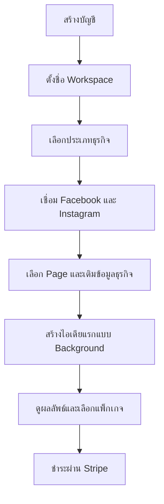

# Sprint 0A — G0 Readiness Report

**สถานะ:** Specification Baseline Complete / External Verification Pending  
**วันที่:** 30 สิงหาคม 2026  
**ผลิตภัณฑ์:** AI Content OS สำหรับ SME ไทย — Facebook + Instagram  
**Phase แรก:** Research → Analyze → Generate → Asset → Approve → Calendar → Publish

---

## 1. Executive Result

Sprint 0A จัดทำ baseline ที่พร้อมกระจายให้ Coding Agents หลายตัวแล้ว โดยยึดกฎต่อไปนี้:

- แบ่งงานตาม Role, Skill, Risk และ Tool access ไม่แบ่งตามชื่อ Codex หรือ Claude
- ทุก Work Package ต้องมี Author, Independent Reviewer และ Independent Tester
- งาน Critical ต้องเพิ่ม Security Reviewer และ Integration Owner
- Agent ที่มีส่วนเขียนงานห้ามอนุมัติงานของตัวเอง แม้จะสลับโมเดลภายหลัง
- Repository, versioned contracts, machine-readable work package, tests และ evidence เป็น Source of Truth
- สามารถเปลี่ยนหรือเพิ่ม AI model กลางงานได้ แต่ต้องบันทึก handoff/co-author และ contribution scope

เอกสารและ contract ภายในพร้อมสำหรับ Gate Review แต่ **G0 ยังไม่ถือว่าผ่าน** จนกว่าจะปิด external blockers และได้รับการอนุมัติจาก Product Owner ตามรายการในเอกสารนี้

---

## 2. Approved Lean Beta Direction

| เรื่อง | Baseline |
|---|---|
| Pilot industry | GoldenHome Built-in เป็น primary; Sarolux ใช้ high-risk evaluation |
| Channels | Facebook Page + Instagram Professional ผ่าน Meta |
| Workspace | หลาย User, หลาย Page/IG account และ Business Knowledge แยกราย Page |
| Approval | เปิด/ปิดได้; Maker → Approver |
| AI | Auto routing + BYOK หนึ่ง provider ใน Production Beta; provider อื่นอยู่หลัง feature flag |
| Media P0 | Image + carousel; video/Reel เปิดหลัง feasibility spike |
| Background work | Research/Analyze/Generate/Media processing ทำแบบ asynchronous พร้อม notification |
| Notifications | In-app + email; LINE เป็น P1 |
| Billing | Stripe Subscription เป็นหลัก; Hosted Checkout + Customer Portal; manual invoice เป็น fallback ที่ควบคุมได้ |
| Storage | Provider-neutral adapter; R2 เป็น primary candidate, metadata/manifest อยู่ Postgres |
| Onboarding | ภาษาไทย, mobile-first, click/select มากกว่าพิมพ์, skip/resume และ first value เป้าหมายไม่เกิน 10 นาที |
| Lead/ROI | Phase 2 ไม่อยู่ Critical Path ของ Production Beta แรก |
| Pilot size | Closed Pilot 5; Paid Beta ไม่เกิน 10 Workspaces ก่อน review |

---

## 3. Sprint 0A Artifact Status

| Deliverable | สถานะ | สิ่งที่พร้อมใช้ | สิ่งที่ยังต้องยืนยัน |
|---|---|---|---|
| Decision Register + Contract Catalog | Ready for review | Decisions, ownership, 37+ contracts, DAG, G0 tracker | Product Owner approval |
| Core ERD/RLS/Retention | Ready for review | ERD, migration registry, RLS matrix, retention/delete, DB-00 tests | Data/legal decisions 10 รายการ |
| Industry/Research Pack | Ready for review | Pack contract, Built-in candidate, skincare risk skeleton, fixtures/evals | Domain reviewer และแหล่งข้อมูลจริง |
| Quality Rubric/Golden Set | Ready for pilot annotation | Rubric 9 มิติ, hard blocks, 30 pilot cases, thresholds | Human annotation/adjudication จริง |
| Mobile Core Flow | Ready for prototype | IA, screen/state matrix, 10 flows, Thai copy, WCAG acceptance | Usability tests กับ SME จริง |
| Meta/Security/Ops | Partially verified | Test plan, threat model, PDPA, CI/SLO/DR contracts | Meta credentials, legal/accounting, restore evidence |
| Multi-agent Operating Model | Ready for approval | Capability routing, role profiles, work packages, evidence, handoff | Repository adoption/CI enforcement |
| Object Storage Lifecycle | Ready for implementation | UUID paths, provision/export/grace/purge, exact-key deletion, reconciliation | Provider pricing/config และ restore drill |
| Simple Onboarding | Ready for prototype | Mobile-first flow, skip/resume, multi-page knowledge, errors/analytics | Moderated usability tests |
| Stripe Billing | Ready for sandbox implementation | Checkout, Portal, signed webhook inbox, state machine, reconciliation/tests | Live Thai account, methods, tax/VAT/refund policy |

---

## 4. Skill-based Software Engineering Organization

| Function | Required strengths | Main responsibility | Must not do |
|---|---|---|---|
| Product Owner | SME workflow, prioritization, Thai UX | Scope, decision and acceptance | Approve technical risk without evidence |
| Architecture Owner | contracts, modularity, distributed systems | Freeze interfaces and ADRs | Own every implementation |
| Author | skill matching the package | Implement only allowed paths, tests and handoff | Self-approve |
| Peer Reviewer | same domain, independent context | Correctness, maintainability, contract compliance | Rewrite silently or approve own contribution |
| Security Reviewer | tenant isolation, secrets, webhook/storage security | Abuse cases and security evidence | Accept warnings without disposition |
| Independent Tester | API/E2E/fault/mobile/eval skill | Test black-box acceptance and regression | Treat Author tests as sufficient evidence |
| Integration Owner | dependency, migration and release skill | Merge order, contract compatibility, full slice | Merge failing or incomplete evidence |
| Release Owner | ops, rollback and incident response | Go/no-go and rollback readiness | Release external integrations marked UNVERIFIED |

### Model switching rule

Codex, Claude หรือ model อื่นรับบทใดก็ได้เมื่อ capability ตรงกับงาน ตัวอย่างเช่น Claude เป็น Author ของ AI workflow ในงานหนึ่ง และ Codex เป็น Author ของ background jobs ในอีกงานหนึ่งได้ หากสลับภายใน task เดียวต้องเพิ่มรายการ co-author/handoff; Reviewer และ Tester ยังต้องเป็น independent context ที่ไม่มี contribution ต่อ code path นั้น

---

## 5. First Implementation Assignment

| Package | Author skill | Reviewer skill | Tester skill | Extra owner | Dependency |
|---|---|---|---|---|---|
| REP-00 Repository bootstrap | Platform/monorepo | Architecture | CI reproducibility | Integration Owner | G0 approval |
| CON-00 Canonical contracts | API/schema | Contract architecture | Contract tests | Integration Owner | REP-00 |
| DB-00 Tenant foundation | Postgres/RLS | Data security | Cross-tenant/fault | Security Reviewer | CON-00 |
| STO-01 Storage adapter + paths | Object storage | Storage security | Isolation/lifecycle | Data Owner | DB-00 |
| JOB-00 Background job kernel | Durable jobs/idempotency | Distributed systems | Retry/duplicate/failure | SRE | CON-00 |
| UX-00 Onboarding prototype | Mobile React/Thai UX | UX/accessibility | Moderated mobile QA | Product Owner | CON-00 |
| BILL-00 Stripe sandbox | Stripe/backend | Billing/security | Webhook/reconciliation | Finance Owner | DB-00, CON-00 |
| META-00 Feasibility spike | Meta Graph API | Integration/security | External capability test | Release Owner | Credentials |
| RES-00 Research slice | Retrieval/evidence | Domain/AI safety | Golden Set evaluation | Quality Owner | CON-00, DB-00 |
| GEN-00 Generate slice | LLM structured output | Thai content quality | Model/cost/regression | Quality Owner | RES-00, JOB-00 |

แต่ละ Package ต้องมี agent IDs จริงใน manifest ก่อนเปลี่ยนสถานะจาก `Backlog` เป็น `Ready` และควรใช้ cross-vendor review สำหรับ DB/RLS, storage purge, Stripe webhook, BYOK secrets และ Meta publishing เมื่อมี agent ที่มีทักษะเหมาะสม

---

## 6. Object Storage Rules ที่เป็น Gate

1. Object key ใช้ UUID เท่านั้น ห้าม customer name, email, phone, page name หรือชื่อไฟล์ดิบ
2. Canonical hierarchy ต้องแยก environment → workspace → page → asset → version/variant
3. Database manifest เป็น Source of Truth; object listing ไม่ใช่ business index
4. Upload เข้า staging/quarantine ก่อน promote เป็น ready; derivative ทุกชิ้นอ้าง parent asset/version
5. Offboarding ใช้ Suspend → Export → Grace → Purge และหยุด purge ได้เมื่อมี legal hold
6. Production purge ใช้ approved immutable snapshot ของ exact object keys ห้าม recursive delete จาก prefix ที่รับจาก request
7. Deletion job ต้อง idempotent, resumable, audited และ reconcile กับ DB หลังจบ
8. Deduplication จำกัดภายใน workspace ใน Beta; ref-count ต้องเป็นศูนย์ก่อนลบ shared object
9. Signed URL อายุสั้น, private-by-default, จำกัด MIME/size และสแกนไฟล์ก่อนใช้งาน
10. มี quota, cost ledger, orphan scanner, restore drill และ monthly storage cost review

ตัวอย่าง logical key:

```text
prod/workspaces/{workspace_uuid}/pages/{page_uuid}/assets/{asset_uuid}/versions/{version_uuid}/original
prod/workspaces/{workspace_uuid}/pages/{page_uuid}/assets/{asset_uuid}/versions/{version_uuid}/variants/{variant_uuid}
```

ชื่อ provider และ bucket จริงเป็น configuration ห้ามรั่วเข้า domain contract

---

## 7. Simple Onboarding Gate

Onboarding ต้องใช้ progressive disclosure และตั้งค่าขั้นต่ำที่จำเป็นก่อน โดย flow หลักคือ:



- ทุกหน้ามีหนึ่ง primary action และข้อความภาษาไทยแบบไม่ใช้ศัพท์เทคนิค
- ใช้ card, preset, toggle และ checklist แทนช่องพิมพ์ยาว
- Team approval, BYOK, asset import และข้อมูลเชิงลึกเป็น optional setup ที่ skip/resume ได้
- Business Knowledge ต้องแยกราย Page แม้อยู่ Workspace เดียวกัน
- Meta permission denied/reconnect และ background job ต้องมี recovery ที่ผู้ใช้เข้าใจได้
- เป้าหมาย first useful content ไม่เกิน 10 นาที โดยไม่บังคับกรอกข้อมูลที่ไม่จำเป็น
- จ่ายเงินสำเร็จในหน้า browser ไม่ใช่ entitlement source of truth; รอ verified Stripe webhook

---

## 8. Stripe Billing Gate

- ใช้ Stripe Hosted Checkout เป็น Beta baseline; Embedded Checkout เป็น option หลัง usability/security review
- ใช้ Customer Portal สำหรับเปลี่ยนแพ็กเกจ, payment method และ cancel เพื่อลด custom billing UI
- ห้ามเก็บ card number, CVC หรือข้อมูลบัตรในระบบ
- Secret key และ webhook secret อยู่ฝั่ง server/secret manager เท่านั้น
- Webhook ต้องอ่าน raw body, verify signature, เก็บ event inbox และ enforce unique `stripe_event_id`
- Handler ต้องรองรับ duplicate, retry, out-of-order และ replay อย่างปลอดภัย
- Entitlement มาจาก local subscription projection ที่อัปเดตจาก verified events ไม่เชื่อ query string จาก success page
- Payment failure ใช้ grace policy ที่ Product Owner/Finance อนุมัติ; ห้าม purge data ทันทีเมื่อชำระไม่สำเร็จ
- มี daily reconciliation ระหว่าง Stripe กับ local ledger และ alert เมื่อ mismatch
- Refund, VAT/tax invoice และ live payment methods ของบัญชีไทยยังเป็น open decisions จนกว่าจะตรวจด้วยบัญชีจริงและผู้เชี่ยวชาญด้านบัญชี

---

## 9. G0 Gate Checklist

### Internal specification

- [x] Product scope และ Phase 1 non-goals ชัดเจน
- [x] Module/data/migration ownership มี registry
- [x] Core contracts และ dependency DAG มี baseline
- [x] Author/Reviewer/Tester separation ถูกกำหนด
- [x] RLS, deletion, storage purge และ webhook abuse cases มี test plan
- [x] Mobile onboarding และ core flow มี acceptance criteria
- [x] Quality rubric และ pilot Golden Set พร้อมสำหรับ annotation
- [x] Stripe sandbox implementation contract พร้อม
- [x] Object storage lifecycle/offboarding contract พร้อม

### Approval and external evidence

- [ ] Product Owner อนุมัติ DEC-01..16
- [x] Repository มี canonical guide, thin Codex/Claude adapters และ protected CI — ปิดเมื่อ 2026-09-02; หลักฐานและข้อจำกัดที่รู้ตัวอยู่ใน `evidence/g0-tracker-th.md`
- [ ] เลือก agent IDs ตาม capability benchmark และกรอกทุก Ready package
- [ ] Meta app, pages, IG accounts และ permissions ถูกทดสอบด้วย credentials จริง
- [ ] Stripe Thai account/sandbox, products/prices, webhook endpoint และ Portal ถูกทดสอบจริง
- [ ] Legal/PDPA และ accountant ยืนยัน retention, VAT, invoice, refund และ grace policy
- [ ] GoldenHome/Sarolux และ SME ภายนอกทำ onboarding usability test
- [ ] Qualified skincare reviewer ตรวจ claim rules/cases
- [ ] Storage provider pricing/config, export/purge และ restore drill มี evidence

**G0 pass rule:** ผ่านเมื่อรายการ internal specification ไม่ถอยหลัง, Product Owner อนุมัติ scope/contracts, external blocker ที่กระทบ P0 มีหลักฐานหรือ approved fallback และไม่มี Critical risk ที่ไม่มี owner/due gate

---

## 10. External Blockers and Stop Conditions

| Blocker | Owner | Safe work while waiting | Stop condition |
|---|---|---|---|
| Meta credentials/app review | Meta Integration Owner | Fake adapter, fixtures, contract tests | ห้ามเปิด publishing จริง |
| Stripe live Thai configuration | Billing Owner + Finance | Sandbox, test clocks, webhook replay | ห้ามขาย Paid Beta จริง |
| Legal/accounting review | Product Owner | Proposed policy + manual review | ห้ามสรุป tax/refund/retention เป็น final |
| SME usability participants | UX Research Owner | Prototype + internal heuristic review | ห้ามอ้างว่า onboarding ผ่านผู้ใช้จริง |
| Skincare domain reviewer | Quality Owner | Evaluation-only pack/hard block | ห้ามเปิด autonomous skincare publishing |
| Storage restore/purge evidence | SRE + Data Owner | Emulator/test bucket | ห้ามเปิด self-service permanent deletion |

---

## 11. Immediate Next Actions

1. Product Owner review และอนุมัติ DEC-01..16
2. Bootstrap repository พร้อม `ENGINEERING_AGENT_GUIDE.md`, `AGENTS.md`, `CLAUDE.md`, role profiles และ work-package schemas
3. ทำ capability benchmark แล้ว assign agent IDs ให้ REP-00, CON-00, DB-00, UX-00, STO-01 และ BILL-00
4. เปิด Stripe Sandbox, สร้าง Product/Price/Test Customer และทดสอบ signed webhook replay
5. เตรียม Meta test assets/credentials และรัน feasibility matrix โดยไม่ผูก Production customer data
6. ทำ onboarding clickable prototype และทดสอบกับผู้ใช้ไทย non-tech อย่างน้อย 5 คน
7. รัน workspace lifecycle drill: provision → upload → export → suspend → grace → purge → reconcile
8. ประชุม Gate G0 โดยใช้ evidence links และ risk disposition ไม่ใช้รายงานจากความจำของ Agent

---

## 12. Source Documents

- [Execution Master Plan](ai-content-os-execution-master-plan-th.md)
- [Decision Register + Contract Catalog](sprint-0a-decision-register-contract-catalog-th.md)
- [Core ERD/RLS/Retention](sprint-0a-core-erd-rls-retention-th.md)
- [Industry/Research Pack](sprint-0a-industry-research-pack-th.md)
- [Quality Rubric/Golden Set](sprint-0a-quality-rubric-golden-set-th.md)
- [Mobile Core Flow](sprint-0a-mobile-core-flow-spec-th.md)
- [Meta/Security/Commercial Readiness](sprint-0a-meta-security-commercial-readiness-th.md)
- [Multi-agent Operating Model](sprint-0a-multi-agent-engineering-operating-model-th.md)
- [Object Storage Lifecycle](sprint-0a-object-storage-lifecycle-contract-th.md)
- [Simple Onboarding Flow](sprint-0a-simple-onboarding-flow-th.md)
- [Stripe Billing Contract](sprint-0a-stripe-billing-contract-th.md)

