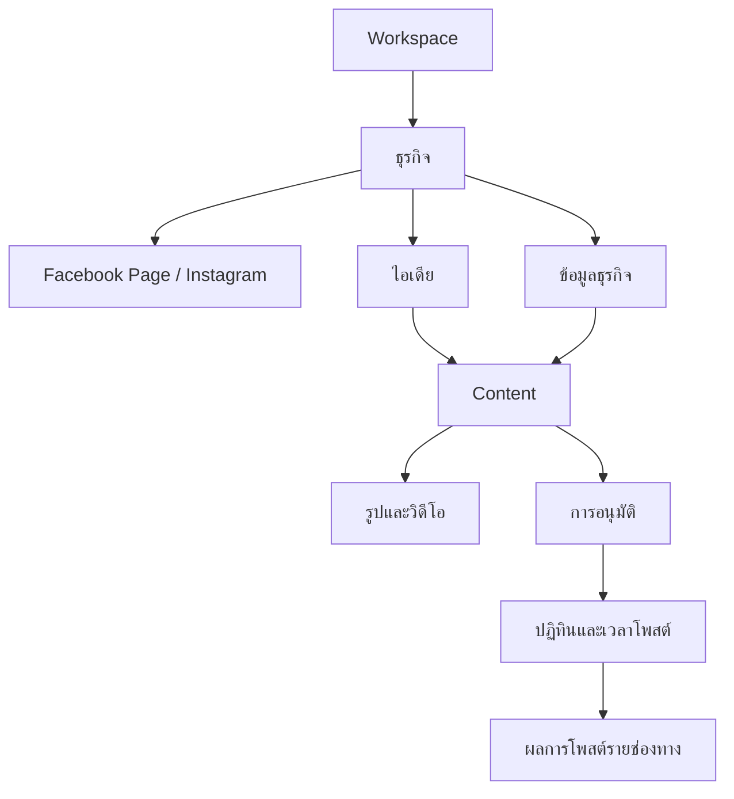
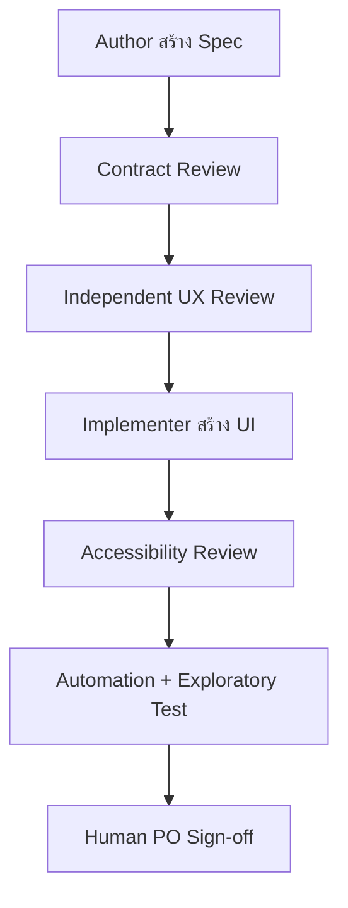

# Sprint 0A — Mobile Core Flow Specification

**ผลิตภัณฑ์:** AI Content OS สำหรับ SMEs ไทย  
**เอกสาร:** UX Execution Contract สำหรับ Mobile-first / Non-tech User  
**เวอร์ชัน:** 1.0  
**สถานะ:** Ready for independent UX review  
**เจ้าของงาน:** A4 Mobile UX & Design System  
**ขอบเขตหน้าจอ:** Onboarding, Meta Connect, Business Knowledge, Research, Generate, Asset, Approval, Calendar, Publish Status, Notifications และ Admin  
**อุปกรณ์หลัก:** โทรศัพท์หน้าจอกว้าง 360 px; รองรับขั้นต่ำ 320 px  

---

## 1. วัตถุประสงค์และคำจำกัดความของงานเสร็จ

เอกสารนี้เปลี่ยน Mobile UX จากหัวข้อระดับ Feature ให้เป็นสัญญางานที่ UX Designer, Frontend Engineer, Backend/Contract Owner, Reviewer และ Tester สามารถทำงานขนานกันได้โดยไม่สร้างกติกาของตนเอง

งาน Sprint 0A ถือว่าเสร็จเมื่อ:

1. Core flow ทุกขั้นมี Screen ID, เป้าหมาย, entry/exit, action, state และ recovery ครบ
2. ผู้ใช้ทำงานหลักบนมือถือ 360 px ได้ด้วยการแตะและเลือก โดยไม่ต้องเขียน Prompt
3. ทุกงาน AI, Research, Upload และ Publish ที่ใช้เวลานานออกจากหน้าได้และกลับมาต่อได้
4. ทุกหน้ารู้ว่าอยู่ใน Workspace, ธุรกิจ และ Page/IG ใด
5. Partial success แสดงผลรายช่องทางและไม่ชวนให้โพสต์ซ้ำ
6. Frontend ห้ามสร้าง Domain status เอง; ค่า state ต้องมาจาก Contract Owner
7. มี Acceptance criteria ที่ Reviewer และ Tester ใช้ตรวจโดยไม่ต้องตีความเพิ่ม

### 1.1 สิ่งที่ Sprint 0A ไม่ทำ

- ไม่สร้าง Visual Design แบบ production-final
- ไม่สร้างระบบลากวางเป็นวิธีเดียว
- ไม่เปิด Prompt, model, token, API key หรือ technical error ใน Core UI
- ไม่ตัดสิน Schema, Event หรือ Job state แทนเจ้าของ Contract
- ไม่ถือว่า Desktop เป็นหน้าหลักแล้วค่อยย่อให้มือถือ

---

## 2. ผู้ใช้หลักและงานที่ต้องสำเร็จ

| Persona | บริบท | งานสำคัญ | สิ่งที่กังวล | UX ที่ต้องตอบ |
|---|---|---|---|---|
| เจ้าของธุรกิจ | ใช้มือถือระหว่างทำงาน | เลือกไอเดีย, ตรวจโพสต์, อนุมัติ, ดูว่าโพสต์สำเร็จหรือไม่ | กลัว AI เขียนผิด, โพสต์ผิดเพจ, กดซ้ำ | Preview ชัด, Business/Page ชัด, action ยืนยันง่าย |
| ผู้ทำคอนเทนต์ | ทำงานหลายเพจ | Research, สร้าง, เลือกสื่อ, ตั้งเวลา, ส่งหัวหน้าตรวจ | งานหาย, AI ช้า, แก้แล้วทับของเดิม | Autosave, background job, version, notification |
| ผู้อนุมัติ | เข้ามาเป็นช่วงสั้น ๆ | อ่าน FB/IG variant, ดูรูป, อนุมัติหรือขอแก้ | ไม่รู้ว่าต้องดูอะไร, comment ยาว | จุดที่ควรปรับ, quick reason, one-hand action |
| Workspace Admin | ตั้งค่าช่วงเริ่มใช้ | เพิ่มธุรกิจ, เชื่อมหลายเพจ, เชิญทีม, เปิด approval | กลัวตั้งค่าผิดและข้อมูลข้ามธุรกิจ | Guided setup, task-based role, safe default |
| ผู้ดูอย่างเดียว | ดูปฏิทิน/สถานะ | ตรวจแผนและผลโพสต์ | เผลอแก้งาน | Read-only state และ action ที่ถูกซ่อนตามสิทธิ์ |

---

## 3. UX Product Contract v1

กฎส่วนนี้เป็น Merge Gate ถ้าหน้าจอใดฝ่าฝืนให้ Reviewer ปฏิเสธการ Merge

### 3.1 Click-first และพิมพ์ให้น้อยที่สุด

1. หลังจบ Onboarding งานหลักต้องไม่มีช่องข้อความบังคับ
2. ใช้ Card, Chip, Preset, Import และ Suggested default ก่อน Text input
3. ช่อง “รายละเอียดเพิ่มเติม” เป็น optional และพับไว้
4. การแก้ Content ใช้ Quick action ก่อน เช่น “สั้นลง”, “เป็นกันเองขึ้น”, “ขายน้อยลง”, “เน้นจุดเด่น”, “เปลี่ยนคำชวน”
5. ช่อง Search ใช้ได้แต่ห้ามเป็นทางเดียวในการหาข้อมูล
6. ค่าเริ่มต้นต้องปลอดภัย เช่น approval เปิดเมื่อมีผู้อนุมัติ, publish ต้องผ่าน preview

### 3.2 Mobile-first

1. กว้างขั้นต่ำ 320 px; acceptance หลักที่ 360 px
2. Touch target อย่างน้อย 44×44 px; ระยะระหว่าง action เสี่ยงอย่างน้อย 8 px
3. Primary action อยู่ในระยะนิ้วโป้งและไม่ชน safe area
4. ใช้ Bottom navigation ไม่เกิน 5 รายการ
5. ห้ามพึ่ง hover, right-click, drag หรือ horizontal table
6. Calendar บนมือถือเปิด Agenda เป็นค่าเริ่มต้นและมีปุ่มเปลี่ยนวันแทน drag-only
7. Keyboard เปิดแล้วต้องไม่บัง field, error หรือ primary action

### 3.3 Context safety

1. App bar แสดงชื่อธุรกิจ และเมื่อเกี่ยวข้องให้แสดง Page/IG เป้าหมาย
2. เปลี่ยนธุรกิจแล้ว list, filter, selection และ draft context ต้อง reset หรือยืนยันตาม Contract
3. ก่อน Generate, Approval, Schedule และ Publish ต้องเห็น target accounts
4. Deep link ต้องตรวจ Workspace/Business permission ก่อนแสดงข้อมูล
5. หากเปิดลิงก์ผิดสิทธิ์ ให้บอกวิธีติดต่อ Admin โดยไม่เปิดเผยชื่อข้อมูลที่ไม่มีสิทธิ์

### 3.4 งานเบื้องหลัง

1. Research, Generate, Analyze, Upload processing และ Publish เป็น background job
2. หน้ารอใช้ข้อความ “ออกจากหน้านี้ได้ เราจะแจ้งเมื่อเสร็จ”
3. งานต้องปรากฏในหน้าแรก, ศูนย์งาน หรือแจ้งเตือนตามความสำคัญ
4. Retry ต้อง idempotent และ UI ปิดปุ่มซ้ำระหว่างกำลังส่งคำขอ
5. ผู้ใช้ต้องกลับไปผลลัพธ์สำเร็จได้ไม่เกิน 2 taps จาก Notification

### 3.5 Progressive disclosure

- Core settings: ธุรกิจ, เพจ, ทีม, การอนุมัติ, การแจ้งเตือน
- Advanced settings: BYOK, provider/model, raw usage, integration diagnostics
- ผู้ใช้ทั่วไปไม่เห็นคำว่า API, token, queue, webhook, model ID, RLS หรือ storage key

---

## 4. Information Architecture

### 4.1 Navigation หลักบนมือถือ

| ตำแหน่ง | Label | หน้าที่ | Badge |
|---|---|---|---|
| 1 | หน้าแรก | งานวันนี้, งานรอตรวจ, background job, next action | จำนวนงานต้องทำ |
| 2 | สร้าง | ไอเดีย, สร้างใหม่, วิเคราะห์โพสต์เดิม | ไม่มีหรือสถานะ draft |
| 3 | ปฏิทิน | Agenda, schedule, published, failed | จำนวนที่ต้องแก้ |
| 4 | คลังสื่อ | รูป, วิดีโอ, upload, processing, rights | processing/rights warning |
| 5 | เพิ่มเติม | ธุรกิจและเพจ, ทีม, แจ้งเตือน, แพ็กเกจ, ช่วยเหลือ, Admin | warning เฉพาะจำเป็น |

Bottom navigation แสดง label เสมอ ห้ามใช้ icon อย่างเดียว

### 4.2 Object map

### 4.3 Sitemap

| กลุ่ม | เส้นทาง | Screen family |
|---|---|---|
| Entry | Login → Invite/Workspace → Onboarding | AUTH, ONB |
| Setup | Business → Meta Connect → Knowledge starter → Team/Approval | BIZ, META, KNW, TEAM |
| Discover | หน้าแรก → ไอเดีย → รายละเอียด/หลักฐาน → ใช้ไอเดีย | HOME, IDEA |
| Create | เป้าหมาย → รูปแบบ → สื่อ/เวลา → Generate → Editor → Quality | CREATE, EDIT, QUALITY |
| Review | ส่งตรวจ → Approval inbox → Preview → Approve/Request changes | APPROVE |
| Deliver | Schedule → Calendar → Publish status → Retry/Reconnect | CAL, PUB |
| Support | Notifications → Job detail → Settings/Help | NOTI, JOB, ADMIN |

### 4.4 Entry rules

- Owner/Admin ครั้งแรก: ONB → META → KNW starter → HOME
- Content maker ที่รับ Invite: AUTH → accept invite → HOME ของธุรกิจที่ได้รับสิทธิ์
- Approver ผ่าน notification: AUTH เมื่อจำเป็น → APPROVE detail
- Deep link publish fail: PUB detail โดย pin Business/Page จากผลลัพธ์
- กลับเข้าแอป: เปิด context ล่าสุดเฉพาะเมื่อยังมีสิทธิ์ มิฉะนั้นเปิด context chooser

---

## 5. Global Screen Anatomy ที่ 360 px

| Zone | ขนาด/พฤติกรรม | เนื้อหา |
|---|---|---|
| System/safe area | ตามอุปกรณ์ | ห้ามวาง action สำคัญทับ |
| App bar | สูงประมาณ 56 px | Back/menu, ชื่อหน้า, Business/Page switcher แบบเห็นชื่อ |
| Context strip | 36–44 px เมื่อจำเป็น | Page/IG targets หรือ warning; ซ่อนได้เมื่อ scroll แต่กลับมาเมื่อ primary action |
| Main content | 16 px side padding; 12–16 px gap | Card/list แบบหนึ่งคอลัมน์; Asset grid สองคอลัมน์ได้ |
| Sticky action | 64–80 px + safe area | Primary 1 ปุ่ม; secondary เป็น text/button ที่ไม่แข่งกัน |
| Bottom navigation | ประมาณ 64 px + safe area | 5 รายการ; ซ่อนเฉพาะ immersive selection/preview และมีทางกลับ |

Typography baseline:

- หัวหน้าหลัก 22–24 px, 2 บรรทัดสูงสุด
- หัวการ์ด 16–18 px
- Body 15–16 px; ห้ามต่ำกว่า 14 px สำหรับข้อมูลหลัก
- Status ไม่สื่อด้วยสีอย่างเดียว ต้องมี icon และข้อความ
- ข้อความไทยยาวต้อง wrap; ห้าม ellipsis กับ error, permission หรือ target account

---

## 6. Complete Core Screen Inventory

### 6.1 Onboarding และ Workspace

| ID | หน้าจอ | เป้าหมาย | Primary action | Exit/ผลลัพธ์ |
|---|---|---|---|---|
| AUTH-01 | เข้าใช้งาน | รับ Email/OTP | ส่งรหัสเข้าใช้งาน | AUTH-02 |
| AUTH-02 | กรอกรหัส | ยืนยันตัวตน | เข้าใช้งาน | Return path/ONB-01 |
| ONB-01 | ยินดีต้อนรับ | อธิบายผลลัพธ์ 3 ข้อ | เริ่มตั้งค่า | ONB-02 |
| ONB-02 | สร้าง Workspace | ตั้งชื่อพื้นที่ทีม | ใช้ชื่อนี้ | ONB-03 |
| ONB-03 | เลือกประเภทธุรกิจ | เลือก Industry Pack | เลือกประเภท | ONB-04 |
| ONB-04 | เพิ่มธุรกิจ | ชื่อและพื้นที่บริการ | เพิ่มธุรกิจ | ONB-05 |
| ONB-05 | เป้าหมายหลัก | เลือก awareness/ขาย/ความรู้/รีวิว | ต่อไป | META-01 |
| ONB-06 | รูปแบบทีม | ทำคนเดียว/มีผู้ตรวจ | ใช้รูปแบบนี้ | TEAM setup/KNW-01 |
| ONB-07 | พร้อมเริ่ม | สรุปสถานะ setup | ไปหน้าแรก | HOME-01 |

### 6.2 Meta Connect

| ID | หน้าจอ | เป้าหมาย | Primary action | Recovery |
|---|---|---|---|---|
| META-01 | ประโยชน์การเชื่อม | อธิบายสิ่งที่ระบบทำ/ไม่ทำ | เชื่อม Facebook และ Instagram | ลองภายหลัง |
| META-02 | Permission primer | ภาษาคนอธิบายสิทธิ์ | ดำเนินการต่อกับ Meta | กลับ |
| META-03 | Redirect/return | แสดงว่ากำลังกลับเข้าแอป | อัตโนมัติ | ลองใหม่ |
| META-04 | เลือก Facebook Pages | เลือกหลายเพจ | ใช้เพจที่เลือก | reconnect/help |
| META-05 | จับคู่ Instagram | เลือก IG ต่อ Page | บันทึกการจับคู่ | ใช้ FB อย่างเดียว |
| META-06 | จับคู่ธุรกิจ | Page/IG อยู่ใต้ Business ใด | ยืนยัน | สร้างธุรกิจใหม่ |
| META-07 | ตรวจความพร้อม | capability ต่อ channel | แก้รายการ/เสร็จสิ้น | reconnect account |
| META-08 | Connection detail | token health ภาษาคน | เชื่อมใหม่/ยกเลิก | support |

### 6.3 Business Knowledge

| ID | หน้าจอ | เป้าหมาย | Primary action | หมายเหตุ |
|---|---|---|---|---|
| KNW-01 | เริ่มข้อมูลธุรกิจ | เลือกวิธีเพิ่มข้อมูล | ดึงจากเพจ/เว็บไซต์ หรือเลือกเอง | ไม่บังคับพิมพ์ |
| KNW-02 | เลือกแหล่งข้อมูล | FB/IG/website/assets | ดึงข้อมูล | consent ชัด |
| KNW-03 | กำลังเตรียม | background import | ไปทำอย่างอื่น | notification เมื่อเสร็จ |
| KNW-04 | ตรวจข้อมูลที่พบ | เลือกรับ/ไม่รับเป็น card | บันทึกสิ่งที่เลือก | provenance visible |
| KNW-05 | สินค้า/บริการ | เลือกและจัดลำดับ | บันทึก | optional add text |
| KNW-06 | ลูกค้าหลัก | persona chips/cards | บันทึก | suggested by industry |
| KNW-07 | จุดเด่น/น้ำเสียง | preset cards | บันทึก | preview sample |
| KNW-08 | คำที่ใช้/หลีกเลี่ยง | suggestions + toggle | บันทึก | claim-safe pack |
| KNW-09 | ความพร้อมของข้อมูล | บอก “ควรเติมอะไร” | เติมตอนนี้/ภายหลัง | ไม่ใช้คะแนนลอย ๆ |
| KNW-10 | ประวัติ/ความขัดแย้ง | เลือก version/current truth | ใช้ข้อมูลนี้ | audit trail |

### 6.4 Research และ Suggestions

| ID | หน้าจอ | เป้าหมาย | Primary action | Recovery |
|---|---|---|---|---|
| IDEA-01 | ไอเดียที่เหมาะกับธุรกิจคุณ | ดู suggestion cards | เลือกไอเดีย | สร้างชุดใหม่ |
| IDEA-02 | Filter | เป้าหมาย/หมวด/ช่วงเวลา | ดูผลลัพธ์ | ล้าง filter |
| IDEA-03 | Idea detail | เหตุผล, กลุ่มลูกค้า, freshness | ใช้ไอเดียนี้ | บันทึก/ไม่สนใจ |
| IDEA-04 | แหล่งอ้างอิง | ดูหลักฐานแบบย่อ | กลับไปใช้ไอเดีย | report issue |
| IDEA-05 | เลือกเหตุผลไม่สนใจ | ปรับ suggestion | ยืนยัน | ย้อนกลับ |
| IDEA-06 | ขอไอเดียใหม่ | เลือกเป้าหมาย/จำนวน | เริ่มค้นหา | cancel safe |
| IDEA-07 | Research progress | background status | ไปทำอย่างอื่น | job detail |
| IDEA-08 | Research partial | บางแหล่งใช้ไม่ได้ | ใช้ผลที่มี/ลองใหม่ | source-specific retry |
| IDEA-09 | Saved ideas | กลับมาใช้ภายหลัง | ใช้ไอเดีย | remove save |

### 6.5 Generate, Edit และ Quality

| ID | หน้าจอ | เป้าหมาย | Primary action | หมายเหตุ |
|---|---|---|---|---|
| CREATE-01 | เลือกธุรกิจ/เพจ | pin context | ต่อไป | required |
| CREATE-02 | เลือกเป้าหมาย/ไอเดีย | card selection | ต่อไป | prefilled from IDEA |
| CREATE-03 | เลือกรูปแบบ | post/carousel/video เมื่อเปิด | ต่อไป | capability filtered |
| CREATE-04 | เลือกน้ำเสียง | brand preset | ต่อไป | preview phrases |
| CREATE-05 | เลือกสื่อ | เลือกเดี๋ยวนี้/ภายหลัง | ต่อไป | Asset picker |
| CREATE-06 | วันเวลา | ตอนนี้/เลือกภายหลัง/เลือกเวลา | ตรวจสรุป | no drag |
| CREATE-07 | สรุปก่อนสร้าง | target, goal, type, media intent | สร้างโพสต์ | optional details collapsed |
| CREATE-08 | กำลังสร้าง | background generation | ไปทำอย่างอื่น | notification |
| CREATE-09 | Generation result | เปิด draft | ตรวจและปรับ | failed recovery |
| EDIT-01 | Content editor | อ่าน/แก้ caption | บันทึกอัตโนมัติ | platform tabs |
| EDIT-02 | Quick refine | action chips | ใช้เวอร์ชันใหม่ | undo/version |
| EDIT-03 | FB preview | ตรวจรูปแบบ Facebook | กลับ/ส่งตรวจ | target visible |
| EDIT-04 | IG preview | ตรวจรูปแบบ Instagram | กลับ/ส่งตรวจ | truncation warning |
| QUALITY-01 | จุดที่ควรปรับก่อนโพสต์ | issue list + why | แก้ทีละข้อ | no unexplained score |
| QUALITY-02 | Claim/evidence detail | trace knowledge/evidence | ใช้คำแนะนำ | hard block |
| QUALITY-03 | Passed | พร้อมส่งตรวจ/ตั้งเวลา | ส่งตรวจ/ตั้งเวลา | approval toggle aware |

### 6.6 Asset Library

| ID | หน้าจอ | เป้าหมาย | Primary action | Recovery |
|---|---|---|---|---|
| ASSET-01 | คลังรูปและวิดีโอ | browse/filter | เพิ่มรูปหรือวิดีโอ | empty starter |
| ASSET-02 | เพิ่มไฟล์ | ถ่าย/เลือกจากเครื่อง | เลือกไฟล์ | permission help |
| ASSET-03 | ตรวจไฟล์ก่อนส่ง | จำนวน/ขนาด/หมวด | เริ่มอัปโหลด | remove invalid |
| ASSET-04 | Upload progress | per-file progress | ไปทำอย่างอื่น | retry failed file |
| ASSET-05 | Processing | thumbnail/format/scan | ไปทำอย่างอื่น | notification |
| ASSET-06 | Asset picker | เลือก version ให้ content | ใช้ไฟล์ที่เลือก | clear selection |
| ASSET-07 | Asset detail | preview, rights, used-by | ใช้กับโพสต์ | replace version |
| ASSET-08 | สิทธิ์การใช้ | expiry/proof/allowed usage | บันทึก | block expired |
| ASSET-09 | Collection | จัดกลุ่ม | เพิ่มเข้า collection | remove |
| ASSET-10 | Used by | ดู content ที่ใช้ | เปิดโพสต์ | permission safe |
| ASSET-11 | Replace/version | upload new version | ใช้เวอร์ชันใหม่ | old content pinned |
| ASSET-12 | Trash | soft-deleted assets | กู้คืน | delete permanently admin only |
| ASSET-13 | Storage warning | quota friendly | ลบไฟล์ไม่ใช้/เพิ่มพื้นที่ | no raw bytes only |

### 6.7 Approval

| ID | หน้าจอ | เป้าหมาย | Primary action | Recovery |
|---|---|---|---|---|
| APPROVE-01 | ส่งให้ตรวจ | เลือก approver, due | ส่งตรวจ | approval-off bypass |
| APPROVE-02 | งานรอตรวจ | inbox by urgency/business | เปิดตรวจ | empty state |
| APPROVE-03 | Preview รวม | caption/media/targets/time | อนุมัติ | request changes |
| APPROVE-04 | Facebook preview | channel-specific | อนุมัติ | switch IG |
| APPROVE-05 | Instagram preview | channel-specific | อนุมัติ | switch FB |
| APPROVE-06 | จุดควรดู | quality/claim/change summary | รับทราบ | hard block prevents approve |
| APPROVE-07 | ขอแก้ | quick reasons + optional note | ส่งกลับแก้ | cancel |
| APPROVE-08 | Approved | show version/time | ดูปฏิทิน | edit invalidation warning |
| APPROVE-09 | Approval invalidated | content changed after approval | ส่งตรวจใหม่ | compare versions |

### 6.8 Calendar และ Publish

| ID | หน้าจอ | เป้าหมาย | Primary action | Recovery |
|---|---|---|---|---|
| CAL-01 | Agenda | ดูวันนี้/สัปดาห์ | เพิ่มโพสต์ | filter |
| CAL-02 | Week/Month | overview | เปิดรายการ | list alternative |
| CAL-03 | เลือกวันเวลา | Asia/Bangkok | ใช้เวลานี้ | suggested slots |
| CAL-04 | Schedule summary | targets/version/time | ยืนยันตั้งเวลา | edit |
| CAL-05 | Conflict | เวลา/บัญชีชน | ใช้เวลาแนะนำ | keep with confirm |
| CAL-06 | Move item | change picker | ย้ายเวลา | cancel |
| CAL-07 | Cancel schedule | consequence | ยืนยันยกเลิก | back |
| CAL-08 | Calendar filter | business/page/status | ดูผล | reset |
| CAL-09 | Empty calendar | first action | สร้างโพสต์ | use saved idea |
| CAL-10 | Item detail | status/version/targets | edit allowed action | permission aware |
| PUB-01 | ก่อนโพสต์ | final target/time | ยืนยัน | back |
| PUB-02 | กำลังโพสต์ | per-channel progress | ออกจากหน้าได้ | disable duplicate |
| PUB-03 | สำเร็จทุกช่องทาง | live links | ดูโพสต์ | open calendar |
| PUB-04 | สำเร็จบางช่องทาง | separate success/fail | ลองใหม่เฉพาะที่ไม่สำเร็จ | reconnect |
| PUB-05 | ไม่สำเร็จ | friendly cause | ลองใหม่ | edit/reconnect/support |
| PUB-06 | ต้องเชื่อมใหม่ | expired permission | เชื่อมบัญชีใหม่ | notify admin |
| PUB-07 | Media rejected | explain format | เปลี่ยนสื่อ | keep content |
| PUB-08 | Retry confirmation | failed channels only | ลองโพสต์อีกครั้ง | cancel |
| PUB-09 | Live detail | external IDs/links hidden behind detail | เปิดบน FB/IG | archive |
| PUB-10 | Cancelled/expired | next action | ตั้งเวลาใหม่ | duplicate-safe |

### 6.9 Notifications, Job Center และ Admin

| ID | หน้าจอ | เป้าหมาย | Primary action | หมายเหตุ |
|---|---|---|---|---|
| NOTI-01 | แจ้งเตือน | grouped action feed | เปิดรายการ | unread count |
| NOTI-02 | Notification detail | context and next action | ดำเนินการ | safe deep link |
| NOTI-03 | Preferences | in-app/email choices | บันทึก | critical cannot fully mute |
| NOTI-04 | Empty | explain future notices | กลับหน้าแรก | — |
| JOB-01 | งานที่ระบบกำลังทำ | current/history | เปิดรายละเอียด | filters |
| JOB-02 | Job detail | stage, started, next action | cancel/retry when safe | no raw queue terms |
| JOB-03 | Job failed | friendly reason | ลองใหม่ | support reference |
| ADMIN-01 | ธุรกิจและเพจ | list/context | เพิ่ม/แก้ | role gated |
| ADMIN-02 | สมาชิกและบทบาท | task-based permissions | เชิญสมาชิก | revoke confirm |
| ADMIN-03 | การอนุมัติ | on/off + approver | บันทึก | impact summary |
| ADMIN-04 | การแจ้งเตือน | workspace defaults | บันทึก | personal override |
| ADMIN-05 | AI ขั้นสูง | Auto/BYOK | บันทึก | admin only |
| ADMIN-06 | แพ็กเกจและการใช้งาน | human units | จัดการแพ็กเกจ | no infra jargon |
| ADMIN-07 | ช่วยเหลือ | FAQ/report issue | แจ้งปัญหา | consent diagnostics |

---

## 7. Global State Model และ State Matrix

### 7.1 State definitions

| UI state | ความหมาย | สิ่งที่ต้องแสดง | สิ่งที่ห้าม |
|---|---|---|---|
| Empty | ยังไม่มีข้อมูลหรือผลค้นหา | เหตุผล + action แรก + ตัวอย่างสั้น | หน้าขาว, “No data” |
| Loading | รอข้อมูลสั้น ๆ | skeleton ตามโครงจริง; label เมื่อเกิน 1 วินาที | spinner ทั้งหน้าต่อเนื่องโดยไม่อธิบาย |
| Background | งานยาวและออกจากหน้าได้ | ชื่องาน, stage ภาษาคน, ออกจากหน้าได้, notification | lock หน้าหรือบังคับรอ |
| Partial | บางรายการ/ช่องทางสำเร็จ | แยก success/fail ชัด + retry เฉพาะ failed | สรุปทั้งหมดว่า fail หรือกด retry ทั้งหมด |
| Success | งานสำเร็จ | ผลลัพธ์ + next best action + deep link | toast อย่างเดียวสำหรับงานสำคัญ |
| Error | ทำไม่สำเร็จ | เกิดอะไร + กระทบอะไร + action ที่ปลอดภัย | raw code/stack/provider message |
| Recovery | ผู้ใช้กลับมาทำต่อ | state เดิม, งานที่ค้าง, safe retry/reconnect/edit | เริ่ม flow ใหม่โดยไม่จำเป็น |

### 7.2 State matrix ราย Flow

| Flow | Empty | Loading | Background | Partial | Success | Error | Recovery |
|---|---|---|---|---|---|---|---|
| Onboarding | ไม่มีธุรกิจ → “เพิ่มธุรกิจแรก” | ตรวจ invite/session | import knowledge ต่อเบื้องหลัง | Meta ได้บางบัญชี | setup summary | OTP/invite/permission ไม่สำเร็จ | กลับ step ล่าสุดพร้อมค่าที่กรอก |
| Meta Connect | ยังไม่เชื่อม → benefit card | กำลังรับข้อมูลจาก Meta | capability check | FB ได้แต่ IG ไม่ได้/บาง Page ขาดสิทธิ์ | แสดง Page/IG ที่พร้อม | login cancelled/permission/account issue | reconnect เฉพาะ account; preserve mapping |
| Knowledge | ยังไม่มีข้อมูล → starter choices | โหลด suggestions | import/analyze website | รับข้อมูลได้บางแหล่ง | summary + next missing item | URL/source unavailable | ใช้สิ่งที่ได้และ retry source |
| Research | ไม่มี suggestion/filter no result | skeleton cards | research job | บาง source unavailable | idea cards + freshness | ทุก source fail/timeout | retry or adjust goal; saved ideas remain |
| Generate | draft ยังไม่มี | โหลด options | generation job | FB variant ready, IG pending | open editable version | provider/quota/validation fail | retry same request id or choose safe option |
| Asset | ไม่มีสื่อ → upload starter | thumbnail grid skeleton | upload/processing | บางไฟล์สำเร็จ | assets selectable | permission/network/format/rights | retry failed file only; uploaded stay |
| Approval | ไม่มีงานรอตรวจ | preview skeleton | quality recheck | approved some targets is forbidden unless contract supports | approved pinned version | permission/hard block | request changes/re-submit after edit |
| Calendar | ไม่มีโพสต์ → create CTA | agenda skeleton | schedule job when needed | multi-channel schedule partially accepted | item appears with status | conflict/past time/permission | choose suggested time or retry failed target |
| Publish | ไม่มี scheduled item | load target snapshot | per-channel publish | FB success/IG fail | live links per channel | token/media/platform failure | retry failed only/reconnect/change media |
| Notifications | ไม่มีแจ้งเตือน | grouped skeleton | not applicable | batch mark read partial | deep link opens correct item | stale/deleted/no permission | explain and route to safe parent screen |
| Admin | no team/connection | load settings | key validation/import | provider/account partially ready | saved with audit | permission/validation | revert unsaved or retry safe operation |

### 7.3 Global state copy pattern

ทุกข้อความสถานะต้องตอบ 3 คำถามตามลำดับ:

1. เกิดอะไรขึ้น
2. งานของผู้ใช้ได้รับผลอย่างไร
3. ทำอะไรต่อได้

ตัวอย่าง: “Instagram ยังโพสต์ไม่สำเร็จ แต่ Facebook โพสต์แล้ว คุณลอง Instagram อีกครั้งได้โดยไม่กระทบโพสต์บน Facebook”

---

## 8. 360 px Wireframe Specifications

ข้อกำหนดทั้งหมดเป็นโครงสำหรับ Prototype และ Frontend fixture ห้ามเพิ่ม field/action ที่ไม่มีใน Screen inventory โดยไม่แก้เอกสารและ Contract ก่อน

### WF-01 Onboarding: ตั้งค่าธุรกิจ

| ลำดับบนลงล่าง | องค์ประกอบ | พฤติกรรม |
|---|---|---|
| 1 | App bar: “เริ่มต้นใช้งาน” + “ขั้นที่ 2 จาก 5” | ไม่มี hamburger ลดความสับสน |
| 2 | Heading: “ธุรกิจของคุณทำเกี่ยวกับอะไร” | ไม่ใช้คำว่า Industry Pack |
| 3 | Search optional | ไม่ focus keyboard อัตโนมัติ |
| 4 | Card list 1 คอลัมน์: ตกแต่งบ้าน, ความงาม, ร้านอาหาร, อื่น ๆ | แต่ละ card สูง ≥56 px; เลือกได้หนึ่ง |
| 5 | Helper: “ระบบจะใช้ข้อมูลนี้เพื่อแนะนำไอเดียให้ตรงธุรกิจ” | wrap ได้ |
| 6 | Sticky primary: “เลือกประเภทนี้” | disabled พร้อมเหตุผลจนเลือก |

Acceptance: เลือกประเภทและไปต่อ ≤2 taps; ไม่มี prompt; back แล้วค่าเดิมอยู่

### WF-02 Meta Connect: เลือกหลายเพจ

| ลำดับ | องค์ประกอบ | พฤติกรรม |
|---|---|---|
| 1 | App bar + Business chip | ชื่อธุรกิจมองเห็นตลอด |
| 2 | Heading “เลือกเพจที่ต้องการใช้” | subcopy บอกเลือกได้หลายเพจ |
| 3 | Account status banner | “เชื่อมกับบัญชี … แล้ว” + เปลี่ยนบัญชี |
| 4 | Page cards | รูป, ชื่อ Page, linked IG, checkbox, capability warning |
| 5 | Inline partial warning | อยู่ใต้ Page ที่มีปัญหา; action “ดูวิธีแก้” |
| 6 | Sticky summary/action | “เลือกแล้ว 3 เพจ” + “ใช้เพจที่เลือก” |

Acceptance: Page/IG ไม่ถูกตัดชื่อจนแยกไม่ออก; retry account ไม่ล้าง selection ที่ยัง valid

### WF-03 Knowledge Starter

| ลำดับ | องค์ประกอบ | พฤติกรรม |
|---|---|---|
| 1 | App bar + Business/Page | Page override ชัด |
| 2 | Heading “ช่วยให้ระบบรู้จักธุรกิจคุณ” | บอกใช้เวลาประมาณ 3 นาที |
| 3 | Recommended card “ดึงข้อมูลจาก Facebook/Instagram” | primary recommended |
| 4 | Secondary cards “ดึงจากเว็บไซต์”, “เลือกข้อมูลเอง” | มี privacy helper |
| 5 | Completeness task list | ใช้ “เติมแล้ว/ควรเติม” ไม่ใช้คะแนน AI |
| 6 | Sticky action | ตาม card ที่เลือก |

Acceptance: ผู้ใช้ข้าม optional ได้; import มี preview ก่อนบันทึก

### WF-04 Research: ไอเดียที่เหมาะกับธุรกิจ

| ลำดับ | องค์ประกอบ | พฤติกรรม |
|---|---|---|
| 1 | App bar + Business/Page switcher | เปลี่ยน context reset list |
| 2 | Heading + action “หาไอเดียใหม่” | action ไม่ใช้คำ Research |
| 3 | Horizontal filter chips | scroll chips ได้แต่ไม่มีข้อมูลสำคัญซ่อนเฉพาะแนวนอน |
| 4 | Idea cards 1 คอลัมน์ | หัวข้อ, เป้าหมาย, เหตุผล, ความใหม่, save |
| 5 | Background job card เมื่อกำลังหา | “ออกจากหน้านี้ได้” + ดูงาน |
| 6 | Bottom nav | สร้าง selected เมื่ออยู่ใน flow |

Acceptance: แต่ละไอเดียมี “ทำไมเหมาะ”; evidence detail ไม่เกะกะแต่เปิดดูได้

### WF-05 Generate: 3 Decision Stages

**Stage 1 — ธุรกิจ/เพจและเป้าหมาย**

- App bar แสดง “สร้างโพสต์” และ progress 1/3
- Target account cards เลือก FB/IG พร้อม preview avatar/name
- Goal cards: ให้ความรู้, แนะนำบริการ, รีวิว, กระตุ้นการติดต่อ
- Sticky “ต่อไป”

**Stage 2 — แนวคิดและรูปแบบ**

- Idea card ที่มาจาก Research ถูก pin ด้านบน
- Content format cards เฉพาะ capability ที่รองรับ
- Tone chips จาก Business Knowledge
- “รายละเอียดเพิ่มเติม” พับไว้และ optional

**Stage 3 — สื่อและเวลา**

- Asset selection card: เลือกจากคลัง / เพิ่มใหม่ / เลือกภายหลัง
- Timing cards: ยังไม่ตั้งเวลา / เวลาแนะนำ / เลือกเวลา
- Summary card และ target accounts
- Sticky “สร้างโพสต์” ป้องกัน double tap

**Background result**

- แสดง animation/progress แบบไม่หลอกเปอร์เซ็นต์
- ข้อความ “กำลังเตรียมโพสต์ให้คุณ ปิดหน้านี้ได้”
- Actions: “ไปทำอย่างอื่น” และ “ดูสถานะงาน”

Acceptance: ไม่มี required free text; generate request มีหนึ่ง result/job ต่อ idempotency key

### WF-06 Asset Library และ Upload

| ลำดับ | องค์ประกอบ | พฤติกรรม |
|---|---|---|
| 1 | App bar “คลังรูปและวิดีโอ” + Business | scope ชัด |
| 2 | Search + filter button | filter sheet; search optional |
| 3 | Category chips | ทั้งหมด, ผลงาน, สินค้า, รีวิว, ทีม, วิดีโอ |
| 4 | Media grid 2 คอลัมน์ | aspect safe thumbnail, type, processing/rights badge |
| 5 | Floating/sticky “เพิ่มรูปหรือวิดีโอ” | เปิด action sheet ถ่าย/เลือกจากเครื่อง |
| 6 | Bottom nav | active คลังสื่อ |

Upload progress ใช้ list 1 คอลัมน์ต่อไฟล์ แสดง thumbnail, ชื่อที่คนอ่านได้, progress/status และ retry เฉพาะไฟล์

Acceptance: กดไฟล์ processing แล้วเห็นว่าออกจากหน้าได้; expired rights เลือกใช้ไม่ได้และมีวิธีแก้

### WF-07 Approval

| ลำดับ | องค์ประกอบ | พฤติกรรม |
|---|---|---|
| 1 | App bar “ตรวจโพสต์” + due/status | back preserves place |
| 2 | Business/Page target strip | FB/IG แยกชัด |
| 3 | Channel tabs | Facebook / Instagram พร้อม status |
| 4 | Post preview card | media + caption; expand long copy |
| 5 | “จุดที่ควรดู” accordion | quality warning, changes, evidence |
| 6 | Version/time/author summary | compact but visible |
| 7 | Sticky split actions | primary “อนุมัติ”; secondary “ขอให้แก้” |

Request changes เปิด bottom sheet ที่มี quick reasons ก่อน optional note

Acceptance: ห้ามอนุมัติ hard block; approval ผูก version; แก้ภายหลังแสดง invalidated state

### WF-08 Calendar

| ลำดับ | องค์ประกอบ | พฤติกรรม |
|---|---|---|
| 1 | App bar “ปฏิทิน” + Business filter | current timezone optional helper |
| 2 | View switch | Agenda default; สัปดาห์; เดือน |
| 3 | Date strip | previous/today/next buttons ≥44 px |
| 4 | Agenda groups | date heading + scheduled item cards |
| 5 | Item card | time, thumbnail, title, FB/IG chips, status |
| 6 | Primary “เพิ่มโพสต์” | opens create/schedule |
| 7 | Bottom nav | active ปฏิทิน |

Acceptance: ย้ายเวลาได้ด้วย date-time picker; drag เป็น enhancement เท่านั้น; conflict มี suggested slots

### WF-09 Publish Status: Partial Success

| ลำดับ | องค์ประกอบ | พฤติกรรม |
|---|---|---|
| 1 | App bar “ผลการโพสต์” | Business visible |
| 2 | Summary banner | “โพสต์สำเร็จ 1 จาก 2 ช่องทาง” |
| 3 | Facebook result card | success icon, time, “ดูโพสต์บน Facebook” |
| 4 | Instagram result card | error explanation + impact + “ลอง Instagram อีกครั้ง” |
| 5 | Protection note | “การลองใหม่จะไม่โพสต์ Facebook ซ้ำ” |
| 6 | Secondary actions | เปลี่ยนสื่อ/เชื่อมบัญชี/ขอความช่วยเหลือ ตาม cause |

Acceptance: tester ต้องระบุได้ว่าช่องทางใดสำเร็จ ≥90%; retry payload มี failed target เท่านั้น

### WF-10 Notifications และ Admin

Notifications:

- Group ตาม “ต้องทำ”, “เสร็จแล้ว”, “ข้อมูลทั่วไป” ไม่ group ตาม technical event
- Card แสดง Business, action, เวลา และ unread marker ที่ไม่พึ่งสีอย่างเดียว
- Deep link ไปหน้าปลายทางใน ≤1 tap หลังเปิดรายการ

Admin:

- หน้า “เพิ่มเติม” แสดง Core settings ก่อน
- “การตั้งค่าขั้นสูง” พับอยู่ล่างสุดและ role-gated
- Approval toggle แสดงผลกระทบก่อนบันทึก
- BYOK ใช้ label “ใช้บัญชี AI ของคุณเอง” พร้อม warning และ masked key; ห้ามคืน key สู่ client หลังบันทึก

---

## 9. Non-tech Thai Copy Rules

### 9.1 หลักการ

1. เริ่มด้วยผลกระทบต่อผู้ใช้ ไม่เริ่มด้วยชื่อระบบ
2. หนึ่งประโยคหนึ่งความหมาย; ประโยคหลักไม่เกินประมาณ 24 คำเมื่อทำได้
3. ใช้กริยาที่บอกผลลัพธ์: “สร้างโพสต์”, “ส่งให้ตรวจ”, “ตั้งเวลาโพสต์”
4. ปุ่มต้องบอกว่าจะเกิดอะไร ไม่ใช้ “ตกลง”, “Submit”, “Process”
5. Error ไม่กล่าวโทษผู้ใช้และไม่รับประกันสิ่งที่ระบบไม่รู้
6. ข้อความสำคัญใช้ภาษาไทยก่อน; ชื่อ Facebook/Instagram และชื่อบัญชีคงตามจริง
7. ใช้ “คุณ” อย่างพอดี; ไม่ใช้ภาษาหุ่นยนต์หรือขายเกินไป

### 9.2 Dictionary

| คำภายใน | คำที่ผู้ใช้เห็น | ห้ามใช้ใน Core UI |
|---|---|---|
| Workspace | พื้นที่ทำงาน / ทีมของคุณ | tenant |
| Business Profile | ธุรกิจ | business entity |
| Page Context | เพจที่กำลังทำงาน | context ID |
| Research | ไอเดียที่เหมาะกับธุรกิจคุณ / หาไอเดียใหม่ | research run |
| Generation | สร้างโพสต์ | inference |
| Background Job | งานที่ระบบกำลังทำ | queue/job ID |
| Quality Gate | จุดที่ควรปรับก่อนโพสต์ | validator/rule ID |
| Approval | ส่งให้ตรวจ / อนุมัติ | workflow transition |
| Publish | โพสต์ไปยัง Facebook/Instagram | dispatch |
| Partial success | สำเร็จบางช่องทาง | partial failure |
| Reconnect | เชื่อมบัญชีอีกครั้ง | refresh token |
| Asset | รูปและวิดีโอ / สื่อ | object/blob |
| Quota | สิทธิ์ที่ใช้ได้เดือนนี้ | token/compute quota |
| BYOK | ใช้บัญชี AI ของคุณเอง | API key mode |

### 9.3 Status copy catalog ขั้นต่ำ

| Code family | Title | Supporting copy | Primary action |
|---|---|---|---|
| JOB_RUNNING | กำลังเตรียมให้คุณ | ออกจากหน้านี้ได้ เราจะแจ้งเมื่อเสร็จ | ไปทำอย่างอื่น |
| JOB_DONE | พร้อมแล้ว | โพสต์ของคุณพร้อมให้ตรวจและปรับ | เปิดโพสต์ |
| JOB_FAILED_RETRY | ยังเตรียมไม่สำเร็จ | งานเดิมของคุณยังอยู่ ลองอีกครั้งได้ | ลองอีกครั้ง |
| META_RECONNECT | ต้องเชื่อมบัญชีอีกครั้ง | สิทธิ์ของบัญชีหมดอายุ โพสต์ที่เตรียมไว้ยังไม่หาย | เชื่อมบัญชี |
| PUBLISH_PARTIAL | สำเร็จบางช่องทาง | Facebook โพสต์แล้ว แต่ Instagram ยังไม่สำเร็จ | ลอง Instagram อีกครั้ง |
| RIGHTS_EXPIRED | ไฟล์นี้ยังใช้โพสต์ไม่ได้ | สิทธิ์การใช้หมดอายุ กรุณาอัปเดตข้อมูลก่อน | อัปเดตสิทธิ์ |
| APPROVAL_INVALID | ต้องตรวจอีกครั้ง | เนื้อหาถูกแก้หลังอนุมัติ จึงต้องส่งตรวจเวอร์ชันล่าสุด | ส่งให้ตรวจใหม่ |
| PERMISSION_DENIED | คุณยังทำรายการนี้ไม่ได้ | ขอให้ผู้ดูแลพื้นที่ทำรายการหรือปรับสิทธิ์ให้ | ดูผู้ดูแล |

### 9.4 Copy review checklist

- ผู้ใช้รู้ next action หรือไม่
- ใช้คำเดียวกันทุกหน้าหรือไม่
- มี raw technical term/error หลุดหรือไม่
- แปลชื่อ Brand/Account จนผิดหรือไม่
- ข้อความยาว 200% แล้วยังไม่บัง action หรือไม่
- Screen reader อ่าน status ก่อน action หรือไม่

---

## 10. Accessibility Contract

เป้าหมายขั้นต่ำ: WCAG 2.2 AA สำหรับ Core tasks

| หัวข้อ | เกณฑ์ตรวจรับ |
|---|---|
| Contrast | ตัวอักษรปกติ ≥4.5:1; ตัวใหญ่/องค์ประกอบสำคัญ ≥3:1 |
| Touch | target ≥44×44 px; ไม่วาง destructive ติด primary |
| Focus | ลำดับ focus ตรงกับลำดับภาพ; focus visible; bottom sheet trap/restore focus |
| Labels | icon button ทุกอันมี accessible name ภาษาไทย |
| Status | aria-live สำหรับผล async ที่สำคัญ; ไม่ประกาศ progress ถี่รบกวน |
| Color | success/error/selection มี icon+text ไม่พึ่งสี |
| Zoom | 200% ยังทำ Core task ได้ ไม่มี action/data หาย |
| Motion | เคารพ reduced-motion; ห้ามใช้ animation เป็นข้อมูลอย่างเดียว |
| Media | thumbnail มี alt ตามหน้าที่; decorative image ถูกซ่อนจาก assistive tech |
| Forms | label คงอยู่; error เชื่อมกับ field; keyboard type เหมาะสม |
| Calendar | agenda/list alternative ใช้ keyboard/screen reader ได้ |
| Drag | ทุก drag action มี tap/button alternative |

Stop-the-line: Approval, Schedule, Publish retry และ destructive action ใช้ screen reader/keyboard ไม่จบถือเป็น Sev-1

---

## 11. Usability Test Protocol

### 11.1 กลุ่มตัวอย่าง

- อย่างน้อย 8 คนใน Sprint 0A; เป้าหมาย 10–12 คน
- เจ้าของธุรกิจ 3–4, ผู้ทำคอนเทนต์ 3–4, ผู้อนุมัติ 2–3
- มีผู้ที่ไม่เคยใช้ AI tool อย่างน้อยครึ่งหนึ่ง
- ใช้ iOS และ Android; อย่างน้อยหนึ่งเครื่องกว้าง 360 px หรือน้อยกว่า
- Primary pilot: Built-in/Interior; secondary validation: Skincare

### 11.2 Consent และข้อมูลที่เก็บ

- ขออนุญาตอัดหน้าจอ/เสียงแยกกัน
- ไม่ใช้บัญชี Meta จริงของผู้เข้าร่วมใน Prototype
- ไม่บันทึก API key, password, private content หรือ personal messages
- ระบุ role, device, digital confidence และ industry เท่าที่จำเป็น

### 11.3 Test tasks

| Task | Scenario | Success criteria | Critical error |
|---|---|---|---|
| T1 | สร้าง Workspace และเพิ่มธุรกิจ Interior | จบ onboarding โดยไม่ถามว่าต้องเขียน Prompt ตรงไหน | สร้างธุรกิจผิด/ไปต่อไม่ได้ |
| T2 | เชื่อม 2 Facebook Pages และ 1 IG กับธุรกิจเดียว | mapping ถูกและระบุ account ได้ | จับคู่ผิดธุรกิจ/คิดว่าทุกเพจเชื่อมแล้ว |
| T3 | เติม Business Knowledge จากเพจ | เลือกข้อมูลรับ/ไม่รับได้ | เชื่อว่าระบบบันทึกทุกอย่างก่อนยืนยัน |
| T4 | หาและเลือกไอเดีย | อธิบายได้ว่าทำไมไอเดียเหมาะ | ใช้ไอเดียผิดธุรกิจ |
| T5 | สร้างโพสต์และออกจากหน้ารอ | เข้าใจว่างานยังทำต่อและกลับมาผลได้ | คิดว่างานหาย/ส่งซ้ำ |
| T6 | เลือกรูปจากคลังและพบไฟล์กำลังเตรียม | เลือกไฟล์พร้อมใช้หรือรอได้ | เลือกไฟล์ rights expired |
| T7 | หัวหน้าตรวจและขอแก้ | ใช้ quick reason; ไม่อนุมัติ hard block | อนุมัติ version ผิด |
| T8 | ตั้งเวลาโพสต์โดยไม่ลาก | ใช้ picker และเห็น target/timezone | เวลา/เพจผิด |
| T9 | Facebook สำเร็จแต่ Instagram fail | ระบุ channel ถูกและ retry IG เท่านั้น | กดโพสต์ Facebook ซ้ำ |
| T10 | เปลี่ยนธุรกิจแล้วกลับหน้าไอเดีย | เห็นข้อมูลธุรกิจใหม่เท่านั้น | cross-business leakage |

### 11.4 วิธีดำเนินการ

1. Moderator อ่าน scenario ไม่สอนตำแหน่งปุ่ม
2. ใช้ think-aloud แต่ไม่บังคับระหว่างข้อมูลละเอียดอ่อน
3. บันทึก first tap, critical misclick, completion time, hesitation และ quote
4. หลังแต่ละ task ถามความมั่นใจ 1–5 และ “คิดว่าตอนนี้ระบบกำลังทำอะไร”
5. หลังจบใช้ SUS และคำถามความไว้วางใจต่อ AI/การโพสต์

### 11.5 Threshold

| Metric | Sprint 0A target | Release target |
|---|---:|---:|
| Core task completion | ≥80% | ≥85% |
| Critical context error | 0 | 0 |
| Accidental duplicate publish intent | 0 | 0 |
| เข้าใจว่า background job ออกจากหน้าได้ | ≥80% | ≥90% |
| ระบุ partial publish result ถูก | ≥90% | ≥95% |
| Median critical misclick | ≤1/task | ≤1/task |
| SUS | เก็บ baseline | ≥75 |
| Sev-1 open | 0 ก่อน sign-off | 0 |

Severity:

- Sev-1: โพสต์ผิด, อนุมัติผิด version, ข้อมูลข้ามธุรกิจ, สูญเสียงาน, ทำ Core task ไม่ได้
- Sev-2: สำเร็จได้แต่หลงอย่างมากหรือเสี่ยงเข้าใจผิด
- Sev-3: friction/ถ้อยคำ/visual issue ที่ไม่เปลี่ยนผลลัพธ์
- Sev-4: polish

---

## 12. Mixed Codex/Claude Agent Operating Model

ใช้ความถนัดและหลักฐานผลงานเป็นตัวเลือก Agent ไม่ใช้ชื่อ Provider เป็นตัวตัดสินคุณภาพ ทุกชิ้นต้องมีผู้เขียน ผู้รีวิว และผู้ทดสอบคนละ Agent

### 12.1 Functional roles

| Role ID | หน้าที่ | Skill ที่ต้องมี | Output | ห้ามทำ |
|---|---|---|---|---|
| UX-AUTHOR | เขียน flow/screen/state/copy spec | mobile IA, interaction, Thai non-tech UX | versioned screen spec + fixtures | approve งานตนเอง |
| UI-IMPLEMENTER | สร้าง component/screen จาก contract | React/mobile responsive, design system, async state | UI code + story/fixture | เปลี่ยน domain enum เอง |
| UX-REVIEWER | ตรวจ task flow, consistency, context safety | UX heuristic, product reasoning | review comments + pass/fail | เป็น author ชิ้นเดียวกัน |
| A11Y-REVIEWER | ตรวจ WCAG/assistive flow | keyboard, screen reader, contrast, zoom | audit evidence | ใช้ automated scan อย่างเดียว |
| CONTRACT-REVIEWER | ตรวจ API/state compatibility | TypeScript schema/API/event knowledge | contract mismatch report | แก้ UI silently ให้ตรง backend |
| AUTO-TESTER | เขียน component/E2E/accessibility automation | Playwright/Vitest/axe, fixtures | repeatable tests + evidence | ใช้ production credentials |
| EXPLORATORY-TESTER | ทดสอบ edge/recovery แบบผู้ใช้ | mobile exploratory, failure injection | session log + defects | ใช้ acceptance จากความจำ |
| THAI-COPY-REVIEWER | ตรวจถ้อยคำไทย | SME vocabulary, comprehension | approved copy catalog | แก้ domain meaning |
| HUMAN-PO | ตัดสิน trade-off/brand/legal | business context | decision record | approve technical evidence แทน specialist |

### 12.2 Recommended mixed-agent assignment

รหัสด้านล่างเป็น Seat ไม่ผูกกับ session เดิม เปลี่ยน Codex/Claude ได้เมื่อมีคะแนน skill ดีกว่า แต่ห้ามให้ Seat เดียวทำ Author และ Final Reviewer ของชิ้นเดียวกัน

| Work package | Author/Writer | Implementer | UX Reviewer | A11y Reviewer | Tester |
|---|---|---|---|---|---|
| IA + Global navigation | `UX-C1` Claude | `FE-X1` Codex | `UX-XR1` Codex | `AX-C1` Claude | `QA-X1` Codex |
| Onboarding + Meta screens | `UX-C2` Claude | `FE-X2` Codex | `UX-CR1` Claude คนละ context | `AX-X1` Codex | `QA-C1` Claude exploratory + `QA-X1` automation |
| Knowledge + Research | `UX-C1` Claude | `FE-X3` Codex | `UX-XR1` Codex | `AX-C1` Claude | `QA-X2` Codex automation + `QA-C2` Claude exploratory |
| Generate + Quality | `UX-C3` Claude | `FE-X4` Codex | `UX-XR2` Codex | `AX-X1` Codex คนละ agent | `QA-C2` Claude + `QA-X2` Codex |
| Asset + Approval | `UX-XA1` Codex | `FE-X5` Codex คนละ agent | `UX-CR2` Claude | `AX-C2` Claude | `QA-X3` Codex + `QA-C3` Claude |
| Calendar + Publish recovery | `UX-XA2` Codex | `FE-X6` Codex | `UX-CR1` Claude | `AX-C1` Claude | `QA-C3` Claude exploratory + `QA-X3` automation |
| Notifications + Admin | `UX-C2` Claude | `FE-X2` Codex | `UX-XR2` Codex | `AX-X1` Codex | `QA-X1` Codex + `QA-C1` Claude |
| Thai copy catalog | `COPY-C1` Claude | i18n by owning FE | `COPY-XR1` Codex + Human Thai reviewer | `AX-C2` Claude | comprehension test by `QA-C2` |

เหตุผลการจัดเบื้องต้น:

- Codex seats เน้น implementation feasibility, component contract, deterministic automation และ integration test
- Claude seats เน้น long-form flow synthesis, exploratory review, edge-case explanation และ copy variants
- งานที่มีความเสี่ยงสูงใช้ทั้งสองตระกูลเพื่อลด correlated blind spot
- หาก benchmark ภายในพบว่า Agent ใดทำงานข้ามบทบาทได้ดีกว่า ให้ปรับ Seat ผ่าน Decision Record แต่ยังคง separation of duties

### 12.3 Four-eyes workflow

Rules:

1. Author ห้ามปิด review comment ของตนเองโดยไม่มี reviewer confirm
2. Implementer ห้ามเป็นผู้เดียวที่เขียนและ approve E2E ของ feature ตน
3. A11y reviewer ต้อง review prototype/spec ก่อน build และ verify หลัง build
4. Tester ต้องใช้ fixture จาก Contract Owner ไม่สร้าง happy-path data เฉพาะ test จนต่าง production
5. Critical defect ต้องมี reproduction, expected contract, owner และ regression test
6. Agent handoff ทุกครั้งแนบไฟล์ที่แก้, Screen IDs, assumptions, unresolved TBD และ evidence

### 12.4 Skill-based routing rubric

ให้ Integration Lead ให้คะแนน Agent 0–3 ก่อน assign:

| Skill | น้ำหนัก UX author | น้ำหนัก implementer | น้ำหนัก reviewer | น้ำหนัก tester |
|---|---:|---:|---:|---:|
| Thai non-tech comprehension | 3 | 1 | 3 | 2 |
| Mobile interaction/IA | 3 | 2 | 3 | 2 |
| Contract/state discipline | 2 | 3 | 3 | 3 |
| Responsive implementation | 1 | 3 | 2 | 2 |
| Accessibility | 2 | 2 | 3 | 3 |
| Failure/recovery reasoning | 2 | 2 | 3 | 3 |
| Test automation | 0 | 2 | 1 | 3 |
| Exploratory testing | 1 | 1 | 2 | 3 |

Agent ที่คะแนนรวมต่ำกว่า 70% ของคะแนนเต็มสำหรับบทบาทนั้นเป็น contributor ได้แต่ไม่เป็น owner

---

## 13. Handoff Contracts

### 13.1 UX → Contract Owner

UX ส่ง:

- Screen ID และ action intent
- ข้อมูลที่ต้องแสดง โดยไม่กำหนด field name เอง
- State/transition ที่ต้องรองรับ
- idempotency expectation
- permission/context expectation
- error/recovery copy need

Contract Owner ตอบ:

- versioned schema/reference
- source of truth
- allowed states/transitions
- error codes และ retryability
- permission requirements
- sample fixtures happy/empty/partial/error

### 13.2 UX → Frontend

ทุก Screen package ต้องมี:

1. Screen ID และ route intent
2. 360 px anatomy
3. component list
4. state matrix
5. copy keys ไม่ hard-code core copy
6. actions + confirmation/destructive behavior
7. keyboard/focus/screen-reader notes
8. analytics intent
9. acceptance criteria
10. fixture references

### 13.3 Frontend → Reviewer/Tester

- preview URL/build reference
- supported Screen IDs/states
- changed files
- automated test list
- known exceptions with owner/expiry
- screenshots 360/390/768 light/dark
- keyboard and screen reader evidence for critical flow
- no raw technical error proof

### 13.4 Contract mismatch protocol

หาก UI ต้องการ state ที่ไม่มีใน Contract:

1. ใช้ `TBD-CONTRACT` ใน Spec เท่านั้น
2. เปิด issue ถึง Contract Owner พร้อม user scenario
3. ห้ามสร้าง frontend-only enum แล้ว map ภายหลัง
4. หลัง Contract version ใหม่ ให้ Author และ Tester update fixture/test
5. Change ที่กระทบ copy/action ต้อง UX review ใหม่

---

## 14. Component Contracts ขั้นต่ำ

| Component | Required props/concepts | States | Accessibility |
|---|---|---|---|
| BusinessPageSwitcher | current business, targets, permission, onChange | loading/empty/error/selected | full names announced |
| AsyncJobCard | user label, stage, retryability, deep link | queued/running/partial/done/failed/cancelled | live result, not noisy progress |
| TargetAccountChip | platform, account name, capability, status | ready/warning/disconnected | icon+text |
| IdeaCard | title, goal, reason, freshness, saved | loading/ready/stale | heading semantics |
| QuickChoiceCard | label, helper, selected, disabled reason | normal/selected/disabled/error | radio/checkbox semantics |
| AssetTile | thumbnail, media type, processing, rights | ready/processing/blocked/error | descriptive label |
| ApprovalBar | permission, hard block, actions | can approve/request only/disabled | focus order, no adjacent danger |
| SchedulePicker | date/time/timezone/suggestions | normal/conflict/past/error | keyboard/tap complete |
| ChannelResultCard | platform, outcome, link, retry action | running/success/failed/skipped | outcome announced |
| FriendlyError | title, impact, actions, support ref | inline/page/banner | focus moves when blocking |

---

## 15. Analytics and Privacy-safe UX Events

| Event intent | เก็บ | ไม่เก็บ |
|---|---|---|
| screen_view | screen_id, role class, device class, business/page opaque IDs | caption, prompt, account name |
| choice_selected | screen_id, option code, step, duration | free-text content |
| background_exit | job type, stage, return path | provider secret/error raw |
| recovery_action | error family, action, outcome | token, platform payload |
| approval_action | version opaque ID, action, due state | comment text โดย default |
| publish_result_view | target count, outcome mix | external post content |
| usability friction | step, hesitation bucket, abandon | screen recording without consent |

Metrics ที่ต้องตอบได้:

- ผู้ใช้ตกจาก Onboarding step ใด
- เชื่อม Meta ล้มเหลวที่ permission/account/mapping ใด
- ผู้ใช้เข้าใจ background job และกลับมาหรือไม่
- Generate เริ่มจนเปิดผลใช้เวลาที่ผู้ใช้รับรู้เท่าใด
- Approval/Calendar/Publish recovery จบได้หรือไม่
- Business/Page context error มีหรือไม่

---

## 16. Acceptance and Review Gates

### G0-UX — Spec Ready

- IA, terminology, Screen inventory และ state matrix approved
- ไม่มี unresolved domain enum ที่ถูกฝังใน UX
- 360 px wireframe ครบ 10 Core flows
- copy catalog มี empty/background/partial/error/recovery
- A11y pre-build review ผ่าน Critical flows

### G1-UX — Prototype Ready

- Clickable prototype ครบ T1–T10
- ใช้ fixture ของ fake contracts
- happy path และ partial/error/recovery เปิดสาธิตได้
- ไม่มี required prompt
- Business/Page context เห็นชัดทุก critical checkpoint

### G2-UX — Usability Ready

- ผู้ใช้ ≥8 คนตาม screener
- threshold Sprint 0A ผ่าน
- Sev-1 = 0
- Sev-2 มี owner, fix, due date และ retest plan
- terminology critical comprehension ≥90%

### G3-UX — Engineering Handoff Ready

- Component contract + copy keys + fixture references ครบ
- Author/Reviewer/Tester แตกต่างกัน
- open TBD มี Contract owner และ due date
- screenshots/flows ระบุ expected 360/390/768 behavior

---

## 17. Sprint 0A Task Board สำหรับ Agent กระจายงาน

| Task ID | งาน | Owner role | Independent review | Evidence | Dependency |
|---|---|---|---|---|---|
| UX0A-001 | Lock persona/JTBD | UX-AUTHOR | UX-REVIEWER + Human PO | persona cards | pilot contacts |
| UX0A-002 | Lock Thai glossary | THAI-COPY-REVIEWER | UX-REVIEWER | comprehension sheet | UX0A-001 |
| UX0A-003 | IA/navigation/context | UX-AUTHOR | CONTRACT + UX REVIEWER | sitemap/object map | Tenant contract |
| UX0A-004 | Global state/copy matrix | UX-AUTHOR | CONTRACT + COPY REVIEWER | state catalog | Job/Error contracts |
| UX0A-005 | Onboarding wireframes | UX-AUTHOR | UX + A11Y | 360 prototype states | UX0A-002/003 |
| UX0A-006 | Meta connect wireframes | UX-AUTHOR | Meta contract + UX | happy/partial/reconnect | Meta capability spike |
| UX0A-007 | Knowledge/Research wireframes | UX-AUTHOR | Knowledge contract + UX | import/research states | Industry pack |
| UX0A-008 | Generate/Quality wireframes | UX-AUTHOR | AI/Quality contract + UX | background/hard block | Content contracts |
| UX0A-009 | Asset/Approval wireframes | UX-AUTHOR | Asset/Content contract + A11Y | picker/approval states | Asset spec |
| UX0A-010 | Calendar/Publish wireframes | UX-AUTHOR | Meta/Job contract + UX | partial/retry states | Meta spike |
| UX0A-011 | Notification/Admin wireframes | UX-AUTHOR | Security/UX | permission settings | entitlement contracts |
| UX0A-012 | Component contract pack | UI-IMPLEMENTER | UX + A11Y | stories/fixtures | UX0A-005..011 |
| UX0A-013 | Usability prototype | UI-IMPLEMENTER | UX-REVIEWER | clickable flow | UX0A-012 |
| UX0A-014 | Automated a11y/component tests | AUTO-TESTER | A11Y-REVIEWER | CI report | UX0A-012 |
| UX0A-015 | Moderated usability round | EXPLORATORY-TESTER | Human PO | recordings/metrics | UX0A-013 |
| UX0A-016 | Fix + retest | owning Author/FE | original reviewers | before/after evidence | UX0A-014/015 |
| UX0A-017 | Handoff sign-off | Integration Lead | Human PO | G0–G3 checklist | all above |

Parallelization rules:

- UX0A-005 และ 006 ทำขนานได้หลัง IA/glossary lock
- UX0A-007 ถึง 011 ทำขนานได้เมื่อแต่ละ Domain contract มี fixture
- Component implementation เริ่มจาก Global components ก่อน Screen-specific work
- Test author เริ่มเขียน acceptance จาก Spec ได้ก่อน UI เสร็จ แต่ run/verify หลัง preview พร้อม
- งานที่แชร์ Context switcher, AsyncJobCard, FriendlyError, ApprovalBar ต้องมี owner เดียว ป้องกัน duplicate component

---

## 18. Open Decisions ที่ต้องส่ง Product Owner/Contract Owner

| Decision ID | เรื่อง | ค่าแนะนำ | Owner | Blocker |
|---|---|---|---|---|
| DEC-UX-01 | Login Phase 1 | Email OTP/magic link + invite | Product/Security | AUTH prototype |
| DEC-UX-02 | Meta onboarding | Assisted setup สำหรับ Beta พร้อม self-serve flow | Product/Meta | pilot flow |
| DEC-UX-03 | Approval default | เปิดเมื่อ Workspace มี approver; admin toggle | Product | workflow fixture |
| DEC-UX-04 | Notification | In-app บังคับ; Email opt-in/default ตาม role | Product/Ops | copy/preferences |
| DEC-UX-05 | Video/Reel | ซ่อนจน Meta/media spike ผ่าน | Product/Meta | Create capabilities |
| DEC-UX-06 | Calendar timezone | Asia/Bangkok default; show when ambiguity | Product | scheduling |
| DEC-UX-07 | AI provider UI | Auto default; BYOK ใน Admin ขั้นสูง | Product/AI/Security | ADMIN-05 |
| DEC-UX-08 | Partial approval | ไม่อนุมัติแยก channel ใน Beta เว้น Contract ระบุ | Product/Content | approval model |
| DEC-UX-09 | Destructive delete | soft delete; permanent admin + retention | Product/PDPA | ASSET-12 |
| DEC-UX-10 | LINE notification | Backlog หลัง Pilot; ไม่ใส่ Phase 1 contract | Product | scope only |

---

## 19. Definition of Done ต่อ Screen

Screen หนึ่งถือว่า Done เมื่อ:

- [ ] มี Screen ID, goal, entry, exit และ permission
- [ ] แสดง Workspace/Business/Page context ตามความเสี่ยง
- [ ] Empty, loading, background, partial, success, error และ recovery ถูกพิจารณา; N/A มีเหตุผล
- [ ] Primary action ทำได้ที่ 360 px ด้วยมือเดียว
- [ ] ไม่มี required prompt หรือ technical jargon
- [ ] Copy key และ friendly error mapping พร้อม
- [ ] Keyboard, screen reader, 200% zoom และ reduced motion notes พร้อม
- [ ] Analytics intent privacy-safe
- [ ] Contract version/fixture reference พร้อม
- [ ] UX Reviewer คนละ Agent sign-off
- [ ] A11y Reviewer sign-off สำหรับ critical action
- [ ] Automated และ exploratory acceptance มี owner
- [ ] Thai copy ผ่าน comprehension review
- [ ] ไม่มี Sev-1/Sev-2 ที่ไร้ owner และ deadline

---

## 20. Final Sprint 0A Deliverables

1. Versioned Information Architecture + terminology dictionary
2. Screen inventory `AUTH/ONB/META/KNW/IDEA/CREATE/EDIT/QUALITY/ASSET/APPROVE/CAL/PUB/NOTI/JOB/ADMIN`
3. Global and per-flow state matrices
4. 360 px wireframe prototype ครบ T1–T10
5. Component contract pack + responsive/a11y rules
6. Thai copy catalog + comprehension results
7. Contract-backed fixtures: happy, empty, background, partial, error, recovery
8. Accessibility pre-build audit และ post-build evidence plan
9. Moderated usability report + severity backlog
10. Engineering handoff package และ G0–G3 sign-off

เอกสารนี้เป็น UX Source of Truth ของ Sprint 0A หาก Backend contract หรือ Product decision เปลี่ยน ต้องแก้ version, fixtures, copy และ tests ที่อ้างถึงพร้อมกัน ห้ามให้แต่ละ Agentแก้เฉพาะส่วนของตนแล้วปล่อยให้พฤติกรรมขัดกัน
