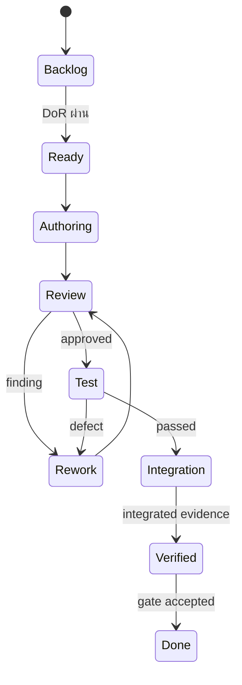

# Sprint 0A — Multi-agent Software Engineering Operating Model

## กฎการทำงานร่วมกันของ Coding Agents หลายค่าย เช่น Codex และ Claude

**สถานะ:** Proposed Operating Baseline v1.0  
**วันที่:** 30 สิงหาคม 2026  
**ขอบเขต:** Architecture, Coding, Review, Testing, Security, Integration และ Release  
**หลักสำคัญ:** แบ่งงานตาม Skill และหน้าที่ ไม่แบ่งตามยี่ห้อ Model

---

## 1. เป้าหมาย

สร้างกระบวนการพัฒนาเหมือนบริษัท Software Engineering ที่หลาย Coding Agent ทำงานพร้อมกันได้ โดย:

1. Agent แต่ละตัวรับงานตามความเชี่ยวชาญ
2. ผู้เขียน, ผู้รีวิว และผู้ทดสอบเป็นคนละบทบาท
3. Codex, Claude หรือ Agent ค่ายอื่นใช้ Contract และ Evidence ชุดเดียวกัน
4. ไม่มี Agent ใดต้องพึ่ง Memory จากบทสนทนาของ Agent อื่น
5. Repository, Contracts, Work Package และ CI เป็น Source of Truth
6. งานเสี่ยงสูงไม่มีการ Self-approve
7. Integration Owner รวมงานตาม Dependency และ Gate ไม่รวมตามว่าใครทำเสร็จก่อน

---

## 2. Vendor-neutral Principles

- `vendor` และ `model` เป็น metadata สำหรับ traceability ไม่ใช่ตำแหน่งงาน
- Assignment ใช้ required skills, risk, context size, tool access และ availability
- ทุก Agent ได้ Task Packet ที่ self-contained
- คำสั่งสำคัญต้องอยู่ใน Canonical Engineering Guide ไม่เก็บเฉพาะ `AGENTS.md` หรือ `CLAUDE.md`
- Agent-specific file เป็น thin adapter เท่านั้น ห้ามกำหนด architecture/business rule เพิ่มเอง
- Output ต้องตรวจด้วย command/test เดียวกันโดยไม่ขึ้นกับ Agent ผู้เขียน
- Critical change ควรใช้ Cross-vendor review เมื่อมี Agent ที่มี skill เหมาะสม
- ถ้า Agent ค่ายหนึ่ง unavailable งานต้องย้ายให้ Agent skill เดียวกันต่างค่ายได้

---

## 3. Canonical Repository Documents

เมื่อเริ่ม Repository ให้สร้าง:

| Path | Owner | หน้าที่ |
|---|---|---|
| `ENGINEERING_AGENT_GUIDE.md` | Engineering Manager/Integrator | กฎกลางฉบับเต็มสำหรับ Agent ทุกค่าย |
| `AGENTS.md` | Integrator | Adapter สำหรับ Codex; อ้าง Guide กลางและเพิ่มเฉพาะวิธีโหลดบริบท |
| `CLAUDE.md` | Integrator | Adapter สำหรับ Claude; อ้าง Guideกลางและเพิ่มเฉพาะวิธีโหลดบริบท |
| `architecture/decisions/` | Architect | ADR/RFC ที่อนุมัติแล้ว |
| `contracts/` | Contract Owner | Versioned API/Event/Job/Port schemas |
| `work-packages/` | Engineering Manager | Machine-readable task packets |
| `ownership/` | Engineering Manager | Module/file/table/event ownership registry |
| `test-kits/` | QA/Contract Owner | Shared contract, RLS, failure และ E2E fixtures |
| `evidence/<task-id>/` | Tester/Reviewer | Test reports, screenshots, diffs, security/cost evidence |
| `runbooks/` | SRE/Ops | Deploy, rollback, replay, incident, recovery |

`AGENTS.md` และ `CLAUDE.md` ต้องไม่คัดลอกกฎกลางทั้งหมด เพราะจะเกิด drift ให้ระบุลิงก์และคำสั่งโหลด Guide กลางแทน

---

## 4. Agent Capability Profile

Agent ทุกตัวต้องลงทะเบียน Capability Profile ก่อนรับงาน:

| Field | ตัวอย่าง |
|---|---|
| `agent_id` | `be-data-02` |
| `vendor` | `openai`, `anthropic` |
| `model` | ชื่อ/รุ่นที่ใช้งาน |
| `primary_skills` | PostgreSQL, RLS, TypeScript |
| `secondary_skills` | API review, performance testing |
| `roles_allowed` | author, reviewer |
| `roles_excluded` | production-approver |
| `tools_available` | repository, test runner, browser, database sandbox |
| `context_limit_class` | small, medium, large |
| `security_clearance` | public-test-data, synthetic-data; ห้าม production secret |
| `max_parallel_packages` | ปกติ 1 implementation package |
| `recent_failures/strengths` | ใช้ช่วย routing ไม่ใช้ลงโทษ vendor ทั้งค่าย |

### Routing order

1. Required skill ตรงกับงาน
2. Tool/environment พร้อม
3. ไม่มี conflict of interest
4. เคยอ่าน Contract version ที่งานใช้หรือ Task Packetแนบครบ
5. Risk level ตรงกับประสบการณ์
6. Availability/WIP
7. Vendor diversity สำหรับ Reviewer/Tester เมื่อทำได้

ห้ามเลือก Agent จากราคาหรือความเร็วอย่างเดียวสำหรับ RLS, Publish, Billing, Secret และ Migration

---

## 5. Engineering Role Catalog

| Role | ความรับผิดชอบ | Deliverable |
|---|---|---|
| Product Owner | Scope, priority, business decision, acceptance | Decision/acceptance sign-off |
| Engineering Manager | Work breakdown, staffing, WIP, escalation | Work packages, capacity, status |
| Architect/Contract Owner | Boundaries, ADR, contracts, compatibility | Versioned contract/RFC |
| Implementation Author | เขียน code/migration/docs ตาม packet | Branch/PR + author evidence |
| Peer Reviewer | ตรวจ design, correctness, maintainability | Review verdict/findings |
| Security Reviewer | Threat, authz, secret, privacy, abuse | Security verdict/findings |
| QA/Test Engineer | สร้าง/รัน test จาก acceptance แบบอิสระ | Test report/defects |
| UX/Accessibility Reviewer | Mobile, Thai non-tech, accessibility | UX/a11y verdict |
| Domain Reviewer | ตรวจ claim/industry/business correctness | Domain sign-off |
| SRE/Operations Reviewer | Deploy, monitor, rollback, recovery, cost | Operational readiness |
| Integration Owner | Merge order, integrated build, release gate | Integrated commit/build evidence |
| Release Owner | Go/No-go; ไม่ใช่ feature author คนเดียว | Gate decision |

หนึ่ง Agent อาจมีหลาย skill แต่ใน Work Package เดียวต้องรับบทบาทเดียวที่มีผลต่อ approval

---

## 6. Separation of Duties

ทุก Implementation Work Package ต้องมีขั้นต่ำ:

- `Author`: สร้าง implementation
- `Reviewer`: ตรวจ code/design โดยไม่ใช่ Author
- `Tester`: ตรวจจาก acceptance criteria โดยไม่แก้ implementation ให้ผ่านเอง
- `Integration Owner`: รวมงานเมื่อทุก Gate ผ่าน

เพิ่มตามความเสี่ยง:

- `Security Reviewer`: RLS, auth, OAuth, secrets, upload, billing, admin, PDPA
- `UX Reviewer`: Core UI/mobile flow
- `Domain Reviewer`: Industry Pack, claims, AI quality
- `SRE Reviewer`: Worker, publish, migration, backup, observability
- `Product Approver`: เปลี่ยน behavior/scope/copy/price

### กฎห้าม Self-approval

1. Author ห้ามเป็น final Reviewer หรือ Tester ของตนเอง
2. Reviewer ที่แก้ code มากจนเปลี่ยน design จะกลายเป็น Co-author และต้องมี Reviewer ใหม่
3. Tester ห้ามลด assertion/threshold เพื่อให้ผ่านโดยไม่มี approved change
4. Integration Owner ห้าม bypass failed test หรือ unresolved critical finding
5. Security finding Critical/High ปิดโดย Security Reviewer ไม่ใช่ Author
6. Release Owner ต้องดู evidence จากหลาย role

---

## 7. Skill-based Assignment Matrix

| Change type | Author skill | Required Reviewer | Independent Tester | Additional Gate |
|---|---|---|---|---|
| Workspace/Auth/RLS | PostgreSQL, Authz, Supabase/RLS | Data/Security | RLS isolation QA | Security + Integration |
| Database migration | PostgreSQL migration/performance | Data Architect | Migration/rollback QA | SRE for risky DDL |
| API/Contract | TypeScript/schema/versioning | Contract Architect | Contract compatibility QA | Integration |
| Job/Event/Outbox | Async/concurrency/idempotency | Platform Reviewer | Failure/replay QA | SRE |
| AI Provider Adapter | Provider API/structured output | AI Platform | Contract/eval tester | Cost/Security |
| Research/Industry Pack | Research/evidence/domain | Domain Reviewer | Golden-set QA | Product/Claim reviewer |
| Content Quality | Thai content/evaluation | Quality/Domain | Frozen Golden-set tester | Human adjudication |
| Asset/Upload/Media | Storage/media/security | Media/Security | Upload/failure/mobile QA | Cost/rights |
| Mobile UI | React/mobile/a11y/Thai UX | UX/Accessibility | E2E/usability QA | Product |
| Approval/Calendar | Domain state/timezone | Workflow Architect | State/concurrency QA | Product |
| Meta OAuth/Publish | Meta API/idempotency | Integration/Security | Sandbox/failure QA | App Review evidence |
| Billing/Quota | Ledger/concurrency/payments | Billing/Security | Reconciliation QA | Accountant/Product |
| Infrastructure/CI | CI/CD/secrets/infra | SRE/Security | Deploy/rollback tester | Release Owner |
| Documentation only | Domain/technical writing | Relevant owner | Link/lint verifier | Integration if source of truth |

Brand/vendor ไม่ปรากฏในคอลัมน์ Assignment เพราะ Skill เป็นตัวตัดสิน

---

## 8. Cross-vendor Review Policy

ใช้ Cross-vendor review เป็นค่าเริ่มต้นสำหรับ:

- Architecture/Contract major change
- RLS/Tenant isolation
- Publish idempotency
- Secret/BYOK/OAuth
- Billing/Quota ledger
- Migration ที่มีผลกับข้อมูลจริง
- AI Quality hard-block rules

ตัวอย่าง:

- Codex Author → Claude Reviewer → QA Agent Tester
- Claude Author → Codex Reviewer → QA Agent Tester

แต่ถ้า Agent ต่างค่ายไม่มี skill ที่ตรง ให้เลือก Reviewer ค่ายเดียวกันที่มี skill ดีกว่า การบังคับต่างค่ายไม่ควรลดคุณภาพ Domain Review

---

## 9. Work Package State Machine



Agent Author ปิดงานได้สูงสุด `Review` ไม่ใช่ `Done`

---

## 10. Machine-readable Work Package Contract

ทุก Package ต้องมี YAML/JSON ที่อย่างน้อยประกอบด้วย:

```yaml
task_id: DB-01
title: Workspace and membership foundation
risk: high
status: ready
requirements: [ACC-001, ACC-002, ACC-004]
owner_module: identity.core
skills_required: [postgresql, rls, authz, typescript]
roles:
  author: be-data-02
  reviewer: sec-data-01
  tester: qa-isolation-01
  integration_owner: int-01
contracts:
  consumes: [tenant-context.v1, stable-error.v1]
  produces: [workspace-command.v1, membership-read-model.v1]
dependencies: [DB-00]
write_scope:
  - modules/identity/**
  - migrations/010-011/**
protected_paths:
  - contracts/**
  - migration-registry.yml
acceptance:
  - cross-workspace access is denied for every role
  - last owner cannot leave before transfer
tests_required:
  - unit
  - rls-isolation
  - clean-migration
  - upgrade-migration
evidence_path: evidence/DB-01/
```

Agent-specific prompt สร้างจาก Package นี้ ไม่ให้ Agent สรุป Scope เองจากข้อความกว้างๆ

---

## 11. Author Workflow

1. อ่าน Task Packet + referenced contracts เท่านั้นก่อน แล้วอ่าน Domain docs ที่บังคับ
2. ตรวจ write scope/protected paths
3. สร้าง branch/worktree แยก
4. รัน baseline tests และบันทึกผล
5. Implement smallest vertical-safe increment
6. เพิ่ม tests โดยไม่แก้ shared contractเอง
7. รัน verification commands ที่ระบุ
8. ส่ง Author Handoff พร้อม assumptions/risks
9. ห้าม merge เอง

## 12. Reviewer Workflow

Reviewer ตรวจอย่างน้อย:

- ตรง Requirement และ Contract
- ไม่มี hidden scope/assumption
- ไม่มี direct cross-module write/import
- Error/retry/idempotency/permission ถูกต้อง
- Migration/index/concurrency เมื่อเกี่ยวข้อง
- Security/privacy/cost/observability
- Code readable/maintainable และมี test ที่ meaningful

Verdict: `approve`, `approve-with-minor`, `request-changes`, `blocked-contract`

Reviewer ห้าม approve เพราะ CI เขียวอย่างเดียว

## 13. Tester Workflow

Tester:

1. สร้าง Test Plan จาก Acceptance โดยไม่อ่านเฉพาะ implementation intent
2. รันบน clean environment/integrated branch
3. ทดสอบ happy, boundary, failure, recovery, concurrency และ authorization ตาม risk
4. บันทึก exact commands/environment/fixtures
5. เปิด Defect แยกจากการแก้ code
6. Re-test หลังแก้และเก็บ regression

Verdict: `passed`, `failed`, `blocked-environment`, `acceptance-ambiguous`

---

## 14. Branch, File และ Merge Ownership

- หนึ่ง Work Package ต่อ branch/worktree
- ชื่อ: `agent/<agent-id>/<task-id>-short-name`
- Agent เขียนได้เฉพาะ `write_scope`
- Root config, lockfile, contracts, CI, migration registry และ Source of Truth เป็น protected paths
- Contract change ส่ง RFC/fixture ก่อน implementation
- Migration number จองจาก registry โดย Integration Owner
- Merge order: Contract → DB/RLS → Domain → Worker/Adapter → UI → Integration test → Ops evidence
- Squash/rebase policy เลือกครั้งเดียวใน repository guide

---

## 15. Required Evidence

| Role | Evidence |
|---|---|
| Author | diff summary, tests run, assumptions, security/cost impact |
| Reviewer | checklist, findings, verdict, contract compatibility |
| Tester | plan, command, fixture, result, defect IDs, regression |
| Security | threat cases, authorization/secret findings, verdict |
| UX | viewport/a11y/task completion evidence |
| SRE | deploy/rollback/replay/recovery/alert evidence |
| Integration | integrated commit, full suite, migration path, traceability |
| Release | Gate checklist, accepted risks, rollback/kill switch |

Evidence ห้ามมี production secret, raw customer personal data หรือ signed URL ระยะยาว

---

## 16. Review Depth by Risk

| Risk | ตัวอย่าง | Required gate |
|---|---|---|
| Low | Copy, isolated docs | Author + Reviewer + lint/test |
| Medium | UI component, read-only query | Author + Reviewer + Tester |
| High | Migration, worker, provider adapter, approval state | Author + specialist Reviewer + Tester + Integration |
| Critical | RLS, secret, publish idempotency, billing ledger, deletion/restore | Author + Cross-vendor specialist review + Security + independent Tester + Release Owner |

---

## 17. Deterministic Tooling

Agent ทุกค่ายต้องใช้:

- package manager/version เดียวกันจาก lockfile
- commands จาก repository scripts ไม่สร้างคำสั่งส่วนตัวเป็นมาตรฐาน
- pinned runtime/tool versions
- reproducible seed/factory
- fake adapters สำหรับ offline contract tests
- clean DB + upgrade DB tests
- same lint/type/unit/contract/E2E/security gates

ผลลัพธ์ที่ทำซ้ำไม่ได้บน CI ถือว่ายังไม่ผ่าน แม้ Agent รายงานว่าผ่านใน environment ของตน

---

## 18. Security Rules for Agents

- Agent development/test ไม่ได้รับ production secret
- ใช้ scoped development credentials และ synthetic/test accounts
- Log/prompt/evidence ต้อง redact token, key, user data และ provider payload ที่อ่อนไหว
- ห้าม paste secret ใน Task Packet, commit, chat หรือ screenshot
- Tool capability ที่ไม่จำเป็นต้องปิด
- Agent ที่เขียน Secret/OAuth module ห้ามเป็น Security approver
- Suspected secret exposure = stop-the-line, revoke/rotate/investigate

---

## 19. Integration Cadence

| Cadence | กิจกรรม |
|---|---|
| ทุกวัน | Async integration report: blocker, contract request, migration collision, CI health |
| วันละ 1–2 รอบ | Merge train โดย Integration Owner |
| ทุก 48 ชั่วโมง | Clean/upgrade migration + full contract/RLS/job replay/mobile smoke |
| ทุกสัปดาห์ | Staging vertical slice demo และ accepted-risk review |
| สิ้น Wave | Gate review โดย Product, Integration, QA, Security/Ops ตาม scope |

---

## 20. Escalation และ Stop-the-line

หยุด Feature Merge เมื่อพบ:

- Tenant/Business/Page data leakage
- Duplicate external publish/payment
- Lost job/result หรือ non-idempotent replay
- Contract producer/consumer mismatch
- Migration divergence/irreversible data risk
- Secret exposure
- Security Critical/High ที่ยังไม่ปิด
- Tester ต้องลด acceptance เพื่อให้ผ่าน
- Reviewer และ Authorตีความ requirement ไม่ตรงกัน

Engineering Manager/Contract Owner เป็นผู้ route ปัญหา; Product Owner ตัดสิน behavior/scope; Security/Release Owner ตัดสิน risk acceptance ตามหน้าที่

---

## 21. Quality Metrics ของกระบวนการ Agent

- First-pass review approval rate
- Defects found by Reviewer เทียบ Tester/Production
- Contract churn หลัง freeze
- Rework PD จาก dependency/ownership collision
- CI reproducibility rate
- Escaped tenant/security/publish defects
- Median review/test turnaround
- Work Package cycle time แยกตาม skill/vendor เพื่อปรับ routing
- Human intervention/support time

ใช้ metric เพื่อปรับ Skill Routing และ Task Packet ไม่ใช้ตัดสินจาก vendor เพียงตัวเดียว

---

## 22. Sprint 0A Exit Criteria สำหรับ Operating Model

- Capability Profile schema approved
- Role/RACI และ separation-of-duties approved
- Canonical Guide + thin Codex/Claude adapters ถูกออกแบบ
- Work Package schema + sample ผ่าน review
- File/table/contract ownership registry มี owner
- Reviewer/Tester pools ระบุ skill ครบ Critical Path
- CI evidence format และ protected paths ตกลง
- Cross-vendor critical review policy ตกลง
- Agent Handoff/Defect/Escalation templates พร้อม
- G0 tasks ทุกตัว assign Author, Reviewer และ Tester ก่อนเข้า Ready
