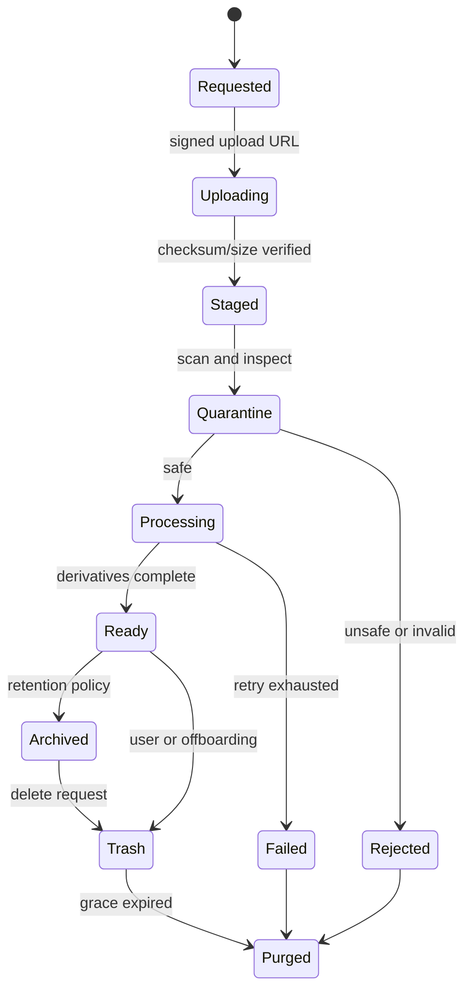
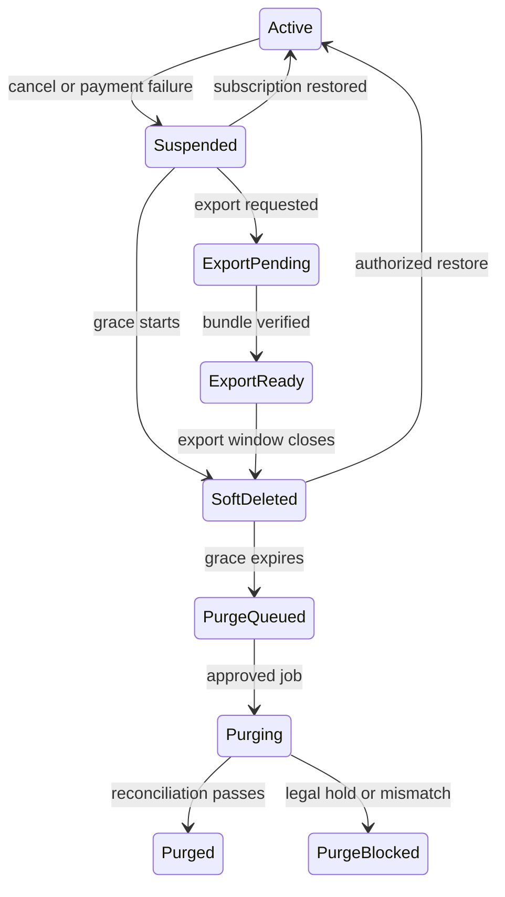

# Sprint 0A — Object Storage Lifecycle Contract

สถานะ: Proposed baseline สำหรับ Gate G0  
ขอบเขต: Asset Library, รูปภาพ, วิดีโอ, ไฟล์แนบ และไฟล์อนุพันธ์ของทุก Workspace/Page/Content  
แนวทางผู้ให้บริการ: Provider-neutral โดย Cloudflare R2 เป็นตัวเลือกหลัก และ PostgreSQL/Supabase เป็นแหล่งข้อมูล metadata ที่เชื่อถือได้

## 1. เป้าหมาย

ข้อกำหนดนี้ทำให้การเพิ่มลูกค้าใหม่ การย้ายข้อมูล การระงับบริการ และการลบลูกค้าที่เลิกใช้งานทำได้เป็นระบบ ปลอดภัย ตรวจสอบย้อนหลังได้ และไม่ผูกกับผู้ให้บริการ Object Storage รายเดียว

หลักสำคัญ:

- Object key ต้องแบ่งขอบเขตตาม tenant/workspace/page/content/asset อย่างชัดเจน
- Database manifest เป็น Source of Truth; ห้ามใช้การไล่ดูรายการไฟล์ใน bucket เป็นฐานข้อมูลธุรกิจ
- ทุก identifier ใน object key ต้องเป็น UUID หรือ opaque system ID เท่านั้น
- ห้ามใส่ชื่อบุคคล ชื่อธุรกิจ อีเมล เบอร์โทร ชื่อเพจ access token หรือข้อมูลส่วนบุคคลใน bucket name และ object key
- ห้ามลบด้วย prefix ที่ยังไม่ผ่านการ resolve และตรวจสอบกับฐานข้อมูล
- การลบต้อง idempotent, ทำซ้ำได้, มี audit trail และมีหลักฐานหลังจบงาน
- ไฟล์ที่ยังไม่ผ่านการตรวจสอบต้องไม่ถูกเผยแพร่ผ่าน public CDN

## 2. ขอบเขตความเป็นเจ้าของ

ลำดับขอบเขตข้อมูล:

```text
Tenant
└── Workspace
    └── Meta Channel / Page / IG Account
        └── Content
            └── Asset
                └── Asset Version / Derivative
```

- `tenant_id`: ขอบเขตบัญชีผู้ชำระเงินหรือองค์กรตาม billing contract
- `workspace_id`: พื้นที่ทำงานร่วมกันของผู้ใช้หลายคน
- `channel_id`: การเชื่อมต่อ Facebook Page หรือ Instagram Account หนึ่งรายการ
- `page_scope_id`: internal UUID ที่แทนเพจหรือบัญชี social; ห้ามใช้ external Meta page ID เป็น path หลัก
- `content_id`: โพสต์หรือชิ้นงานหนึ่งรายการ
- `asset_id`: logical asset หนึ่งรายการ
- `asset_version_id`: ไฟล์ต้นฉบับแต่ละเวอร์ชัน
- `blob_id`: physical object ที่อาจถูกอ้างอิงร่วมกันภายใต้นโยบาย deduplication

ข้อมูล business knowledge ของแต่ละเพจต้องแยก asset scope ตาม `page_scope_id` และต้องไม่ค้นคืนข้ามเพจโดยปริยาย แม้อยู่ใน Workspace เดียวกัน

## 3. Bucket Strategy

### 3.1 Baseline ที่แนะนำ

ใช้ bucket แยกตาม environment และ data class ไม่แยกหนึ่ง bucket ต่อลูกค้า เพื่อหลีกเลี่ยงข้อจำกัดจำนวน bucket และภาระด้าน operations:

```text
<product>-prod-private-assets
<product>-prod-public-derivatives
<product>-prod-backups
<product>-staging-private-assets
<product>-staging-public-derivatives
<product>-staging-backups
```

ข้อกำหนด:

- Development, staging และ production ต้องใช้ credentials และ bucket คนละชุด
- Production private originals ห้ามเป็น public bucket
- Public derivatives เก็บได้เฉพาะไฟล์ที่ผ่าน moderation/scan และได้รับสถานะ `ready`
- Backup bucket ใช้ service identity แยกจาก application runtime และควรอยู่คนละ account/project เมื่อเข้าสู่ production scale
- ชื่อ bucket เป็น configuration ห้าม hard-code ใน domain module
- Storage adapter ต้องรองรับ S3-compatible API เพื่อสลับ R2/S3-compatible provider ได้

### 3.2 เหตุผลที่ไม่ใช้ bucket ต่อลูกค้า

- Provisioning และ offboarding ซับซ้อนเกินจำเป็น
- จัดการ IAM, CORS, lifecycle และ observability ยากเมื่อจำนวนลูกค้าเพิ่ม
- อาจชน quota ของผู้ให้บริการ
- การแยก tenant ทำด้วย immutable prefix, database authorization และ signed URL ได้ชัดกว่า

ลูกค้า enterprise ที่ต้องการ dedicated bucket ให้เป็น feature/contract แยกในอนาคต ไม่ใช่ค่าเริ่มต้นของ SME plan

## 4. Object Key Contract

### 4.1 Canonical Key

```text
v1/tenants/{tenant_uuid}/workspaces/{workspace_uuid}/pages/{page_scope_uuid}/
assets/{asset_uuid}/versions/{asset_version_uuid}/{state}/{variant}/{object_uuid}.{ext}
```

กรณี asset ยังไม่ผูกกับเพจ:

```text
v1/tenants/{tenant_uuid}/workspaces/{workspace_uuid}/pages/unassigned/
assets/{asset_uuid}/versions/{asset_version_uuid}/{state}/{variant}/{object_uuid}.{ext}
```

กรณีไฟล์ที่สร้างจาก content:

```text
v1/tenants/{tenant_uuid}/workspaces/{workspace_uuid}/pages/{page_scope_uuid}/
contents/{content_uuid}/assets/{asset_uuid}/versions/{asset_version_uuid}/{state}/{variant}/{object_uuid}.{ext}
```

ค่าที่อนุญาตสำหรับ `state`:

- `staging`
- `quarantine`
- `ready`
- `archive`
- `trash`

ตัวอย่าง `variant`:

- `original`
- `preview`
- `thumb-320`
- `feed-1080`
- `story-1080x1920`
- `video-720p`
- `poster-frame`
- `subtitle-th`

### 4.2 Invariants ของ Path

- UUID ทุกตัวต้องเป็น canonical lowercase UUID
- Prefix identity หลังสร้างแล้วเป็น immutable; ห้าม rename tenant/workspace/page โดยย้าย object path
- ชื่อไฟล์ที่ผู้ใช้อัปโหลดเก็บในฐานข้อมูลแบบเข้ารหัส/จำกัดสิทธิ์ ไม่ใช้เป็น object key
- MIME type และ extension ต้องมาจาก content sniffing ที่ฝั่ง server ไม่เชื่อ extension จาก client
- Object key ต้องถูกสร้างโดย `StorageKeyBuilder` ส่วนกลางเท่านั้น ห้าม module ประกอบ string เอง
- ห้ามใช้ `../`, URL-encoded separator, wildcard หรือ user-controlled segment
- ห้ามใช้ชื่อ/email/เบอร์โทร/ชื่อธุรกิจ/ชื่อเพจใน key
- ห้ามใช้ hash เพียงอย่างเดียวแทน tenant scope
- ห้ามย้าย object ข้าม tenant; ต้อง copy ผ่าน authorized workflow แล้วสร้าง asset record ใหม่

## 5. Database Manifest เป็น Source of Truth

ตารางขั้นต่ำ:

### `assets`

- `id`
- `tenant_id`
- `workspace_id`
- `page_scope_id` nullable
- `content_id` nullable
- `owner_user_id`
- `kind` — image/video/document/audio
- `lifecycle_state`
- `moderation_state`
- `current_version_id`
- `retention_class`
- `legal_hold`
- `created_at`, `updated_at`, `trashed_at`, `purge_after`, `purged_at`

### `asset_versions`

- `id`, `asset_id`
- `source_type` — upload/generated/imported/derived
- `original_filename_encrypted`
- `declared_mime`, `detected_mime`
- `bytes`, `width`, `height`, `duration_ms`
- `checksum_sha256`
- `processing_state`
- `created_at`

### `storage_objects`

- `id`
- `asset_version_id`
- `blob_id` nullable
- `provider`
- `bucket_alias`
- `object_key`
- `variant`
- `storage_class`
- `etag`
- `checksum_sha256`
- `bytes`
- `visibility`
- `cdn_url` nullable
- `created_at`, `verified_at`, `deleted_at`

### `storage_blobs`

- `id`
- `tenant_id` หรือ `dedupe_scope`
- `checksum_sha256`
- `bytes`
- `reference_count`
- `object_id`
- `last_reconciled_at`

### `asset_references`

- `id`, `asset_id`
- `reference_type` — content/calendar/template/business_knowledge/export
- `reference_id`
- `created_at`, `released_at`

### `storage_jobs` และ `storage_audit_events`

เก็บคำสั่ง, idempotency key, actor, scope, จำนวน object/byte ที่คาดไว้, จำนวนที่ทำจริง, error, retry, timestamps และ evidence URI

ข้อกำหนด:

- ทุก object ต้องมี manifest row ก่อนเข้าสถานะ `ready`
- ห้ามให้ API business logic หาไฟล์ด้วยการ list bucket
- DB row และ object write ใช้ outbox/workflow เพื่อรับมือ distributed transaction
- Object ที่ upload สำเร็จแต่ DB commit ไม่สำเร็จต้องถูก orphan reconciler จัดการ
- DB row ที่ไม่มี physical object ต้องถูกแจ้งเป็น integrity incident

## 6. Upload และ Processing Lifecycle



### 6.1 Upload Workflow

1. Client ขอ upload session โดยส่ง metadata ขั้นต่ำ
2. API ตรวจ entitlement, workspace/page scope, quota, MIME allowlist และขนาด
3. ระบบสร้าง `asset`, `asset_version`, `storage_job` และ canonical object key
4. API ออก signed upload URL อายุสั้น ผูกกับ exact object key, content length และ content type
5. Client upload ตรงไป storage เพื่อไม่ให้ application server รับไฟล์ใหญ่
6. Provider event หรือ client completion signal ส่งเข้า background workflow
7. Worker ตรวจ object existence, byte size, checksum, MIME sniffing, malware และ media integrity
8. ไฟล์ผ่านแล้วจึงสร้าง derivatives แบบ background
9. Workerบันทึก manifest, moderation result และย้ายเชิงตรรกะเป็น `ready`
10. แจ้งผู้ใช้เมื่อพร้อมใช้; หน้าจอไม่ต้องรอ processing

หมายเหตุ: Object Storage ส่วนมากไม่มี atomic rename การเปลี่ยน state จึงควรใช้ copy-to-canonical-key + verify + delete-source หรือคง physical key เดิมแล้วเปลี่ยน logical state ใน DB ตาม storage adapter contract ต้องเลือกหนึ่งวิธีและใช้สม่ำเสมอ ห้ามสมมติว่า rename atomic

### 6.2 Derivatives

- Original เป็น immutable; ทุกการแก้ไขสร้าง version ใหม่
- Derivative ต้องชี้กลับ `asset_version_id` และบันทึก recipe/version ของ processor
- การ regenerate derivative ต้อง idempotent และไม่ overwrite แบบไร้ version
- จำกัดจำนวน preset เพื่อลดต้นทุน; generate on demand ได้เมื่อมี demand threshold
- Video transcode ใช้ background worker พร้อม concurrency limit, timeout และ cost attribution
- ลบ original ต้องลบ derivatives ของ version นั้นด้วย เว้นแต่มี reference ที่ถูกต้อง

## 7. Lifecycle และ Retention

| State | ความหมาย | การเข้าถึง | ค่าเริ่มต้น retention |
|---|---|---|---|
| `staging` | upload ยังไม่ยืนยัน | uploader/session worker | 24 ชั่วโมง |
| `quarantine` | รอตรวจสอบ | security processor เท่านั้น | 72 ชั่วโมงเมื่อ failed |
| `ready` | พร้อมใช้งาน | authorized workspace users/CDN ตาม policy | ตาม subscription |
| `archive` | ไม่ใช้ในงานปัจจุบัน | restore workflow | ตาม retention class |
| `trash` | soft-deleted | admin restore เท่านั้น | 30 วัน baseline |
| `purged` | object ถูกลบแล้ว | ไม่มี | audit metadata ตามกฎหมาย/นโยบาย |

ค่า retention ต้อง configurable เป็น policy version และบันทึก policy ที่ใช้กับแต่ละ asset ห้ามเปลี่ยนย้อนหลังโดยไม่มี migration plan

## 8. Onboarding Provisioning

ไม่สร้าง bucket ใหม่ต่อลูกค้าใน baseline การ onboard workspace ใหม่ต้องเป็น idempotent workflow:

1. สร้าง tenant/workspace/page UUID ใน transaction
2. สร้าง storage namespace manifest และ quota record
3. ผูก retention policy และ subscription entitlement
4. สร้าง default asset collections ใน DB เท่านั้น ไม่ต้องสร้าง empty folders ใน object storage
5. ทดสอบ service identity ด้วย canary object ใน system prefix แล้วลบทันที
6. บันทึก `STORAGE_NAMESPACE_PROVISIONED` audit event
7. เปิด upload capability เมื่อทุก precondition ผ่าน

ผู้ใช้ non-tech ไม่ควรเห็น bucket, prefix, provider หรือ storage class ใน onboarding UI ควรเห็นเพียง “คลังรูปและวิดีโอพร้อมใช้งาน” และ quota ที่เข้าใจง่าย

## 9. Offboarding Contract

### 9.1 State Machine



### 9.2 Baseline Policy

- ยกเลิก subscription: เปลี่ยน workspace เป็น read-only/suspended ตาม billing policy ไม่ลบทันที
- Grace period ค่าเริ่มต้น: 30 วัน ปรับได้ตาม plan และข้อกฎหมาย
- ช่วง grace: ผู้มีสิทธิ์ดาวน์โหลด export และขอกู้คืนได้
- Export ต้องมี manifest, checksum, metadata ที่จำเป็น และ URL อายุจำกัด
- เมื่อหมด grace จึง queue purge; ห้าม purge inline ใน HTTP request
- การลบ tenant ทั้งหมดต้องมี approval ตามระดับความเสี่ยงและ pre-delete dry run
- Audit/control-plane metadata ที่กฎหมายหรือความปลอดภัยต้องเก็บไว้ต้องแยกจาก customer content และ minimize ข้อมูล

### 9.3 Safe Purge Algorithm

1. รับ immutable `purge_request_id`, `tenant_id`, `workspace_id` และ idempotency key
2. Resolve target objects จาก DB manifest ด้วย tenant/workspace IDs
3. ตรวจสิทธิ์ actor, workspace status, grace expiry, legal hold และ active export
4. สร้าง snapshot รายการ exact object IDs/keys พร้อม checksum และ expected bytes
5. ตรวจว่าทุก key ผ่าน `StorageKeyParser` และมี canonical prefix ตรงกับ tenant/workspace ที่ร้องขอ
6. Dry run รายงานจำนวน assets, objects, bytes, shared references และ anomalies
7. ต้อง reject หาก prefix ว่าง, กว้างกว่าระดับ workspace, มี wildcard, parse ไม่ผ่าน หรือจำนวนจริงเกิน safety threshold
8. ลบทีละ exact key เป็น batch จำกัดขนาด พร้อม retry
9. ตรวจ provider response และ `HEAD`/reconciliation ตาม consistency contract
10. ทำ CDN invalidation สำหรับ URL ที่เผยแพร่แล้ว
11. อัปเดต `deleted_at/purged_at` แบบ idempotent
12. ตรวจซ้ำว่า manifest ไม่มี live object และไม่มี orphan ภายใน scope
13. ออก purge certificate/evidence พร้อม counts, bytes, errors และ timestamps

กฎบังคับ: **ห้ามเรียก bulk delete ด้วย unvalidated prefix** ไม่ว่ากรณีใด ให้ prefix ใช้ค้นหาเพื่อ reconciliation ได้เฉพาะหลัง validate แต่การลบ production ต้องใช้รายการ exact keys จาก approved snapshot

### 9.4 Idempotency

- `purge_request_id` เดิมต้องให้ผลสุดท้ายเดิม
- Object not found ถือว่าสำเร็จเฉพาะเมื่อ manifest ระบุว่าอยู่ใน purge set
- Retry ต้องไม่ลด reference count ซ้ำ
- Job resume จาก checkpoint ได้
- Concurrent restore และ purge ต้องถูกกันด้วย workspace lifecycle lock/version

## 10. Legal Hold และ Disputes

- Legal hold เป็น deny-by-default ต่อ purge ไม่ใช่เพียง label
- Hold ต้องมี scope, reason code, authorized actor, start/review/end timestamps
- Content ภายใต้ hold ห้าม purge แม้ subscription จบหรือ retention หมด
- ห้ามใส่รายละเอียดคดีหรือข้อมูลอ่อนไหวใน object key
- การปลด hold ต้องเป็นเหตุการณ์แยก มี approval และ audit
- เมื่อ purge ถูก block ต้องรายงานผู้ดูแลโดยไม่เปิดเผยข้อมูลเกินจำเป็น

## 11. Shared Assets และ Deduplication

ค่าเริ่มต้น Beta: deduplicate ภายใน tenant เดียวเท่านั้น ไม่ทำ cross-tenant deduplication เพื่อลดความเสี่ยง privacy, deletion และ side channel

กฎ:

- Logical asset ownership แยกจาก physical blob
- ทุก active reference เพิ่ม `reference_count` ผ่าน transaction/outbox
- การ release reference ต้อง idempotent
- ลบ physical blob ได้เมื่อ reference count เป็นศูนย์, grace หมด, ไม่มี legal hold และ reconciler ยืนยัน
- ห้ามเชื่อ reference count เพียงอย่างเดียว ต้อง cross-check `asset_references`
- Copy asset ไปอีก workspace ต้องสร้าง authorization event และ reference/asset ใหม่
- หากเปิด cross-tenant dedupe ในอนาคต ต้องมี ADR, encryption/privacy analysis และ deletion proof ใหม่

## 12. Access Control, Signed URLs และ CDN

- Private originals ใช้ signed URLs อายุสั้นและ exact-key scope
- Signed URL ต้องออกหลังตรวจ user membership, workspace role, asset lifecycle และ page access ทุกครั้ง
- Upload URL ห้ามมี permission อ่าน/list/delete
- Download URL ค่าเริ่มต้นไม่เกิน 10 นาที; upload URL ค่าเริ่มต้นไม่เกิน 15 นาที
- ห้าม log full signed URL/query signature
- CDN origin ต้องไม่เปิด public access ไปยัง private bucket
- Public derivative ต้องใช้ unguessable path และ status check ก่อน publish
- เมื่อ asset ถูก trash/purge/revoke ต้อง invalidate CDN และ tokenized delivery cache
- Cache key ต้องไม่ทำให้ private response ของ tenant หนึ่งถูกแชร์กับอีก tenant
- Encryption at rest เป็นข้อบังคับ; credentials เก็บใน secret manager และ rotate ได้
- Service identity แยกตาม environment และหน้าที่: upload, processing, delivery, purge, backup
- RLS ใน Postgres/Supabase ปกป้อง manifest แต่ไม่แทน storage IAM; ต้องบังคับทั้งสองชั้น

## 13. Audit และ Observability

เหตุการณ์ขั้นต่ำ:

- upload requested/completed/failed
- scan accepted/rejected
- derivative created/failed
- asset viewed/downloaded เมื่อเป็นข้อมูลสำคัญ
- asset trashed/restored
- workspace suspended/reactivated
- export requested/ready/expired
- purge requested/approved/started/blocked/completed
- legal hold applied/released
- quota exceeded
- orphan/missing object detected/resolved

ทุก event ต้องมี `event_id`, timestamp, actor/service, tenant/workspace/page scope, asset/object IDs, request/trace ID และ outcome โดยไม่บันทึก signed token หรือข้อมูลอ่อนไหว

Metrics ขั้นต่ำ:

- bytes/object count ต่อ tenant/workspace/page/kind/state
- upload success rate และ processing latency
- derivative/transcode failure rate
- orphan count และ missing-object count
- purge queue age และ purge completion time
- CDN egress/cache hit ratio
- storage, operation, egress และ processing cost ต่อ workspace

## 14. Quota และ Cost Controls

- Quota ผูก subscription entitlement ใน DB ไม่ผูกกับ bucket provider โดยตรง
- ตรวจ quota ก่อนออก upload URL และตรวจซ้ำหลัง upload ด้วย actual bytes
- แยก original bytes, derivative bytes, archive bytes และ monthly egress
- เตือนผู้ใช้ด้วยภาษาง่ายเมื่อถึง 80%, 95% และ 100%
- ที่ 100% ปิด new upload แต่ยังให้ดู/ลบ/export ตาม policy
- Video มี file-size, duration, resolution และ concurrency limits แยก
- ตั้ง budget alert ทั้งระดับระบบและ workspace anomaly
- Cost ledger ต้องผูก generation/transcoding/storage/egress กับ workspace และ operation
- Lifecycle job ลบ incomplete multipart uploads และ staging objects ที่หมดอายุ

## 15. Orphan Reconciliation

รัน background reconciliation เป็นรอบ โดยไม่กระทบ request path:

- DB → Storage: ตรวจทุก manifest object ว่ามี physical object และ checksum/size ตรง
- Storage → DB: list เฉพาะ canonical environment prefix แบบ paginated เพื่อหา object ที่ไม่มี manifest
- Orphan ใหม่ต้อง quarantine ก่อน ห้ามลบทันที
- ใช้ minimum orphan age เช่น 7 วัน และตรวจว่าไม่มี active upload/workflow
- Auto-delete ได้เฉพาะ policy ที่อนุมัติและ exact-key snapshot
- ความผิดปกติเกิน threshold ต้องหยุด auto purge และเปิด incident
- Reconciliation ต้อง checkpoint, rate limit และ restart ได้

## 16. Backup และ Disaster Recovery

- Manifest database และ storage objects ต้องมี backup policy ที่สอดคล้องกัน
- บันทึก RPO/RTO แยกสำหรับ metadata, originals และ derivatives
- Originals สำคัญกว่า derivatives เพราะ derivatives สร้างใหม่ได้
- Backup ต้องเข้ารหัส, access แยก และทดสอบ restore เป็นรอบ
- Restore ต้องรักษา tenant/workspace scope และไม่ทำให้ object ที่ถูก purge ตามคำขอลูกค้ากลับมาใช้งานโดยอัตโนมัติ
- เก็บ deletion tombstone/backup suppression ledger เพื่อป้องกัน deleted data resurrection
- DR test ต้องพิสูจน์ manifest-object consistency, checksum และ signed delivery
- Provider migration ใช้ adapter + dual-read/controlled copy; ห้ามเปลี่ยน key contract โดยไม่มี version migration

## 17. Module Boundaries

```text
storage-domain
├── key-builder-and-parser
├── manifest-repository
├── lifecycle-policy
├── authorization
├── quota-and-cost
├── upload-session
├── processing-orchestrator
├── delivery-and-cdn
├── export
├── purge
├── reconciliation
└── provider-adapters
    ├── r2-s3-compatible
    └── future-provider
```

- Domain module ห้าม import SDK ของ provider โดยตรง
- Provider adapter รับเฉพาะ canonical commands และคืน normalized results
- Billing, onboarding และ offboarding เรียก storage ผ่าน application service/contract
- Event contracts ต้อง versioned และรองรับ at-least-once delivery

## 18. Invariants ที่ห้ามละเมิด

1. Asset ทุกชิ้นสังกัด tenant และ workspace เดียวเสมอ
2. Asset ที่สังกัดเพจหนึ่งไม่ถูกค้นคืนให้อีกเพจโดย default
3. Object `ready` ทุกชิ้นมี manifest ที่ verified
4. Original immutable; การแก้ไขสร้าง version ใหม่
5. ไม่มี PII หรือ business-readable name ใน object key
6. Signed URL ออกหลัง authorization และมีอายุจำกัด
7. ไม่มีการลบ production จาก raw/unvalidated prefix
8. Purge ใช้ exact-key approved snapshot และทำซ้ำได้
9. Legal hold มีสิทธิ์เหนือ retention และ cancellation
10. Shared blob ถูกลบเมื่อไม่มี reference ที่ถูกต้องเท่านั้น
11. Offboarding มี grace/export ก่อน purge ตาม policy
12. Restore ห้ามทำให้ข้อมูลที่ถูก purge แล้วกลับคืนโดยไม่ผ่าน authorized recovery process

## 19. Required Tests

### Unit/Property Tests

- Key builder/parser round-trip สำหรับ UUID ที่ถูกต้อง
- Reject name, email, slash, wildcard, traversal และ malformed UUID
- Tenant/workspace/page mismatch ต้อง fail closed
- Lifecycle transition ที่ไม่อนุญาตต้องถูกปฏิเสธ
- Idempotency ของ upload completion, ref-count release และ purge
- Legal hold block ทุก purge path

### Integration Tests

- Direct upload → scan → derivatives → ready → signed delivery
- Upload สำเร็จแต่ DB commit ล้มเหลวแล้ว reconciler จัดการได้
- DB manifest มีแต่ object หายแล้วเปิด incident
- Cross-workspace/cross-tenant access ถูกปฏิเสธ
- CDN invalidation หลัง trash/purge
- Shared asset ไม่ถูกลบเมื่อยังมี reference
- Grace expiry → purge exact keys → verified certificate
- Retry purge หลัง partial provider failure ให้ผลถูกต้อง
- Cancel และ reactivate ก่อน purge แล้วข้อมูลยังอยู่
- Export checksum และ expiry ถูกต้อง

### Destructive Safety Tests

- Empty prefix, tenant-only prefix, wildcard และ malformed prefix ต้องถูก reject
- Expected object/byte count เกิน threshold ต้อง pause approval
- Workspace A purge ไม่แตะ object ของ Workspace B แม้อยู่ bucket เดียวกัน
- Concurrent restore/purge มีเพียง workflow เดียวชนะตาม lifecycle version
- Backup restore ไม่ resurrect tombstoned content

### Load/Resilience Tests

- Multipart upload ไฟล์วิดีโอใหญ่
- Processing queue backlog และ retry storm
- Provider throttling/timeout
- Reconciliation หลายล้าน object แบบ pagination/checkpoint
- Signed URL generation และ CDN delivery ตาม peak target

## 20. Work Packages และ Separation of Duties

| Work package | Author skill | Independent reviewer | Independent tester | Evidence |
|---|---|---|---|---|
| STO-01 Key/manifest contract | Backend/Data Contract Engineer | Security/Data Reviewer | Property-test Engineer | schemas, parser tests, threat cases |
| STO-02 R2/S3 adapter | Storage/Platform Engineer | Platform Reviewer | Integration Tester | emulator/provider test report |
| STO-03 Upload/processing | Media/Backend Engineer | Reliability Reviewer | Queue/Failure Tester | workflow traces, retry tests |
| STO-04 Signed delivery/CDN | Security/Edge Engineer | Application Security Reviewer | Authorization Tester | access matrix, cache tests |
| STO-05 Quota/cost ledger | FinOps/Data Engineer | Billing Reviewer | Data Reconciliation Tester | cost fixtures, ledger checks |
| STO-06 Offboarding/export | Lifecycle/Backend Engineer | Privacy/PDPA Reviewer | E2E Tester | export and grace scenarios |
| STO-07 Purge engine | Senior Platform Engineer | Security + Data Reviewers | Destructive Safety Tester | dry run, exact-key proof, purge certificate |
| STO-08 Reconciliation/DR | SRE/Data Reliability Engineer | Architecture Reviewer | Recovery Tester | orphan report, restore drill |

กติกาการมอบหมาย:

- Author อาจใช้ Codex, Claude หรือหลายโมเดลร่วมกัน แต่ทุก contribution ต้องบันทึกใน work package
- Reviewer และ Tester ต้องใช้ context/session แยกจาก Author และห้ามเป็นผู้ที่มีส่วนเขียน code ชุดนั้น
- งาน `STO-04`, `STO-06`, `STO-07`, `STO-08` เป็น high risk ต้องมี human approval ตาม policy ก่อน production
- Cross-vendor review ควรใช้เมื่อทำได้ แต่เกณฑ์ตัดสินคือ skill, independence, tests และ evidence ไม่ใช่ชื่อโมเดล
- Integrator ตรวจ contract compatibility และ merge order แต่ไม่แทน Reviewer/Tester

ตัวอย่าง assignment:

```yaml
task_id: STO-07
risk: critical
author:
  role: senior-platform-author
  required_skills: [object-storage, idempotent-workflows, typescript]
reviewers:
  - role: application-security-reviewer
  - role: data-lifecycle-reviewer
tester:
  role: destructive-safety-tester
integration_owner:
  role: platform-integrator
acceptance:
  - no_raw_prefix_delete
  - exact_key_snapshot_verified
  - legal_hold_test_passed
  - cross_tenant_isolation_passed
  - retry_idempotency_passed
required_evidence:
  - dry-run-report.json
  - destructive-safety-test-results.xml
  - purge-certificate-sample.json
  - reviewer-signoffs.md
```

## 21. Gate G0 Acceptance Checklist

- [ ] อนุมัติ bucket strategy และ environment isolation
- [ ] อนุมัติ canonical key v1 และ parser test vectors
- [ ] อนุมัติ manifest schema, RLS และ data classification
- [ ] เลือก physical state transition strategy ให้ชัดเจน
- [ ] อนุมัติ upload limits และ media processing presets
- [ ] อนุมัติ retention/grace/export policy กับ Product, Legal/PDPA และ Billing
- [ ] อนุมัติ purge safety threshold และ human approval rule
- [ ] อนุมัติ legal hold workflow
- [ ] อนุมัติ tenant-only deduplication baseline
- [ ] กำหนด RPO/RTO และผ่าน restore drill plan
- [ ] มี cost dashboard/alert specification
- [ ] มี Author, Reviewer และ Tester แยกสำหรับทุก STO work package

## 22. Decisions ที่ต้องยืนยันก่อน Production

1. R2 เป็น production primary หรือใช้ provider อื่น โดย contract ยังคง provider-neutral
2. ไฟล์ `ready` จะ copy ไป canonical state key หรือคง key เดิมแล้วใช้ DB state
3. Grace period และ export window ตาม plan/ข้อกฎหมาย
4. Retention ของ audit metadata และ backup suppression ledger
5. ขนาด/ประเภทไฟล์วิดีโอที่ Beta รองรับ
6. CDN strategy สำหรับ private derivative เทียบกับ public published media
7. ระดับ approval ของ workspace purge และ tenant purge
8. Dedicated bucket option สำหรับ enterprise ในอนาคต

เอกสารนี้เป็น baseline contract; การเปลี่ยน key format, tenant boundary, purge semantics, retention หรือ deduplication scope ต้องผ่าน ADR และ migration plan ก่อนนำไปใช้
