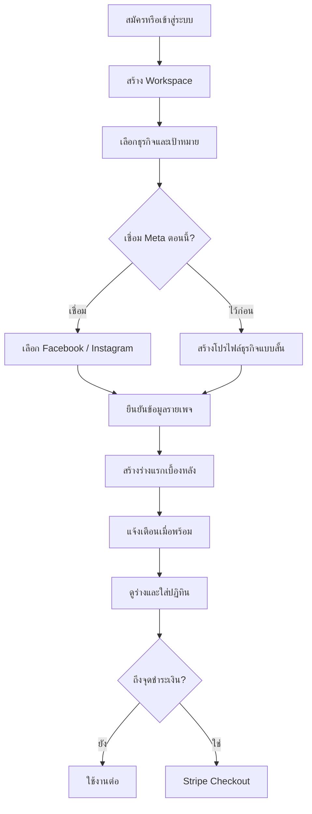

# Sprint 0A — Simple Onboarding Flow สำหรับผู้ใช้ไทย

สถานะ: Specification baseline  
ขอบเขต: Mobile-first Web App, Facebook + Instagram, Stripe Billing  
กลุ่มผู้ใช้หลัก: เจ้าของธุรกิจ SME และทีมการตลาดไทยที่ไม่ใช่สายเทคนิค

## 1. เป้าหมาย

Onboarding ต้องพาผู้ใช้จาก “ยังไม่มีบัญชี” ไปถึง “เห็นร่างคอนเทนต์แรกของธุรกิจตัวเอง” ภายในไม่เกิน 10 นาที โดยไม่บังคับตั้งค่าทุกอย่างให้เสร็จตั้งแต่ครั้งแรก

หลักสำคัญ:

- ใช้การกด เลือก และตอบคำถามสั้น ๆ มากกว่าการพิมพ์
- ใช้ภาษาไทยทั่วไป ไม่แสดงศัพท์เทคนิค เช่น API, OAuth, token หรือ webhook
- แสดงทีละเรื่อง ไม่เปิดฟอร์มยาวในหน้าจอเดียว
- ทุกขั้นที่ไม่จำเป็นต้องมีปุ่ม `ข้ามไว้ก่อน`
- บันทึกอัตโนมัติทุกขั้น และกลับมาทำต่อได้
- ให้ค่าเริ่มต้นที่ปลอดภัย และอธิบายผลของตัวเลือกก่อนยืนยัน
- การเชื่อมต่อเพจ การเชิญทีม BYOK และ Asset Import เป็นขั้นเสริม ไม่ควรขวางการเห็นคุณค่าแรก
- หนึ่ง Workspace รองรับหลายผู้ใช้ หลาย Facebook Page และหลาย Instagram Account
- Business Knowledge ต้องแยกตามแต่ละเพจ ไม่ใช้ข้อมูลปะปนข้ามธุรกิจ

## 2. ตัวชี้วัดหลัก

| ตัวชี้วัด | เป้าหมาย Beta |
|---|---:|
| เวลาเฉลี่ยถึงร่างคอนเทนต์แรก | ไม่เกิน 10 นาที |
| อัตราทำ Core Onboarding สำเร็จ | อย่างน้อย 70% |
| อัตราเชื่อม Meta สำเร็จในครั้งแรก | อย่างน้อย 80% ของผู้ที่เริ่มเชื่อม |
| อัตรากลับมาทำต่อหลังออกกลางทาง | อย่างน้อย 40% ภายใน 7 วัน |
| ผู้ใช้ที่เข้าใจว่า Knowledge แยกตามเพจ | อย่างน้อย 90% ใน usability test |
| ผู้ใช้ที่สร้างร่างแรกได้โดยไม่มีผู้ช่วย | อย่างน้อย 80% |

`First Value` หมายถึง ผู้ใช้เห็นร่างคอนเทนต์ที่อ้างอิงข้อมูลธุรกิจของเพจที่เลือก และสามารถกด `แก้ไข`, `บันทึก`, หรือ `ใส่ปฏิทิน` ได้

## 3. Progressive Onboarding

แบ่งเป็น 3 ช่วง เพื่อไม่ให้การตั้งค่าที่ซับซ้อนขวางคุณค่าแรก

### ช่วง A — จำเป็นก่อนสร้างร่างแรก

1. สมัคร/เข้าสู่ระบบ
2. สร้าง Workspace แบบสั้น
3. เลือกประเภทธุรกิจและเป้าหมายคอนเทนต์
4. สร้าง Business Profile แรก หรือเชื่อม Meta แล้วเลือกเพจ
5. ยืนยันข้อมูลสำคัญของเพจ
6. สร้างร่างคอนเทนต์แรกแบบ background job

### ช่วง B — แนะนำให้ทำหลังเห็นร่างแรก

7. เชื่อม Facebook/Instagram เพิ่มเติม
8. เพิ่มรูป โลโก้ และ Brand Assets
9. เชิญสมาชิกทีมและเปิด Approval Flow
10. เลือกแผนและชำระเงินผ่าน Stripe

### ช่วง C — Advanced Setup

11. เพิ่ม AI Key ของตัวเอง (BYOK)
12. เลือกผู้ให้บริการและรุ่นโมเดล
13. ปรับ Brand Voice, คำต้องห้าม, หลักฐานอ้างอิง และตารางโพสต์

ก่อนหมด Trial หรือเมื่อใช้สิทธิ์ฟรีครบ ระบบจึงเรียก Stripe Checkout แบบไม่ขัดจังหวะก่อนผู้ใช้เห็นคุณค่าแรก

## 4. Flow หลัก



## 5. หน้าจอและข้อความภาษาไทย

### ONB-01 — ยินดีต้อนรับ

วัตถุประสงค์: สร้างความเข้าใจภายใน 10 วินาที

- หัวข้อ: `เริ่มทำคอนเทนต์ให้ธุรกิจของคุณ`
- คำอธิบาย: `ตอบคำถามสั้น ๆ แล้วรับร่างคอนเทนต์แรกได้ภายในประมาณ 10 นาที`
- ปุ่มหลัก: `เริ่มกันเลย`
- ปุ่มรอง: `ฉันมีบัญชีแล้ว`
- แสดง 3 ประโยชน์: `ค้นคว้าหัวข้อ`, `ช่วยเขียนคอนเทนต์`, `วางแผนและโพสต์ Facebook + Instagram`

State: default, loading, service unavailable, offline

### ONB-02 — สมัครและยืนยันตัวตน

- ตัวเลือกหลัก: `ใช้ Google`, `ใช้ Apple`, `ใช้อีเมล`
- หากใช้อีเมล ขอเฉพาะอีเมลก่อน แล้วส่ง Magic Link/OTP
- ไม่ขอรหัสผ่านซับซ้อนในรอบแรก
- ข้อความสำเร็จ: `ส่งลิงก์เข้าใช้งานแล้ว กรุณาเปิดจากอีเมลของคุณ`
- Recovery: `ส่งอีกครั้ง` และ `เปลี่ยนอีเมล`

### ONB-03 — สร้าง Workspace

- หัวข้อ: `ตั้งชื่อพื้นที่ทำงาน`
- ค่าแนะนำอัตโนมัติ: `{ชื่อธุรกิจ} Workspace`
- ขอเพียงชื่อ Workspace; โลโก้และข้อมูลบริษัทข้ามได้
- ข้อความช่วย: `พื้นที่นี้รวมเพจ คอนเทนต์ และทีมของคุณไว้ด้วยกัน`
- ปุ่มหลัก: `ถัดไป`

ระบบสร้าง `workspace_id` ก่อนสร้างข้อมูลใด ๆ และผูก object storage/database records ด้วย tenant key นี้เสมอ

### ONB-04 — เลือก Industry Pack

แสดงการ์ดพร้อมไอคอนและตัวอย่าง ไม่ใช้ dropdown ยาว

- `ตกแต่งภายใน / บิวต์อิน`
- `ความงามและดูแลผิว`
- `ร้านอาหารและเครื่องดื่ม`
- `ค้าปลีก / สินค้าออนไลน์`
- `บริการมืออาชีพ`
- `การศึกษา`
- `ธุรกิจอื่น ๆ`

เลือกได้ 1 ประเภทธุรกิจหลักต่อเพจ และแก้ภายหลังได้ หาก Workspace มีหลายธุรกิจ ให้กำหนดแยกในระดับเพจ

### ONB-05 — เลือกเป้าหมายคอนเทนต์

เลือกได้สูงสุด 3 ข้อ:

- `ให้คนรู้จักแบรนด์มากขึ้น`
- `สร้างความน่าเชื่อถือ`
- `ให้ความรู้ลูกค้า`
- `โปรโมตสินค้าและบริการ`
- `กระตุ้นให้ทัก Inbox`
- `รักษาความสัมพันธ์กับลูกค้าเดิม`

Default ตาม Industry Pack ได้ แต่ผู้ใช้ต้องเห็นและแก้ได้

### ONB-06 — เชื่อม Facebook และ Instagram

- หัวข้อ: `เชื่อมเพจที่คุณดูแล`
- อธิบาย: `เลือกได้หลายเพจ และเพิ่มภายหลังได้`
- ปุ่มหลัก: `เชื่อมด้วย Meta`
- ปุ่มรอง: `ข้ามไว้ก่อน`
- Permission explanation แบบการ์ด: `ใช้เพื่ออ่านข้อมูลเพจ สร้างร่าง และโพสต์เมื่อคุณอนุมัติ`
- ห้ามใช้คำว่า access token หรือ scope ใน UI ปกติ

หลัง Meta callback ให้แสดงเฉพาะเพจที่บัญชีมีสิทธิ์ และสถานะ:

- `พร้อมเชื่อม`
- `เชื่อมแล้ว`
- `ต้องขอสิทธิ์จากผู้ดูแลเพจ`
- `Instagram ยังไม่ได้เชื่อมกับเพจนี้`

รองรับ multi-select พร้อม `เลือกทั้งหมด` แต่ต้องยืนยันจำนวนเพจก่อนบันทึก

### ONB-07 — ตั้งค่าธุรกิจแยกตามเพจ

ใช้ Stepper เช่น `เพจ 1 จาก 3` พร้อมโลโก้/ชื่อเพจชัดเจน เพื่อป้องกันใส่ข้อมูลผิดธุรกิจ

ข้อมูลขั้นต่ำ:

- ชื่อที่ต้องการให้เรียกลูกค้าเห็น (prefill จาก Meta)
- สินค้าหรือบริการหลัก: เลือกจาก suggestion และเพิ่มข้อความสั้นได้
- กลุ่มลูกค้าหลัก: เลือกการ์ด เช่น เจ้าของบ้าน, ผู้ปกครอง, คนทำงาน
- พื้นที่ให้บริการ: จังหวัด/ทั่วประเทศ/ออนไลน์
- โทนภาษา: `เป็นกันเอง`, `มืออาชีพ`, `อบอุ่น`, `พรีเมียม`
- คำที่ไม่ควรใช้: ข้ามได้
- ช่องทางให้ลูกค้าติดต่อ: Inbox เป็น default

ด้านบนต้องแสดงคำเตือน: `ข้อมูลชุดนี้ใช้เฉพาะกับ {ชื่อเพจ} เท่านั้น`

มีคำสั่ง `ใช้ข้อมูลจากเพจก่อนหน้า` แต่ต้องแสดง preview และให้ยืนยัน ห้าม copy อัตโนมัติ

### ONB-08 — สร้างร่างคอนเทนต์แรก

- หัวข้อ: `เลือกสิ่งที่อยากโพสต์ก่อน`
- แสดง suggestion 3–5 หัวข้อจาก Industry Pack + Business Knowledge
- ตัวเลือก format: `โพสต์ภาพ`, `Carousel`
- Default channel: Facebook + Instagram ที่เชื่อมคู่กัน; เปลี่ยนได้
- ปุ่มหลัก: `สร้างร่างให้ฉัน`

เมื่อกด ระบบสร้าง background job ทันทีและนำผู้ใช้ไปหน้า Home/Checklist ไม่ให้ค้างรอหน้า loading

ข้อความ: `กำลังสร้างร่างให้ {ชื่อเพจ} คุณออกไปทำอย่างอื่นได้ เราจะแจ้งเมื่อเสร็จ`

สถานะ job: queued, researching, drafting, quality_checking, completed, failed, cancelled

### ONB-09 — Setup Checklist

แสดง Progress แบบผลลัพธ์ ไม่สร้างความรู้สึกว่าต้องกรอกทุกอย่าง:

- `สร้าง Workspace แล้ว`
- `เพิ่มข้อมูลธุรกิจแล้ว`
- `ร่างคอนเทนต์แรกพร้อมแล้ว`
- `เชื่อมช่องทางสำหรับโพสต์` (แนะนำ)
- `เพิ่มโลโก้และรูปภาพ` (ไม่บังคับ)
- `เชิญทีม` (ไม่บังคับ)
- `เลือกแผน` (ก่อน Trial หมด)

ปุ่ม `ทำต่อ` ต้องพาไปขั้นที่สำคัญถัดไป ไม่พากลับจุดเริ่ม

### ONB-10 — Asset Import แบบไม่บังคับ

- ตัวเลือก: `ถ่ายรูป`, `เลือกรูปจากเครื่อง`, `เพิ่มโลโก้`, `ทำทีหลัง`
- รองรับอัปโหลดหลายไฟล์และ background processing
- แสดง thumbnail, progress, retry และ remove
- หลังอัปโหลดถามด้วยการกดเลือก: `รูปนี้เกี่ยวกับเพจไหน?`
- Default เป็นเพจที่กำลังตั้งค่า ห้ามแชร์ข้ามเพจโดยอัตโนมัติ

### ONB-11 — เชิญทีมและ Approval

- หัวข้อ: `มีทีมช่วยทำคอนเทนต์ไหม?`
- ตัวเลือก: `ฉันทำคนเดียว`, `เชิญทีม`, `ไว้ทีหลัง`
- บทบาทแบบภาษาคน: `ทำและแก้ไข`, `ตรวจและอนุมัติ`, `ดูอย่างเดียว`
- Toggle: `ต้องให้หัวหน้าอนุมัติก่อนโพสต์`
- Default: ปิดสำหรับ Workspace คนเดียว; แนะนำเปิดเมื่อมีผู้อนุมัติอย่างน้อยหนึ่งคน
- Validate ว่ามี Approver ก่อนเปิดใช้งานจริง เพื่อไม่ให้ content ติดค้าง

### ONB-12 — AI Provider

- Default: `เลือกให้อัตโนมัติ` และแสดงว่า `แนะนำ`
- ตัวเลือกเสริม: `ใช้ AI Key ของฉัน`
- BYOK อยู่ใน Advanced Setup ไม่บังคับตอนเริ่ม
- เมื่อเลือก BYOK จึงให้เลือก Claude, OpenAI, Gemini, Grok หรือ OpenRouter และ model ที่ระบบรองรับ
- ซ่อน key หลังบันทึก แสดงเพียงสถานะ `เชื่อมแล้ว` และปุ่ม `ทดสอบการเชื่อมต่อ`
- หากทดสอบไม่ผ่าน ให้ผู้ใช้กลับมาใช้ Auto ได้ทันที

### ONB-13 — เลือกแผนและ Stripe Checkout

Timing:

- ไม่แสดง Paywall ก่อนผู้ใช้เห็นตัวอย่างหรือร่างแรก เว้นแต่เป็นแผนไม่มี Trial ตามนโยบายที่ประกาศชัด
- แสดง reminder เมื่อเหลือ Trial 3 วัน, 1 วัน และเมื่อสิทธิ์หมด
- การเพิ่มบัตรและชำระเงินจริงทำผ่าน Stripe Checkout ที่ Stripe เป็นผู้รับข้อมูลบัตร
- หลังชำระ กลับมาหน้า `ชำระเงินสำเร็จ` พร้อมชื่อแผน ยอด รอบบิล และลิงก์ใบเสร็จ
- การเปลี่ยนแผน/ยกเลิก/ดูใบเสร็จใช้ Stripe Customer Portal

ข้อความก่อนออกไป Stripe: `ขั้นต่อไปเป็นหน้าชำระเงินที่ปลอดภัยของ Stripe คุณจะกลับมาที่นี่อัตโนมัติเมื่อเสร็จ`

State: checkout_creating, redirected, payment_processing, active, requires_action, failed, cancelled, expired

ห้ามเปิดสิทธิ์จาก success URL อย่างเดียว ต้องยืนยันสถานะจาก Stripe webhook ที่ผ่าน signature verification และรองรับ idempotency

## 6. Skip, Resume และ Progress

- บันทึก `onboarding_state` หลังทุก action สำคัญ ไม่รอจนจบหน้า
- Resume จาก `next_best_step` ไม่ใช่ step number อย่างเดียว เพราะบางขั้นถูกข้ามหรือเพิ่มทีหลัง
- เมื่อกลับมา แสดง `ทำต่อจากครั้งก่อน` พร้อมชื่อสิ่งที่จะทำ ไม่ใช้ `Continue step 6`
- ผู้ใช้เปิด Checklist จาก Home ได้ตลอด
- ขั้นที่ข้ามต้องมีสถานะ `ไว้ทีหลัง` ไม่ถือว่า error
- Progress หลักนับเฉพาะ Core Steps เพื่อไม่ให้ค้างที่ 70% เพราะไม่ใช้ BYOK/ทีม
- หากมีหลายเพจ ให้เก็บ progress รายเพจ เช่น knowledge_complete, channel_connected, first_draft_created

ตัวอย่างข้อมูลสถานะ:

```json
{
  "workspace_id": "ws_123",
  "core_status": "first_value_reached",
  "next_best_step": "connect_meta",
  "optional_steps": {
    "asset_import": "skipped",
    "invite_team": "not_started",
    "byok": "not_applicable",
    "billing": "trial_active"
  },
  "page_progress": {
    "page_456": {
      "knowledge": "complete",
      "first_draft": "complete"
    }
  }
}
```

## 7. Defaults ที่ปลอดภัย

| เรื่อง | Default |
|---|---|
| ภาษา | ไทย |
| Timezone | Asia/Bangkok |
| AI Provider | Auto |
| Approval | ปิด ถ้ามีผู้ใช้คนเดียว |
| การโพสต์ | Draft only จนกว่าผู้ใช้ยืนยันสิทธิ์และเวลา |
| ช่องทาง | Facebook + Instagram คู่กันเมื่อพร้อม |
| Lead CTA | ทัก Inbox |
| Asset visibility | เฉพาะเพจที่เลือก |
| Notifications | In-app + email |
| Content format | ภาพเดี่ยวก่อน; Carousel เป็นทางเลือก |
| การต่ออายุแผน | ตามข้อความใน Stripe Checkout และต้องยืนยันก่อนจ่าย |

## 8. Error และ Recovery

กฎข้อความผิดพลาด: บอกว่าเกิดอะไรขึ้น, ข้อมูลผู้ใช้ยังอยู่หรือไม่, และกดอะไรต่อได้ ห้ามแสดง stack trace หรือรหัสระบบแก่ผู้ใช้ทั่วไป

### Internet หลุด

- เก็บ draft local ชั่วคราวเมื่อเหมาะสม
- แสดง `อินเทอร์เน็ตหลุด ข้อมูลที่บันทึกแล้วไม่หาย`
- ปุ่ม `ลองอีกครั้ง`

### Meta Permission Denied

- แสดง `ยังเชื่อมเพจไม่ได้ เพราะไม่ได้อนุญาตสิทธิ์ที่จำเป็น`
- ปุ่ม `ลองเชื่อมอีกครั้ง`
- ปุ่ม `ดูวิธีให้สิทธิ์` เป็นภาพขั้นตอนสั้น ๆ
- ปุ่ม `ข้ามไว้ก่อน`
- เก็บเหตุผลเชิงเทคนิคไว้ใน logs เท่านั้น

### ไม่เห็นเพจที่ต้องการ

- Checklist: `บัญชีนี้เป็นผู้ดูแลเพจหรือไม่`, `เลือกเพจนี้ในหน้าของ Meta แล้วหรือยัง`
- ปุ่ม `เชื่อมบัญชี Meta อื่น`
- ห้ามสร้างเพจจำลองที่อาจทำให้ผู้ใช้คิดว่าโพสต์ได้จริง

### Meta Token หมดอายุ/ถูกเพิกถอน

- สถานะเพจ: `ต้องเชื่อมใหม่`
- หยุดเฉพาะงาน publish ของ connection นั้น งานวิจัยและร่างยังทำได้
- แจ้งเตือน in-app + email พร้อม deep link ไป reconnect
- หลัง reconnect ให้ retry งานที่ผู้ใช้ยืนยันแล้วอย่างปลอดภัย ห้ามโพสต์ซ้ำ

### AI Generation ล้มเหลว

- เก็บคำขอเดิมและ asset references
- Retry อัตโนมัติตาม policy; หากยังล้มเหลวแสดง `ลองสร้างอีกครั้ง` หรือ `เปลี่ยนเป็น AI อัตโนมัติ`
- ไม่คิด quota ซ้ำจาก failure ที่ระบบรับผิดชอบ

### Stripe Checkout ถูกยกเลิก

- กลับมาหน้าเดิมพร้อม `ยังไม่มีการเรียกเก็บเงิน`
- ปุ่ม `กลับไปชำระเงิน` และ `เลือกแผนอื่น`

### Payment สำเร็จแต่ UI ยังไม่อัปเดต

- แสดง `กำลังยืนยันการชำระเงิน` และ poll สถานะภายในเวลาจำกัด
- มีปุ่ม `ตรวจสอบอีกครั้ง`
- ห้ามให้ผู้ใช้ชำระซ้ำทันที

## 9. Mobile-first และ Accessibility

- ออกแบบที่ความกว้าง 320–430 px ก่อน desktop
- ปุ่มแตะขั้นต่ำ 44×44 px และมีช่องว่างเพียงพอ
- ปุ่มหลักอยู่ตำแหน่งเอื้อมถึงด้วยนิ้วโป้ง แต่ไม่บัง keyboard
- หนึ่งหน้ามี primary action เดียว
- แบบเลือกใช้ card, chip, toggle หรือ radio; ถ้าตัวเลือกมากให้ค้นหาได้
- รองรับ browser back โดยไม่สูญข้อมูลหรือสร้างรายการซ้ำ
- Contrast อย่างน้อย WCAG AA; ไม่ใช้สีอย่างเดียวสื่อสถานะ
- Label และ error ต้องอ่านด้วย screen reader ได้
- รองรับ text scaling 200% โดยไม่ตัดข้อความ/ปุ่ม
- Focus order และ keyboard navigation ต้องถูกต้องบน desktop
- ข้อความไทยไม่เล็กกว่า 16 px สำหรับเนื้อหาหลัก
- Loading ที่เกิน 1 วินาทีต้องมี status; background task ต้องออกจากหน้าได้
- ไม่บังคับ permission ของกล้อง/รูปจนกว่าผู้ใช้กดฟังก์ชันนั้น

## 10. Event Analytics

ทุก event ต้องมี `event_id`, `occurred_at`, `workspace_id` (เมื่อมี), `session_id`, `screen_id`, `platform`, `app_version`; ห้ามเก็บ AI key, access token, ข้อมูลบัตร หรือข้อความส่วนตัวโดยไม่จำเป็น

| Event | Properties สำคัญ |
|---|---|
| onboarding_started | entry_source |
| signup_method_selected | method |
| signup_completed | method, duration_ms |
| workspace_created | duration_ms |
| industry_selected | industry_pack_id |
| goals_selected | goal_ids, count |
| meta_connect_started | source_screen |
| meta_connect_completed | page_count, ig_count, duration_ms |
| meta_connect_failed | normalized_reason, recoverable |
| page_knowledge_completed | page_id, field_completion_rate |
| first_generation_requested | page_id, format, channels |
| first_generation_completed | duration_ms, quality_status |
| first_value_reached | elapsed_from_signup_ms |
| onboarding_step_skipped | step_id |
| onboarding_resumed | next_best_step, idle_days |
| team_invite_sent | role, approval_enabled |
| byok_setup_result | provider, success; ห้าม model key value |
| checkout_started | plan_id, price_id, trial_state |
| checkout_completed | plan_id, currency; ไม่เก็บรายละเอียดบัตร |
| onboarding_error_shown | screen_id, normalized_error |

Funnel หลัก: started → signup → workspace → knowledge → generation requested → first value → Meta connected → paid

ต้องแยก Drop-off ตาม device, step, permission error และจำนวนเพจ โดยไม่ใช้ข้อมูลอ่อนไหวเพื่อ profiling ที่ไม่จำเป็น

## 11. Usability Test Plan

ผู้ทดสอบอย่างน้อย 8 คนใน Sprint 0A/Beta preparation:

- เจ้าของ SME ที่ทำเพจเอง 3 คน
- แอดมิน/น้องการตลาด 3 คน
- หัวหน้าที่มี approval flow 2 คน
- อย่างน้อยครึ่งหนึ่งใช้งานจากมือถือเป็นหลัก
- มีผู้ที่ไม่เคยใช้เครื่องมือจัดการ Social Media อย่างน้อย 3 คน

ภารกิจ:

1. สมัครและสร้าง Workspace
2. เลือกธุรกิจ/เป้าหมายโดยไม่ถามผู้ดำเนินการ
3. เชื่อม Facebook + Instagram อย่างน้อยหนึ่งคู่
4. อธิบายด้วยคำตัวเองว่า Knowledge ของแต่ละเพจแยกกันอย่างไร
5. สร้างร่างแรกและออกไปทำอย่างอื่นระหว่างรอ
6. กลับมาเปิดจาก notification
7. เชิญผู้อนุมัติและเปิด Approval
8. เริ่ม Stripe Checkout ใน test mode และกลับมาแอป
9. แก้สถานการณ์ permission denied/reconnect จาก prototype

เกณฑ์:

- Core flow สำเร็จแบบไม่มีผู้ช่วย ≥80%
- Median time to first value ≤10 นาที
- Critical error เช่นเลือกผิดเพจหรือคิดว่าโพสต์แล้วทั้งที่ยังไม่โพสต์ = 0
- System Usability Scale เป้าหมาย ≥75
- ข้อความที่ผู้ใช้ไม่เข้าใจต้องถูกแก้ก่อน G0/G1 ตามระดับความรุนแรง

## 12. Acceptance Criteria

### Functional

- ผู้ใช้สมัคร สร้าง Workspace เลือก Industry/Goal และสร้างร่างแรกได้
- รองรับการเชื่อมหลาย Facebook Page และ Instagram Account ใน Workspace เดียว
- Business Knowledge, assets และ generation context ถูกแยกตาม page/business profile
- ขั้นเสริมทุกขั้นข้ามและกลับมาทำต่อได้
- Progress ถูกบันทึกอัตโนมัติและไม่สร้าง record ซ้ำเมื่อกดย้อน/รีเฟรช
- Generation ทำงานเบื้องหลังและมี notification เมื่อสำเร็จหรือล้มเหลว
- Approval เปิด/ปิดได้ และเปิดไม่ได้หากไม่มี Approver
- Auto AI ใช้ได้โดยไม่ตั้ง BYOK; BYOK failure กลับไป Auto ได้
- Stripe Checkout/Portal ทำงานผ่าน server-created sessions และ webhook ที่ตรวจ signature
- Meta reconnect ไม่ทำให้ draft/assets/knowledge สูญหายและไม่โพสต์ซ้ำ

### UX

- First value ภายใน 10 นาทีในการทดสอบตามกลุ่มเป้าหมาย
- ไม่มีศัพท์เทคนิคใน primary UI
- ทุกหน้ามี primary action ชัดเจนหนึ่งรายการ
- ผู้ใช้รู้เสมอว่ากำลังตั้งค่า Workspace/เพจใด
- UI ใช้งานได้ที่ 320 px และ text scaling 200%
- Error ทุกประเภทมี next action และข้อมูลที่บันทึกแล้วไม่หาย

### Security/Privacy

- Tenant/page isolation ผ่าน authorization และ RLS ตามสถาปัตยกรรมกลาง
- OAuth token, BYOK secret และ Stripe secret ไม่ถูกส่งลง analytics/client logs
- ไม่จัดเก็บข้อมูลบัตรในระบบแอป
- Callback/webhook มี state/signature/replay/idempotency protection
- การ invite/role/approval ถูกตรวจสิทธิ์ฝั่ง server
- ผู้ใช้ขอลบ Workspace ได้ตาม lifecycle และ retention policy กลาง

## 13. Work Packages และการแยกหน้าที่

| Task | ขอบเขต | Author ที่เหมาะสม | Reviewer อิสระ | Tester อิสระ | หลักฐาน |
|---|---|---|---|---|---|
| ONB-01 | State machine, progress, resume API | Backend/Product Author | Architecture Reviewer | API Tester | contract tests, state transition report |
| ONB-02 | Mobile screens + Thai copy | Frontend/UX Author | UX + Accessibility Reviewer | Mobile E2E Tester | screenshots, a11y report, E2E video |
| ONB-03 | Workspace/page knowledge isolation | Data/Backend Author | Security Reviewer | RLS/Tenant Isolation Tester | negative isolation tests |
| ONB-04 | Meta multi-page connect/reconnect | Meta Integration Author | Security/Integration Reviewer | Meta Sandbox Tester | callback/reconnect/idempotency evidence |
| ONB-05 | Background first-generation flow | AI/Workflow Author | AI Quality Reviewer | Job Reliability + Golden Set Tester | retry/failure/quality report |
| ONB-06 | Asset import onboarding | Asset Pipeline Author | Storage/Privacy Reviewer | Upload/Processing E2E Tester | upload matrix, orphan cleanup evidence |
| ONB-07 | Invite + optional approval | Collaboration Author | Authorization Reviewer | Workflow E2E Tester | role/approval transition tests |
| ONB-08 | Stripe Checkout/Portal/webhooks | Billing Author | Security + Finance Reviewer | Stripe Test-mode Tester | webhook/idempotency/payment-state report |
| ONB-09 | Funnel analytics and dashboards | Analytics Author | Privacy Reviewer | Data QA Tester | event schema + sample funnel |
| ONB-10 | Thai usability study | Product Researcher | Product Owner | Independent Usability Moderator | findings, severity, decisions |

กฎ Separation of Duties:

- Author จะใช้ Codex, Claude หรือร่วมกันเป็น Co-author ก็ได้
- ผู้ที่เขียนหรือแก้ implementation ห้ามอนุมัติงานตัวเอง
- Reviewer ต้องตรวจ design/code/contract จาก context แยก
- Tester ต้องรัน acceptance scenario จาก build ที่ Reviewer ผ่านแล้ว และบันทึก evidence
- งาน Meta, Stripe, Auth, BYOK และ tenant isolation ต้องมี Security Reviewer เพิ่ม
- Integration Owner เป็นผู้ merge ตาม dependency order หลัง evidence ครบ ไม่ใช่เปลี่ยนผล review เอง

## 14. Definition of Done

Onboarding ถือว่าพร้อมเข้า Gate ถ้า:

- Screen/contract/state/error matrix ครบและ trace กลับ acceptance criteria ได้
- Core path และ recovery paths มี automated tests
- Thai copy ผ่านการทดสอบกับ non-tech users
- Mobile, accessibility และ browser-back behavior ผ่านเกณฑ์
- Meta และ Stripe ทดสอบใน sandbox/test mode พร้อมหลักฐาน; ถ้ายังไม่มี credential ต้องระบุ `blocked` ห้ามอ้างว่าผ่านจริง
- Analytics วัด time-to-first-value และ drop-off ได้โดยไม่เก็บ secret/ข้อมูลบัตร
- Runbook สำหรับ Meta reconnect, payment pending และ stuck background job พร้อม
- Author, Reviewer, Tester และ Integration Owner ลงชื่อผลแยกกันใน work package

## 15. สิ่งที่ยังต้องตัดสินใจก่อน Production

- ระยะ Trial, free quota และจุดบังคับชำระเงิน
- แผนราคา/สกุลเงินบาท/ภาษีมูลค่าเพิ่มและรูปแบบใบกำกับภาษี
- Stripe account country, payment methods ที่เปิดใช้ได้จริง และ settlement policy
- Meta permissions ที่ได้รับอนุมัติจริงจาก App Review
- รายการ Industry Packs ที่เปิดใน Beta
- Policy การ import ข้อมูลจากเพจและ retention เมื่อยกเลิกเชื่อมต่อ
- Notification channel ช่วงแรก: in-app + email ตาม baseline; LINE เป็น backlog

เอกสารนี้เป็น UX/Product/Engineering contract สำหรับ Onboarding ไม่ใช่หลักฐานว่า Meta App Review, Stripe production account หรือ usability test ภายนอกเสร็จแล้ว
