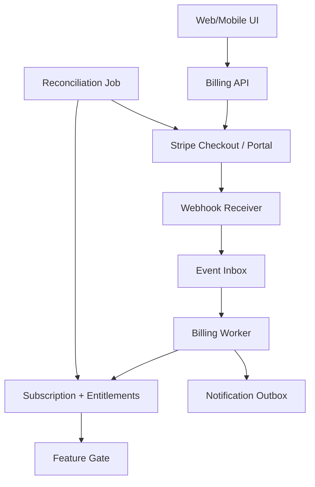
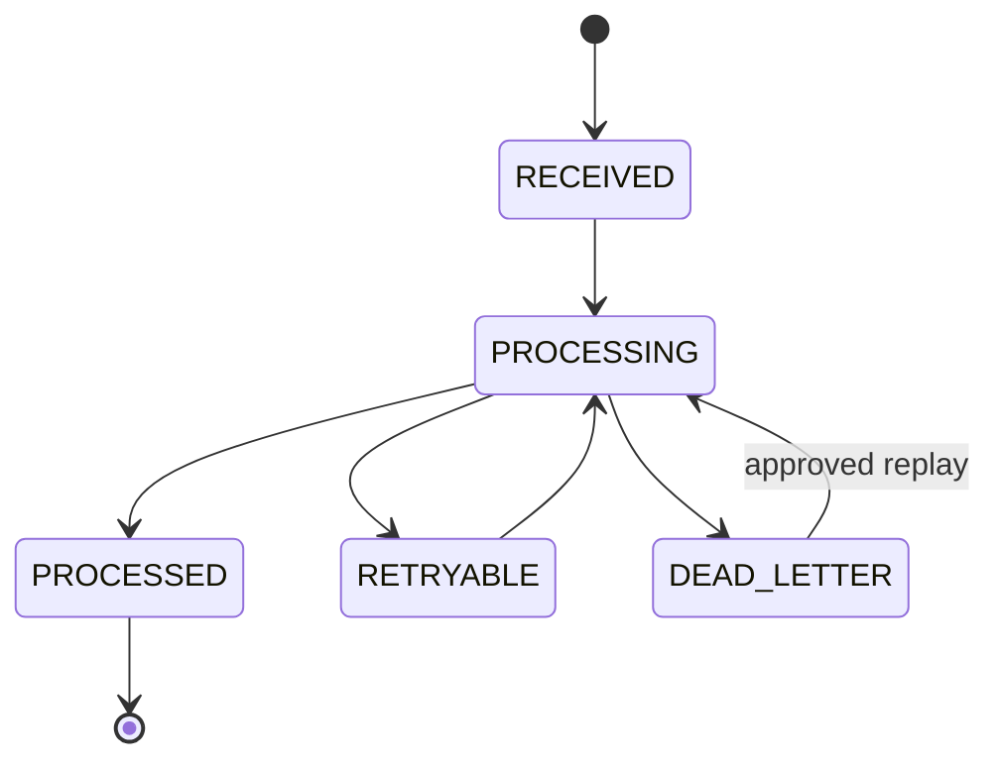
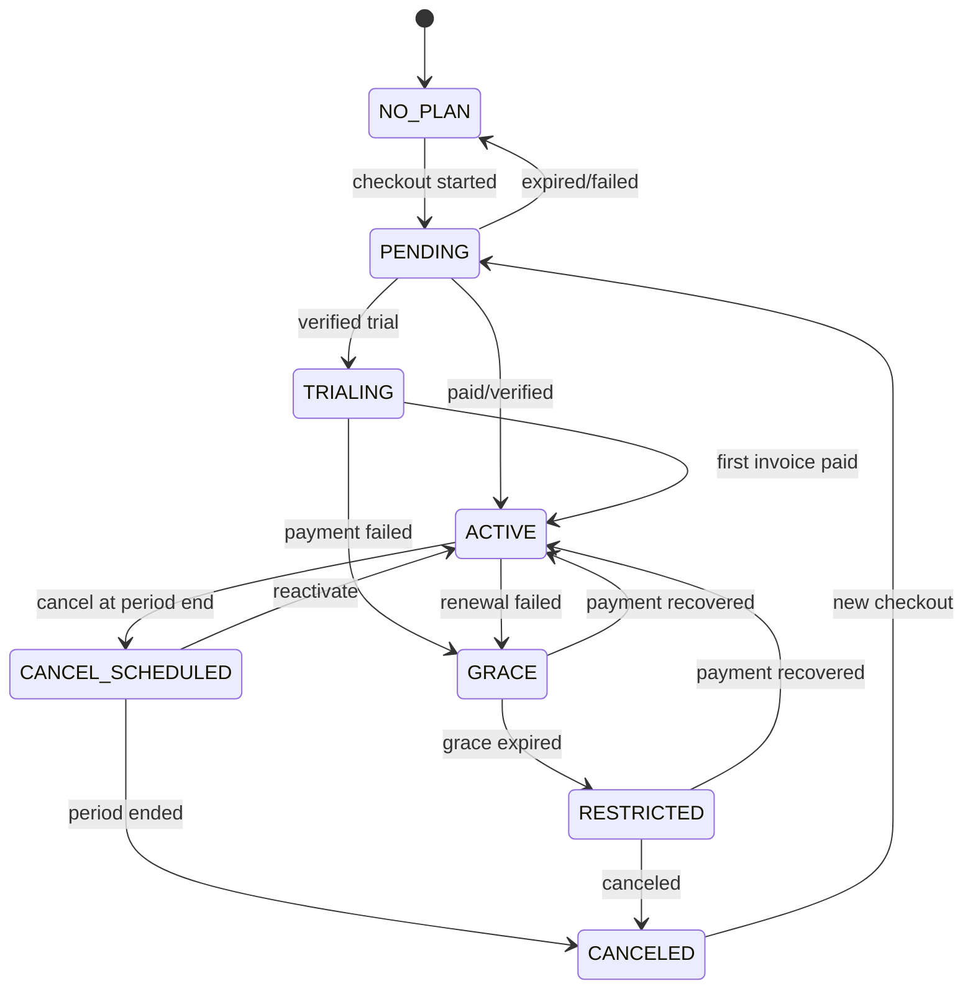

# Sprint 0A — Stripe Subscription & Billing Contract (Thailand)

สถานะ: **Execution Baseline v1.0 — Proposed / Awaiting Account Verification**  
วันที่จัดทำ: 30 สิงหาคม 2026  
ผลิตภัณฑ์: Thai SME AI Content PaaS  
Payment provider สำหรับ Production: **Stripe**  
เจ้าของเอกสาร: Product + Billing Platform  
ผู้อนุมัติ Gate: Product Owner + Finance/Accounting Owner + Architecture Lead + Security Reviewer + QA Lead

> เอกสารนี้เป็นสัญญาการออกแบบและแผนทดสอบ ไม่ใช่หลักฐานว่า Stripe account ของนิติบุคคลไทย, สกุลเงิน, วิธีชำระเงิน, ภาษี, ใบเสร็จ/ใบกำกับภาษี หรือ webhook Production ได้รับการตรวจจริงแล้ว รายการที่ขึ้น `OPEN` หรือ `UNVERIFIED` ต้องปิดด้วยบัญชีจริงและผู้เชี่ยวชาญที่เกี่ยวข้องก่อนเปิด Paid Beta

---

## 1. เป้าหมายและขอบเขต

ระบบ Billing ต้องทำให้เจ้าของ SME ไทยที่ไม่ใช่สายเทคนิคสามารถ:

1. เลือกแพ็กเกจและชำระเงินบนมือถือได้โดยไม่ต้องกรอกข้อมูลซ้ำ
2. ดูแพ็กเกจ วันต่ออายุ ใบแจ้งหนี้ และแก้ไขวิธีชำระเงินได้
3. เข้าใจว่าเมื่อชำระไม่สำเร็จ ถูกลดสิทธิ์ หรือยกเลิกแล้วจะเกิดอะไรขึ้น
4. ให้ทีม Support ตรวจสอบสถานะและแก้กรณีผิดปกติได้โดยมี audit trail
5. ให้ระบบกำหนดสิทธิ์ใช้งานจาก entitlement ที่ตรวจสอบได้ ไม่เชื่อ redirect จากหน้า Checkout

ขอบเขต Phase 1:

- Subscription รายเดือนเป็นค่าเริ่มต้น; รายปีเป็น `OPEN`
- หนึ่ง billable subscription ต่อหนึ่ง workspace
- Hosted Stripe Checkout เป็นค่าเริ่มต้น; Embedded Checkout เป็นตัวเลือกหลัง mobile UAT
- Stripe Customer Portal สำหรับจัดการบัตร/แผน/ใบแจ้งหนี้ตาม capability ที่อนุมัติ
- Product, Price และ Entitlement mapping
- Webhook event inbox, reconciliation, retry, grace period, cancel/reactivate
- Refund ผ่าน Support ที่มี approval
- Manual invoice/transfer เป็น fallback แบบควบคุม ไม่ใช่เส้นทางปกติ

นอกขอบเขต Phase 1:

- Marketplace/Stripe Connect
- Usage-based overage charging แบบ real-time
- หลาย subscription ต่อ workspace
- การคิดเงินแยกตาม Facebook Page
- In-app wallet/credit ที่แลกเป็นเงินได้
- Revenue recognition automation และระบบบัญชีเต็มรูปแบบ

---

## 2. คำตัดสินหลักและรายการที่ยังต้องปิด

| ID | เรื่อง | Baseline | สถานะ/เงื่อนไข |
|---|---|---|---|
| BILL-DEC-001 | Provider | Stripe เป็น provider Production | `APPROVED-PRODUCT`; รอ account verification |
| BILL-DEC-002 | Checkout UI | Hosted Checkout เป็นค่าเริ่มต้นเพื่อให้ PCI scope ต่ำและ mobile flow เสถียร | `PROPOSED`; Embedded Checkout ทดลองได้หลัง security/mobile UAT |
| BILL-DEC-003 | Card data | ระบบไม่รับ ไม่ log และไม่เก็บ PAN/CVC | `MANDATORY` |
| BILL-DEC-004 | Billing owner | Workspace Owner เป็นผู้เริ่ม Checkout/Portal; Billing Admin เป็น role ที่เพิ่มได้ | `PROPOSED` |
| BILL-DEC-005 | Source of truth | Stripe เป็นแหล่งจริงด้านการเรียกเก็บเงิน; local entitlement projection เป็นแหล่งอนุญาตการใช้งาน | `PROPOSED` |
| BILL-DEC-006 | Manual invoice | เปลี่ยนจาก baseline หลักเป็น fallback สำหรับ incident/ลูกค้าพิเศษที่อนุมัติ | `PROPOSED`; Product + Finance ต้องอนุมัติ |
| BILL-DEC-007 | Trial | มี/ไม่มี, ระยะเวลา, ต้องผูกบัตรหรือไม่ | `OPEN` |
| BILL-DEC-008 | Coupon/promotion | ประเภทส่วนลด, duration, สิทธิ์สร้าง code | `OPEN`; ต้องมี abuse controls |
| BILL-DEC-009 | VAT/Tax | ราคาแสดงรวม/ไม่รวม VAT, tax calculation, ที่อยู่ภาษี | `OPEN-FINANCE/LEGAL` |
| BILL-DEC-010 | เอกสารภาษีไทย | Stripe document เพียงพอหรือระบบ/ผู้ให้บริการบัญชีต้องออกเอกสารเพิ่ม | `OPEN-ACCOUNTING` |
| BILL-DEC-011 | Payment methods | บัตรและวิธีอื่นที่เปิดใช้ได้จริงในบัญชีไทย | `UNVERIFIED`; ห้ามโฆษณาก่อน live account test |
| BILL-DEC-012 | Grace period | 7 วันหลัง payment failure เป็นค่าเริ่มต้น | `PROPOSED`; ปรับได้ผ่าน policy ไม่ hard-code |
| BILL-DEC-013 | Refund | Support request + ผู้อนุมัติแยก + Stripe Dashboard/API | `PROPOSED` |
| BILL-DEC-014 | Currency | THB เป็นค่าเริ่มต้น | `UNVERIFIED` กับ Price/live account |

### 2.1 ผลต่อ baseline เดิม

- **Stripe แทน manual invoice เป็นเส้นทางหลัก** สำหรับ Paid Beta และ Production
- Manual invoice/transfer ยังคงเป็น fallback เมื่อ Stripe incident, ข้อจำกัดบัญชี, ลูกค้าองค์กร หรือกรณี Support ที่ Product + Finance อนุมัติ
- ห้ามสร้าง entitlement ด้วยการแก้ฐานข้อมูลตรง ๆ เมื่อรับเงิน manual ต้องผ่าน `Manual Billing Grant` พร้อมหลักฐาน, วันหมดอายุ, ผู้อนุมัติ และ audit event

---

## 3. หลักการสถาปัตยกรรม

1. **Hosted payment surface:** เลือก Stripe Checkout/Customer Portal เพื่อลดการสัมผัสข้อมูลบัตรและลด PCI scope แต่ทีมต้องยืนยันหน้าที่ PCI ที่ยังเหลือกับ Stripe/ที่ปรึกษา
2. **Webhook authoritative:** หน้า `success_url` มีไว้แจ้ง UX เท่านั้น ห้ามเปิดสิทธิ์จาก redirect หรือ query string
3. **Event inbox first:** ตรวจ signature แล้วบันทึก event ก่อนประมวลผล การประมวลผลทำใน background worker
4. **Idempotent and replayable:** event เดิมรับซ้ำได้โดยไม่เพิ่มสิทธิ์/ส่งอีเมลซ้ำ และ replay จาก inbox ได้
5. **Out-of-order safe:** ห้ามสรุปสถานะจากลำดับ arrival; ใช้ provider object/version timestamps และ re-fetch Stripe เมื่อคลุมเครือ
6. **Entitlement decoupling:** UI/API ตรวจ `workspace_entitlements` ไม่เรียก Stripe ทุก request
7. **Fail closed for upgrades, fail humane for outages:** ถ้ายืนยัน upgrade ไม่ได้ ห้ามเพิ่มสิทธิ์; ถ้า provider ชั่วคราวล่ม ห้ามตัดลูกค้าที่จ่ายแล้วทันที
8. **No secrets in clients:** Secret key และ webhook signing secret อยู่ใน server secret manager เท่านั้น
9. **One workspace boundary:** Stripe identifiers ทุกตัว map กลับ workspace เดียวและตรวจ authorization server-side
10. **Auditable manual exception:** ทุก bypass ต้องมีเหตุผล ผู้อนุมัติ อายุสิทธิ์ และ reconciliation

---

## 4. Component และ Contract Boundary



| Module | รับผิดชอบ | ห้ามรับผิดชอบ |
|---|---|---|
| `billing-catalog` | local plan/price/feature mapping | เก็บ secret หรือสร้าง Checkout |
| `billing-api` | authz, create Checkout/Portal session, read projection | เชื่อ client-supplied Stripe IDs |
| `stripe-adapter` | Stripe SDK/API, idempotency keys, version pinning | business entitlement rules |
| `webhook-ingress` | raw body, signature, inbox insert, fast ACK | ทำงานหนักหรือส่ง notification ตรง |
| `billing-worker` | project events, fetch latest objects, state transition | render UI |
| `entitlement-service` | effective access/limits per workspace | เรียกเก็บเงิน |
| `billing-reconciliation` | เปรียบเทียบ Stripe กับ local, repair/alert | ลบ audit history |
| `billing-support` | refund/manual grant/correction workflow | อ่าน PAN/CVC หรือ bypass approval |

---

## 5. Domain Model ขั้นต่ำ

### 5.1 ตารางหลัก

| Entity | คีย์/ข้อมูลสำคัญ | กฎ |
|---|---|---|
| `billing_customers` | `workspace_id`, `stripe_customer_id`, `email_snapshot`, `livemode` | unique ต่อ workspace + mode; ไม่ใช้ email เป็น identity |
| `billing_subscriptions` | local ID, workspace, Stripe subscription, price, provider status, local state, periods, cancel flags | unique Stripe ID; เก็บ projection ไม่แก้จาก UI |
| `billing_prices` | internal plan code, Stripe product/price IDs, currency, interval, active dates | immutable mapping หลังมีลูกค้า; สร้าง revision ใหม่ |
| `plan_entitlements` | plan code, feature key, limit/value | versioned contract |
| `workspace_entitlements` | workspace, feature, effective value, source, valid period | คำนวณซ้ำได้จาก source |
| `stripe_event_inbox` | event ID, type, livemode, created, raw hash/encrypted payload policy, status, attempts | unique event ID; immutable receipt metadata |
| `billing_operations` | checkout/portal/refund/manual grant, actor, idempotency key, status | audit ทุก write |
| `billing_reconciliation_runs` | cursor, counts, mismatch, repairs, evidence | append-only summary |
| `billing_notifications` | workspace, template, dedupe key, delivery state | outbox/dedupe |

### 5.2 Identity และ metadata

- `workspace_id` เป็น UUID ภายในและเป็น tenant boundary
- ใส่ `workspace_id`, `plan_code`, `environment` ใน Stripe metadata เท่าที่จำเป็น ห้ามใส่ secret, prompt, content หรือข้อมูลอ่อนไหว
- Client ส่งได้เฉพาะ `plan_code`; server resolve Stripe `price_id` จาก allowlist
- Customer email/name/address เป็น billing snapshot ไม่ใช่ตัวกำหนดเจ้าของ workspace
- Production/test records ต้องแยกด้วย environment และ `livemode`; ห้าม map ข้าม mode

### 5.3 Product, Price และ Entitlement

ตัวอย่าง plan contract:

```yaml
plan_code: starter_th_monthly_v1
stripe:
  currency: thb
  interval: month
  price_ref: STRIPE_PRICE_FROM_SERVER_CONFIG
entitlements:
  workspace_users: 3
  connected_channels: 3
  scheduled_posts_per_month: 100
  ai_generation_mode: included_or_byok_policy
  asset_storage_bytes: 21474836480
effective_from: 2026-09-01
```

กฎ:

- Stripe Product อธิบายสิ่งที่ขาย; Stripe Price ระบุราคา/รอบ; local plan contract ระบุสิทธิ์จริง
- ห้ามผูก feature gate กับชื่อ Product ที่แก้ได้
- downgrade ที่ทำให้ usage เกิน limit ต้องไม่ลบข้อมูลทันที ใช้ read-only/ห้ามสร้างเพิ่ม + แจ้งวิธีแก้
- price เก่า inactive สำหรับลูกค้าใหม่ได้ แต่ subscription เดิมต้องยัง map ได้
- การเปลี่ยน entitlement ต้องมี version, migration impact และ approval

---

## 6. Authorization และ Workspace Ownership

| Action | Workspace Owner | Billing Admin | Admin/Approver | Member | Platform Support |
|---|---:|---:|---:|---:|---:|
| ดูแผน/สถานะ | ✓ | ✓ | ✓ | optional summary | ตาม support case |
| เริ่ม Checkout | ✓ | ✓ | configurable | ✗ | ✗ |
| เปิด Customer Portal | ✓ | ✓ | configurable | ✗ | impersonation forbidden |
| เปลี่ยน/ยกเลิกแผน | ✓ | ✓ ตาม policy | configurable | ✗ | ผ่าน support workflow |
| ขอใบเสร็จ/ข้อมูล billing | ✓ | ✓ | configurable | ✗ | case-scoped |
| ขอ refund | ✓ | ✓ | configurable | ✗ | รับคำขอได้แต่อนุมัติเองไม่ได้ |
| อนุมัติ refund/manual grant | ✗ ผู้ขอเดียวกัน | ✗ ผู้ขอเดียวกัน | Finance/Product approver | ✗ | role แยก |

ข้อบังคับ:

- ตรวจ membership/role ใหม่ทุก write; ห้ามเชื่อ role จาก client cache
- บันทึก actor user, workspace, IP/UA ตาม privacy policy, request ID และ before/after summary
- เมื่อโอน Owner ต้องกำหนดชัดว่า billing authority โอนไปด้วยหรือไม่; ค่าเริ่มต้นคือโอนหลัง re-authentication
- การลบ workspace ต้อง cancel/resolve subscription ตาม offboarding policy ก่อนเริ่ม data purge

---

## 7. Checkout และ Customer Portal Flow

### 7.1 Hosted Checkout (baseline)

1. Owner เลือกแพ็กเกจจากการ์ดภาษาไทย
2. UI สรุปราคา รอบบิล ภาษีที่ทราบ และวันที่คาดว่าจะเรียกเก็บ
3. `POST /billing/checkout-sessions` พร้อม `plan_code` และ return route allowlist
4. Server ตรวจ role, plan availability, current subscription, currency และ duplicate operation
5. Server สร้าง/reuse Stripe Customer และ Checkout Session ด้วย server-resolved Price
6. Client redirect ไป Stripe-hosted page
7. กลับหน้า “กำลังตรวจสอบการชำระเงิน” ไม่แสดงว่า Active จน webhook/projection ยืนยัน
8. Background worker อัปเดต subscription/entitlement และส่ง notification

API response ห้ามคืน secret และควรคืนเฉพาะ URL/session token ที่จำเป็นตาม Checkout mode

### 7.2 Embedded Checkout (optional experiment)

ใช้ได้เมื่อ:

- Security Reviewer ยืนยัน integration และ CSP
- Mobile UAT ผ่าน Safari/Chrome และ keyboard/redirect/authentication cases
- PCI responsibility ได้รับการบันทึก
- มี feature flag และ fallback ไป Hosted Checkout

### 7.3 Customer Portal

- สร้าง Portal session server-side หลัง re-authentication สำหรับ action เสี่ยง
- return URL ต้องมาจาก allowlist
- Portal configuration แยก test/live และ version/control owner
- เปิดเฉพาะ capability ที่ product policy รองรับ เช่น update payment method, view invoices, cancel at period end
- หาก Portal เปลี่ยน plan ได้ ต้องทดสอบ proration/downgrade/entitlement timing ก่อนเปิด

### 7.4 Thai UX Copy ขั้นต่ำ

| State | หัวข้อ | คำอธิบาย/CTA |
|---|---|---|
| Checkout starting | กำลังพาไปหน้าชำระเงิน | กรุณารอสักครู่ และอย่าปิดหน้านี้ |
| Returned/pending | กำลังตรวจสอบการชำระเงิน | คุณไปทำงานอื่นได้ เราจะแจ้งเมื่อแพ็กเกจพร้อมใช้งาน |
| Active | เปิดใช้งานแพ็กเกจแล้ว | ดูรายละเอียดแพ็กเกจ |
| Failed | ชำระเงินไม่สำเร็จ | ลองอีกครั้งหรือเปลี่ยนวิธีชำระเงิน |
| Past due/grace | กรุณาอัปเดตวิธีชำระเงิน | คุณยังใช้งานได้ถึง {date} ก่อนถูกจำกัดบางฟังก์ชัน |
| Cancel scheduled | จะยกเลิกเมื่อสิ้นสุดรอบบิล | ใช้งานได้ถึง {date} • กลับมาใช้ต่อ |
| Canceled | แพ็กเกจสิ้นสุดแล้ว | เลือกแพ็กเกจเพื่อกลับมาใช้งาน |
| Portal unavailable | เปิดหน้าจัดการการชำระเงินไม่ได้ | ลองใหม่ภายหลัง หรือติดต่อทีมช่วยเหลือพร้อมรหัส {request_id} |

ห้ามใช้คำเทคนิค เช่น `webhook`, `PaymentIntent`, `past_due` ใน UI ลูกค้า

---

## 8. Webhook Security และ Event Processing

### 8.1 Ingress contract

`POST /webhooks/stripe` ต้อง:

1. อ่าน **raw request body** ก่อน parser ใด ๆ
2. ตรวจ `Stripe-Signature` ด้วย endpoint signing secret ของ environment นั้น
3. ปฏิเสธ signature/ความเก่าเกิน tolerance ตาม SDK/policy
4. จำกัด body size, method และ content type โดยไม่ทำลาย raw body
5. บันทึก inbox ด้วย unique `event.id` และ payload hash; payload retention ตาม data policy
6. ตอบ 2xx เร็วหลัง durable insert; ไม่รอ business processing
7. ไม่ log header signature, full payload, customer PII หรือ secret

Signature ผ่านไม่ได้ต้องไม่ insert เป็น trusted event และไม่ retry business logic

### 8.2 Idempotency สองชั้น

- **Outbound Stripe API:** ใช้ idempotency key จาก stable operation ID เช่น `checkout:{workspace}:{operation_uuid}`; ห้าม reuse key กับ parameter ต่างกัน
- **Inbound webhook:** unique constraint `(provider, livemode, event_id)`; projection update ใช้ transaction/outbox และ dedupe side effects

### 8.3 Event inbox state



Inbox fields ขั้นต่ำ:

```yaml
provider: stripe
event_id: evt_xxx
event_type: customer.subscription.updated
livemode: false
provider_created_at: 0
received_at: 0
payload_sha256: "..."
processing_status: RECEIVED
attempt_count: 0
next_attempt_at: null
last_error_code: null
correlation_workspace_id: null
```

### 8.4 Out-of-order และ replay

- Event type ไม่ใช่คำสั่งให้ set state แบบ blind
- ก่อนลดสิทธิ์หรือกรณี event เก่ากว่า projection ให้ fetch Subscription/Invoice ล่าสุดจาก Stripe
- เก็บ `provider_created_at`, `processed_at`, provider object ID และ projection revision
- Replay tool ต้องเลือก event/range, preview impact, require approval สำหรับ live, สร้าง audit entry และไม่ส่ง notification ซ้ำ
- Dead-letter alert ต้องมี event type, request ID และ sanitized error; ห้ามมี PII/secret
- Scheduled reconciliation เป็น safety net ไม่ใช่สิ่งทดแทน webhook

### 8.5 Event coverage baseline

อย่างน้อยต้อง handle หรือ explicitly ignore พร้อมเหตุผล:

- `checkout.session.completed`
- `customer.subscription.created`
- `customer.subscription.updated`
- `customer.subscription.deleted`
- `invoice.paid`
- `invoice.payment_failed`
- `invoice.payment_action_required` หาก applicable
- `invoice.finalization_failed`
- `customer.updated` เฉพาะ field ที่จำเป็น
- refund/credit-note related events ตาม implementation ที่เลือก

ชื่อ event และ payload ต้อง pin กับ Stripe API version ของระบบและยืนยันอีกครั้งใน test account

---

## 9. Local Subscription State Machine

แยก `provider_status` จาก `local_access_state` เพื่ออธิบายนโยบาย grace/manual fallback ได้



| Local state | การเข้าถึง | UX/ระบบ |
|---|---|---|
| `NO_PLAN` | free/no paid entitlement | เลือกแพ็กเกจ |
| `PENDING` | เดิมหรือ free; ห้ามให้ upgrade จน verified | poll projection + notification |
| `TRIALING` | trial entitlement ตาม policy | แสดงวันสิ้นสุดและเงื่อนไข |
| `ACTIVE` | paid entitlement | แสดงวันต่ออายุ |
| `GRACE` | คงสิทธิ์ชั่วคราว 7 วัน baseline | แจ้งเตือน + Portal CTA |
| `RESTRICTED` | อ่าน/ส่งออกได้; ห้าม generate/post/upload ใหม่ตาม policy | ไม่ลบข้อมูล |
| `CANCEL_SCHEDULED` | ใช้ถึง period end | แสดงวันสิ้นสุด + reactivate |
| `CANCELED` | read-only/retention policy | เลือกแพ็กเกจใหม่ |
| `MANUAL_FALLBACK` | สิทธิ์มีวันหมดอายุชัดเจน | audit + reconcile |

Mapping จาก Stripe status ต้องอยู่ใน versioned policy และมี test ครบ `incomplete`, `incomplete_expired`, `trialing`, `active`, `past_due`, `canceled`, `unpaid`, `paused` ที่ applicable; ห้ามถือว่า `paused` เท่ากับ pause collection โดยอัตโนมัติ

---

## 10. Payment Failure, Grace, Retry และ Notification

### 10.1 Baseline policy

- Stripe retry/dunning configuration ต้อง export/บันทึกเป็น evidence; ห้ามพึ่งค่า Dashboard ที่ไม่มี owner
- เมื่อรับ `invoice.payment_failed`: re-fetch invoice/subscription, set `GRACE` เมื่อเข้า policy, บันทึก deadline, enqueue notification
- Grace baseline 7 วันและ config ได้; ไม่ reset grace จาก event ซ้ำ
- เมื่อ `invoice.paid`: verify subscription/price, restore `ACTIVE`, clear restriction และส่ง “ชำระสำเร็จ” ครั้งเดียว
- หลัง grace: `RESTRICTED` แบบไม่ทำลายข้อมูล; scheduled posts ที่จะยิงหลัง restriction ต้องหยุดอย่างอธิบายได้
- การลบ asset/content เป็น retention/offboarding flow แยก ไม่เกิดจาก payment failure อัตโนมัติ

### 10.2 Notification cadence (proposed)

| เวลา | ช่องทาง | เนื้อหา |
|---|---|---|
| ทันที | In-app + email | ชำระไม่สำเร็จ, CTA อัปเดตวิธีชำระ |
| วันที่ 3 | In-app + email | เตือนวันสิ้นสุด grace |
| 24 ชม.ก่อนจำกัด | In-app + email | ผลกระทบที่ชัดเจน |
| ถูกจำกัด | In-app + email | ฟังก์ชันที่หยุดและวิธีกลับมาใช้ |
| Recovery | In-app + email | ยืนยันกลับมา Active |

ทุกข้อความต้อง dedupe ด้วย `(workspace, invoice, template, policy_version)`

---

## 11. Cancel, Downgrade, Reactivate และ Offboarding

### 11.1 Cancel baseline

- ค่าเริ่มต้น `cancel_at_period_end`; immediate cancel เป็น Support/exception
- ก่อนยืนยันต้องแสดงวันสิ้นสุด สิ่งที่จะหยุด และข้อมูลจะเก็บนานเท่าไร
- เก็บ cancellation reason แบบเลือกคลิกได้ พร้อมช่องข้อความ optional
- Reactivate ได้ก่อน period end ผ่าน Portal/API ที่ idempotent
- เมื่อ period end worker ยืนยัน provider state ก่อนเปลี่ยน `CANCELED`

### 11.2 Downgrade

- ระบุ effective timing (ทันที/รอบหน้า) และ proration เป็น `OPEN-PRODUCT/FINANCE`
- ถ้า users/pages/storage เกิน plan ใหม่: ไม่ลบอัตโนมัติ; freeze create/connect/upload ตามลำดับ policy
- UI ต้องแสดงรายการที่เกินและวิธีลดก่อนกดยืนยัน

### 11.3 Workspace deletion dependency

คำขอลบ workspace ต้องตรวจ:

1. subscription active/cancel scheduled หรือไม่
2. invoice/refund/dispute/open support case หรือไม่
3. เอกสารบัญชีที่ต้องเก็บตามกฎหมาย
4. export request และ asset purge schedule

Billing record ที่ต้องเก็บตามกฎหมาย/บัญชีแยกจาก product content และต้อง pseudonymize/minimize เท่าที่ทำได้ ห้ามลบหลักฐานการเงินก่อน retention decision ที่อนุมัติ

---

## 12. Refund, Credit และ Manual Support

### 12.1 Refund workflow

1. Support เปิด case พร้อม invoice/payment, workspace, เหตุผล และจำนวน
2. ระบบตรวจ refundable amount และ refund ซ้ำ
3. Approver คนละคนกับผู้ขออนุมัติ/ปฏิเสธ
4. Server ใช้ idempotency key สร้าง refund หรือเจ้าหน้าที่ทำใน Dashboard ตาม controlled runbook
5. Webhook/reconciliation ยืนยันผล แล้วอัปเดต ledger projection
6. แจ้งลูกค้าด้วยภาษาที่ไม่รับประกันเวลาธนาคารเกินข้อมูลที่ยืนยัน

ห้าม Support ปรับ subscription/entitlement โดยแก้ DB เพื่อ “แก้เร็ว”

### 12.2 Manual invoice/transfer fallback

ใช้เมื่อ:

- Stripe incident/ข้อจำกัดที่ได้รับการยืนยัน
- ลูกค้าองค์กรต้องใช้เอกสาร/วิธีจ่ายเฉพาะ
- Closed Beta exception ที่ Product + Finance อนุมัติ

ต้องมี:

- `manual_billing_case_id`, payer/workspace, amount/currency, service period
- payment evidence reference ที่ access-controlled
- finance verifier และ product approver แยกจาก requester
- entitlement expiry; ห้าม perpetual grant
- reconciliation status และเหตุผลที่ไม่ผ่าน Stripe
- ลูกค้าเห็นป้าย “ชำระผ่านใบแจ้งหนี้” ไม่สับสนกับ Stripe auto-renew

---

## 13. Reconciliation และ Operational Control

### 13.1 Scheduled reconciliation

- Daily: subscriptions/invoices ที่เปลี่ยนใน lookback window
- Monthly close: active workspaces, Stripe subscriptions, paid/failed/refunded totals และ manual fallback
- On demand: workspace, customer, subscription, event range

Mismatch classes:

| Code | ตัวอย่าง | Auto-repair |
|---|---|---|
| `MISSING_LOCAL_CUSTOMER` | Stripe Customer มี metadata workspace แต่ local ไม่มี | quarantine + human review |
| `SUBSCRIPTION_STATUS_DRIFT` | local Active แต่ Stripe canceled | fetch latest; restrict per policy |
| `ENTITLEMENT_DRIFT` | plan mapping ไม่ตรง | recompute if version known |
| `UNKNOWN_PRICE` | Stripe price ไม่มี local mapping | stop-the-line; ห้ามเดา |
| `DUPLICATE_ACTIVE_SUBS` | workspace มีมากกว่า 1 active | security/finance incident |
| `LIVEMODE_MISMATCH` | test object ใน production mapping | critical incident; no auto-repair |
| `MANUAL_GRANT_EXPIRED` | grant หมดแต่ยัง Active | restrict + alert |

Auto-repair ทุกครั้งต้อง append audit event, เก็บ before/after และส่ง alert ตาม severity

### 13.2 Observability/SLO proposed

- Webhook durable acceptance success ≥ 99.95% รายเดือน (ไม่รวม invalid signatures)
- p95 จาก verified event ถึง entitlement projection ≤ 60 วินาที
- Dead-letter age critical < 15 นาทีจน acknowledge
- Reconciliation mismatch ที่กระทบ access ต้อง triage ภายใน 1 ชั่วโมง
- Dashboard: event rate/failure/lag, checkout create failure, state counts, grace/restricted, reconciliation drift, refunds/manual grants

ห้าม label metrics ด้วย email/customer ID เพื่อหลีกเลี่ยง PII และ cardinality สูง

---

## 14. Security, Privacy และ Audit

### 14.1 Data prohibited

ระบบห้ามเก็บหรือ log:

- หมายเลขบัตรเต็ม (PAN)
- CVC/CVV
- magnetic stripe/chip raw data
- Stripe secret key/webhook secret ใน database, client bundle, error, screenshot หรือ evidence

เก็บได้เท่าที่จำเป็น เช่น Stripe object IDs, brand/last4/expiry ที่ Stripe ส่งให้และมี UX need โดยต้องผ่าน privacy review

### 14.2 Secret controls

- แยก test/live keys และ webhook endpoints
- secret manager + least privilege + access audit
- key rotation runbook และ dual-secret transition ตาม capability
- CI ใช้ environment-scoped secret; pull request จาก untrusted context ห้ามเข้าถึง live secret
- Stripe API version pin และ dependency update review

### 14.3 Threat controls

| Threat | Control | Test |
|---|---|---|
| ปลอม webhook | signature + raw body + secret isolation | invalid/tampered/old signature |
| Replay | unique event ID + idempotent projection/outbox | event ซ้ำ 10 ครั้ง |
| Tenant swap | server maps workspace/customer; ownership check | ใช้ Customer ID ของ workspace อื่น |
| Price tampering | plan allowlist; server resolves Price | client ส่ง price/amount ปลอม |
| Open redirect | return URL allowlist | external URL rejected |
| Double checkout | operation idempotency + active sub guard | parallel 20 requests |
| Privilege misuse | role check + re-auth + audit | member เรียก Portal/refund |
| Log leakage | redaction + structured errors | secret scanner/log review |
| Event order corruption | timestamp/re-fetch/reconciliation | shuffled fixtures |
| Support fraud | maker-checker approval | requester approve own refund blocked |

Audit event อย่างน้อย: checkout started, portal opened, subscription changed, entitlement changed, refund requested/approved/executed, manual grant, replay, reconciliation repair, config/price mapping change

---

## 15. Testing Strategy

### 15.1 Environments

| Environment | Stripe mode | ข้อมูล | จุดประสงค์ |
|---|---|---|---|
| Local | test/mocked signed fixtures | synthetic only | unit/contract |
| CI | deterministic fixtures; no shared secret when possible | synthetic | regression |
| Staging | Stripe test mode | synthetic personas | E2E/webhook/Test Clock |
| Production | Stripe live mode | real/minimized | controlled smoke/canary |

ห้ามใช้ live key ใน local/CI และห้าม copy live webhook payload ที่มี PII ลง fixture

### 15.2 Test Clock และ fixtures

- ใช้ Stripe Test Clocks ใน Staging เพื่อจำลอง trial end, renewal, failure และ period end ตาม capability ที่ Stripe รองรับ
- Fixture ต้อง pin Stripe API version, redact PII, ระบุ expected projection และ checksum
- มี signed webhook integration test ผ่าน Stripe CLI/test endpoint ตาม runbook
- กรณีที่ Test Clock ไม่รองรับต้องใช้ explicit fixture/controlled test และบันทึก limitation

### 15.3 Acceptance test matrix

| ID | Scenario | Expected evidence |
|---|---|---|
| BILL-AT-001 | Owner เริ่ม Checkout แผน allowlisted | session + audit; ไม่มี client amount |
| BILL-AT-002 | Member เริ่ม Checkout | 403 + audit-safe denial |
| BILL-AT-003 | กลับ success URL ก่อน webhook | ยังไม่ Active; แสดง pending |
| BILL-AT-004 | Valid webhook | inbox durable + 2xx + async projection |
| BILL-AT-005 | Tampered/raw body changed | signature reject; no entitlement |
| BILL-AT-006 | Event ซ้ำ 10 ครั้ง | one projection/notification |
| BILL-AT-007 | Shuffled paid/failed/updated events | final state matches Stripe latest |
| BILL-AT-008 | Worker fail 3 ครั้ง | backoff/retry; then processed |
| BILL-AT-009 | Poison event | dead letter + alert + approved replay |
| BILL-AT-010 | Renewal success | Active + correct period/entitlement |
| BILL-AT-011 | Payment failure | Grace deadline + Thai notification |
| BILL-AT-012 | Recovery in grace | Active; restriction cleared; no duplicates |
| BILL-AT-013 | Grace expires | Restricted, no data deletion |
| BILL-AT-014 | Cancel at period end | access until verified end |
| BILL-AT-015 | Reactivate before end | cancel flag cleared idempotently |
| BILL-AT-016 | Unknown Price | no guessed entitlement; stop alert |
| BILL-AT-017 | Cross-workspace Customer/Portal | blocked |
| BILL-AT-018 | Concurrent Checkout requests | max one effective operation/subscription |
| BILL-AT-019 | Refund maker-checker | self-approval blocked; result reconciled |
| BILL-AT-020 | Manual fallback expires | entitlement removed/restricted on time |
| BILL-AT-021 | Test/live ID mismatch | critical rejection |
| BILL-AT-022 | Reconciliation drift | detected and audited repair/quarantine |
| BILL-AT-023 | Portal mobile Thai flow | usable on target Safari/Chrome |
| BILL-AT-024 | Logs/evidence scan | no secret, PAN, CVC, unredacted payload |
| BILL-AT-025 | Workspace deletion with active sub | blocked/routed to billing resolution |

### 15.4 Production verification (ยังไม่ทำ)

ก่อน Paid Beta ต้องมีหลักฐานจากบัญชีจริงว่า:

- Business/account activation และ settlement configuration ใช้ได้
- THB Product/Price และวิธีชำระเงินที่จะประกาศใช้ได้จริง
- Hosted Checkout/Portal ภาษา/มือถือ/return URLs ทำงาน
- Live webhook signature, endpoint routing, retry และ alert ทำงาน
- การคืนเงิน/statement descriptor/email receipt ตาม policy
- เอกสารภาษีไทยและ reconciliation ได้รับ Finance/Accounting signoff

สถานะปัจจุบัน: `UNVERIFIED — ไม่มี credentials/evidence ในงานจัดทำเอกสารนี้`

---

## 16. Work Packages และการแยกหน้าที่

| Work package | Author skills | Independent Reviewer | Tester | Security/Acceptance |
|---|---|---|---|---|
| `BILL-01 Catalog & Entitlements` | domain modeling, DB, feature flags | Architect/Product reviewer | Contract/property tester | Finance/Product acceptor |
| `BILL-02 Checkout & Portal` | Stripe SDK, API, authz, mobile web | Integration reviewer | E2E/mobile tester | Security reviewer |
| `BILL-03 Webhook Inbox` | raw HTTP, cryptography API usage, queue/idempotency | Backend/concurrency reviewer | fault/replay tester | Security reviewer required |
| `BILL-04 State Projection` | state machines, transactions, outbox | Domain reviewer | model-based tester | Product acceptor |
| `BILL-05 Failure & Notifications` | background jobs, Thai UX | Ops/Product reviewer | time/retry/notification tester | UX acceptor |
| `BILL-06 Refund & Manual Fallback` | secure admin workflow, audit | Finance + Security reviewers | authorization/reconciliation tester | maker-checker UAT |
| `BILL-07 Reconciliation & Ops` | scheduled jobs, observability | SRE reviewer | drift/restore tester | Release Captain |
| `BILL-08 Production Verification` | Integration Owner with live access | Finance/Security | QA Lead | Product go/no-go |

กฎทีม:

- Claude หรือ Codex รับบท Author ได้ตาม skill benchmark; ไม่ผูก provider ของ AI กับบทบาท
- Author หลายโมเดลเป็น co-author และทุกคนถือว่า “มีส่วนเขียน”
- Author/co-author ห้ามเป็นผู้อนุมัติสุดท้ายของ work package เดียวกัน
- Tester เขียน/รัน test จาก acceptance contract และต้องไม่พึ่งเฉพาะผลที่ Author ส่งมา
- Security Reviewer เป็น gate บังคับสำหรับ webhook, secrets, refund, admin/manual grant
- Finance/Accounting signoff ไม่สามารถแทนด้วย AI agent สำหรับ VAT/ใบกำกับภาษี/การปิดงบ
- Integration Owner ตรวจ contract compatibility และ evidence ก่อน merge/release

ตัวอย่าง work package:

```yaml
task_id: BILL-03
title: Stripe webhook inbox and replay
risk: critical
assignments:
  author:
    role: billing-integration-author
    required_skills: [raw-http, stripe-sdk, queues, idempotency]
  reviewer:
    role: backend-concurrency-reviewer
    independent_from_author: true
  tester:
    role: resilience-tester
    independent_from_author: true
  security_reviewer:
    role: payment-security-reviewer
acceptance_tests:
  - BILL-AT-004
  - BILL-AT-005
  - BILL-AT-006
  - BILL-AT-007
  - BILL-AT-008
  - BILL-AT-009
required_evidence:
  - contract-test-results.json
  - replay-test-report.md
  - redacted-log-scan.json
  - security-review.md
```

---

## 17. Definition of Done และ Gate

### G0 — Contract Ready

- [ ] Product อนุมัติ plan/price/entitlement model
- [ ] Finance/Accounting owner รับรายการ VAT/tax document decisions
- [ ] State machine, grace/cancel/downgrade policy approved
- [ ] Webhook inbox/idempotency/replay contract approved
- [ ] Manual billing baseline ถูกเปลี่ยนเป็น fallback ใน decision register
- [ ] Work packages มี Author/Reviewer/Tester/Security owner แยกกัน

### G1 — Implementation Ready

- [ ] Test/live environment และ secrets แยกครบ
- [ ] Stripe API version/SDK version pin
- [ ] Price mapping และ Portal config มี version owner
- [ ] Migration/RLS/audit/outbox reviewed
- [ ] Thai UX copy และ mobile wireflow approved

### G2 — Verified Test Mode

- [ ] BILL-AT-001 ถึง 025 ที่ applicable ผ่านพร้อม evidence
- [ ] Test Clock/fixture coverage ผ่าน trial/renewal/failure/cancel
- [ ] shuffled/duplicate/replay/fault injection ผ่าน
- [ ] Security scan ไม่พบ card/secret leakage
- [ ] Reconciliation drill และ manual fallback expiry ผ่าน

### G3 — Paid Beta Go/No-Go

- [ ] Live account/business verification และ payout owner confirmed
- [ ] วิธีชำระเงิน/THB ที่ประกาศผ่าน live controlled test
- [ ] Live webhook/alert/reconciliation smoke ผ่าน
- [ ] Finance/Accounting อนุมัติ VAT/receipt/tax invoice process
- [ ] Refund/support/on-call runbook ซ้อมแล้ว
- [ ] Product + Security + Finance + QA ลงชื่อ go/no-go

Stop-the-line หากพบ: live/test ปะปน, unknown price, duplicate active subscriptions, entitlement จาก redirect, invalid signature ถูกยอมรับ, card/secret leakage, self-approved refund/manual grant หรือ reconciliation drift ที่อธิบายไม่ได้

---

## 18. Open Questions Register

| ID | คำถาม | Owner | Due gate | Fallback |
|---|---|---|---|---|
| BILL-OQ-01 | ราคา/แพ็กเกจ/รายเดือนหรือรายปี | Product | G0 | monthly only |
| BILL-OQ-02 | Free trial กี่วันและต้องมีบัตรหรือไม่ | Product/Risk | G0 | no trial |
| BILL-OQ-03 | Coupon ใครสร้างและจำกัด abuse อย่างไร | Product/Finance | G1 | disabled |
| BILL-OQ-04 | ราคาแสดงรวม VAT หรือไม่ | Finance/Accounting | G0 | block paid launch |
| BILL-OQ-05 | ใครออกใบเสร็จ/ใบกำกับภาษีไทย | Accounting/Legal | G2 | controlled manual document process |
| BILL-OQ-06 | Payment methods ใดเปิดได้จริง | Integration/Finance | G3 | advertise verified methods only |
| BILL-OQ-07 | Proration upgrade/downgrade | Product/Finance | G1 | changes next period |
| BILL-OQ-08 | Grace กี่วันและ restriction ใดบ้าง | Product/Ops | G0 | 7 days + read-only |
| BILL-OQ-09 | Refund window/partial refund policy | Product/Finance/Legal | G1 | case-by-case approval |
| BILL-OQ-10 | Billing data retention ไทย | Legal/Accounting/DPO | G1 | block irreversible purge |

---

## 19. เอกสารอ้างอิงทางเทคนิค

- [Stripe: Receive events with webhooks](https://docs.stripe.com/webhooks) — raw body, signature verification และ delivery behavior
- [Stripe: Using webhooks with subscriptions](https://docs.stripe.com/billing/subscriptions/webhooks) — subscription/invoice event families
- [Stripe: Test your Billing integration](https://docs.stripe.com/billing/testing) — test cards, failures และ Test Clocks
- [Stripe: Customer Portal](https://docs.stripe.com/customer-management) — hosted billing management
- [Stripe: Checkout subscriptions](https://docs.stripe.com/payments/checkout/build-subscriptions) — Checkout Session สำหรับ subscription
- [Stripe: Subscription object/status](https://docs.stripe.com/api/subscriptions/object) — provider states ที่ต้อง map แบบ versioned

> ต้องตรวจเอกสาร Stripe และ Dashboard ของ account จริงอีกครั้งตอน implementation เพราะ API version, capability, payment methods และข้อกำหนดแต่ละประเทศเปลี่ยนได้ เอกสารนี้ไม่ใช่คำปรึกษากฎหมาย ภาษี บัญชี หรือ PCI
